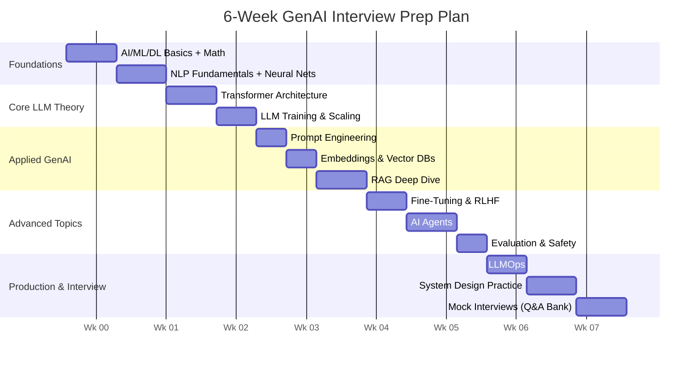

# GenAI & LLM Mastery — Roadmap and Study Plan

> **Author's note (from your trainer):** I've spent 20 years teaching engineers how enterprise AI systems actually get built — not just the theory, but what gets asked in interviews and what breaks in production. This series takes you from "what is AI?" all the way to "design a RAG system for a bank with 50,000 employees." Go in order the first time. After that, use it as a reference.

---

## 1. How This Curriculum Is Organized

This is a **layered curriculum** — each document assumes you've read the ones before it, but each also stands alone as a reference you can jump back to before an interview.

| # | Document | What You'll Learn | Level |
|---|----------|-------------------|-------|
| 00 | Roadmap & Study Plan (this doc) | How to use this series | — |
| 01 | AI/ML/DL Foundations | Core vocabulary, how AI, ML, DL, and GenAI relate | Beginner |
| 02 | Math & Statistics for AI | Just-enough linear algebra, probability, calculus | Beginner |
| 03 | NLP Fundamentals | Tokenization, embeddings, classic NLP before Transformers | Beginner |
| 04 | Neural Networks & Deep Learning | Perceptrons, backprop, CNNs/RNNs, training mechanics | Beginner–Intermediate |
| 05 | Transformer Architecture | Self-attention, multi-head attention, encoder/decoder | Intermediate |
| 06 | LLM Fundamentals, Training & Scaling | Pretraining, SFT, RLHF, scaling laws, sampling params | Intermediate |
| 07 | Prompt Engineering | Zero/few-shot, CoT, ReAct, structured output, injection risks | Intermediate |
| 08 | Embeddings & Vector Databases | Similarity search, indexing, Pinecone/FAISS/Weaviate | Intermediate |
| 09 | RAG (Retrieval-Augmented Generation) | Chunking, retrieval, reranking, advanced RAG patterns | Intermediate–Advanced |
| 10 | Fine-Tuning, PEFT, LoRA, RLHF | When and how to customize a model | Advanced |
| 11 | AI Agents & Orchestration | Tool calling, ReAct loops, multi-agent systems | Advanced |
| 12 | LLM Evaluation, Safety & Guardrails | Metrics, hallucination, red-teaming, benchmarks | Advanced |
| 13 | LLMOps: Deployment & Monitoring | Serving, quantization, cost, observability | Advanced |
| 14 | GenAI System Design & Case Studies | Interview-style system design walkthroughs | Advanced |
| 15 | Responsible AI, Ethics & Governance | Bias, privacy, IP, regulation | All levels |
| 16 | Interview Q&A Bank | 80+ curated questions with answers, by topic | All levels |

---

## 2. Suggested Study Plan

If you have less time, compress by combining: Week 1 (docs 1–4), Week 2 (docs 5–7), Week 3 (docs 8–10), Week 4 (docs 11–13), Week 5 (docs 14–16 + mock interviews).

---

## 3. Who This Is For

- **Freshers / career switchers** — read every doc start to end, don't skip the math doc.
- **Mid-level engineers** — skim docs 1–4, focus deeply on 5–13.
- **Senior / Lead / Architect candidates** — focus on 9, 11, 13, 14 (system design is where senior interviews are won or lost), and be ready to defend trade-offs, not just definitions.

---

## 4. How to Actually Use These Docs for Interview Prep

1. **First pass:** Read for understanding. Don't memorize yet.
2. **Second pass:** Cover the "Interview Angle" boxes in each doc and try to answer them cold.
3. **Third pass:** Use Doc 16 (Q&A Bank) as a timed self-test.
4. **Before the interview:** Re-draw every mermaid diagram from memory on a whiteboard or paper. If you can redraw the RAG pipeline and the Transformer block diagram unaided, you're in the top 10% of candidates.

> **Trainer's tip:** In real interviews, the difference between a good and a great answer is almost never "more facts." It's the ability to explain *why* a design choice was made and *what trade-off* it implies. Every doc in this series calls out trade-offs explicitly — pay attention to those sections.

---

**Next:** Start with [`01_AI_ML_DL_Foundations.md`](./01_AI_ML_DL_Foundations.md)
