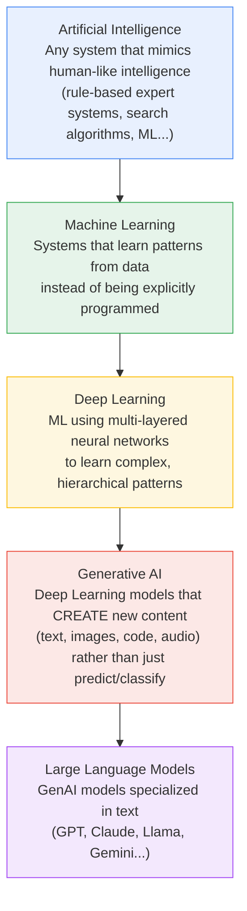
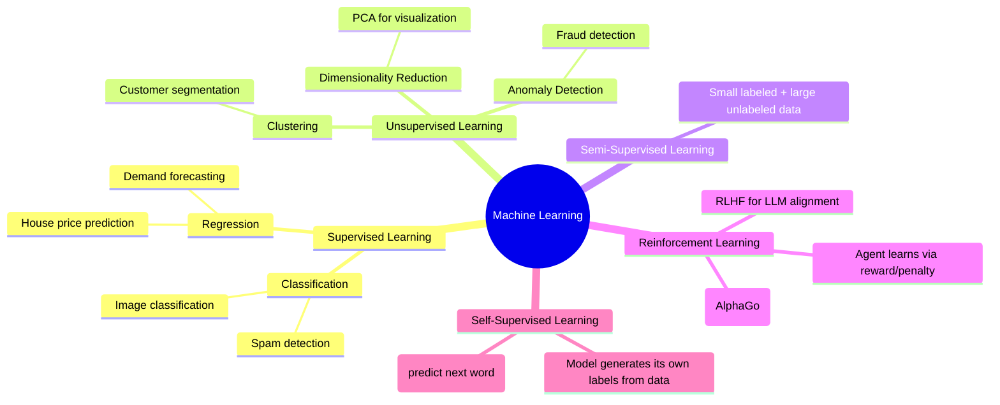

# 01. AI, ML, DL & GenAI Foundations

## Learning Objectives
- Explain the difference between AI, ML, Deep Learning, and Generative AI in plain language
- Know the major types of Machine Learning and when each is used
- Be able to answer "explain AI to a non-technical stakeholder" confidently

---

## 1. The Nesting-Doll Relationship

People use "AI," "ML," "Deep Learning," and "GenAI" interchangeably in casual conversation — but in an interview, mixing them up signals you don't know the field. Think of them as **nested circles**, each one a subset of the last.

### Simple Definitions

| Term | Plain-Language Definition | Example |
|------|---------------------------|---------|
| **AI** | Any technique that makes a machine act "smart" | A chess engine using search + rules |
| **ML** | A machine that improves at a task by learning from examples, not hard-coded rules | A spam filter trained on labeled emails |
| **DL** | ML using neural networks with many layers to automatically learn features | Image recognition using CNNs |
| **GenAI** | Deep learning models that generate new, original content | ChatGPT writing an email; Midjourney creating an image |
| **LLM** | A GenAI model trained on massive text data to understand and generate language | Claude, GPT-4, Llama 3 |

> **Interview Angle:** A very common opener is *"How would you explain AI to my grandmother?"* Don't dive into math. Use an analogy: *"Traditional software follows rules you write. AI writes its own rules by looking at thousands of examples — like teaching a child to recognize a cat by showing them many pictures, instead of describing a cat's exact measurements."*

---

## 2. Types of Machine Learning

### Quick Comparison

| Type | How It Learns | Real Enterprise Use Case |
|------|---------------|---------------------------|
| **Supervised** | Learns from labeled input→output pairs | Credit risk scoring using historical loan outcomes |
| **Unsupervised** | Finds structure in unlabeled data | Segmenting customers by purchasing behavior |
| **Semi-Supervised** | Mix of small labeled + large unlabeled sets | Medical imaging where labels are expensive |
| **Reinforcement Learning (RL)** | Learns via trial, error, and reward signals | Warehouse robot path optimization; RLHF for LLMs |
| **Self-Supervised Learning** | Creates its own training signal from raw data | How GPT/Claude are pretrained — predicting the next word in a sentence |

> **Why this matters for GenAI:** Modern LLMs are built primarily using **self-supervised learning** (pretraining on raw text) followed by a dash of **reinforcement learning** (RLHF/DPO for alignment). Knowing this connects the "classic ML" world to the GenAI world — a favorite interview bridge question.

---

## 3. Scenario-Based Example

**Scenario:** A retail company wants to (a) predict next month's sales, (b) automatically tag product photos, and (c) build a chatbot that answers customer questions using their internal product manuals.

| Task | Category | Technique |
|------|----------|-----------|
| Predict next month's sales | Supervised Learning (Regression) | Gradient Boosted Trees / Time-series models |
| Auto-tag product photos | Deep Learning (Computer Vision) | CNN or Vision Transformer classifier |
| Chatbot answering from manuals | Generative AI (LLM + RAG) | LLM + Retrieval-Augmented Generation (see Doc 09) |

This is exactly the kind of question interviewers ask to test whether you reach for the *right tool*, not just the trendiest one — GenAI is powerful, but not every problem needs an LLM.

---

## 4. Common Pitfalls & Misconceptions

- ❌ "AI" and "ML" are NOT the same thing — AI is the umbrella term.
- ❌ Not all Deep Learning is Generative — a CNN classifying cats vs. dogs is DL, not GenAI, because it labels rather than creates.
- ❌ LLMs don't "understand" in the human sense — they predict statistically likely sequences of tokens based on patterns learned from training data (more in Doc 06).

---

## 5. Interview Quick-Fire Q&A

**Q: What's the difference between AI and ML?**
A: AI is the broad goal of making machines act intelligently — it can include hand-coded rules. ML is a *subset* of AI where the system learns patterns from data rather than being explicitly programmed.

**Q: Is ChatGPT Deep Learning or Machine Learning?**
A: Both, technically — Deep Learning is a subset of Machine Learning. Specifically, it's a Generative AI application built on a Deep Learning architecture (the Transformer).

**Q: Give an example of Reinforcement Learning in the GenAI pipeline.**
A: RLHF (Reinforcement Learning from Human Feedback) is used after pretraining to align a model's outputs with human preferences — the model is rewarded for responses humans rate as more helpful/safe.

---

**Next:** [`02_Math_and_Statistics_for_AI.md`](./02_Math_and_Statistics_for_AI.md)
