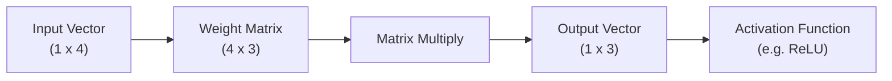
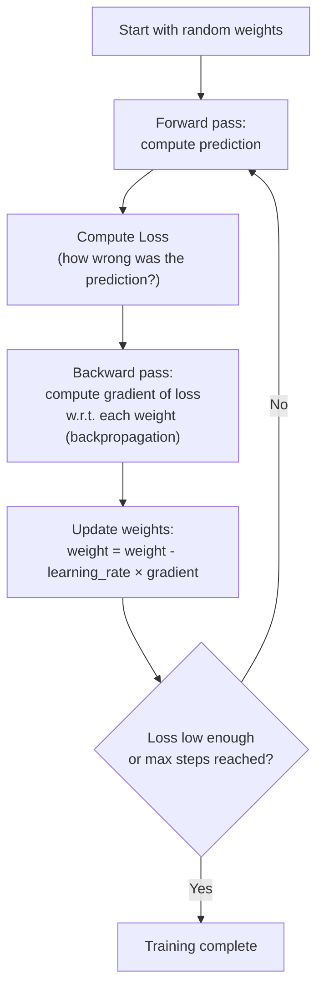

# 02. Math & Statistics for AI (Just Enough to Be Dangerous)

## Learning Objectives
- Understand the handful of math concepts that actually show up in AI interviews
- Connect each concept directly to where it's used inside a neural network or LLM
- Be able to explain *why* softmax, cosine similarity, and gradients matter — not just recite formulas

> You do **not** need a PhD in math to work in GenAI. You need working intuition for about eight concepts. This doc covers exactly those, and nothing more.

---

## 1. Linear Algebra — The Language of Neural Networks

### Vectors
A vector is just an ordered list of numbers representing a point or direction in space.
`[0.2, -1.4, 0.9]` — in AI, this could represent a word embedding (see Doc 03) or a pixel feature.

### Matrices & Matrix Multiplication
A matrix is a grid of numbers. Neural networks are, under the hood, chains of matrix multiplications followed by non-linear functions.

**Why it matters:** Every layer of a Transformer — the attention mechanism, the feed-forward blocks — is built from matrix multiplications. When someone says "a 7B parameter model," they mean the *total count of numbers* inside these weight matrices.

### Dot Product & Cosine Similarity
The dot product measures how much two vectors "point in the same direction."

`similarity(A, B) = (A · B) / (‖A‖ ‖B‖)`

**Why it matters:** This is *exactly* how vector databases find "similar" documents (Doc 08), and it's part of how attention scores are computed (Doc 05) — the model computes how much each word should "attend to" every other word using a dot product between Query and Key vectors.

---

## 2. Probability & Statistics

### Probability Distributions
LLMs don't output a single word — they output a **probability distribution over the entire vocabulary** for the next token. The model picks (or samples) the next word based on these probabilities.

### Softmax Function
Converts a list of raw scores ("logits") into probabilities that sum to 1.

`softmax(z_i) = e^(z_i) / Σ e^(z_j)`

**Plain language:** Imagine the model has 50,000 possible next words and assigns each a raw "score." Softmax squashes these scores into probabilities — e.g., "the" might get 40%, "a" might get 25%, and so on — so the model (or a sampling method) can pick one.

### Cross-Entropy Loss
The standard loss function for training classifiers and language models. It measures how far the predicted probability distribution is from the true answer.

**Plain language:** If the correct next word was "cat" and the model assigned it only 5% probability, cross-entropy loss is *high* (bad). If the model assigned "cat" 95% probability, loss is *low* (good). Training = adjusting weights to make loss lower over millions of examples.

### Key Distributions to Know by Name
| Distribution | Where It Shows Up |
|---|---|
| Normal (Gaussian) | Weight initialization, noise modeling |
| Bernoulli | Binary classification outcomes, dropout |
| Categorical | The next-token prediction distribution in LLMs |

---

## 3. Calculus — Just Gradients & the Chain Rule

### Gradient
A gradient tells you the *direction and rate* in which a function increases. Training a neural network means repeatedly asking: *"If I nudge this weight a tiny bit, does the loss go up or down?"* and adjusting accordingly.

### Gradient Descent (the training algorithm)

### The Chain Rule
Backpropagation is just the calculus chain rule applied layer by layer, from the output back to the input, to figure out how much *each* weight in a deep network contributed to the final error.

**You don't need to derive this by hand in most interviews** — but you should be able to say: *"Backpropagation uses the chain rule to efficiently compute how the loss changes with respect to every weight in the network, layer by layer, from output back to input."*

---

## 4. Scenario-Based Example

**Scenario:** An interviewer asks: *"Why does an LLM sometimes give different answers to the exact same prompt?"*

**Strong answer connecting the math:** "Because the model outputs a probability distribution (via softmax) over possible next tokens rather than one deterministic answer. Sampling parameters like `temperature` reshape that distribution before a token is randomly selected — higher temperature flattens the distribution (more randomness/creativity), lower temperature sharpens it toward the highest-probability token (more deterministic)." *(This connects directly to Doc 06 — sampling parameters.)*

---

## 5. Interview Quick-Fire Q&A

**Q: What does softmax do and why is it used in the output layer of a language model?**
A: It converts raw output scores (logits) into a valid probability distribution (values between 0–1 that sum to 1), which lets the model represent uncertainty over which token comes next.

**Q: What's the relationship between cosine similarity and dot product?**
A: Cosine similarity is the dot product of two vectors divided by the product of their magnitudes — it measures the *angle* between vectors (direction) regardless of their length, making it a normalized similarity score commonly used in semantic search.

**Q: In one sentence, what is backpropagation?**
A: An efficient application of the chain rule that computes how much each weight in a network contributed to the total error, so weights can be updated to reduce that error.

**Q: Why do we need a loss function at all?**
A: It gives the model a single number representing "how wrong" its prediction was, which is what gradient descent uses to know which direction to adjust weights in.

---

**Next:** [`03_NLP_Fundamentals.md`](./03_NLP_Fundamentals.md)
