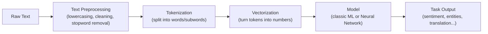
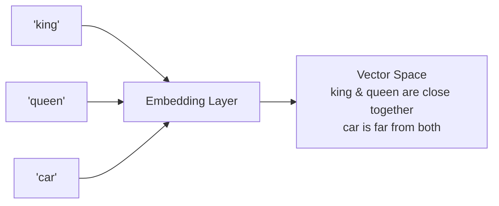
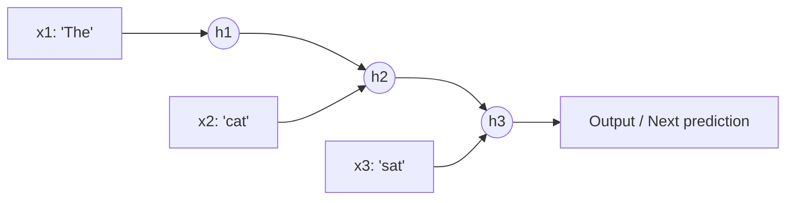

# 03. NLP Fundamentals (Before Transformers)

## Learning Objectives
- Understand how text is turned into numbers a model can process
- Know the classic NLP pipeline and why it evolved into today's Transformer-based approach
- Be fluent in tokenization, embeddings, and the key pre-Transformer architectures

> Why study "old" NLP if GenAI runs on Transformers? Because interviewers use this history to test whether you understand *why* Transformers were a breakthrough — not just that they exist.

---

## 1. The NLP Pipeline (Classic View)

---

## 2. Tokenization

Tokenization = breaking text into units ("tokens") the model can work with.

| Type | Example on "unbelievable" | Pros | Cons |
|------|---------------------------|------|------|
| **Word-level** | `["unbelievable"]` | Intuitive | Huge vocabulary, can't handle unseen words |
| **Character-level** | `["u","n","b",...]` | Tiny vocabulary, no "unknown word" problem | Very long sequences, loses word meaning |
| **Subword-level (used by modern LLMs)** | `["un", "believ", "able"]` | Balances vocabulary size and flexibility; handles rare/unseen words gracefully | Slightly less intuitive |

Modern LLMs use **subword tokenization** algorithms:
- **BPE (Byte-Pair Encoding)** — used by GPT models
- **WordPiece** — used by BERT
- **SentencePiece / Unigram** — used by Llama, T5

**Interview Angle:** *"Why not just use whole words as tokens?"* → Because vocabulary would be unbounded (typos, new words, different languages), embeddings tables would be huge, and the model couldn't handle words it never saw during training. Subword tokenization lets the model build unfamiliar words out of familiar pieces.

---

## 3. From Words to Numbers: Embeddings

Computers don't understand words — they understand numbers. An **embedding** is a dense vector representation of a token that captures semantic meaning, such that similar words end up close together in vector space.

### Classic Word Embedding Techniques (Pre-Transformer)
| Technique | Key Idea |
|---|---|
| **One-Hot Encoding** | Each word = a vector of all 0s with a single 1. No semantic meaning captured. Vectors are huge and sparse. |
| **Bag of Words (BoW)** | Represents a document by word counts, ignoring order. Simple but loses context. |
| **TF-IDF** | Weighs words by how important/rare they are across a document collection — down-weights common words like "the." |
| **Word2Vec** | Learns dense embeddings by predicting a word from its context (CBOW) or context from a word (Skip-gram). Famous for `king - man + woman ≈ queen`. |
| **GloVe** | Learns embeddings from global word co-occurrence statistics across a corpus. |

**Key limitation these all share:** These produce a **single, fixed embedding per word**, regardless of context. "Bank" gets the same vector whether it means *river bank* or *money bank*. This is exactly the problem Transformer-based **contextual embeddings** solve (Doc 05) — the embedding for "bank" changes depending on the surrounding sentence.

---

## 4. Sequence Models Before Transformers

Text is sequential — word order matters ("dog bites man" ≠ "man bites dog"). Before Transformers, **Recurrent Neural Networks (RNNs)** and their variants were the standard way to model sequences.

Each hidden state `h` carries forward information from all previous words — but this creates two big problems:

1. **Sequential bottleneck:** Word 100 can't be processed until words 1–99 are processed. This makes RNNs slow to train (no parallelization).
2. **Vanishing gradients / long-range memory loss:** Information from early words fades by the time the model reaches later words — the network "forgets" the beginning of a long sentence.

### LSTM & GRU
**LSTM (Long Short-Term Memory)** and **GRU (Gated Recurrent Unit)** were designed to fix the vanishing-memory problem using "gates" that control what information to keep, forget, or output at each step. They helped — but didn't solve the *sequential/slow-to-parallelize* problem, and long documents (100+ words) still lost information.

**This exact limitation is why the Transformer's self-attention mechanism (Doc 05) was such a breakthrough** — it lets every word look directly at every other word in one step, with no sequential bottleneck.

---

## 5. Other Classic NLP Tasks Worth Knowing

| Task | What It Does | Example |
|---|---|---|
| **POS Tagging** | Labels each word's grammatical role | "run" tagged as Verb vs Noun |
| **NER (Named Entity Recognition)** | Extracts entities like people, places, orgs | "Apple" tagged as `ORG`, "Paris" as `LOCATION` |
| **Sentiment Analysis** | Classifies text tone | "I love this!" → Positive |
| **Machine Translation** | Converts text between languages | English → French |

---

## 6. Scenario-Based Example

**Scenario:** You're asked to build a search feature for an e-commerce site that matches "cheap running shoes" to a product titled "affordable athletic sneakers" even though **no words match exactly**.

- A **TF-IDF / keyword search** approach would fail here — zero overlapping words.
- A **word embedding based semantic search** would succeed — "cheap" and "affordable," "running shoes" and "athletic sneakers" are close in embedding space.

This is precisely why modern search and RAG systems use **dense embeddings + vector similarity** rather than classic keyword matching (see Doc 08).

---

## 7. Interview Quick-Fire Q&A

**Q: What's the difference between word-level and subword-level tokenization?**
A: Word-level treats each whole word as a token, leading to huge vocabularies and failure on unseen words. Subword tokenization (BPE/WordPiece) breaks rare/unknown words into familiar smaller pieces, keeping vocabulary manageable while handling any input text.

**Q: Why did Word2Vec/GloVe embeddings get replaced by Transformer-based embeddings?**
A: Word2Vec/GloVe give each word one fixed vector regardless of context ("bank" is always the same vector). Transformer-based contextual embeddings generate a different vector for the same word depending on surrounding context, capturing meaning far more accurately.

**Q: Why were RNNs eventually replaced by Transformers for most NLP tasks?**
A: RNNs process tokens sequentially (slow, hard to parallelize) and suffer from vanishing gradients that cause them to "forget" earlier context in long sequences. Transformers process all tokens in parallel using self-attention and connect any two tokens directly, regardless of distance.

**Q: What is TF-IDF used for?**
A: It weighs a word's importance in a document relative to a corpus — common words like "the" get low weight, rare/distinctive words get high weight. Still used today for lightweight keyword search and as a complement to semantic (embedding) search in hybrid retrieval systems.

---

**Next:** [`04_Neural_Networks_and_Deep_Learning.md`](./04_Neural_Networks_and_Deep_Learning.md)
