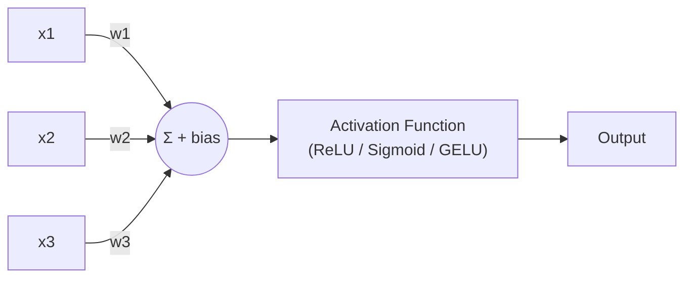
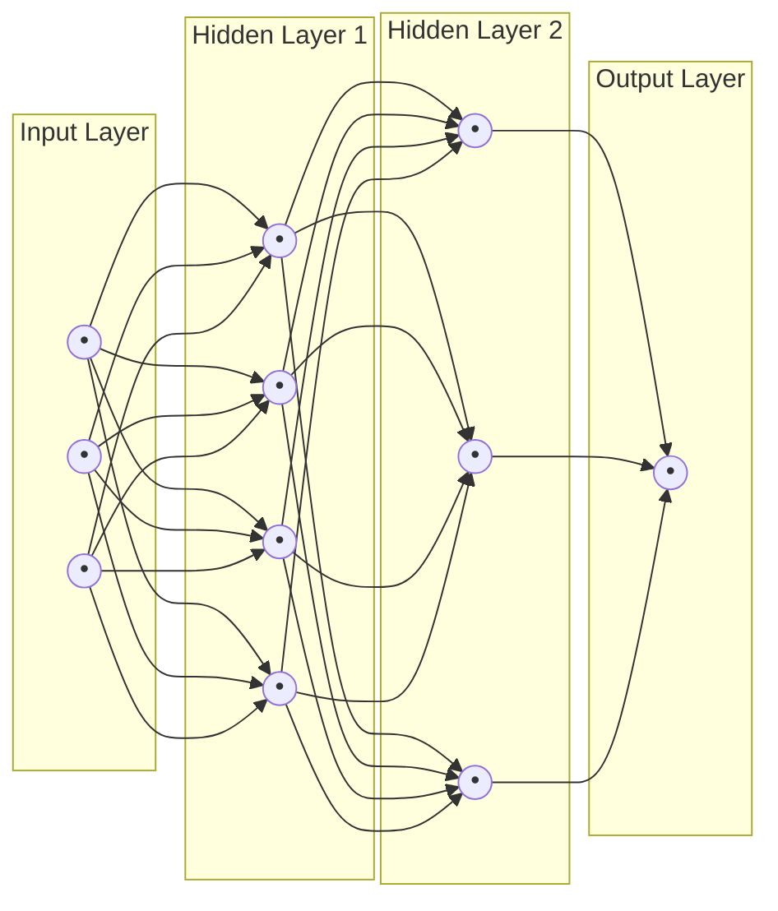
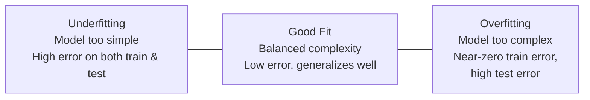
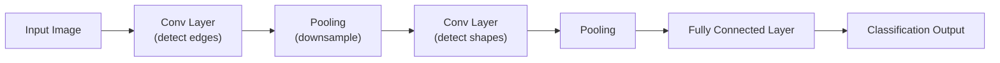

# 04. Neural Networks & Deep Learning Basics

## Learning Objectives
- Understand the anatomy of a neural network layer by layer
- Know how training actually works end-to-end (forward pass, loss, backward pass, update)
- Understand overfitting and the standard tools to prevent it
- Know just enough CNN/RNN basics to compare them against Transformers

---

## 1. The Building Block: The Perceptron / Neuron

A single artificial neuron does three things: takes weighted inputs, sums them with a bias, and passes the result through an **activation function**.



`output = activation(w1*x1 + w2*x2 + w3*x3 + bias)`

Stack many neurons into a **layer**, and stack many layers on top of each other, and you get a **Multi-Layer Perceptron (MLP)** — the simplest form of a "deep" neural network.



**"Deep" learning simply means networks with many hidden layers**, which allows the model to learn increasingly abstract representations — early layers might detect edges in an image, later layers detect shapes, and the final layers detect entire objects.

---

## 2. Activation Functions

Without a non-linear activation function, stacking layers would be mathematically pointless (many linear layers collapse into one linear layer). Activation functions introduce the non-linearity that lets neural networks learn complex patterns.

| Function | Formula (intuition) | Common Use |
|---|---|---|
| **ReLU** | `max(0, x)` — zero out negatives, pass positives through | Default for hidden layers in most networks |
| **Sigmoid** | Squashes input to (0,1) | Binary classification output layer |
| **Softmax** | Converts a vector of scores into probabilities summing to 1 | Multi-class / next-token output layer |
| **GELU** | Smooth, probabilistic variant of ReLU | Default in Transformers (GPT, BERT) |

---

## 3. The Training Loop, End to End

```mermaid
sequenceDiagram
    participant Data as Training Data
    participant Model as Neural Network
    participant Loss as Loss Function
    participant Opt as Optimizer

    Data->>Model: Forward pass (input batch)
    Model->>Loss: Predictions vs. true labels
    Loss->>Model: Compute gradients (backpropagation)
    Model->>Opt: Pass gradients
    Opt->>Model: Update weights (e.g., Adam, SGD)
    Note over Model: Repeat for many batches/epochs<br/>until loss stops improving
```

### Key Terms
| Term | Meaning |
|---|---|
| **Epoch** | One full pass through the entire training dataset |
| **Batch size** | Number of examples processed before a weight update |
| **Learning rate** | How big a step the optimizer takes when updating weights |
| **Optimizer** | The algorithm that decides how to update weights from gradients (SGD, Adam, AdamW) |
| **AdamW** | The most common optimizer for training Transformers — Adam with proper weight decay |

---

## 4. Overfitting & Regularization

**Overfitting** = the model memorizes training data instead of learning generalizable patterns — great training accuracy, poor real-world performance.



### Standard Tools to Prevent Overfitting
| Technique | How It Helps |
|---|---|
| **Dropout** | Randomly "turns off" a fraction of neurons during training, forcing the network to not rely on any single path |
| **Batch Normalization** | Normalizes layer inputs, stabilizing and speeding up training |
| **Weight Decay / L2 Regularization** | Penalizes overly large weights, encouraging simpler solutions |
| **Early Stopping** | Stop training once validation performance stops improving |
| **Data Augmentation** | Artificially expand training data (image flips, text paraphrasing) |
| **More/better data** | The single most effective fix in most real projects |

---

## 5. CNNs and RNNs — Just Enough to Compare Against Transformers

### Convolutional Neural Networks (CNNs)
Primarily used for images. A small filter ("kernel") slides across the image detecting local patterns (edges, textures), and deeper layers combine these into higher-level features (shapes, objects).



### Recurrent Neural Networks (RNNs/LSTMs)
Covered in Doc 03 — process sequences step by step, carrying a hidden state forward. Good historical foundation, largely replaced by Transformers for NLP due to parallelization and long-range memory limitations.

> **Interview Angle:** *"Why don't we use CNNs for text?"* → CNNs excel at detecting local, spatial patterns (like an edge in a photo) using fixed-size filters, but language has long-range, non-local dependencies (a pronoun 200 words later can refer back to a name at the start of a document) that fixed local filters struggle to capture efficiently. This is part of why Transformers' self-attention (which connects any two positions in one step) became the standard.

---

## 6. Scenario-Based Example

**Scenario:** Your model achieves 99% accuracy on training data but only 65% on a held-out test set. An interviewer asks you to diagnose and fix this.

**Strong answer:**
1. **Diagnosis:** This is a textbook case of overfitting — the model has memorized noise/specifics of the training set rather than learning generalizable patterns.
2. **Fixes to propose, in order of typical effectiveness:**
   - Get more / more diverse training data
   - Add dropout or increase weight decay
   - Reduce model complexity (fewer layers/parameters) if data is limited
   - Use data augmentation
   - Apply early stopping based on validation loss
   - Check for data leakage (test examples accidentally present in training data) — often the *real* culprit in production bugs

---

## 7. Interview Quick-Fire Q&A

**Q: Why do we need activation functions?**
A: Without non-linear activation functions, stacking multiple layers would mathematically collapse into a single linear transformation, no matter how many layers you add — activations are what let deep networks learn complex, non-linear patterns.

**Q: What's the difference between an epoch and a batch?**
A: An epoch is one complete pass through the entire training dataset. A batch is a subset of the data processed together before the model's weights are updated once — many batches make up one epoch.

**Q: Explain dropout in one sentence.**
A: During training, dropout randomly disables a fraction of neurons on each forward pass, which prevents the network from over-relying on specific neurons and improves generalization.

**Q: What problem does backpropagation solve?**
A: It efficiently computes the gradient of the loss with respect to every weight in a deep network (using the chain rule), which is what enables gradient descent to update all weights across all layers.

---

**Next:** [`05_Transformer_Architecture.md`](./05_Transformer_Architecture.md)
