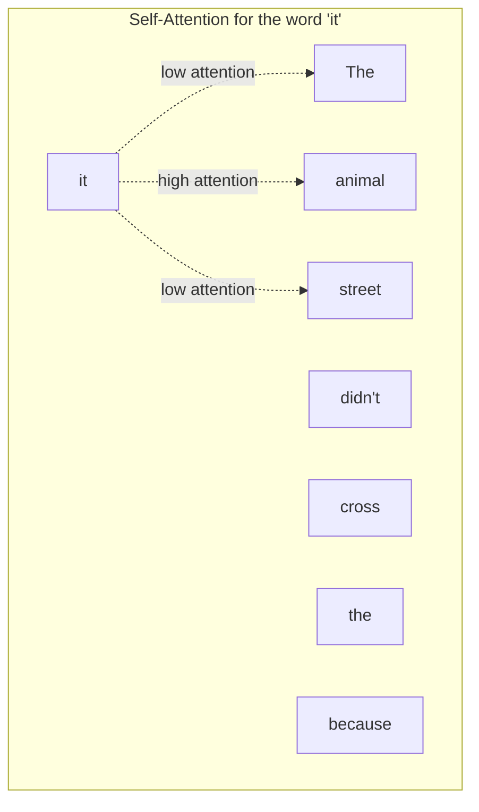
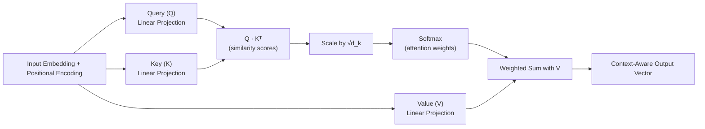
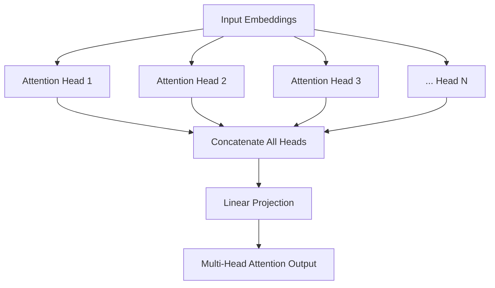
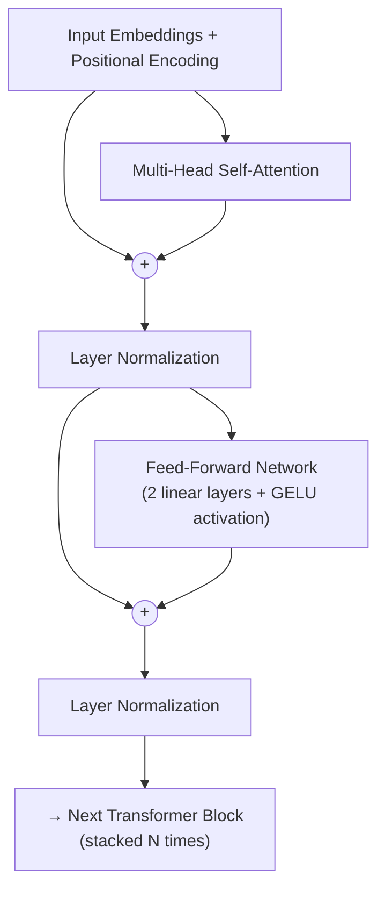
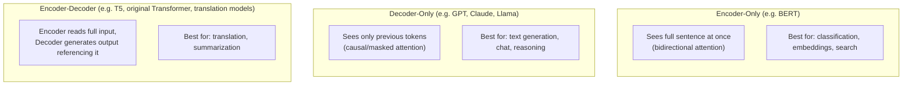
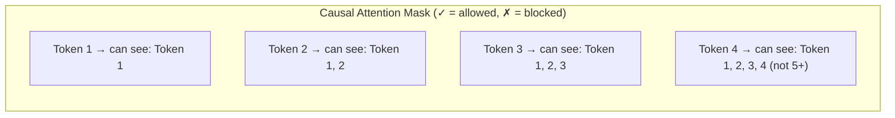

# 05. Transformer Architecture — The Engine Behind Every LLM

## Learning Objectives
- Explain self-attention in plain language, then in mechanical (Q/K/V) detail
- Draw and explain the full Transformer block diagram
- Know the difference between encoder-only, decoder-only, and encoder-decoder models — and name examples of each

> This is the single most important document in the entire series. If an interviewer asks only one deep technical question, it's usually about attention. Master this doc.

---

## 1. The Core Idea: Self-Attention

**Plain-language definition:** Self-attention lets every word in a sentence look at every other word and decide *how much to "pay attention" to it* when building its own representation.

**Example sentence:** *"The animal didn't cross the street because it was too tired."*

What does "it" refer to — the animal or the street? A human immediately knows it's "the animal." Self-attention is the mechanism that lets the model learn this too — when processing the word "it," attention scores will be high toward "animal" and low toward "street."

---

## 2. The Mechanics: Query, Key, Value (Q, K, V)

Every input token is projected into three vectors using learned weight matrices:

| Vector | Plain-Language Role |
|---|---|
| **Query (Q)** | "What am I looking for?" — represents the current word's search request |
| **Key (K)** | "What do I contain?" — represents what each word offers/advertises |
| **Value (V)** | "What information do I actually carry?" — the content passed along if attended to |

### The Attention Formula

`Attention(Q, K, V) = softmax( (Q · Kᵀ) / √d_k ) · V`

**Step-by-step in plain English:**
1. Compute the dot product of the Query with every Key → gives a raw "relevance score" between the current word and every other word.
2. Divide by `√d_k` (a scaling factor) to keep values numerically stable.
3. Apply **softmax** → converts scores into attention weights (probabilities summing to 1).
4. Multiply those weights by each word's **Value** vector and sum → produces the final, context-aware representation of the current word.

---

## 3. Multi-Head Attention

Instead of computing attention once, the Transformer runs **multiple attention "heads" in parallel**, each learning to focus on different types of relationships (one head might track grammatical subject-verb agreement, another might track coreference like "it → animal," another might track topical relevance).

**Why multiple heads instead of one big one?** Each head has a smaller dimensionality but can specialize — collectively they capture a richer, more diverse set of relationships than a single attention computation could.

---

## 4. Positional Encoding

Unlike RNNs, self-attention has **no inherent sense of word order** — mathematically, attention treats input as a "bag" of tokens unless we inject order information. **Positional encoding** adds a unique signal per position (traditionally using sine/cosine functions of different frequencies, or in modern models, learned/rotary embeddings like RoPE) so the model knows "this word is 1st, this one is 5th," etc.

> **Interview Angle:** *"Why can't the Transformer just infer word order from the words themselves?"* → Because self-attention computes relationships based on content similarity, not sequence position — without explicit positional signals, "the cat sat on the mat" and "the mat sat on the cat" would look identical to the attention mechanism.

---

## 5. The Full Transformer Block

Key supporting concepts:
- **Residual ("skip") connections** — the `+` symbols above. The input to a sub-layer is added back to its output, which prevents gradients from vanishing in very deep networks and helps preserve original signal.
- **Layer Normalization** — normalizes activations, stabilizing training.
- **Feed-Forward Network (FFN)** — applied independently to each token position; typically expands dimensionality (e.g., 4x) then projects back down, adding representational capacity.

A full model (e.g., GPT, Llama) is simply this block **stacked N times** (e.g., 32, 80, or more layers depending on model size).

---

## 6. Encoder-Only vs. Decoder-Only vs. Encoder-Decoder

| Architecture | Attention Direction | Example Models | Typical Use Case |
|---|---|---|---|
| **Encoder-only** | Bidirectional (sees whole input at once) | BERT, RoBERTa | Classification, embeddings for search, sentiment analysis |
| **Decoder-only** | Causal / unidirectional (only sees past tokens) | GPT-4, Claude, Llama, Mistral, Gemini | Open-ended text generation, chat, reasoning — **this is what "LLM" usually refers to today** |
| **Encoder-Decoder** | Encoder bidirectional, Decoder causal + cross-attends to encoder | T5, BART, original "Attention Is All You Need" Transformer | Translation, summarization (sequence-to-sequence tasks) |

**Why almost all modern chat LLMs are decoder-only:** Generation is inherently sequential (predict next token, then the next, then the next), and a single decoder-only architecture handles understanding *and* generation reasonably well at massive scale, simplifying training and enabling the "just predict the next token" pretraining objective (Doc 06) to work for nearly any task.

---

## 7. Causal (Masked) Attention — Why GPT Can't "Cheat"

In decoder-only models, a **causal mask** prevents each position from attending to future tokens — this is essential both during training (so the model can't just "look ahead" to see the answer it's supposed to predict) and during generation (future tokens don't exist yet).

---

## 8. Scenario-Based Example

**Scenario:** An interviewer says: *"We're building a semantic search feature and a chatbot. Which type of Transformer architecture would you use for each, and why?"*

**Strong answer:**
- **Semantic search / embeddings:** Use an **encoder-only** model (like a `sentence-transformers` model based on BERT) — it processes the full text bidirectionally in one pass to produce a rich, fixed-size embedding vector optimized for similarity comparison. It's also faster/cheaper since it's a single forward pass with no token-by-token generation.
- **Chatbot:** Use a **decoder-only** model (like GPT-4 or Claude) — it needs to generate open-ended, variable-length responses token by token, which is exactly what causal/autoregressive decoding is built for.

---

## 9. Interview Quick-Fire Q&A

**Q: In your own words, what problem does self-attention solve that RNNs couldn't?**
A: It lets every token directly relate to every other token in a single step, regardless of distance, and does so in parallel rather than sequentially — solving both the "forgetting long-range context" problem and the "slow, non-parallelizable training" problem RNNs had.

**Q: What are Query, Key, and Value, in simple terms?**
A: Query is what the current token is "looking for," Key is what each token "advertises" about itself, and Value is the actual content passed along when a token is attended to. Attention scores come from comparing Queries against Keys, and are used to weight a sum over Values.

**Q: Why do we scale by √d_k in the attention formula?**
A: To prevent dot-product values from growing too large as the dimensionality increases, which would push softmax into regions with extremely small gradients and destabilize training.

**Q: What's the difference between self-attention and cross-attention?**
A: Self-attention relates tokens within the same sequence to each other. Cross-attention (used in encoder-decoder models) lets the decoder's tokens attend to the encoder's output representations — e.g., in translation, letting each generated output word attend to the relevant parts of the source sentence.

**Q: Why is positional encoding necessary?**
A: Self-attention has no built-in notion of sequence order — without positional encoding, shuffling the words in a sentence would produce identical attention computations, so explicit position information must be injected into the input.

---

**Next:** [`06_LLM_Fundamentals_Training_and_Scaling.md`](./06_LLM_Fundamentals_Training_and_Scaling.md)
