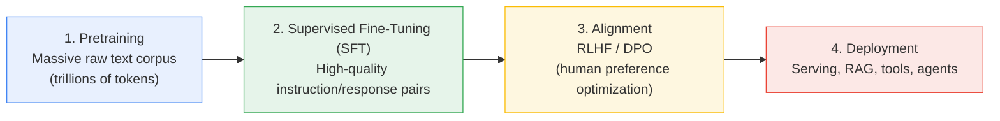
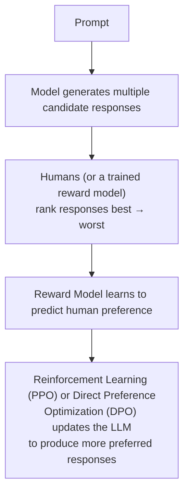
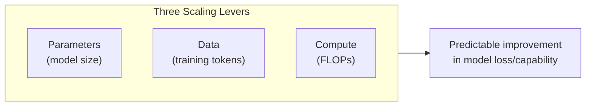
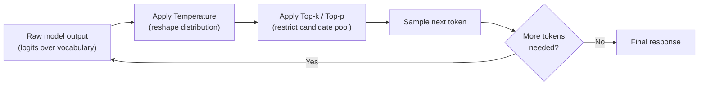
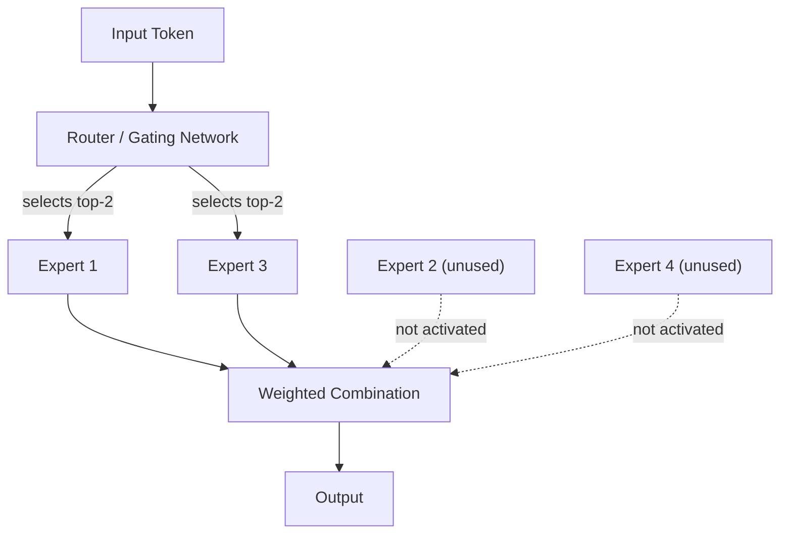

# 06. LLM Fundamentals: Training, Lifecycle & Scaling

## Learning Objectives
- Know the three-stage lifecycle of how an LLM like Claude or GPT gets built
- Understand pretraining objectives, scaling laws, and context windows
- Be able to explain inference-time sampling parameters (temperature, top-p, top-k) and their trade-offs

---

## 1. The Full LLM Lifecycle

### Stage 1: Pretraining
The model is trained on a massive corpus of text (web pages, books, code, etc.) using a **self-supervised objective** — no human labeling required, because the "label" is just the next word in the existing text.

- **Causal Language Modeling (used by GPT/Claude/Llama):** Given a sequence of tokens, predict the next token. Repeated across trillions of tokens.
- **Masked Language Modeling (used by BERT):** Randomly mask ~15% of tokens and predict them from surrounding context (bidirectional).

**Result of pretraining alone:** A model that's excellent at *completing text* but not naturally good at *following instructions* or having a conversation — it will often just continue your prompt rather than answer it, or ramble in the style of internet text.

### Stage 2: Supervised Fine-Tuning (SFT)
The pretrained model is fine-tuned on a smaller, curated dataset of **(instruction, ideal response)** pairs, written or curated by humans. This teaches the model the *format* of being a helpful assistant — following instructions, answering questions directly, using a conversational tone.

### Stage 3: Alignment (RLHF / DPO)
Even after SFT, models may be unhelpful, unsafe, or produce responses humans don't prefer. Alignment further tunes the model using human preference data.

- **RLHF (Reinforcement Learning from Human Feedback):** Trains a separate reward model on human rankings, then uses RL (typically PPO) to optimize the LLM against that reward model.
- **DPO (Direct Preference Optimization):** A simpler, more stable alternative that directly optimizes the model on preference pairs without needing a separate reward model or full RL loop — increasingly popular because it's cheaper and easier to train.

> **Interview Angle:** *"Why not just skip straight to RLHF after pretraining?"* → SFT first teaches the model the basic *shape* of instruction-following/conversation. RLHF/DPO then *refines* the quality, tone, safety, and helpfulness within that shape — attempting alignment on a purely raw pretrained model (which doesn't yet know how to follow instructions) is far less effective and less stable.

---

## 2. Scaling Laws

Research (most famously from OpenAI and DeepMind's "Chinchilla" paper) found predictable relationships between **model size (parameters)**, **dataset size (tokens)**, **compute budget**, and resulting model performance (loss).

**Key practical takeaway (Chinchilla-optimal training):** For a fixed compute budget, there's an optimal balance between model size and training data volume — many earlier large models were actually **under-trained** relative to their size (too many parameters, not enough training tokens). Modern models are trained closer to this optimal ratio, or intentionally over-trained on more tokens than "optimal" because inference cost (which scales with parameter count) matters more in production than training-compute efficiency alone.

### Emergent Abilities
As models scale up, they sometimes display **capabilities that weren't explicitly trained for and don't appear at smaller scale** — e.g., multi-step arithmetic, chain-of-thought reasoning, few-shot in-context learning. This is an active and somewhat debated research area (some "emergence" may be a measurement artifact), but it's a common interview talking point.

---

## 3. Context Window

The **context window** is the maximum number of tokens (input + output combined) a model can process/attend to in a single request.

| Consideration | Why It Matters |
|---|---|
| Larger context = more information the model can reference at once | Enables long documents, extended conversations, large codebases |
| Attention cost grows (historically quadratically with sequence length in vanilla attention) | Longer context = more compute/memory per request — a major driver of inference cost and the motivation behind optimized attention implementations (e.g., FlashAttention) and architectural tricks |
| "Lost in the middle" effect | Models can under-utilize information placed in the middle of a very long context compared to the beginning/end — relevant when designing RAG prompts (Doc 09) |

---

## 4. Inference-Time Sampling Parameters

Once trained, the model still outputs a probability distribution over the vocabulary for the next token at each step — **how that distribution is turned into an actual word is controlled by sampling parameters.**

| Parameter | What It Controls | Effect |
|---|---|---|
| **Temperature** | Reshapes the probability distribution before sampling | Low (e.g., 0.1–0.3) → more deterministic, focused, repetitive. High (e.g., 0.8–1.2) → more random, creative, diverse |
| **Top-p (nucleus sampling)** | Samples only from the smallest set of tokens whose cumulative probability ≥ p | Dynamically adjusts vocabulary size considered, avoiding very unlikely tokens while preserving diversity |
| **Top-k** | Samples only from the top k most likely tokens | Simpler, fixed-size cutoff |
| **Max tokens** | Caps the length of the generated output | Controls cost and prevents runaway generation |

> **Interview Angle:** *"You're building a code-generation assistant vs. a creative writing assistant — how would you set temperature differently?"* → Code generation should use **low temperature (near 0)** for deterministic, correct, repeatable output. Creative writing benefits from **higher temperature (0.7–1.0)** for varied, interesting phrasing.

---

## 5. Popular LLM Families — Quick Comparison

| Family | Maker | Notable Trait |
|---|---|---|
| **GPT (GPT-4, GPT-5 series)** | OpenAI | Widely adopted, strong general-purpose reasoning and tool use |
| **Claude** | Anthropic | Strong focus on safety/alignment, large context windows, strong coding/agentic performance |
| **Llama** | Meta | Open-weight models, widely used for self-hosting and fine-tuning |
| **Gemini** | Google DeepMind | Natively multimodal, deep integration with Google ecosystem |
| **Mistral / Mixtral** | Mistral AI | Efficient open-weight models; Mixtral uses a Mixture-of-Experts (MoE) architecture |

> **Note:** Specific model version names, benchmark rankings, and pricing change frequently — in a real interview or on the job, always verify current specifics rather than relying on memorized figures, since this space moves fast.

### Mixture of Experts (MoE) — Worth Knowing
Instead of every token passing through the *entire* network, an MoE model has many "expert" sub-networks and a **router** that sends each token to only a few relevant experts. This allows models to have a very large *total* parameter count while keeping the *active* compute per token much smaller — improving efficiency.

---

## 6. Scenario-Based Example

**Scenario:** A finance company wants an internal assistant that must give **consistent, reproducible answers** to the same compliance question every time it's asked (for audit purposes), while a separate marketing team wants an assistant that generates **varied, creative ad copy** for A/B testing.

**Strong answer:**
- Compliance assistant → **low temperature (~0), low/no top-p randomness**, possibly combined with retrieval grounding (RAG, Doc 09) and strict system prompts, so answers are as deterministic and traceable as possible.
- Marketing copy assistant → **higher temperature (0.7–1.0) with top-p sampling**, generating multiple varied candidates per prompt for the team to choose from.

---

## 7. Interview Quick-Fire Q&A

**Q: What's the difference between pretraining and fine-tuning?**
A: Pretraining trains a model from scratch (or near-scratch) on massive, broad, unlabeled text using a self-supervised objective like next-token prediction. Fine-tuning takes that pretrained model and further trains it on a smaller, task/domain-specific labeled dataset to specialize its behavior.

**Q: What does temperature = 0 actually do?**
A: It effectively makes generation deterministic — the model always picks the single highest-probability token at each step (equivalent to greedy decoding), rather than sampling from the full distribution.

**Q: What is RLHF and why is it used?**
A: Reinforcement Learning from Human Feedback trains a reward model on human-ranked response comparisons, then uses reinforcement learning to fine-tune the LLM to produce outputs the reward model scores highly — aligning the model's behavior with human preferences for helpfulness, honesty, and safety beyond what SFT alone achieves.

**Q: What is a context window, and why does a bigger one add cost?**
A: It's the maximum number of tokens (input + output) the model can process in one request. Larger context windows increase compute and memory usage per request, since attention mechanisms must relate every token pair within that window — driving up latency and inference cost.

**Q: What's the difference between RLHF and DPO?**
A: RLHF trains a separate reward model and then uses reinforcement learning (typically PPO) to optimize the LLM against it — a two-stage, relatively complex and unstable process. DPO skips the separate reward model and RL loop, directly optimizing the LLM on human preference pairs using a simpler, more stable supervised-style loss function.

---

**Next:** [`07_Prompt_Engineering.md`](./07_Prompt_Engineering.md)
