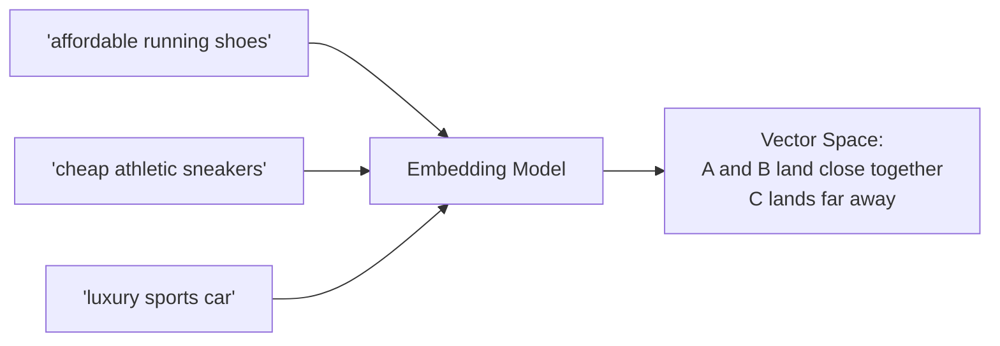
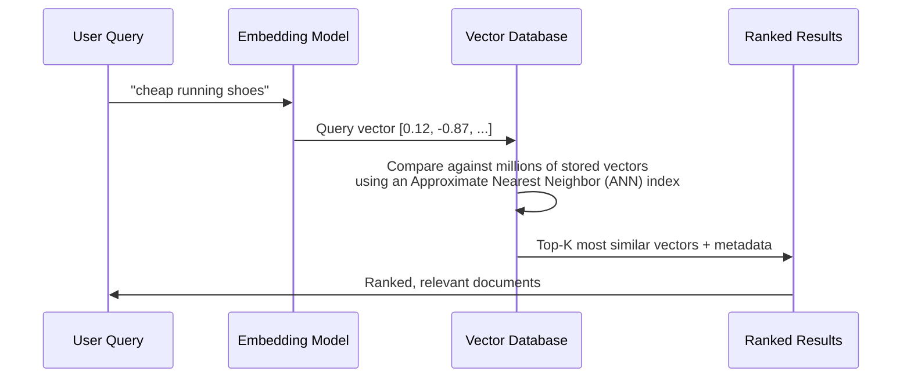
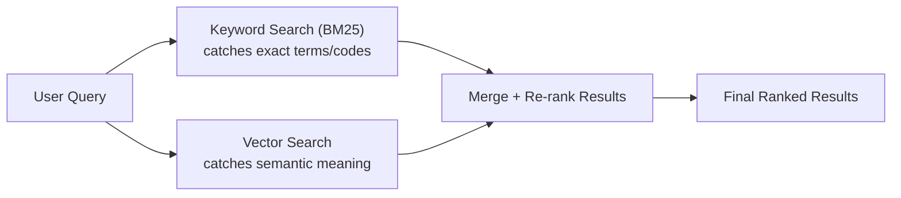

# 08. Embeddings & Vector Databases

## Learning Objectives
- Understand how embeddings power semantic search
- Know the major similarity metrics and indexing algorithms
- Be able to compare the popular vector database options and when to use each

---

## 1. What Is an Embedding, Really?

An embedding is a **dense numerical vector** (e.g., 384, 768, or 1536 dimensions) that represents the *meaning* of a piece of text (or image, audio, etc.), produced by a trained neural network (typically an encoder-only Transformer, see Doc 05).

**Key property:** Pieces of text with similar meaning end up as vectors that are **close together** in this high-dimensional space, even if they share no exact words.

### Popular Embedding Models
| Model | Notes |
|---|---|
| OpenAI `text-embedding-3` family | Widely used commercial API embeddings |
| `sentence-transformers` (e.g., all-MiniLM, BGE, E5) | Popular open-source options, self-hostable |
| Cohere Embed | Commercial API, strong multilingual support |
| Voyage AI | Commercial, strong retrieval-focused embeddings |

---

## 2. Similarity Metrics

| Metric | Formula Intuition | Notes |
|---|---|---|
| **Cosine Similarity** | Angle between two vectors, ignoring magnitude | Most common for text embeddings; range -1 to 1 |
| **Dot Product** | Raw projection of one vector onto another | Faster to compute; equivalent to cosine similarity if vectors are normalized |
| **Euclidean (L2) Distance** | Straight-line distance between two points | More common in image/numeric embedding spaces |

> **Interview Angle:** *"Why is cosine similarity preferred over Euclidean distance for text embeddings?"* → Cosine similarity focuses on the *direction* (semantic meaning) of vectors rather than their magnitude, which can vary due to text length or other factors unrelated to meaning — making it more robust for comparing semantic similarity.

---

## 3. How Vector Search Actually Works

### Why "Approximate" Nearest Neighbor (ANN)?
Comparing a query vector against *every single* stored vector (brute-force / "exact" search) is accurate but too slow at scale (millions/billions of vectors). **ANN algorithms** trade a small amount of accuracy for massive speed gains by using smart indexing structures.

### Common Indexing Algorithms
| Algorithm | How It Works (Intuition) |
|---|---|
| **HNSW (Hierarchical Navigable Small World)** | Builds a multi-layer graph where each vector connects to its "neighbors" — search hops through the graph, quickly narrowing down to the closest matches. The most widely used ANN algorithm today; strong speed/accuracy trade-off. |
| **IVF (Inverted File Index)** | Clusters vectors into buckets ("cells"); search only compares the query against vectors in the most relevant few buckets, not the whole dataset. |
| **PQ (Product Quantization)** | Compresses vectors into smaller codes to save memory, often combined with IVF (IVF-PQ) for large-scale deployments. |

---

## 4. Popular Vector Databases

| Vector DB | Type | Notable For |
|---|---|---|
| **Pinecone** | Managed cloud service | Fully managed, easy to scale, popular for production RAG |
| **Weaviate** | Open-source (also offers cloud) | Built-in hybrid search, GraphQL API, modular |
| **Milvus** | Open-source | Built for very large-scale, high-performance deployments |
| **Chroma** | Open-source, lightweight | Popular for prototyping and local development |
| **FAISS** (Facebook AI Similarity Search) | Open-source library (not a full DB) | Extremely fast ANN library; often embedded inside other systems rather than used standalone in production |
| **pgvector** | PostgreSQL extension | Adds vector search to existing Postgres databases — great when you want to avoid a separate specialized DB |
| **Elasticsearch / OpenSearch (vector support)** | Search engine with vector capability | Good when you already run Elastic and want hybrid keyword+vector search in one system |

> **Interview Angle:** *"Your company already runs PostgreSQL for everything — would you introduce a new dedicated vector DB or use pgvector?"* → A strong answer weighs trade-offs: pgvector avoids operational overhead of a new system and keeps data in one place (good for moderate scale), while a dedicated vector DB (Pinecone/Milvus) offers better performance and features at very large scale or high query volume. The "right" answer depends on scale, team expertise, and existing infrastructure — showing you can reason about trade-offs (not just name-drop tools) is what interviewers look for.

---

## 5. Hybrid Search

Pure semantic (vector) search can sometimes miss exact keyword matches that matter (product codes, names, acronyms). **Hybrid search** combines:
- **Sparse/keyword search** (e.g., BM25/TF-IDF) — great for exact terms
- **Dense/vector search** (embeddings) — great for meaning/paraphrase

...then merges results, typically using a re-ranking step (see Doc 09).

---

## 6. Scenario-Based Example

**Scenario:** A legal-tech company wants to let lawyers search across 2 million contracts using natural language, and also find contracts by exact clause reference numbers (e.g., "Section 4.2(b)").

**Strong answer:** Pure vector search alone would struggle with the exact clause-number lookup (embeddings capture *meaning*, not precise identifiers). This calls for **hybrid search** — combine BM25/keyword search (for exact reference lookups) with dense vector search (for natural-language, conceptual queries like "find contracts with unusually short termination notice periods"), merging and re-ranking results. At 2 million documents, an HNSW-based index (via Pinecone, Milvus, or Weaviate) would be appropriate for the vector side to keep latency low.

---

## 7. Interview Quick-Fire Q&A

**Q: What's the difference between an embedding model and a vector database?**
A: An embedding model is a neural network that *converts* text (or other data) into a numerical vector representing its meaning. A vector database *stores* those vectors and efficiently *searches* them for similarity — they're complementary, not interchangeable.

**Q: Why do we need Approximate Nearest Neighbor search instead of exact search?**
A: Exact (brute-force) search compares a query against every stored vector, which becomes too slow at scale (millions+ vectors). ANN algorithms like HNSW trade a small, usually negligible accuracy loss for massive speed improvements, making real-time search feasible at scale.

**Q: What is hybrid search and when would you use it?**
A: Hybrid search combines keyword-based search (like BM25) with vector/semantic search, merging both result sets. It's used when queries need to match both exact terms (IDs, names, codes) and paraphrased/conceptual meaning — pure vector search alone can under-perform on exact-match queries.

**Q: What does HNSW stand for and what's the core idea?**
A: Hierarchical Navigable Small World — it builds a multi-layered graph connecting each vector to its nearest neighbors, allowing search to quickly "navigate" toward the closest matches without comparing against every vector in the dataset.

---

**Next:** [`09_RAG_Retrieval_Augmented_Generation.md`](./09_RAG_Retrieval_Augmented_Generation.md)
