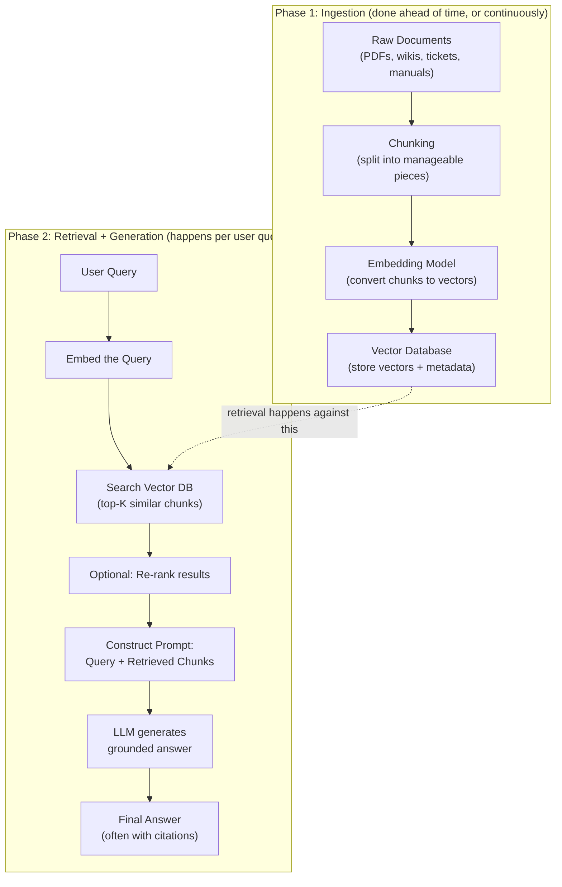
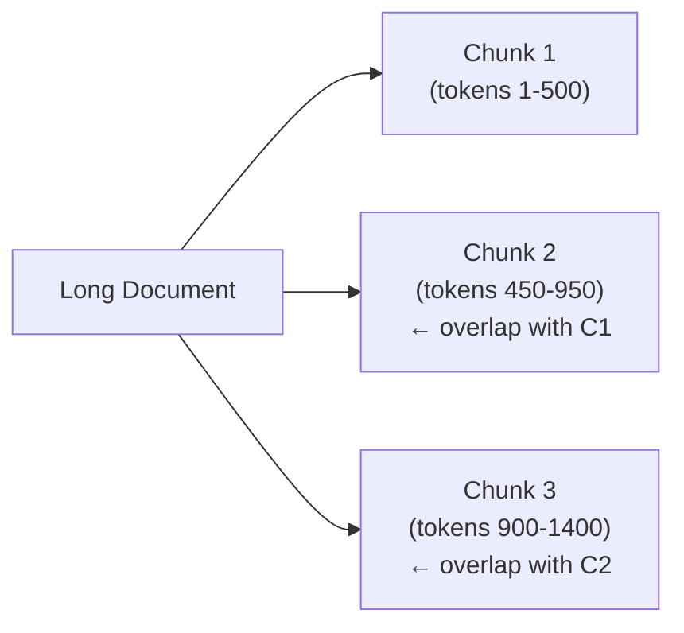
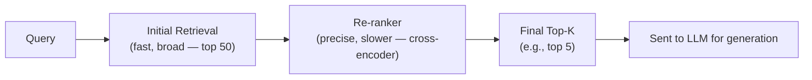
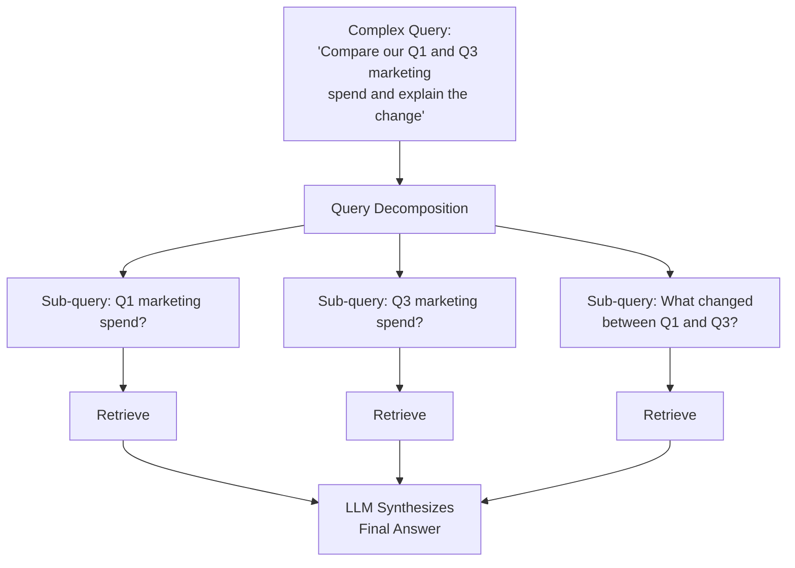
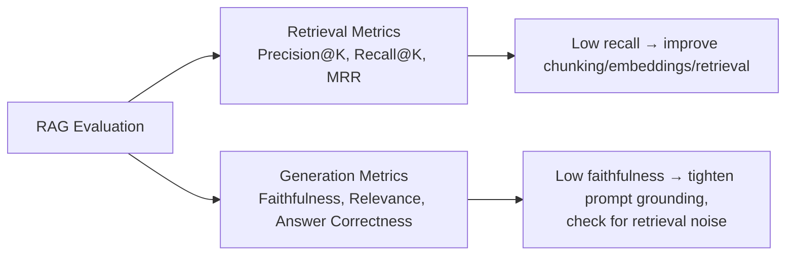

# 09. RAG — Retrieval-Augmented Generation

## Learning Objectives
- Explain why RAG exists and what problems it solves
- Draw the full RAG pipeline from ingestion to generation
- Know chunking strategies, retrieval methods, and advanced RAG patterns
- Be able to evaluate a RAG system's quality

> RAG is, by a wide margin, the single most commonly asked GenAI system-design topic in enterprise interviews today. Know this document cold.

---

## 1. Why RAG Exists

LLMs have three fundamental limitations:

| Limitation | Problem | How RAG Helps |
|---|---|---|
| **Knowledge cutoff** | The model only knows what was in its training data up to a certain date | RAG injects fresh, up-to-date information at query time |
| **No access to private/proprietary data** | A company's internal documents were never in the training set | RAG retrieves from the company's own document store |
| **Hallucination** | The model may confidently generate plausible-sounding but false information | Grounding responses in retrieved, verifiable source documents reduces (but doesn't eliminate) hallucination |

**Plain-language definition:** RAG = "look it up, then answer" instead of "answer from memory alone."

---

## 2. The Two Phases of RAG



---

## 3. Chunking Strategies

Documents must be broken into smaller pieces ("chunks") before embedding — an entire 50-page manual can't be meaningfully compared to a short user query as a single vector.

| Strategy | How It Works | Trade-off |
|---|---|---|
| **Fixed-size chunking** | Split every N tokens/characters (e.g., 500 tokens), often with overlap | Simple, fast — but can cut sentences/ideas in half |
| **Sentence/paragraph-based chunking** | Split along natural language boundaries | Preserves meaning better than arbitrary cuts |
| **Recursive/semantic chunking** | Split by document structure (headers, sections) first, then by size within sections | Best balance of coherence and manageable size for most enterprise docs |
| **Sliding window with overlap** | Consecutive chunks share a bit of overlapping text (e.g., 10-20%) | Reduces the risk of losing context that spans a chunk boundary |
| **Parent-child (small-to-big) chunking** | Embed small, precise chunks for retrieval accuracy, but return the larger "parent" chunk/section for generation context | Gets the best of both worlds — precise matching + sufficient context |



> **Interview Angle:** *"What chunk size would you pick and why?"* → There's no universal answer — smaller chunks (e.g., 200-400 tokens) improve retrieval precision (less irrelevant content per chunk) but may lose context; larger chunks (e.g., 800-1500 tokens) preserve more context but can dilute relevance and waste context window. The right answer shows you'd **test empirically** against your actual documents and query patterns, and mention parent-child chunking as a way to avoid the trade-off entirely.

---

## 4. Retrieval Methods

| Method | Description |
|---|---|
| **Dense retrieval** | Standard vector similarity search using embeddings (Doc 08) |
| **Sparse retrieval (BM25/keyword)** | Traditional term-frequency-based search; strong for exact terms/codes |
| **Hybrid retrieval** | Combines dense + sparse, typically merged via a fusion method like Reciprocal Rank Fusion (RRF) |
| **Metadata filtering** | Narrow the search using structured filters (date range, document type, department) before/alongside vector search |

### Re-ranking
After initial retrieval pulls, say, the top 50 candidate chunks (fast but coarse), a **re-ranker** (often a smaller, more precise cross-encoder model) re-scores and re-orders the top candidates for relevance before the final top-K are passed to the LLM. This two-stage "retrieve broad, then re-rank precise" approach significantly improves answer quality at low added latency.



---

## 5. Advanced RAG Patterns

| Pattern | What It Does | When to Use |
|---|---|---|
| **HyDE (Hypothetical Document Embeddings)** | LLM first generates a hypothetical "ideal answer," then embeds *that* to search — often matches real documents better than embedding the raw (possibly vague) user query | When user queries are short/ambiguous compared to document style |
| **Multi-query retrieval** | LLM rewrites the user's query into several variations, retrieves for each, and merges results | When a single query phrasing might miss relevant documents phrased differently |
| **Query decomposition** | Breaks a complex multi-part question into sub-questions, retrieves for each separately, then synthesizes | Complex analytical questions ("Compare Q1 and Q3 revenue trends and explain the dip") |
| **Agentic RAG** | An agent (Doc 11) decides *whether* to retrieve, *what* to retrieve, and can iterate — retrieve, evaluate sufficiency, retrieve again if needed | Complex, multi-hop questions where single-shot retrieval isn't enough |
| **GraphRAG** | Builds a knowledge graph from documents and retrieves via graph traversal/relationships, not just vector similarity | Questions requiring multi-hop relational reasoning ("Which vendors used by Department A are also flagged in the Department B audit?") |



---

## 6. Constructing the Final Prompt

```
You are a helpful assistant. Answer the QUESTION using ONLY the information in the CONTEXT below.
If the answer cannot be found in the CONTEXT, say "I don't have enough information to answer that."
Cite the source document for each claim using [Source: filename].

CONTEXT:
[Chunk 1 - source: HR_Policy_2026.pdf]
"Employees are entitled to 18 days of paid leave annually..."

[Chunk 2 - source: HR_Policy_2026.pdf]
"Unused leave may be carried over up to 5 days into the next calendar year..."

QUESTION:
How many leave days can I carry over to next year?
```

Key elements: explicit grounding instruction, explicit "don't know" fallback (reduces hallucination), citation requirement (builds trust and enables verification).

---

## 7. Evaluating a RAG System

RAG quality has **two separate dimensions** that must be evaluated independently:

| Dimension | Question It Answers | Example Metrics |
|---|---|---|
| **Retrieval quality** | Did we fetch the *right* documents? | Precision@K, Recall@K, MRR (Mean Reciprocal Rank) |
| **Generation quality** | Given the right documents, did the LLM produce a *good* answer? | Faithfulness/groundedness (does the answer only use retrieved content?), Answer relevance, Context precision |

Frameworks like **RAGAS**, **TruLens**, and **LLM-as-judge** approaches (see Doc 12) are commonly used to automate these evaluations at scale.



---

## 8. Scenario-Based Example (Enterprise Use Case)

**Scenario:** A 50,000-employee bank wants an internal chatbot so employees can ask HR policy, IT support, and compliance questions, sourced only from official internal documentation, with full auditability.

**Design walkthrough (this is exactly how to answer a RAG system-design interview question):**

1. **Ingestion:** Pull documents from SharePoint/Confluence via connectors; use semantic/recursive chunking respecting document structure (headers, policy sections); store chunk-level metadata (department, document owner, last-updated date, access-control tags).
2. **Embedding:** Use a strong general-purpose or domain-tuned embedding model; re-embed on document updates (track via checksums to avoid unnecessary re-processing).
3. **Access control:** Critical for a bank — retrieval must respect the *querying employee's* permissions (e.g., an IT employee shouldn't retrieve legal/compliance-restricted documents). This means filtering by metadata/access tags **at retrieval time**, not just relying on the LLM to "behave."
4. **Retrieval:** Hybrid search (BM25 + dense) since employees will search using both exact policy codes and natural questions; re-ranking to improve top-5 precision.
5. **Generation:** Strict grounding prompt, mandatory citations, explicit "I don't know" fallback, low temperature for consistency.
6. **Evaluation & monitoring:** Faithfulness/groundedness scoring on sampled responses, human review queue for low-confidence answers, feedback thumbs-up/down loop feeding back into retrieval tuning.
7. **Compliance:** Full audit log of every query, retrieved chunk, and generated answer — a hard requirement in regulated industries (see Doc 15).

---

## 9. Common RAG Failure Modes & Fixes

| Failure Mode | Likely Cause | Fix |
|---|---|---|
| Answers cite irrelevant chunks | Poor chunking or weak embeddings | Improve chunking strategy, try a stronger/domain-tuned embedding model, add re-ranking |
| Model ignores retrieved context and hallucinates anyway | Weak grounding instructions, model prioritizing parametric knowledge | Strengthen system prompt, lower temperature, consider fine-tuning for stronger context-adherence |
| Slow response times | Large re-ranking step, oversized context, unoptimized vector index | Reduce top-K before re-ranking, cache frequent queries, tune ANN index parameters |
| Misses relevant info split across multiple chunks | Chunking severed related content | Use overlap, parent-child chunking, or multi-hop/agentic retrieval |
| Retrieves outdated info alongside current info | No recency handling | Add recency metadata filtering/boosting, deprecate/remove stale documents |

---

## 10. Interview Quick-Fire Q&A

**Q: What are the two core problems RAG solves that fine-tuning alone doesn't solve well?**
A: Providing access to information the model was never trained on (private data, real-time/recent information) and reducing hallucination by grounding answers in verifiable retrieved sources — fine-tuning changes model *behavior/style*, but doesn't reliably inject new *factual* knowledge or keep it current.

**Q: Walk me through what happens when a user submits a query in a RAG system.**
A: The query is embedded into a vector, the vector database is searched for the most similar document chunks (often via ANN search, possibly combined with keyword/BM25 search in hybrid mode), the top candidates may be re-ranked for precision, the highest-scoring chunks are inserted into a prompt alongside the original query with grounding instructions, and the LLM generates a response using that provided context.

**Q: Why would you add a re-ranking step instead of just increasing K in initial retrieval?**
A: Initial vector retrieval is optimized for speed over a huge corpus and can be noisy; a re-ranker (typically a more computationally expensive cross-encoder) re-scores a smaller candidate set with much higher precision. Simply raising K increases noise and context length/cost without necessarily improving relevance ordering.

**Q: How would you evaluate whether a RAG answer is hallucinating?**
A: Check "faithfulness"/groundedness — whether every claim in the generated answer can be traced back to the retrieved context, typically using an LLM-as-judge that compares the answer against the retrieved chunks, or frameworks like RAGAS that automate this scoring.

**Q: When would you choose agentic RAG over standard single-shot RAG?**
A: When queries are complex, multi-hop, or ambiguous enough that a single retrieval pass is unlikely to gather everything needed — agentic RAG lets the system iteratively decide what to retrieve, evaluate whether it has enough information, and retrieve again if not, at the cost of extra latency and complexity.

---

**Next:** [`10_Fine_Tuning_PEFT_LoRA_RLHF.md`](./10_Fine_Tuning_PEFT_LoRA_RLHF.md)
