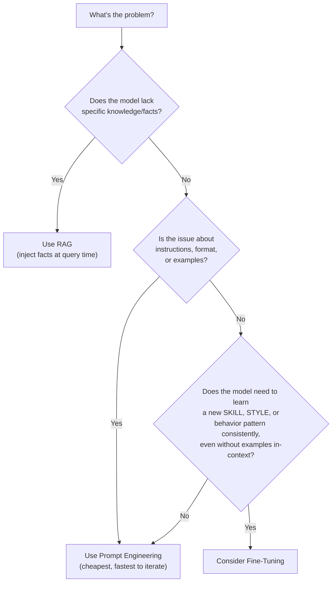
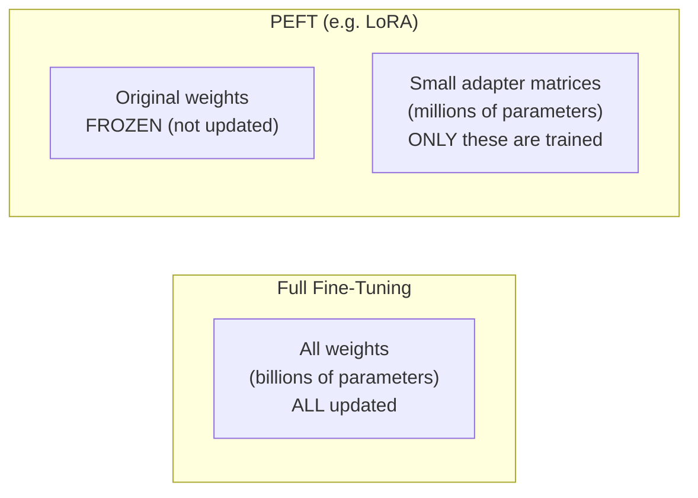
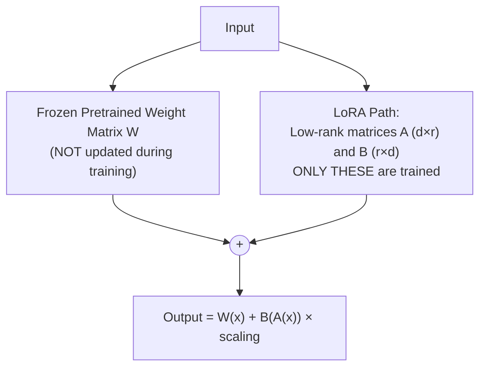
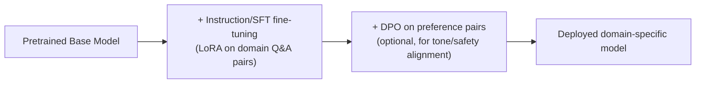

# 10. Fine-Tuning, PEFT, LoRA & RLHF

## Learning Objectives
- Know when to fine-tune vs. use RAG vs. use prompt engineering
- Understand full fine-tuning vs. parameter-efficient fine-tuning (PEFT), especially LoRA/QLoRA
- Be able to describe a fine-tuning project end-to-end, including data prep and common pitfalls

---

## 1. The Decision Framework: Prompting vs. RAG vs. Fine-Tuning

This is one of the most common **judgment-based** interview questions in GenAI roles — interviewers want to see you reach for the *cheapest effective solution*, not the most sophisticated one.

| Approach | Best For | Cost/Effort | Updates Knowledge? |
|---|---|---|---|
| **Prompt Engineering** | Format, tone, simple task instructions | Lowest | No |
| **RAG** | Injecting facts, proprietary/current data | Medium (build retrieval pipeline) | Yes — dynamically, at query time |
| **Fine-Tuning** | Teaching consistent style, domain jargon, complex behavior patterns, reducing prompt length/cost at scale | Highest (data + compute + MLOps) | Only what's in the fine-tuning data; not dynamic |

> **Interview Angle:** *"A team wants to fine-tune a model so it 'knows' the latest company product catalog."* → Push back constructively: fine-tuning is usually the **wrong tool** for injecting fast-changing factual knowledge — RAG is almost always better here since the catalog will keep changing and fine-tuning would need constant re-training. Fine-tuning shines when you need the model to reliably *behave* a certain way (e.g., always respond in a specific structured format, master a narrow domain's terminology/reasoning style), not to memorize a lookup table of facts.

---

## 2. Full Fine-Tuning vs. Parameter-Efficient Fine-Tuning (PEFT)

### Full Fine-Tuning
Every single weight in the model is updated during training.

| Pros | Cons |
|---|---|
| Maximum flexibility/capability change | Extremely expensive (GPU memory for a 70B model can require hundreds of GB) |
| Can achieve the deepest behavior change | Risk of **catastrophic forgetting** (model loses general capabilities while learning the new task) |
| | Requires storing a full separate model copy per fine-tuned variant |

### PEFT (Parameter-Efficient Fine-Tuning)
Instead of updating all weights, PEFT methods freeze the original model and train only a small number of *additional* parameters.

### LoRA (Low-Rank Adaptation) — The Industry Standard PEFT Method

**Core idea:** Instead of updating a full weight matrix `W` (which might be huge, e.g., 4096×4096), LoRA freezes `W` entirely and learns two much smaller matrices, `A` and `B`, whose product approximates the *change* that would have been needed.

`W_new = W_frozen + (A × B)`

Where `A` and `B` have a small "rank" `r` (e.g., r=8 or 16) — dramatically reducing the number of trainable parameters (often by 100-1000x) while achieving performance close to full fine-tuning for many tasks.

**Why LoRA is so widely used in industry:**
- Trains in a fraction of the time/cost of full fine-tuning
- The tiny adapter (often just a few MB–hundreds of MB) can be stored and swapped independently of the base model — enabling many task-specific "adapters" on top of one shared base model
- Much lower risk of catastrophic forgetting since the original weights never change

### QLoRA (Quantized LoRA)
Combines LoRA with **quantization** (Doc 13) — the frozen base model is loaded in a compressed, lower-precision format (e.g., 4-bit instead of 16-bit), drastically cutting GPU memory requirements, while LoRA adapters are still trained in higher precision. This makes it possible to fine-tune very large models (e.g., 70B parameters) on a single consumer or prosumer-grade GPU.

| Method | Trainable Params | GPU Memory Needed | Typical Use |
|---|---|---|---|
| **Full Fine-Tuning** | 100% of model | Very High | Rare in practice for LLMs >7B; used by model labs training foundation models |
| **LoRA** | Often <1% of model | Moderate | Most common enterprise fine-tuning approach |
| **QLoRA** | Often <1% of model | Low | Fine-tuning large models on limited hardware |
| **Prompt Tuning / Prefix Tuning** | A small set of learned "virtual tokens" prepended to input | Very Low | Lightweight task adaptation, less powerful than LoRA for complex tasks |

---

## 3. Instruction Tuning & RLHF (Recap + Deeper Detail)

Covered at a high level in Doc 06 — here's the practitioner's view relevant to fine-tuning projects specifically.

### Instruction Fine-Tuning
Fine-tuning on **(instruction, response)** pairs to teach the model to follow directives in a specific domain or format. This is what most companies mean by "we fine-tuned our own model" — typically LoRA-based instruction tuning on a curated internal dataset.

### RLHF / DPO for Custom Models
Companies with strict tone/safety/compliance requirements sometimes go further than instruction tuning and apply DPO (much more accessible than full RLHF for most teams) using internally-collected preference data (e.g., support agents ranking which of two chatbot responses they'd send to a customer).

---

## 4. Data Preparation — Where Most Fine-Tuning Projects Actually Fail

In real projects, **data quality dwarfs every architectural decision.** A poorly curated dataset of 50,000 examples will underperform a carefully curated dataset of 2,000.

### Checklist for a Fine-Tuning Dataset
- [ ] **Representative** of real production queries/use cases (not just "easy" examples)
- [ ] **Consistent formatting** across all examples (same structure the model should learn to produce)
- [ ] **Deduplicated** — repeated examples waste training and can cause overfitting to specific phrasings
- [ ] **Balanced** across categories/intents you care about (avoid a dataset that's 90% one type of query)
- [ ] **Clean labels** — human-reviewed for accuracy, since the model will faithfully learn any labeling mistakes
- [ ] **Held-out validation/test set** — never trained on, used to measure real performance
- [ ] **Sufficient volume** — LoRA fine-tuning can work with as few as a few hundred high-quality examples for narrow tasks, but complex behavior changes typically need thousands+

---

## 5. Catastrophic Forgetting

A major risk when fine-tuning: the model **overfits to the new narrow task and loses general capabilities** it had before (e.g., a model fine-tuned heavily on legal documents might get worse at general conversation or basic math).

**Mitigations:**
- Use PEFT (LoRA) instead of full fine-tuning — the frozen base weights help preserve general capability
- Mix in a small proportion of general-purpose data alongside domain-specific data during fine-tuning
- Use a lower learning rate and fewer epochs (avoid overtraining on the narrow dataset)
- Evaluate on *both* the target task AND general benchmarks before/after fine-tuning to catch regressions

---

## 6. Scenario-Based Example

**Scenario:** A healthcare company wants their support chatbot to consistently respond using precise medical terminology, follow a strict SOAP-note-like structured format, and maintain a calm, reassuring tone — all things generic prompting hasn't reliably achieved even with detailed instructions and few-shot examples.

**Strong answer:**
1. **Diagnose why prompting alone is failing:** If the model still ignores formatting instructions after well-engineered prompts with examples, that's a signal the desired behavior needs to be trained in, not just requested.
2. **Choose LoRA fine-tuning** (not full fine-tuning) — cost-effective, lower forgetting risk, and sufficient for a stylistic/structural behavior change rather than new factual knowledge.
3. **Data:** Curate a few thousand high-quality (query → correctly-formatted, appropriately-toned response) pairs, ideally reviewed by clinical staff for accuracy and tone.
4. **Combine with RAG, not instead of it:** Fine-tune for *style/format/tone*; keep using RAG for actual medical facts/company policies so information stays current and traceable — a very common and important interview point: **fine-tuning and RAG are complementary, not mutually exclusive.**
5. **Evaluate:** Test on held-out examples for format adherence and tone, plus regression-test on general capability to check for catastrophic forgetting.

---

## 7. Interview Quick-Fire Q&A

**Q: What is LoRA and why is it popular?**
A: Low-Rank Adaptation freezes the original pretrained model weights and instead trains a small pair of low-rank matrices that approximate the necessary weight updates. It's popular because it dramatically cuts training cost/memory versus full fine-tuning, reduces catastrophic forgetting, and produces small, swappable adapter files.

**Q: What's the difference between LoRA and QLoRA?**
A: QLoRA adds quantization — the frozen base model is loaded in low precision (e.g., 4-bit) to drastically reduce memory usage, while LoRA adapters are still trained normally. This allows fine-tuning very large models on much more limited hardware than LoRA alone would require.

**Q: When would you pick fine-tuning over RAG?**
A: When the goal is changing the model's behavior, style, format-following, or domain reasoning patterns consistently — not injecting facts that change over time. If the core problem is "the model doesn't know X fact" or "X data changes frequently," RAG is almost always the better and cheaper choice.

**Q: What is catastrophic forgetting and how do you prevent it?**
A: It's when fine-tuning on a narrow task causes the model to lose previously-held general capabilities. It's mitigated by using PEFT methods like LoRA instead of full fine-tuning, mixing general-purpose data into the fine-tuning set, using conservative learning rates/fewer epochs, and evaluating on general benchmarks post-training.

**Q: Can you combine fine-tuning and RAG?**
A: Yes, and it's common in production — fine-tune the model for consistent style, tone, or domain-specific reasoning patterns, while using RAG to supply current, verifiable factual context at query time. They solve different problems and work well together.

---

**Next:** [`11_AI_Agents_and_Orchestration.md`](./11_AI_Agents_and_Orchestration.md)
