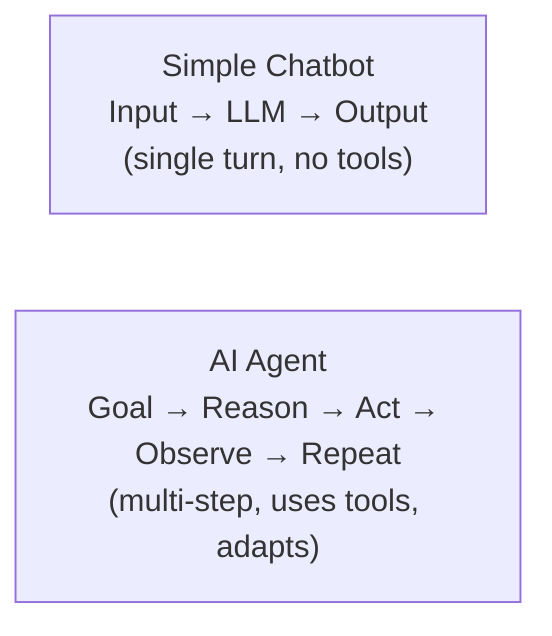
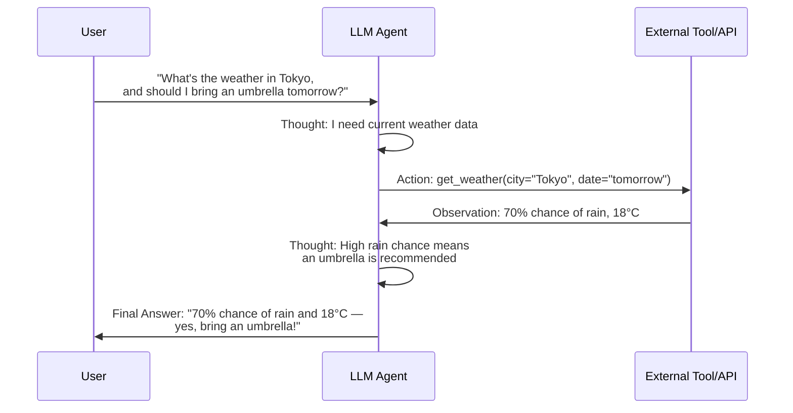
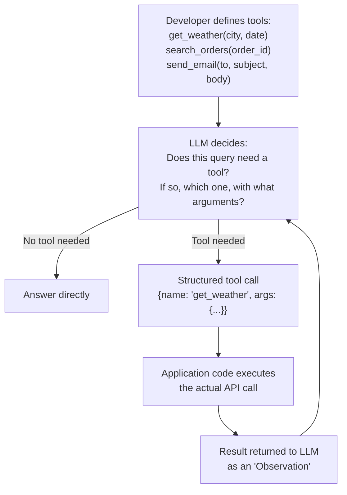
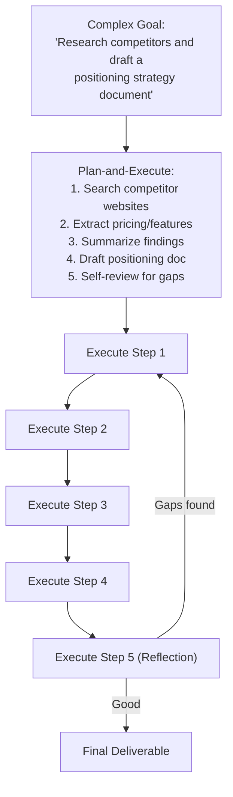
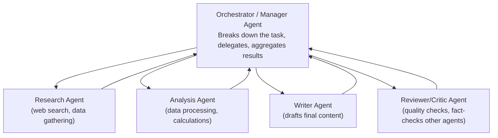
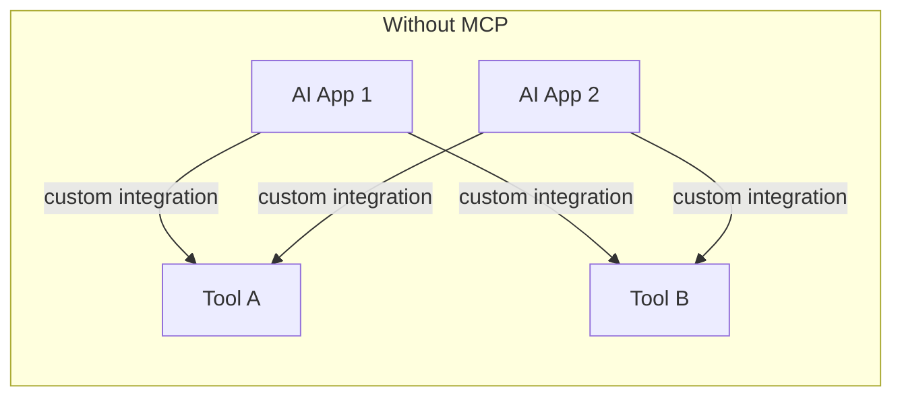
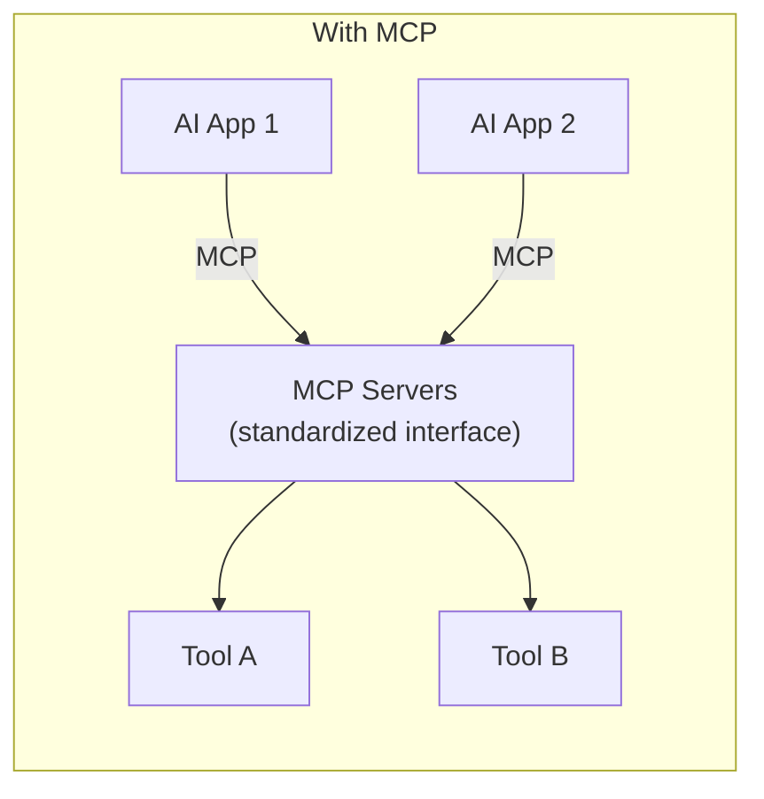

# 11. AI Agents & Orchestration

## Learning Objectives
- Define what makes a system an "agent" vs. a simple chatbot
- Understand the ReAct loop, tool/function calling, memory, and planning
- Know the major orchestration frameworks and multi-agent patterns
- Understand the Model Context Protocol (MCP) at a conceptual level

---

## 1. What Makes Something an "Agent"?

A simple LLM call takes an input and produces an output — it can't take actions in the world or make multi-step decisions. An **AI agent** is an LLM-powered system that can:

1. **Reason** about a goal
2. **Plan** a sequence of steps
3. **Act** — call tools/APIs/functions to interact with the real world
4. **Observe** the results of those actions
5. **Iterate** — repeat until the goal is achieved

> **Interview Angle:** *"What's the difference between a chatbot and an agent?"* → A chatbot responds to input using only its own knowledge/context in a single pass. An agent can take actions in the world (call APIs, query databases, browse the web, run code), observe the results, and adjust its plan — turning it from a passive responder into an active problem-solver.

---

## 2. The ReAct Loop (Reason + Act)

This is the foundational pattern behind most modern agents (introduced in Doc 07, expanded here).

The agent loops through **Thought → Action → Observation** until it has enough information to produce a **Final Answer**, potentially calling multiple tools across multiple iterations.

---

## 3. Tool / Function Calling

Modern LLM APIs support **structured function calling** — you describe available tools (name, description, parameters as a schema) to the model, and the model outputs a structured request to call one when appropriate, rather than trying to guess an answer or hallucinate data.

**Key point for interviews:** The LLM itself **never directly executes code or calls APIs** — it only outputs a structured *request* to do so. The surrounding application is responsible for actually executing the tool call safely and returning the result. This is an important security/architecture distinction.

---

## 4. Agent Memory

| Memory Type | Purpose | Example |
|---|---|---|
| **Short-term / working memory** | The current conversation/task context (within the context window) | The last few turns of a chat |
| **Long-term memory** | Persisted across sessions, typically stored externally | A vector DB storing summaries of past interactions, user preferences |
| **Episodic memory** | Records of specific past events/tasks the agent completed | "Last time, this workflow failed at step 3 due to X" |
| **Tool/procedural memory** | Knowledge of how to use available tools effectively | Learned patterns for which tool sequences solve which problem types |

Long-term memory is often implemented using the same RAG techniques from Doc 09 — storing summarized memories as embeddings and retrieving relevant ones as needed.

---

## 5. Planning Strategies

| Strategy | Description |
|---|---|
| **ReAct** | Interleaved reasoning and acting, one step at a time — simple, reactive, good for moderately complex tasks |
| **Plan-and-Execute** | The agent first generates a full multi-step plan upfront, then executes each step (possibly re-planning if a step fails) — better for complex, long-horizon tasks since it avoids "losing the thread" |
| **Tree of Thoughts** | Explores multiple reasoning branches in parallel (like a search tree), evaluating and pruning less-promising paths — used for complex problem-solving where the first idea isn't always best |
| **Reflection / Self-Critique** | The agent reviews its own output/plan, identifies flaws, and revises before finalizing — improves reliability at the cost of extra LLM calls |

---

## 6. Multi-Agent Systems

For complex workflows, a single agent juggling everything can become unreliable ("jack of all trades" problem). **Multi-agent architectures** assign specialized roles to different agents that collaborate.

**Why multi-agent instead of one large agent?**
- Specialization improves reliability (each agent has a focused, well-scoped prompt/role instead of one overloaded prompt trying to do everything)
- Easier to debug/monitor which "stage" failed
- Can run some sub-agents in parallel for speed

**Trade-off to always mention in interviews:** Multi-agent systems add complexity, coordination overhead, higher latency (more LLM calls), and higher cost — they're justified for genuinely complex, multi-faceted workflows, not for tasks a single well-prompted agent (or even a simple LLM call) could handle.

---

## 7. Orchestration Frameworks

| Framework | Notable For |
|---|---|
| **LangChain** | The most widely adopted general-purpose framework for building LLM apps — chains, tools, memory, retrieval integrations |
| **LangGraph** | Built by the LangChain team specifically for building stateful, graph-based agent workflows with explicit control flow (loops, conditionals) — popular for production agents needing reliability |
| **CrewAI** | Focused specifically on multi-agent "crews" with defined roles and collaborative workflows |
| **AutoGen** (Microsoft) | Multi-agent conversation framework, strong for agent-to-agent dialogue patterns |
| **LlamaIndex** | Strong focus on data ingestion/indexing for RAG, also supports agent workflows |

> **Note:** This space evolves extremely quickly — new frameworks and major version changes happen often. In an interview, it's fine to discuss frameworks conceptually, but always mention that you'd verify current best practices/tooling before committing to one in a real project.

---

## 8. Model Context Protocol (MCP)

**MCP** is an open protocol (introduced by Anthropic) that standardizes how AI applications connect to external tools, data sources, and systems — think of it as a common "plug" so any MCP-compatible AI application can connect to any MCP-compatible tool/data server without custom integration code for each pairing.

**Why it matters for interviews:** It signals awareness of how the industry is standardizing agent-to-tool connectivity (analogous to how USB standardized device connectivity) — reducing the "N apps × M tools = N×M custom integrations" problem down to "N + M" standardized connections.

---

## 9. Agent Risks & Guardrails (ties into Doc 12)

| Risk | Mitigation |
|---|---|
| **Excessive/unintended actions** | Least-privilege tool access; require human confirmation for high-stakes/irreversible actions (payments, deletions, sending external communications) |
| **Infinite loops / runaway costs** | Max iteration limits, timeouts, cost budgets per task |
| **Prompt injection via tool outputs** | Treat all tool/retrieval outputs as untrusted data, not instructions (see Doc 07) |
| **Cascading errors in multi-agent systems** | Validation/review steps between agents; a "critic" agent to catch errors before they propagate |

---

## 10. Scenario-Based Example

**Scenario:** Design an AI agent for an internal IT helpdesk that can check a user's account status, reset passwords, and escalate to a human for anything involving financial systems access.

**Design walkthrough:**
1. **Tools exposed to the agent:** `check_account_status(user_id)`, `reset_password(user_id)` (with mandatory identity verification step first), `create_escalation_ticket(details)`. Notably, **no direct tool for granting financial system access** — that's explicitly excluded and always routed to `create_escalation_ticket` for human review.
2. **Planning pattern:** ReAct is sufficient here — tasks are short (1-3 tool calls), don't need complex upfront planning.
3. **Guardrails:** Password reset requires a verification tool call (e.g., confirming a security question or OTP) before execution — never allow the agent to reset a password purely based on a chat claim of identity. Any query mentioning financial systems is automatically routed to `create_escalation_ticket`, never handled directly by the agent, regardless of what the agent "thinks" it could do.
4. **Human-in-the-loop:** All account modification actions logged; password resets could optionally require a confirmation step shown to the user before execution.
5. **Memory:** Short-term only needed within a session; no long-term memory required for this narrow use case, keeping the system simpler and reducing risk surface.

---

## 11. Interview Quick-Fire Q&A

**Q: What's the core loop that defines most AI agents?**
A: The ReAct loop — Reason (Thought) about what's needed, Act by calling a tool, Observe the result, and repeat until enough information is gathered to produce a final answer.

**Q: Does the LLM itself execute tool calls?**
A: No — the LLM only outputs a structured request (e.g., a JSON object naming a function and arguments). The surrounding application code is responsible for actually executing that call safely and returning the result back to the model as an observation.

**Q: When would you use a multi-agent system instead of a single agent?**
A: When a task has genuinely distinct sub-tasks that benefit from specialized prompts/roles (e.g., research vs. analysis vs. writing vs. review), and when the added latency/cost/complexity of multiple coordinated LLM calls is justified by improved reliability and quality over a single, overloaded agent.

**Q: What's the biggest security risk specific to agents (vs. simple chatbots), and how do you mitigate it?**
A: Agents can take real-world actions via tools, so a successful prompt injection or reasoning error can cause real harm (unauthorized actions, data leaks) rather than just a bad text response. Mitigate with least-privilege tool scoping, human confirmation for high-stakes/irreversible actions, treating all external content as untrusted, and hard limits on iteration/cost.

**Q: What problem does the Model Context Protocol (MCP) solve?**
A: It standardizes how AI applications connect to external tools and data sources, avoiding the need for custom point-to-point integrations between every AI app and every tool — analogous to how a universal connector standard reduces an N×M integration problem to roughly N+M.

---

**Next:** [`12_LLM_Evaluation_Safety_Guardrails.md`](./12_LLM_Evaluation_Safety_Guardrails.md)
