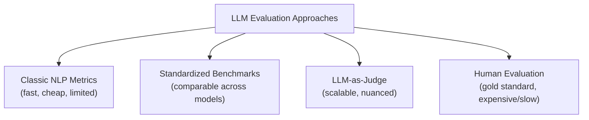
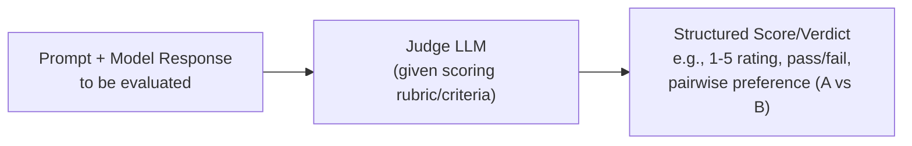
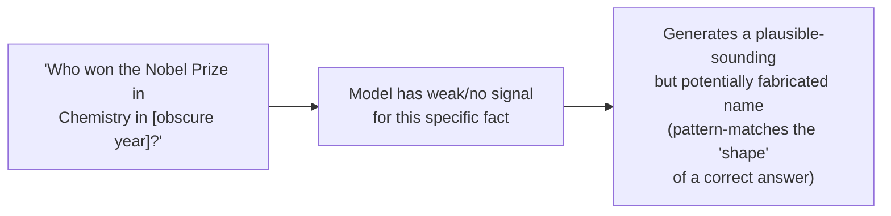
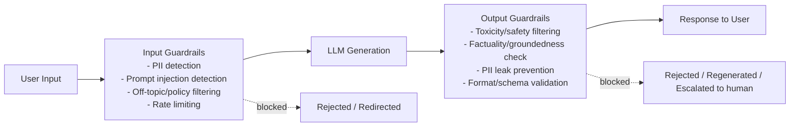
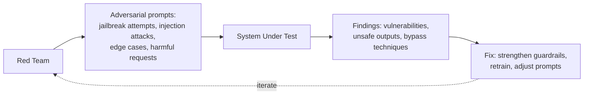

# 12. LLM Evaluation, Safety & Guardrails

## Learning Objectives
- Know classic NLP metrics vs. modern LLM-specific evaluation approaches
- Understand hallucination — why it happens and how to detect/reduce it
- Be able to describe a guardrail pipeline for a production GenAI application
- Know major benchmark suites and what they measure

---

## 1. Why Evaluating LLMs Is Hard

Unlike a classic ML classifier with a clear right/wrong answer, LLM outputs are often **open-ended text** — there can be many valid ways to answer the same question well. This means evaluation needs a mix of automated metrics, model-based judging, and human review.

---

## 2. Classic NLP Metrics (Still Used, But Limited)

| Metric | What It Measures | Limitation |
|---|---|---|
| **BLEU** | N-gram overlap between generated and reference text (originally for translation) | Penalizes valid paraphrasing; doesn't capture meaning |
| **ROUGE** | Overlap of n-grams/sequences, common for summarization | Same issue — rewards surface similarity, not semantic quality |
| **Perplexity** | How "surprised" a language model is by a sequence of text (lower = more confident/fluent) | Measures fluency, not correctness, helpfulness, or factuality |
| **F1 / Exact Match** | Standard classification metrics | Useful for tasks with clear correct answers (extraction, classification), not open-ended generation |

**Interview Angle:** *"Why can't we just use BLEU score to evaluate a chatbot?"* → BLEU measures surface-level word overlap with a reference answer — a chatbot response can be excellent, accurate, and helpful while using completely different words than a reference answer (or vice versa: high word overlap but wrong meaning). It's inadequate for open-ended, creative, or reasoning-heavy generation.

---

## 3. LLM-as-Judge

Using a strong LLM to evaluate another model's outputs against defined criteria (helpfulness, correctness, tone, safety) — has become the dominant scalable evaluation method in industry.

**Common patterns:**
- **Pointwise scoring:** Judge rates a single response against a rubric (e.g., 1-5 for helpfulness)
- **Pairwise comparison:** Judge is shown two responses (e.g., from two model versions) and picks which is better — often more reliable than absolute scoring since it's an easier judgment call
- **Reference-based grading:** Judge compares the response against a known correct/ideal answer

**Known limitations to mention in interviews:**
- Judge models can have their own biases (e.g., favoring longer or more confidently-worded responses)
- Position bias in pairwise comparison (favoring whichever answer is shown first) — mitigated by randomizing/swapping order across evaluation runs
- Still needs periodic human calibration to confirm the judge's scores actually correlate with genuine human quality judgments

---

## 4. Hallucination

**Hallucination** = the model generates content that is fluent and confident-sounding but factually incorrect or unsupported by any real source.

### Why Hallucination Happens
LLMs are fundamentally next-token predictors trained to produce *plausible* continuations of text — they have no built-in mechanism to "know that they don't know" something, or to verify facts against ground truth at generation time. When the model doesn't have strong evidence in its training data (or retrieved context) for a specific fact, it can still generate a statistically plausible-sounding but false answer.

### Reducing Hallucination
| Technique | How It Helps |
|---|---|
| **RAG** (Doc 09) | Grounds answers in retrieved, verifiable source documents rather than relying purely on parametric memory |
| **Lower temperature** | Reduces randomness, favoring higher-confidence (though not necessarily more correct) tokens |
| **Explicit "say I don't know" instructions** | Gives the model permission/instruction to abstain rather than guess |
| **Citation requirements** | Forces traceability — makes it easier to verify (and for the model to "notice" when it lacks support) |
| **Fact-checking / self-consistency passes** | Generate multiple answers and check agreement, or have a separate verification step cross-check claims |
| **Fine-tuning for calibration** | Training the model to better express uncertainty when appropriate |

**Important nuance for interviews:** Hallucination can never be fully eliminated with current LLM architectures — it can only be *reduced and managed*. Any claim that a system "never hallucinates" is a red flag; strong answers frame this as risk *mitigation*, not elimination.

---

## 5. Guardrails — The Production Safety Layer

A **guardrail pipeline** wraps the raw LLM with checks before and after generation.

| Guardrail Type | Examples |
|---|---|
| **Input guardrails** | Detecting PII before it's sent to a third-party API, blocking known jailbreak patterns, topic restriction (e.g., a cooking bot refusing medical questions) |
| **Output guardrails** | Scanning for toxic/unsafe content, checking generated code for obvious security issues, validating that structured output matches the expected schema, verifying claims against retrieved sources |
| **Behavioral guardrails** | System-prompt-level rules, tool permission scoping (Doc 11), rate limits on sensitive actions |

**Tooling mentioned in industry:** NeMo Guardrails, Guardrails AI, Llama Guard, and various commercial content-moderation APIs — good to know these exist conceptually; specific tool choice depends on the stack.

---

## 6. Bias & Fairness Evaluation

LLMs can reflect and amplify biases present in their training data. Evaluation should check for:
- **Representation bias:** Does the model perform worse or stereotype based on demographic attributes (gender, ethnicity, etc.)?
- **Allocation bias:** In decision-support use cases (loan approval assistance, resume screening), does the model's output correlate inappropriately with protected characteristics?
- **Tooling:** Bias benchmark datasets (e.g., BBQ, StereoSet) and fairness-focused red-teaming are standard practice for high-stakes deployments.

---

## 7. Red-Teaming

**Red-teaming** = deliberately trying to break the system — probing for jailbreaks, harmful outputs, prompt injection vulnerabilities, and edge cases — *before* real users or bad actors find them.

Can be done manually (security/safety specialists), via automated adversarial prompt generation, or through structured bug-bounty-style programs.

---

## 8. Standard Benchmark Suites (Know These by Name)

| Benchmark | What It Tests |
|---|---|
| **MMLU** (Massive Multitask Language Understanding) | Broad knowledge across 57 subjects (math, law, medicine, history...) |
| **HellaSwag** | Commonsense reasoning / plausible sentence completion |
| **HumanEval** | Code generation correctness (functional test-based) |
| **TruthfulQA** | Whether models avoid generating popular misconceptions/falsehoods |
| **GSM8K** | Grade-school math word problems (multi-step reasoning) |
| **MT-Bench / Chatbot Arena** | Multi-turn conversational quality, often using LLM-as-judge or human preference voting |

> **Note:** New benchmarks appear constantly, and top models' scores shift with nearly every release — treat specific numbers/rankings as perishable information to verify at time of need, not something to memorize long-term.

---

## 9. Scenario-Based Example

**Scenario:** A healthcare company's GenAI-powered symptom-checker chatbot is about to launch. Design its evaluation and safety plan.

**Strong answer:**
1. **Groundedness/factuality evaluation:** Since medical accuracy is critical, use RAG grounded in vetted medical sources, and score faithfulness (does every claim trace back to source material?) using an LLM-as-judge pipeline plus periodic clinician review.
2. **Guardrails:** Input guardrail to detect emergency-symptom language (e.g., "chest pain," "can't breathe") and immediately route to an emergency-care message/human escalation rather than generating a conversational response. Output guardrail to block any response resembling a definitive diagnosis, ensuring language stays within "informational, not diagnostic" bounds per policy/regulatory requirements.
3. **Bias evaluation:** Test whether symptom assessments differ inappropriately across demographic groups described in test prompts.
4. **Red-teaming:** Specifically probe for jailbreaks that could extract harmful medical misinformation or bypass the emergency-escalation guardrail.
5. **Human-in-the-loop:** Flag low-confidence or high-risk conversations for human clinician review; log everything for audit given regulatory requirements (see Doc 15).
6. **Ongoing monitoring:** Track hallucination/escalation rates in production, not just at launch — safety evaluation is continuous, not a one-time gate.

---

## 10. Interview Quick-Fire Q&A

**Q: Why is BLEU/ROUGE insufficient for evaluating a modern chatbot?**
A: These metrics measure surface-level n-gram overlap with a reference text, but open-ended generation can be correct and high-quality while using entirely different wording than any single reference — they don't capture semantic correctness, helpfulness, or reasoning quality.

**Q: What is LLM-as-judge and what's a key risk with it?**
A: Using a capable LLM to score or compare another model's outputs against a rubric, at scale, instead of relying purely on slow/expensive human evaluation. A key risk is judge bias — e.g., favoring longer or more confidently-worded responses, or position bias in pairwise comparisons — so judge outputs should be periodically calibrated against genuine human judgment.

**Q: Can hallucination be completely eliminated?**
A: No — it's an inherent property of how autoregressive language models generate text (predicting plausible continuations rather than verifying facts). It can be significantly reduced through techniques like RAG, lower temperature, explicit abstention instructions, and citation requirements, but not fully eliminated with current architectures.

**Q: What's the difference between input and output guardrails?**
A: Input guardrails screen and filter what goes INTO the model (PII, injection attempts, off-topic/policy-violating requests) before generation happens. Output guardrails screen what comes OUT of the model (toxicity, factual claims, schema validity, PII leaks) before it's returned to the user or used to trigger an action.

**Q: What is red-teaming in the context of LLMs?**
A: The practice of deliberately and systematically attempting to break a system — via jailbreaks, prompt injection, edge cases, or harmful requests — before deployment or attackers find these vulnerabilities, so weaknesses can be fixed proactively.

---

**Next:** [`13_LLMOps_Deployment_and_Monitoring.md`](./13_LLMOps_Deployment_and_Monitoring.md)
