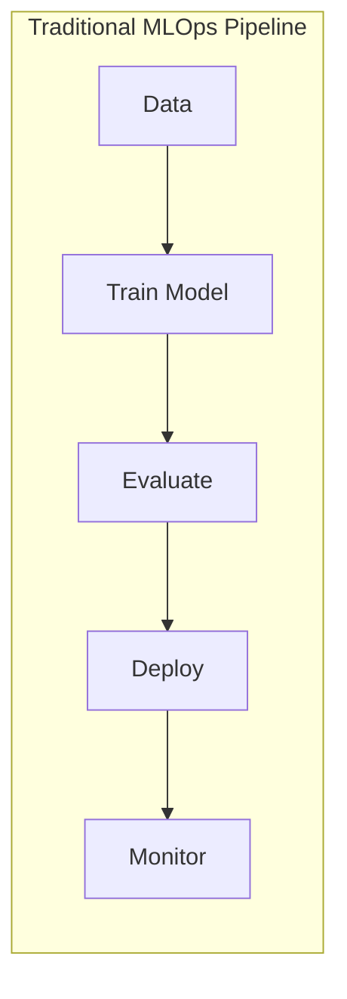
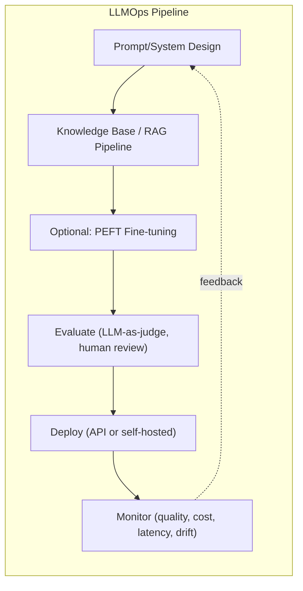
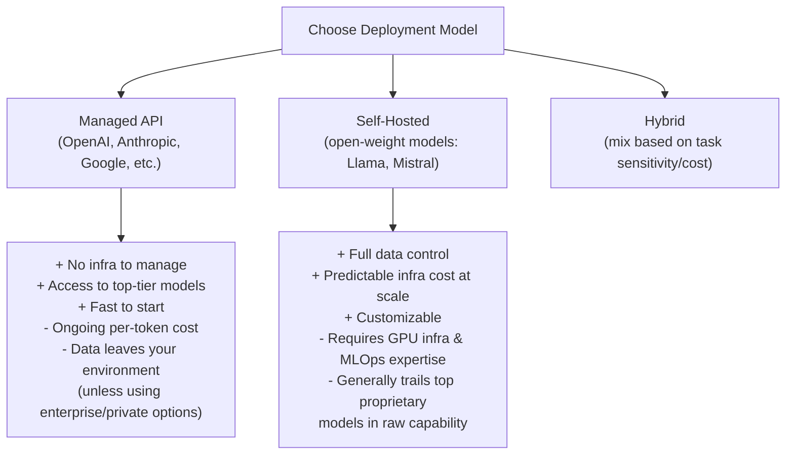
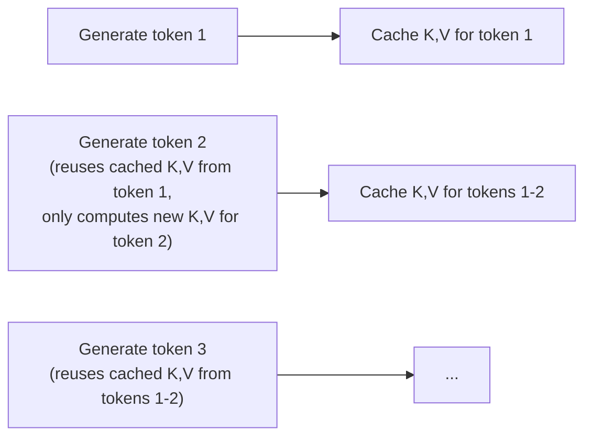
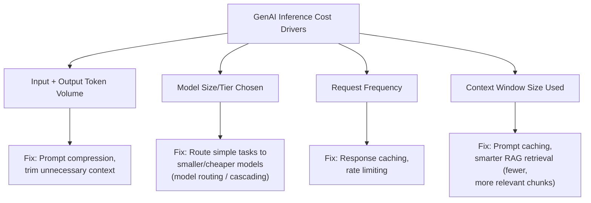
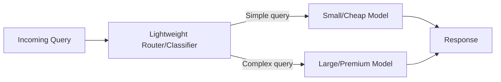
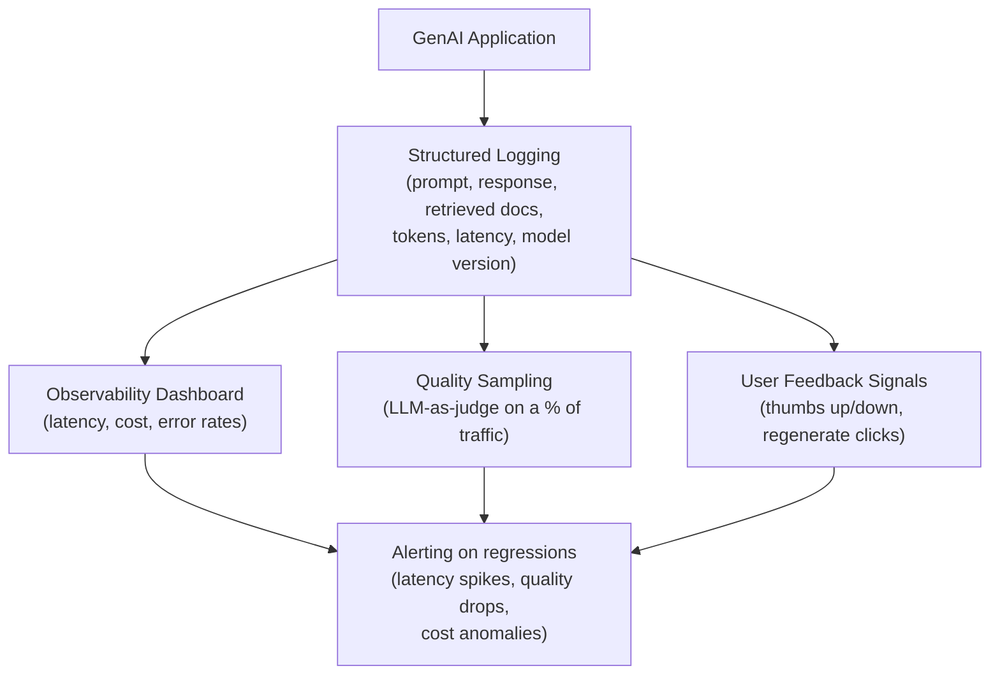
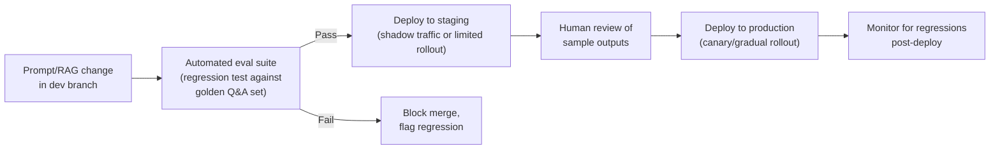

# 13. LLMOps: Deployment, Optimization & Monitoring

## Learning Objectives
- Understand how LLMOps differs from traditional MLOps
- Know the major inference optimization techniques (quantization, batching, caching)
- Be able to design a monitoring/observability strategy for a production GenAI system
- Understand cost drivers and how to manage them

---

## 1. MLOps vs. LLMOps

| Aspect | Traditional MLOps | LLMOps |
|---|---|---|
| **Model training** | Often trained in-house on your own data | Usually consuming a pretrained/foundation model (via API or self-hosted), rarely training from scratch |
| **Customization** | Full retraining common | Prompt engineering, RAG, and PEFT fine-tuning (Doc 10) more common than full retraining |
| **Versioning** | Model version + dataset version | Model version + **prompt version** + retrieval/knowledge base version — prompts are now a first-class artifact to version control |
| **Evaluation** | Accuracy, F1, RMSE — usually clear ground truth | Open-ended generation quality, hallucination rate, LLM-as-judge scores — much harder to define "correct" |
| **Cost model** | Mostly training-time compute | Mostly ongoing **inference-time** compute, billed per token in API-based setups |
| **Latency sensitivity** | Often batch/offline | Frequently real-time, user-facing (chat), where every second matters |

---

## 2. Deployment Options

| Consideration | Favors Managed API | Favors Self-Hosting |
|---|---|---|
| Data sensitivity / compliance | Enterprise/private cloud offerings can address this | Full control, data never leaves your infrastructure |
| Predictable high-volume usage | Cost can grow linearly and become expensive at massive scale | Fixed infra cost can become cheaper at very high, steady volume |
| Need for cutting-edge capability | Usually best-in-class models available fastest | Open-weight models typically lag frontier capability somewhat |
| Team's infra/MLOps maturity | Low barrier to entry | Requires GPU provisioning, serving infra (e.g., vLLM), ongoing maintenance |

---

## 3. Inference Optimization Techniques

### Quantization
Reduces the numerical precision of model weights (e.g., from 16-bit floating point down to 8-bit or 4-bit integers), shrinking memory footprint and often speeding up inference, at a small cost to accuracy.

| Precision | Relative Memory | Typical Use |
|---|---|---|
| FP32/FP16 (full/half precision) | Baseline | Training, highest accuracy |
| INT8 | ~2-4x smaller | Common production inference trade-off |
| INT4 | ~4-8x smaller | Aggressive compression (e.g., QLoRA, edge deployment) — larger accuracy trade-off |

### KV Caching
During autoregressive generation, the attention mechanism (Doc 05) recomputes Key/Value vectors for all previous tokens at every new step unless cached. **KV caching** stores these once they're computed and reuses them, avoiding redundant computation — a standard, essentially mandatory optimization in all production LLM serving.

### Batching
Grouping multiple incoming requests together to process on the GPU simultaneously, dramatically improving throughput (GPUs are optimized for parallel work).
- **Static batching:** Wait for a fixed batch size or timeout — simple but can add latency waiting to fill a batch.
- **Continuous/dynamic batching:** New requests join an in-progress batch as soon as capacity frees up (as other requests finish generating) — used by modern serving engines like vLLM, significantly improving GPU utilization and throughput without the latency penalty of static batching.

### Speculative Decoding
A small, fast "draft" model quickly proposes several candidate next tokens, and the large target model verifies them in a single parallel pass instead of generating token-by-token — can meaningfully speed up generation when the draft model's guesses are often correct.

### Caching (Application-Level)
Beyond KV caching, applications commonly cache:
- **Exact-match response caching:** Identical repeated queries return a cached answer instantly, skipping the LLM call entirely
- **Semantic caching:** Cache lookups based on embedding similarity, so near-duplicate queries (not just exact matches) can hit the cache
- **Prompt caching:** Some providers support caching large, repeated portions of a prompt (e.g., a long system prompt or document context) so it isn't reprocessed on every request — a major cost/latency saver for RAG systems with large static context

---

## 4. Cost Management

### Model Routing / Cascading
Not every query needs the most expensive, largest model. A common cost-optimization pattern: use a smaller/cheaper model (or a classifier) to first assess query complexity, routing simple queries to a fast/cheap model and only escalating genuinely complex queries to the largest, most expensive model.

---

## 5. Monitoring & Observability

Production GenAI systems need monitoring across several distinct dimensions:

| Dimension | What to Track | Why |
|---|---|---|
| **Latency** | Time-to-first-token, total response time | User experience, especially for chat |
| **Cost** | Tokens consumed per request, per user, per feature | Budget control, identifying expensive query patterns |
| **Quality** | Sampled LLM-as-judge scores, user thumbs up/down, hallucination flags | Catching quality regressions early (a new prompt version or model update can silently degrade quality) |
| **Usage patterns** | Query volume, popular query types, failure/error rates | Capacity planning, identifying common failure modes |
| **Drift** | Are retrieved documents/answers becoming stale? Are user query patterns shifting? | RAG knowledge bases go stale; user behavior evolves |
| **Safety incidents** | Guardrail trigger rate, blocked requests, escalations | Security/compliance visibility |

**Common tooling mentioned in industry:** LangSmith, Weights & Biases (W&B Weave), Arize, Langfuse, Helicone — good to know this category of tool exists; specific choice depends on stack and requirements.

---

## 6. CI/CD for Prompts and RAG Pipelines

Prompts, retrieval configurations, and fine-tuned adapters should be treated like code — version-controlled, tested, and deployed through a pipeline, not edited ad-hoc in production.

A **golden evaluation dataset** (a curated, versioned set of representative queries with known-good expected answer characteristics) is the single most valuable asset for catching regressions before they reach users — treat it as seriously as a unit test suite.

---

## 7. Scenario-Based Example

**Scenario:** A company's RAG-based customer support assistant is getting slower and more expensive as usage has scaled from 100 to 100,000 daily queries. Diagnose and propose fixes.

**Strong answer:**
1. **Diagnose cost drivers first:** Pull metrics on token volume per request, model tier used, and cache hit rate. Common culprits at this scale: no response caching, oversized retrieved context per query, and using the most expensive model for every query regardless of complexity.
2. **Latency fixes:** Ensure continuous batching is enabled on the serving layer; check if KV caching and prompt caching (for the large, mostly-static system prompt/instructions) are being used; verify retrieval/re-ranking steps aren't adding unnecessary latency (e.g., re-ranking too many candidates).
3. **Cost fixes:** Introduce model routing — simple FAQ-style queries go to a smaller/cheaper model, complex multi-part queries escalate to the premium model; add semantic caching for frequently repeated question patterns; tighten retrieval to fewer, higher-precision chunks (paired with better chunking/re-ranking from Doc 09) to reduce token usage per request.
4. **Ongoing monitoring:** Set up dashboards and alerting for cost-per-query and latency percentiles (not just averages — p95/p99 matter for user experience), so regressions are caught immediately rather than discovered via a surprise bill.

---

## 8. Interview Quick-Fire Q&A

**Q: What's the biggest structural difference between MLOps and LLMOps?**
A: Traditional MLOps centers on training and versioning your own models on your own data. LLMOps typically centers on consuming pretrained foundation models and managing prompts, retrieval pipelines, and inference-time behavior/cost as the primary artifacts — training from scratch is rare; prompt/RAG versioning and inference optimization dominate instead.

**Q: What is KV caching and why is it essentially mandatory in production?**
A: It stores the Key and Value vectors computed for previous tokens during autoregressive generation so they don't need to be recomputed at every new generation step — without it, generating each new token would redundantly reprocess the entire preceding sequence, making inference far slower and more expensive.

**Q: What's the difference between quantization and distillation as cost-reduction techniques?**
A: Quantization reduces the numerical precision of an existing model's weights (e.g., 16-bit to 4-bit) to shrink memory/compute needs with a small accuracy trade-off. Distillation trains a separate, smaller model to mimic a larger "teacher" model's outputs — producing a genuinely smaller architecture, not just a compressed version of the same one.

**Q: How would you reduce cost in a high-volume GenAI application without hurting quality?**
A: A combination of model routing (send simple queries to cheaper models), response/semantic caching for repeated queries, prompt caching for large static context, and tightening retrieval to fewer, more relevant chunks — all before resorting to a blanket downgrade to a weaker model, which risks hurting quality broadly.

**Q: Why is a "golden evaluation dataset" important in LLMOps?**
A: It provides a consistent, versioned benchmark of representative queries to automatically test every prompt, model, or RAG pipeline change against — catching quality regressions before they reach production, similar to how a unit test suite catches code regressions.

---

**Next:** [`14_GenAI_System_Design_Case_Studies.md`](./14_GenAI_System_Design_Case_Studies.md)
