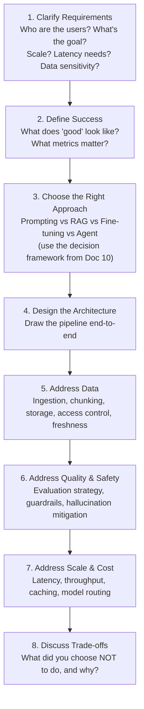
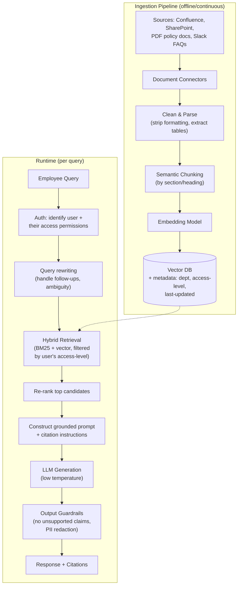
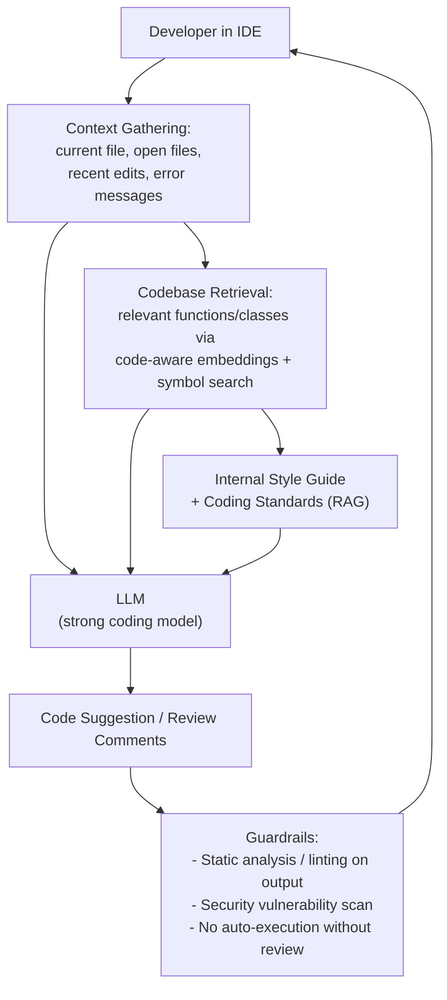
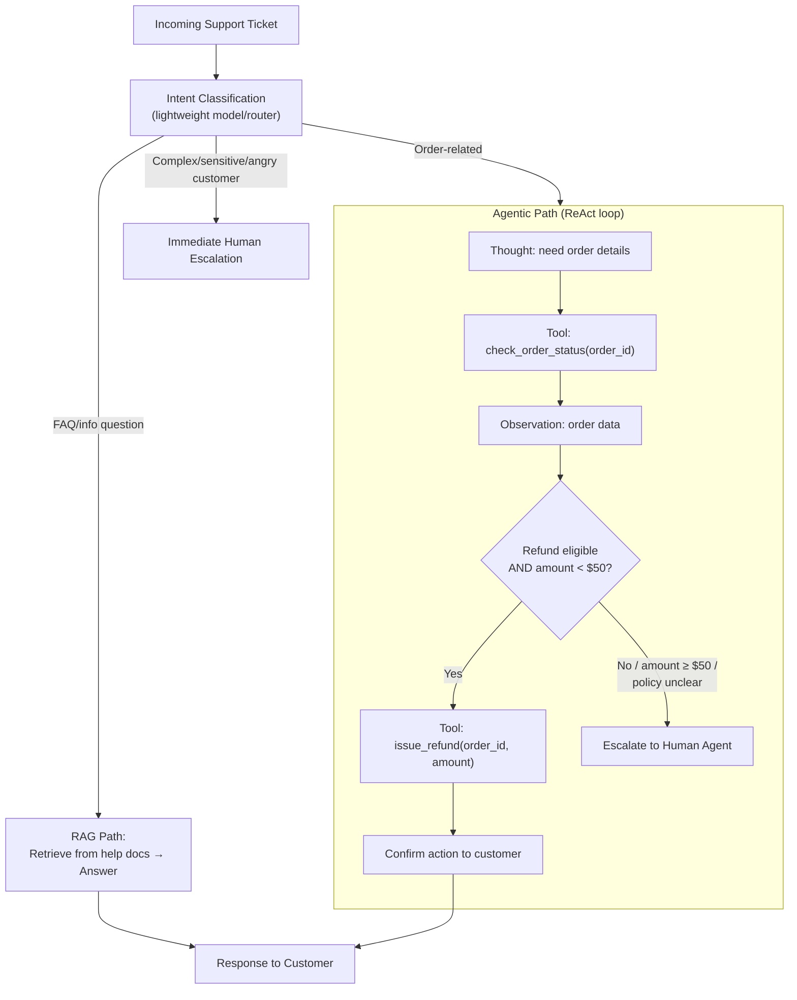

# 14. GenAI System Design & Case Studies

## Learning Objectives
- Have a repeatable framework for answering any GenAI system design question
- Walk through three fully worked case studies with architecture diagrams
- Know the trade-off discussions senior/lead interviewers specifically probe for

> This is where senior and lead-level GenAI interviews are actually won or lost. Facts and definitions get you in the door — structured design thinking and trade-off reasoning get you the offer.

---

## 1. A Repeatable Framework

**Golden rule:** Always start by asking clarifying questions before designing. Interviewers deliberately give underspecified prompts ("design a chatbot for our company") to see if you gather requirements first or jump straight to a solution.

**Questions worth asking almost every time:**
- How many users / what query volume?
- What's the acceptable latency (real-time chat vs. background batch job)?
- How sensitive is the data (public, internal, regulated/PII)?
- Does this need to integrate with existing systems (SSO, existing data stores)?
- What's the tolerance for occasional errors — is this advisory (human reviews everything) or autonomous (system acts directly)?

---

## 2. Case Study 1: Enterprise Knowledge Assistant (RAG-based)

**Prompt:** *"Design an internal chatbot so employees can ask questions about company policies, benefits, and IT procedures, sourced from thousands of internal documents."*

### Architecture

### Key Design Decisions & Trade-offs
| Decision | Reasoning |
|---|---|
| Hybrid retrieval, not pure vector | Employees will search by exact policy codes AND natural language — pure semantic search misses exact-match queries |
| Access-level filtering at retrieval time, not just prompt instructions | Never rely on the LLM to "choose" not to reveal restricted info — enforce access control structurally, before content ever reaches the prompt |
| Mandatory citations | Builds trust, enables verification, critical for policy/compliance questions where "trust me" isn't acceptable |
| Low temperature | Consistency matters for policy answers — the same question asked twice should get consistent guidance |
| "I don't know" fallback with human escalation path | Prevents hallucinated policy answers; routes genuinely unclear cases to HR/IT rather than guessing |

**Follow-up the interviewer will likely ask:** *"How do you handle a policy document that gets updated?"* → Track document versions via checksums/webhooks from the source system; re-chunk and re-embed only changed documents (not the whole corpus); consider a short TTL or "last verified" metadata flag surfaced to the user for time-sensitive policies.

---

## 3. Case Study 2: AI Coding Assistant

**Prompt:** *"Design an AI assistant that helps engineers at our company write and review code, aware of our internal codebase and coding standards."*

### Architecture

### Key Design Decisions & Trade-offs
| Decision | Reasoning |
|---|---|
| Code-aware retrieval (not generic text chunking) | Code has structure (functions, classes, imports) — retrieval should respect syntactic boundaries, and often benefits from combining semantic search with symbol/dependency-graph lookups |
| Never auto-execute or auto-commit generated code | High-stakes action (production code) always needs human review — agent has suggestion power, not execution power, by design |
| Run static analysis/security scan on generated output | LLMs can generate code with subtle bugs or vulnerabilities; automated checks catch common classes of issues before a human even reviews |
| Fine-tuning vs. RAG for "knowing our codebase" | RAG is generally preferred (codebase changes constantly; fine-tuning would need continuous retraining) — fine-tuning might still be layered in for consistently applying company-specific style/patterns, per Doc 10's "combine both" principle |

**Follow-up the interviewer will likely ask:** *"How do you evaluate whether the assistant is actually helping, not just generating plausible-looking code?"* → Track acceptance rate of suggestions, downstream bug rates in AI-assisted vs. non-assisted code (if measurable), and run generated code against actual test suites where applicable — plausible-looking isn't the same as correct, so evaluation must go beyond "does it compile."

---

## 4. Case Study 3: Automated Customer Support Agent (Agentic)

**Prompt:** *"Design an AI agent that can handle customer support tickets end-to-end — answering questions, checking order status, and issuing refunds up to a limit — escalating to a human for anything else."*

### Architecture

### Key Design Decisions & Trade-offs
| Decision | Reasoning |
|---|---|
| Hard dollar-limit on autonomous refunds | Bounding the "blast radius" of agent errors — a $50 cap limits financial risk from a reasoning mistake or edge-case bug; higher-value refunds always get human review |
| Intent classification/routing before the agent | Cheaper and more reliable than letting the agent "decide" whether it should be handling a request at all; also lets simple FAQ questions skip the more expensive agentic loop entirely |
| Immediate escalation on detected frustration/anger | Business + UX judgment call: an upset customer often needs empathetic human handling, not an efficient bot — this is a product decision as much as a technical one, worth explicitly calling out in an interview |
| Every agent action logged with full reasoning trace | Essential for auditing refund decisions, debugging failures, and demonstrating compliance if questioned later |
| No tool for actions beyond defined scope (e.g., no `change_account_email` tool) | Least-privilege principle (Doc 11) — the agent literally cannot take actions outside its intended scope, because those tools don't exist for it to call |

**Follow-up the interviewer will likely ask:** *"What happens if the agent gets stuck in a loop or the order-status tool is down?"* → Hard iteration/timeout limits on the ReAct loop; graceful fallback to human escalation on tool failures rather than retrying indefinitely or guessing; circuit-breaker pattern if a downstream tool's failure rate spikes.

---

## 5. Cross-Cutting Trade-off Themes (Interviewers Love These)

| Trade-off Axis | Discussion Point |
|---|---|
| **Latency vs. Quality** | More retrieval/re-ranking/reflection steps improve quality but add latency — where's the line for this use case? |
| **Autonomy vs. Control** | How much can the agent do without human confirmation? Tie this directly to the cost of a mistake in that domain. |
| **Cost vs. Capability** | Do you need the largest/most expensive model for every request, or can routing/caching handle most traffic cheaply? |
| **Freshness vs. Stability** | How often does the knowledge base need updating, and what's the risk of serving stale information vs. the cost of constant re-indexing? |
| **Build vs. Buy** | Managed API vs. self-hosted (Doc 13); off-the-shelf orchestration framework vs. custom-built agent loop |
| **Generality vs. Specialization** | One flexible agent handling everything vs. multiple specialized agents/pipelines (Doc 11) |

> **Trainer's tip:** When you're not sure what to say next in a system design interview, pick one of these axes and say: *"There's a trade-off here between X and Y — given [stated requirement], I'd lean toward X because..."* This single habit signals senior-level thinking more than any specific tool name-drop.

---

## 6. A Simple Mental Checklist Before You Finish Any System Design Answer

- [ ] Did I clarify requirements before designing?
- [ ] Did I draw/describe the end-to-end pipeline (ingestion + runtime)?
- [ ] Did I address data freshness and access control?
- [ ] Did I address hallucination/quality risk specifically for this use case?
- [ ] Did I address cost and latency at the stated scale?
- [ ] Did I name at least one explicit trade-off and justify my choice?
- [ ] Did I mention monitoring/evaluation — how would we know if this breaks in production?

---

**Next:** [`15_Responsible_AI_Ethics_Governance.md`](./15_Responsible_AI_Ethics_Governance.md)
