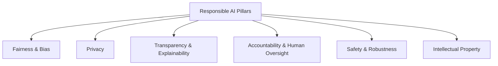
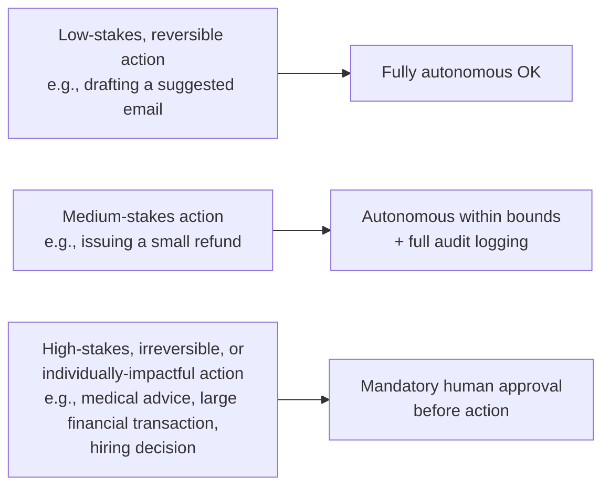
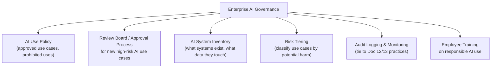

# 15. Responsible AI, Ethics & Governance

## Learning Objectives
- Understand core responsible AI principles employers expect you to reason about
- Know the major categories of AI risk: bias, privacy, IP/copyright, transparency
- Be able to discuss AI governance frameworks at a conceptual level
- Understand this is a fast-evolving regulatory area — know the shape, verify specifics

> Regulations, named frameworks, and specific compliance requirements change frequently and vary by jurisdiction. Treat the *concepts* in this document as durable, and verify current specifics (e.g., latest regulatory status) before relying on them in a real project.

---

## 1. Why This Matters for a Technical Role (Not Just Legal/Policy)

Engineers building GenAI systems make dozens of small technical decisions that have ethical/governance consequences: what data to train or fine-tune on, what guardrails to build, how much autonomy to give an agent, what to log and retain. Interviewers — especially for senior roles — test whether you factor this in *by default*, not as an afterthought.

---

## 2. Fairness & Bias

**Where bias enters a GenAI system:**
- **Training data bias:** If historical data reflects societal biases (e.g., past hiring decisions), a model trained/fine-tuned on it can learn and perpetuate those patterns.
- **Representation gaps:** Underrepresented groups/topics in training data lead to worse performance for those groups/topics.
- **Evaluation blind spots:** If a team only tests on "typical" cases, bias against edge-case or minority populations can go undetected until production.

**Mitigations (practical, not just theoretical):**
- Bias-focused evaluation benchmarks and red-teaming (Doc 12) covering demographic variation
- Diverse review panels when curating fine-tuning/evaluation data
- Avoiding GenAI for high-stakes, individual-impacting decisions (loan approval, hiring, medical diagnosis) without strong human oversight and audit trails
- Documented model cards / data sheets describing known limitations and intended use

> **Interview Angle:** *"Would you use an LLM to auto-approve or auto-reject job applications?"* → Strong answer pushes back: this is a high-stakes, individually-impacting decision prone to bias amplification and poor explainability — appropriate use here is *decision support* (e.g., summarizing an application, flagging missing info) with a human making the actual approve/reject call, plus audit logging of what the AI surfaced to that human.

---

## 3. Privacy

| Risk | Mitigation |
|---|---|
| **PII leakage into model training data** | Data scrubbing/anonymization pipelines before training or fine-tuning |
| **PII leakage in generated outputs** | Output guardrails (Doc 12) scanning for and redacting PII patterns |
| **Sending sensitive data to third-party APIs** | Data classification policy; use enterprise/private deployment options or self-hosting for regulated data; input guardrails blocking sensitive data from being sent externally |
| **Retention of user conversations** | Clear data retention policies; understand what your LLM provider does/doesn't retain and for how long |
| **Re-identification risk** | Even "anonymized" data can sometimes be re-identified when combined with other data sources — treat anonymization as risk-reduction, not a guarantee |

**Regulatory concepts worth knowing the shape of (verify current specifics when it matters):** GDPR (EU) established strong rights around personal data processing and consent; various regions have since developed AI-specific regulation building on top of general data protection law. The EU AI Act introduced a risk-tiered regulatory approach to AI systems specifically. In the US, regulation has been more sector-specific and state-by-state rather than one comprehensive federal AI law. **This is an actively evolving area — check current status rather than relying on memorized details.**

---

## 4. Transparency & Explainability

| Practice | Why It Matters |
|---|---|
| **Disclosing AI use to end users** | Users often have a right to know they're interacting with an AI system, especially in customer-facing or decision-impacting contexts |
| **Citations/source attribution (RAG, Doc 09)** | Lets users verify claims rather than trust the model blindly |
| **Model/system documentation** | Model cards, system cards documenting capabilities, limitations, and intended use cases |
| **Explainability limits** | Be honest that deep learning models (including LLMs) are largely "black boxes" — we can observe behavior and reasoning traces (e.g., chain-of-thought) but can't fully explain internal decision mechanisms the way a rule-based system can be explained |

> **Interview Angle:** *"How would you explain to a regulator why your model made a specific recommendation?"* → Acknowledge the limits honestly: full mechanistic explainability isn't achievable with current LLMs, but you can provide the retrieved evidence/context the answer was grounded in (RAG citations), the reasoning trace if chain-of-thought was used, logged inputs/outputs for audit, and documented evaluation results showing the system's tested behavior on relevant scenarios. This combination is the practical, honest answer — better than overclaiming full transparency.

---

## 5. Accountability & Human Oversight

**Human-in-the-loop (HITL) design** — deciding *where* humans must review or approve AI actions — is one of the most important, concrete design decisions in any GenAI system, and ties directly back to the case studies in Doc 14.

**Key principle:** The required level of human oversight should scale with the **severity and reversibility** of potential harm from an error — not with how technically confident the system seems.

---

## 6. Intellectual Property & Copyright

Relevant issues for anyone building or deploying GenAI systems:
- **Training data provenance:** Was training/fine-tuning data legally obtained and appropriately licensed for that use?
- **Output originality/infringement risk:** Generated content (text, code, images) could closely resemble copyrighted source material — a live and evolving area of law.
- **Attribution:** When RAG retrieves and uses licensed/proprietary internal content, is proper sourcing/attribution maintained?
- **Model outputs used commercially:** Understand your LLM provider's terms of service regarding ownership and permitted use of generated outputs.

> This is a genuinely unsettled and fast-moving legal area across jurisdictions — a strong interview answer acknowledges the uncertainty rather than asserting a confident legal position, and mentions involving legal/compliance stakeholders for real deployments rather than making unilateral engineering assumptions about IP risk.

---

## 7. Governance in an Enterprise Setting

A mature enterprise GenAI governance program typically includes:

**Risk tiering example (a common pattern, not a universal standard):**
| Tier | Example Use Case | Governance Requirement |
|---|---|---|
| **Low risk** | Internal meeting-notes summarizer | Standard review, self-service |
| **Medium risk** | Customer-facing support chatbot with bounded actions | Guardrails, monitoring, periodic review |
| **High risk** | Automated decisions affecting employment, credit, healthcare | Formal approval board, mandatory human oversight, ongoing bias auditing, legal/compliance sign-off |

---

## 8. Scenario-Based Example

**Scenario:** Your company wants to deploy an LLM-powered tool that helps managers write performance review summaries by analyzing an employee's work history and project data.

**Strong, governance-aware answer:**
1. **Risk tiering:** This touches employment-related evaluation — even though the AI isn't making the final decision, it's influencing a high-stakes, individually-impactful document. Classify as medium-to-high risk, not low risk, even though it "just summarizes."
2. **Bias mitigation:** Evaluate whether summaries differ in tone/emphasis/length across demographic groups given similar underlying performance data — a subtle but real risk (e.g., systematically softer language for one group).
3. **Human oversight:** The manager must review, edit, and explicitly approve any AI-drafted content before it becomes part of an official record — never auto-publish. This should be enforced by the UI/workflow, not just policy.
4. **Transparency:** Employees should be informed that AI tools assist in drafting reviews (organizational policy/disclosure question, not purely technical, but the system should support it — e.g., logging AI involvement).
5. **Data privacy:** Employee performance data is sensitive — ensure it isn't sent to external APIs without appropriate data processing agreements, or use enterprise/private deployment options.
6. **Audit trail:** Log what data the AI used and what it generated, in case a review is later contested — accountability requires a clear record.

---

## 9. Interview Quick-Fire Q&A

**Q: How does bias enter an LLM-based system, and how do you catch it?**
A: Primarily through biased or unrepresentative training/fine-tuning data, and through evaluation blind spots where testing only covers "typical" cases. It's caught through deliberate bias-focused evaluation benchmarks, red-teaming across demographic variations, and diverse review of training/eval data — not by assuming a model is neutral by default.

**Q: What determines how much human oversight an AI system needs?**
A: The severity and reversibility of potential harm from an error — low-stakes, easily-reversible actions can be more autonomous, while high-stakes, irreversible, or individually-impactful actions (financial, medical, legal, employment decisions) should require mandatory human review before acting, regardless of how confident the system appears.

**Q: Can you fully explain why an LLM produced a specific output?**
A: Not in a complete mechanistic sense — LLMs are largely black-box in terms of internal decision processes. Practical transparency instead comes from grounding answers in cited, verifiable sources (RAG), logging inputs/outputs for audit, and documenting evaluation results — being honest about this limitation is more credible than overclaiming explainability.

**Q: What's a responsible way to think about IP risk with GenAI outputs?**
A: Recognize it's a genuinely unsettled and evolving legal area across training data provenance, output similarity to copyrighted material, and provider terms of service — involve legal/compliance stakeholders for real deployments rather than making unilateral technical assumptions about what's permissible.

---

**Next:** [`16_Interview_QA_Bank.md`](./16_Interview_QA_Bank.md)
