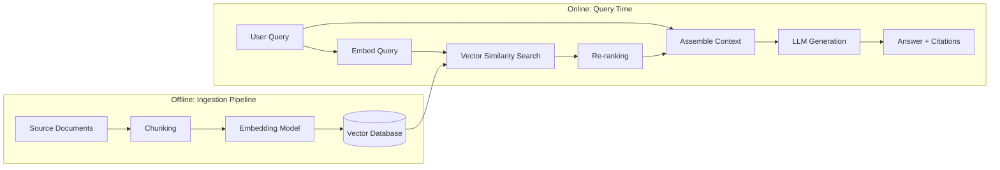
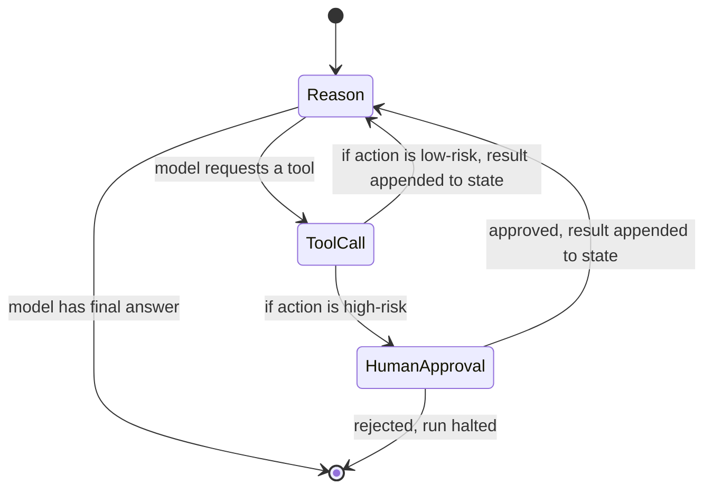
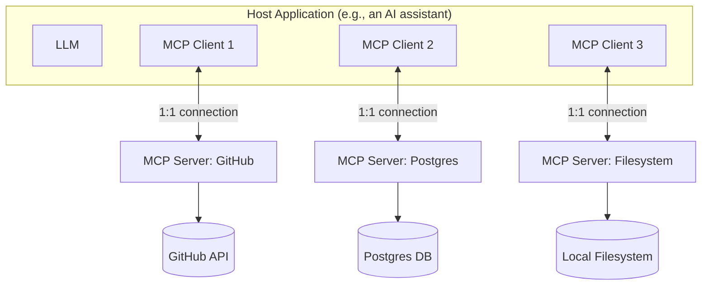
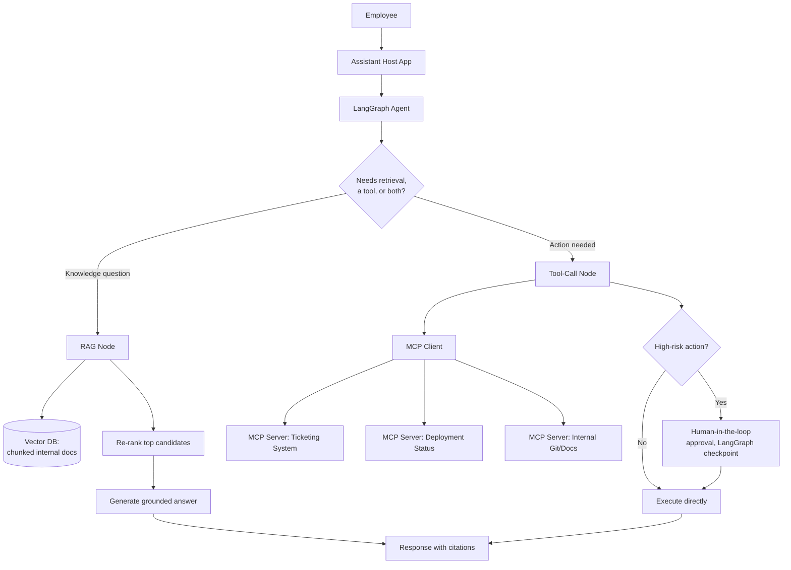

# AI Engineering — LangChain, LangGraph, RAG & MCP — Expert Interview & Study Guide

## 1. Scope and How These Interviews Are Structured

"AI Engineer" / "LLM Application Engineer" interviews test a different axis than classical ML interviews: not "can you derive backprop," but "can you build a reliable, evaluable, cost-aware product on top of a foundation model." Expect questions across four layers: (1) **LLM fundamentals** (context windows, tokens, sampling, why models hallucinate), (2) **retrieval and grounding** (RAG end to end), (3) **orchestration frameworks** (LangChain/LangGraph — what problem each abstraction solves), and (4) **the emerging interoperability layer** (MCP) plus general **agent architecture and evaluation**.

## 2. LLM Fundamentals Interviewers Assume You Know

- **Tokens, not words**: models operate on subword tokens (via BPE or similar); "context window" is a token budget covering both input and output combined for most APIs. Cost and latency scale with tokens, not characters — always reason in tokens when estimating cost/feasibility.
- **Autoregressive generation**: the model predicts one token at a time, each conditioned on everything before it — this is *why* a single bad early token can cascade into a badly derailed response, and why techniques like chain-of-thought help (they give the model "space" to reason token-by-token before committing to an answer).
- **Temperature/top-p/top-k**: control sampling randomness. Temperature 0 (or near it) for deterministic, factual, or code-generation tasks; higher temperature for creative/brainstorming tasks. Know that "temperature 0" doesn't guarantee perfect determinism across all providers/hardware, but it minimizes variance.
- **Context window is not free**: stuffing more into context doesn't just cost money — very long contexts can suffer from the "lost in the middle" effect, where information in the middle of a long context is attended to less reliably than information at the start or end. This is a direct argument *for* retrieval (fetch only what's relevant) over "just paste the whole knowledge base into context."
- **Hallucination, precisely**: a model generates fluent, confident-sounding text that's factually wrong or unsupported, because the model is fundamentally a next-token predictor optimized for plausibility, not a database with a "verify" step. Mitigations (know several, not just "use RAG"): grounding in retrieved sources with citations, lower temperature for factual tasks, explicit "say you don't know if unsure" instructions, structured output validation, and a verification/self-critique pass.
- **Why prompting matters as much as it does**: instructions, examples (few-shot), and structure in the prompt directly shape output quality and format because the model has no separate "configuration" channel — everything is conditioning on the same token stream. Key techniques: **few-shot examples** (show the desired input/output pattern), **chain-of-thought prompting** ("think step by step" — improves multi-step reasoning tasks measurably), **role/system prompts** (set persistent behavior/persona/constraints), and **structured output** (JSON schema-constrained generation, now natively supported by most major APIs — this should be the default over "please respond in JSON" prompt begging for anything programmatically consumed downstream).

## 3. Retrieval-Augmented Generation (RAG) — End to End

**The core idea**: instead of relying on a model's parametric (trained-in) knowledge, retrieve relevant, up-to-date, authoritative source content at query time and feed it into the prompt as context — the model answers *from* the provided context rather than from memory, dramatically reducing hallucination for knowledge-grounded tasks and letting the knowledge base be updated without retraining anything.



### 3.1 Chunking

Splitting documents into retrievable units is the single highest-leverage, most under-discussed decision in a RAG pipeline. Too large: retrieved chunks contain irrelevant padding that dilutes the context and can push out other relevant chunks; too small: chunks lose surrounding context needed to make sense on their own. Strategies: **fixed-size** with overlap (simplest, chunk boundaries fall arbitrarily mid-thought), **semantic/recursive chunking** (split on natural boundaries — paragraphs, sections, then fall back to smaller units only if a section is still too large), **document-structure-aware chunking** (respect markdown headers, code blocks, table boundaries — never split a table row from its header), and **sentence-window retrieval** (embed and index small units like single sentences for precise matching, but retrieve a wider window of surrounding text around each match to preserve context for generation — decoupling the unit optimized for *search precision* from the unit used for *generation context*).

### 3.2 Embeddings and Vector Search

An embedding model maps text to a dense vector such that semantically similar text lands close together in vector space (measured by cosine similarity or dot product). Retrieval finds the *k* nearest neighbor vectors to the query's embedding. At scale, exact nearest-neighbor search is too slow, so production vector databases use **Approximate Nearest Neighbor (ANN)** algorithms — most commonly **HNSW** (Hierarchical Navigable Small World graphs — a layered graph structure enabling fast approximate search with a tunable accuracy/speed tradeoff) or **IVF** (Inverted File Index — partition the vector space into clusters, search only the most relevant clusters). Know the tradeoff: ANN trades a small amount of recall for a massive speed improvement, which is the correct trade for nearly all real applications given how imprecise "relevance" itself already is.

**Vector database options** (a frequent "which one" question): purpose-built (Pinecone, Weaviate, Qdrant, Milvus — managed or self-hosted, built specifically around vector search with rich filtering), or vector-search-as-a-feature bolted onto an existing database (pgvector for Postgres, Elasticsearch/OpenSearch's vector engine, Redis, MongoDB Atlas Vector Search). Choose a bolt-on option when you already run that database and want to avoid adding a new piece of infrastructure and your scale/query-pattern needs are modest; choose a purpose-built vector DB when retrieval performance/scale is a first-class requirement or you need advanced features (hybrid search, metadata filtering at scale, multi-tenancy isolation) that bolt-ons handle less maturely.

### 3.3 Hybrid Search and Re-ranking

Pure vector (semantic) search can miss exact keyword/entity matches that a user explicitly typed (product SKUs, exact names, acronyms) because semantic similarity doesn't guarantee lexical overlap. **Hybrid search** combines vector similarity with traditional keyword search (BM25/full-text) and merges the results (commonly via **Reciprocal Rank Fusion**, which combines ranked lists from each method without needing to normalize incomparable raw scores). **Re-ranking** adds a second, more expensive but more accurate pass: retrieve a larger candidate set cheaply (e.g., top 50 via vector search), then run a specialized cross-encoder re-ranking model over the query + each candidate pair to reorder by true relevance, and keep only the top few (e.g., 5) for the final context — this two-stage "retrieve cheap, rerank precise" pattern is standard in production RAG because a cross-encoder (which jointly encodes query and document) is far more accurate at relevance judgment than a bi-encoder (which encodes query and document independently, as vector search does) but is too slow to run over an entire corpus.

### 3.4 RAG Evaluation

The metrics that actually matter, decomposed by pipeline stage (evaluating only the final answer conflates retrieval failures with generation failures and makes debugging impossible):
- **Retrieval metrics**: **Context Precision** (of the retrieved chunks, what fraction are actually relevant?), **Context Recall** (of the chunks that *should* have been retrieved, what fraction were?), **MRR/NDCG** (classic IR ranking-quality metrics — is the most relevant chunk ranked first?).
- **Generation metrics**: **Faithfulness/Groundedness** (is every claim in the answer actually supported by the retrieved context, or did the model add unsupported claims — the direct hallucination-in-RAG metric), **Answer Relevance** (does the answer actually address the question asked, independent of whether it's grounded).
- **LLM-as-judge**: increasingly the standard way to score faithfulness/relevance at scale — prompt a strong LLM to evaluate a (question, context, answer) triple against a rubric, since these qualities are semantic and don't reduce to exact-match string comparison. Know the caveats: judge models have their own biases (favoring longer/more confident-sounding answers), so a judge prompt needs careful calibration, and a small human-labeled evaluation set should periodically validate that the LLM judge's scores correlate with human judgment.
- **RAGAS** and similar frameworks operationalize these metrics into a runnable evaluation harness — worth naming as the "don't reinvent this" answer to "how would you evaluate a RAG system."

### 3.5 Advanced RAG Patterns

- **Query transformation**: rewrite/expand the user's raw query before retrieval — **HyDE** (Hypothetical Document Embeddings: ask the LLM to generate a hypothetical answer first, then embed *that* for retrieval, since a hypothetical answer is often closer in embedding space to real relevant documents than the terse original question), **multi-query expansion** (generate several rephrasings of the query and retrieve for each, merging results, to reduce sensitivity to exact query phrasing).
- **Agentic RAG**: instead of a single fixed retrieve-then-generate pass, let the model decide *whether* to retrieve, formulate its own search queries, evaluate whether retrieved results are sufficient, and iteratively retrieve again if not — turning RAG from a pipeline into a tool the agent chooses to invoke (this is exactly where LangGraph-style agent loops and RAG intersect, covered in section 5).
- **GraphRAG**: build a knowledge graph from the corpus (entities and relationships extracted via LLM) and retrieve by graph traversal in addition to/instead of vector similarity — better for questions requiring multi-hop reasoning across explicitly connected facts ("who is the manager of the person who approved this project") that pure vector similarity handles poorly since the relevant chunks may not be semantically similar to the query at all, only relationally connected.

## 4. LangChain — What It Actually Solves

LangChain is a framework of composable abstractions over the "glue code" every LLM application ends up writing by hand: prompt templating, calling a model, parsing its output, chaining multiple calls together, integrating retrieval, and giving a model tools to call.

- **LCEL (LangChain Expression Language)**: a declarative way to compose components with the `|` pipe operator (`prompt | model | output_parser`), giving you streaming, batching, and async support "for free" across the whole chain without writing that plumbing yourself.
- **Chains**: a sequence of calls (to a model, a tool, a parser) composed together — from a simple prompt-then-parse chain to a multi-step `RetrievalQA` chain that retrieves context and generates an answer in one call.
- **Retrievers**: a standardized interface over any retrieval backend (a vector store, a keyword search, a hybrid combination, or even a web search) so the rest of your chain doesn't care which one is plugged in underneath.
- **Memory**: abstractions for carrying conversation history across turns — from simply replaying the full message history, to summarizing older turns to keep context bounded, to entity-specific memory that tracks facts about specific entities mentioned across a conversation.
- **Agents (classic LangChain)**: given a set of tools and a goal, the model decides which tool to call and in what order, typically via the **ReAct** pattern (interleaved **Re**asoning and **Act**ing — the model emits a thought, then an action/tool call, observes the result, and repeats until it can produce a final answer). This is the predecessor to LangGraph's more explicit, controllable agent construction (section 5).

**Where LangChain earns real criticism, and you should be ready to discuss it**: heavy abstraction layers can obscure exactly what prompt is being sent to the model and make debugging/customizing behavior harder than writing the API call directly; version churn has historically broken backward compatibility; and for a genuinely simple single-call task, LangChain's abstraction overhead is pure cost with no benefit — the honest, senior answer to "should we use LangChain" is "it's worth it once you have real orchestration complexity (multi-step chains, several swappable retrieval/model backends, agents); for a single prompt-and-parse call, call the provider's SDK directly."

```python
# A minimal LCEL chain: retrieve, then generate a grounded answer.
from langchain_core.prompts import ChatPromptTemplate
from langchain_core.output_parsers import StrOutputParser
from langchain_core.runnables import RunnablePassthrough

prompt = ChatPromptTemplate.from_template(
    "Answer using only the context below. If the answer isn't in the "
    "context, say you don't know.\n\nContext:\n{context}\n\nQuestion: {question}"
)

def format_docs(docs):
    return "\n\n".join(d.page_content for d in docs)

rag_chain = (
    {"context": retriever | format_docs, "question": RunnablePassthrough()}
    | prompt
    | model
    | StrOutputParser()
)
# rag_chain.invoke("What's our refund policy for annual plans?")
```

## 5. LangGraph — Why It Exists When LangChain Already Has "Agents"

Classic LangChain agents (the ReAct loop) are a black-box `while` loop you don't control directly — hard to add custom branching logic, hard to persist and resume state, hard to have multiple agents collaborate with explicit handoffs, and hard to add a human-approval step in the middle of a run. **LangGraph models an agent as an explicit state machine (a graph of nodes and edges)** — you define the states, the transitions between them, and the shared state object that flows through the graph, giving you the control flow of a real program instead of an opaque loop.

**Core concepts:**
- **State**: a shared, typed object (e.g., a `TypedDict` or Pydantic model) that every node reads from and writes to as execution proceeds — this is what makes it possible to inspect, checkpoint, and resume execution at any point.
- **Nodes**: functions (a model call, a tool call, a custom transformation) that take the current state and return an update to it.
- **Edges**: define which node runs next — can be a fixed edge (always go to node B after node A) or a **conditional edge** (a function inspects the state and decides which node to route to — this is what implements branching, retries, and loops).
- **Cycles**: unlike a DAG-based pipeline framework, LangGraph graphs can loop (a tool-calling node can route back to the reasoning node repeatedly until the model decides it's done) — this is the structural feature that makes it suited to agents specifically, not just fixed pipelines.
- **Persistence (checkpointing)**: LangGraph can persist state after every node execution (to memory, a DB, etc.), enabling pause/resume, replay for debugging, and — critically — **human-in-the-loop**: pause the graph at a specific node (e.g., before executing a risky tool call), wait for external human approval, then resume exactly where it left off.
- **Multi-agent orchestration**: model multiple specialized agents as nodes (or subgraphs) in the same graph, with explicit routing/handoff logic between them (a "supervisor" node that decides which specialist agent handles the next step, or agents that hand off directly to each other) — giving you an auditable, debuggable structure for what would otherwise be an implicit, hard-to-trace set of agent-to-agent calls.



```python
from typing import TypedDict, Annotated
from langgraph.graph import StateGraph, END
from langgraph.graph.message import add_messages

class AgentState(TypedDict):
    messages: Annotated[list, add_messages]

def call_model(state: AgentState):
    response = model_with_tools.invoke(state["messages"])
    return {"messages": [response]}

def should_continue(state: AgentState):
    last_message = state["messages"][-1]
    return "tools" if last_message.tool_calls else END

graph = StateGraph(AgentState)
graph.add_node("agent", call_model)
graph.add_node("tools", tool_node)
graph.set_entry_point("agent")
graph.add_conditional_edges("agent", should_continue, {"tools": "tools", END: END})
graph.add_edge("tools", "agent")  # the cycle: tool result flows back to reasoning
app = graph.compile(checkpointer=memory_saver)  # enables persistence/resume
```

**When to reach for LangGraph over a plain ReAct agent**: whenever you need explicit, auditable control flow — multi-agent handoffs, human approval gates, retry/branching logic that depends on more than "did the model call a tool," or the ability to pause and resume long-running agent sessions. For a simple single-agent tool-loop with no special control-flow requirements, a plain agent loop (or even a hand-rolled `while` loop over the raw API, as shown in section 7) is simpler and has less to learn/debug.

## 6. Model Context Protocol (MCP) — The Interoperability Layer

**The problem MCP solves**: before MCP, every AI application that wanted to connect a model to external tools/data (a database, a filesystem, a SaaS API) had to write custom, bespoke integration code for that specific combination of application and tool — an M×N integration problem (M applications × N tools, each pair needing its own glue code). **MCP is an open, standardized protocol (introduced by Anthropic) that lets any MCP-compatible application connect to any MCP-compatible tool/data server**, turning the M×N problem into an M+N problem — a tool provider builds one MCP server, and it works with every MCP-compatible client, the same way USB-C lets any compliant device connect to any compliant cable/port regardless of which vendor made either end.

**Core architecture — three roles:**
- **Host**: the end-user-facing AI application (e.g., a chat client, an IDE assistant) that manages the overall interaction and embeds one or more MCP clients.
- **Client**: lives inside the host, maintains a 1:1 connection to exactly one MCP server, handling the protocol-level message exchange.
- **Server**: an external, typically lightweight process that exposes capabilities (tools, data, prompts) from a specific system (a database, a filesystem, a SaaS API, a code repository) via the standardized MCP interface — a server has no knowledge of which model or host is calling it.



**The three primitives a server exposes:**
- **Tools**: model-invokable functions with a defined input schema (e.g., `create_issue(repo, title, body)`) — analogous to function/tool calling, but standardized at the protocol level so any host can discover and call them without custom integration code.
- **Resources**: read-only data the host application can attach to context (a file's contents, a database schema, a document) — think of these as addressable, application-controlled context (the *host* decides when to attach a resource), distinct from tools (which the *model* decides to invoke).
- **Prompts**: reusable, server-defined prompt templates (potentially parameterized) that a user or host can invoke — letting a tool provider ship not just capabilities but also vetted, well-crafted ways of using them.

**Transports**: **stdio** (the server runs as a local subprocess, communicating over standard input/output — simplest, used for local tools with no network hop, e.g., a local filesystem or git server) and **Streamable HTTP** (the server runs remotely, communicating over HTTP with support for streaming responses — used for remote/shared/multi-user servers, e.g., a company's internal API exposed as an MCP server for many users' AI assistants to share).

**Why this matters architecturally, not just as a buzzword**: MCP standardizes exactly the kind of "give a model access to external systems" integration that, pre-MCP, was solved by every framework (LangChain tools, custom function-calling glue) in its own incompatible way. It doesn't replace function/tool calling as a *model capability* (the underlying LLM call still uses the same tool-use mechanism) — it standardizes *how tools and data sources are packaged, discovered, and connected* to any AI application, which is the layer LangChain/LangGraph tool integrations previously each reinvented independently. In an interview, the sharpest thing to say is: **MCP is to AI tool integration what LSP (Language Server Protocol) was to IDE-language integration** — before LSP, every IDE needed custom support for every language; LSP let one language server work with any compliant editor. MCP does the same for AI applications and external capabilities.

## 7. A Minimal Hand-Rolled Agentic Tool-Use Loop (What LangChain/LangGraph Abstract Away)

Understanding what these frameworks are actually doing underneath is a strong interview signal — here's the loop in raw form, using the Anthropic Messages API's tool-use mechanism as the concrete example:

```python
import anthropic

client = anthropic.Anthropic()
tools = [{
    "name": "get_weather",
    "description": "Get current weather for a city",
    "input_schema": {
        "type": "object",
        "properties": {"city": {"type": "string"}},
        "required": ["city"],
    },
}]

messages = [{"role": "user", "content": "What's the weather in Tokyo?"}]

while True:
    response = client.messages.create(
        model="claude-opus-5",
        max_tokens=1024,
        tools=tools,
        messages=messages,
    )
    messages.append({"role": "assistant", "content": response.content})

    if response.stop_reason != "tool_use":
        break  # model produced a final answer, no more tools to call

    # Execute every tool_use block from this turn, then return ALL results
    # in a single user message (required — splitting them across messages
    # silently trains the model to stop making parallel tool calls).
    tool_results = []
    for block in response.content:
        if block.type == "tool_use":
            result = execute_tool(block.name, block.input)  # your own dispatch
            tool_results.append({
                "type": "tool_result",
                "tool_use_id": block.id,
                "content": str(result),
            })
    messages.append({"role": "user", "content": tool_results})
```

This *is* the ReAct loop LangChain's classic agents wrap, and it's the single-node cycle LangGraph makes explicit as a graph — seeing it in raw form makes it obvious why LangGraph's "cycle back to the reasoning node" edge and LangChain's agent executor both exist to manage exactly this loop, plus error handling, max-iteration limits, and parsing robustness you'd otherwise hand-roll yourself.

## 8. Agent Architectures Beyond ReAct

- **Plan-and-Execute**: separate planning (produce a full multi-step plan up front) from execution (carry out each step, potentially re-planning if a step fails or reveals new information) — more token-efficient and predictable for well-understood multi-step tasks than ReAct's step-by-step reasoning, but less adaptive if the plan's assumptions turn out wrong mid-execution.
- **Reflection/self-critique**: after producing an output, the model (or a second call) critiques its own work against the requirements and revises — meaningfully improves quality on tasks with checkable correctness (code, structured extraction) at the cost of extra latency/tokens per additional pass.
- **Multi-agent (supervisor/orchestrator pattern)**: a coordinating agent decomposes a task and delegates subtasks to specialized worker agents (a "research agent," a "coding agent," a "critique agent"), then synthesizes their outputs — useful when subtasks genuinely benefit from different tools/context/prompting strategies, but adds coordination overhead and failure modes (a worker's error propagating silently) that a single well-designed agent with good tools often avoids more simply. The senior-level caution to voice unprompted: **don't reach for multi-agent complexity before establishing that a single agent with the right tools and a good prompt actually fails at the task** — it's one of the most over-applied patterns in current AI engineering.
- **Guardrails and validation**: schema-validate structured outputs (reject and retry on invalid JSON rather than trying to parse malformed output), apply input/output content moderation for user-facing systems, and set hard iteration/tool-call limits on any agent loop to bound cost and prevent infinite loops from a confused agent.

## 9. Fine-Tuning vs. RAG vs. Prompt Engineering — The Decision Framework

| | Best for | Not good for |
|---|---|---|
| **Prompt engineering** | Fast iteration, no infra, works with any capable base model, easy to update | Can't inject knowledge beyond context window; limited by base model's inherent capability |
| **RAG** | Injecting current/proprietary/large knowledge bases; needs citeable, updatable facts; reducing hallucination on knowledge-grounded questions | Doesn't change the model's underlying behavior/style/reasoning ability; adds retrieval infra and latency |
| **Fine-tuning** | Teaching a consistent output format/style/tone at scale; specializing behavior on a narrow task; reducing prompt length (baking instructions into weights) | Expensive and slow to iterate on; doesn't reliably inject *new factual knowledge* the way people assume (the model tends to learn style/format more reliably than facts, and can still hallucinate on facts outside training data); needs meaningful, well-curated training data |

**The single most common interview trap**: candidates reach for fine-tuning to "teach the model new facts." The better-informed answer is that RAG is almost always the correct tool for that job — fine-tuning is for changing *how* a model behaves (format, tone, task specialization), not primarily for injecting knowledge, and even then, most production systems get further with better prompting and RAG before fine-tuning is justified, given fine-tuning's cost and slower iteration loop. Reach for fine-tuning only after prompting and RAG have been tried and demonstrably fall short on a specific, measurable dimension.

## 10. Case Study: Enterprise Support Assistant (RAG + Agent + MCP, End to End)

**Requirements**: answer employee questions grounded in internal docs (HR policy, engineering runbooks, product specs), take actions when needed (create a ticket, check a deployment's status), require human approval for any action with side effects, and support multiple internal tool providers without custom integration per tool.



**Key design decisions:**
- **RAG grounds knowledge questions**, with citations surfaced to the user (linking back to the source doc) — both for user trust and because it makes faithfulness failures immediately visible/auditable, unlike an ungrounded answer where a hallucination is invisible until someone happens to fact-check it.
- **LangGraph provides the explicit control flow**: a routing node decides between "answer from knowledge" and "take an action," and a conditional edge gates any side-effecting tool call behind human approval — implemented as a graph checkpoint that pauses execution and resumes once a human approves via a UI, exactly the human-in-the-loop pattern from section 5.
- **MCP standardizes the tool layer**: the ticketing system, deployment dashboard, and internal doc/repo access are each a separate MCP server, built and maintained independently (potentially by different teams) — the agent host doesn't need bespoke integration code per tool, and adding a fourth internal system later means standing up one more MCP server, not modifying the agent's core code.
- **Evaluation is built in, not bolted on after launch**: a held-out set of representative questions with expected-correct citations is run through the faithfulness/relevance metrics from section 3.4 on every change to the retrieval pipeline or prompt, specifically to catch regressions before they reach users — the same discipline as a test suite, applied to a system whose "correctness" is probabilistic rather than exact.
- **Cost/latency tiering**: the routing node itself, and simple retrieval-quality checks, can run on a smaller/cheaper/faster model, reserving the most capable (and expensive) model for final answer generation and any step requiring genuine multi-step reasoning — a real production cost lever that's easy to skip in a demo but expected in a system design discussion.

## 11. Common AI Engineering Interview Prompts to Practice

Design a RAG system for a legal document search product, design an AI coding assistant with codebase-aware context, design a customer support agent with escalation to a human, explain how you'd reduce hallucination in a medical-information chatbot, design an evaluation pipeline for a prompt change before it ships, explain how you'd handle a multi-turn conversation exceeding the context window, design a multi-agent research assistant, explain the cost/latency tradeoffs of a given RAG architecture at 10x scale.

## 12. Interview Questions & Answers

**Q1. Why does RAG reduce hallucination, and does it eliminate it?**
A: RAG reduces hallucination by conditioning generation on retrieved, verifiable source content instead of relying solely on the model's parametric knowledge, and by making faithfulness checkable (does the answer's claims actually appear in the provided context?). It doesn't eliminate hallucination: the model can still misread or over-generalize from the retrieved context, retrieval itself can return irrelevant or incomplete chunks (garbage in, garbage out), and the model can still blend retrieved facts with unsupported additions unless explicitly constrained and evaluated for faithfulness.

**Q2. Walk through why chunk size matters and how you'd choose one for a new RAG system.**
A: Too-large chunks dilute relevance (a chunk mixing the relevant answer with unrelated surrounding text reduces retrieval precision and wastes context budget) and increase the chance a single chunk exceeds what's useful to include. Too-small chunks lose the surrounding context needed to interpret them correctly and increase the number of chunks needed to cover an answer, increasing the chance of missing one. There's no universal correct size — start with a size aligned to the document's natural structure (a paragraph, a subsection) rather than an arbitrary token count, evaluate retrieval quality (context precision/recall) empirically on a representative query set, and consider sentence-window retrieval to decouple retrieval-unit precision from generation-context breadth rather than trying to find one chunk size that serves both goals.

**Q3. What's the difference between a bi-encoder and a cross-encoder, and why do production RAG systems use both?**
A: A bi-encoder embeds the query and each document independently into the same vector space, allowing fast similarity search (embeddings can be precomputed for the whole corpus and compared via nearest-neighbor search) but with less accuracy, since the model never directly compares query and document together. A cross-encoder takes the query and a candidate document together as joint input and outputs a relevance score, capturing much richer interaction between them and giving materially better relevance judgments — but it must run once per query-document pair, making it too slow to run over an entire corpus. Production systems use a bi-encoder (vector search) to cheaply narrow a large corpus to a small candidate set, then a cross-encoder to re-rank just that small set precisely — getting both the cross-encoder's accuracy and the bi-encoder's speed.

**Q4. Explain the difference between LangChain's classic agent and a LangGraph agent, concretely.**
A: A classic LangChain agent runs an internal, largely opaque loop (the AgentExecutor) that repeatedly calls the model, executes any requested tool, and feeds the result back, until the model stops requesting tools — you configure it but don't directly see or control the state transitions. A LangGraph agent makes that same loop an explicit graph you define yourself: a reasoning node, a tool-execution node, and a conditional edge between them that you can inspect, add branches to (e.g., route to a human-approval node instead of executing directly), and checkpoint/resume — the functional behavior can be identical to a simple ReAct agent, but the control flow is explicit code you own rather than framework internals, which is what enables multi-agent routing, human-in-the-loop gates, and persistence that classic agents don't support cleanly.

**Q5. What problem does MCP solve that tool/function calling (already supported by most LLM APIs) doesn't?**
A: Function/tool calling is a *model capability* — the model's ability to emit a structured request to invoke a named function with arguments; every major LLM API already supports this. MCP operates one layer up: it standardizes how the *tools themselves* are packaged, exposed, and discovered by any AI application, so that a tool provider builds one MCP server and it becomes usable by any MCP-compatible host application without custom integration code for each pairing. Without MCP, function calling still works, but every application needing to expose a given external system as tools (a database, a filesystem, a SaaS API) has to write its own bespoke integration — MCP eliminates that duplicated, per-pair integration work, the same way a common protocol lets many clients and many servers interoperate without every pair needing custom code.

**Q6. In the MCP architecture, why does a "client" maintain exactly one connection to one server, rather than one client managing connections to multiple servers?**
A: Keeping the client-to-server relationship 1:1 keeps each connection's protocol state (capability negotiation, session lifecycle) simple and isolated — a failure or reconnect on one server's connection can't affect another's. The host application is the layer responsible for managing multiple such client-server pairs simultaneously (one client instance per server it wants to connect to), which keeps the separation of concerns clean: the *host* orchestrates across many capabilities, while each *client* only ever has to reason about the state of a single connection.

**Q7. Why is "just fine-tune the model on our knowledge base" usually the wrong first move when a team wants an LLM to know their proprietary/current information?**
A: Fine-tuning is empirically better at teaching a model a consistent output style, format, or task-specific behavior than at reliably injecting new, precise factual knowledge — a fine-tuned model can still hallucinate or misremember facts from its fine-tuning data, and unlike RAG, there's no way to verify at answer-time which facts the model actually "knows" versus is inventing, nor any citation trail. It's also far more expensive and slower to iterate on (new/changed information requires re-fine-tuning) than RAG's approach of retrieving current information at query time, which can be updated by simply re-indexing a document. The correct default for "the model needs to know X" is RAG; fine-tuning is better reserved for changing the model's behavior/format/tone or specializing it to a narrow task pattern, tried only after prompting and RAG have been evaluated and found insufficient.

**Q8. How would you debug a RAG system that's producing plausible-sounding but factually wrong answers?**
A: Decompose the failure by pipeline stage rather than only looking at the final answer: first check whether the *right* chunks were even retrieved (a context recall failure — the correct source material never made it into the context, so the model had nothing to be faithful to and effectively fell back on parametric knowledge or fabrication); if retrieval looks correct, check faithfulness specifically (did the model's answer actually align with what the retrieved context said, or did it embellish/misread it — a generation-stage failure). These require different fixes: a retrieval failure points to chunking, embedding model quality, or missing hybrid/re-ranking; a generation failure points to prompt instructions (explicitly constrain the model to only use provided context, and to say when it's insufficient) or model capability. Running this diagnosis against an evaluation set with known-correct answers and expected source chunks (rather than eyeballing individual failures) is what makes this tractable at scale rather than anecdotal.

**Q9. When would you choose a multi-agent architecture over a single agent with more tools, and what's the risk of over-applying it?**
A: Multi-agent architectures earn their complexity when subtasks genuinely need materially different context, tools, or prompting strategies that would otherwise dilute a single agent's focus and system prompt (e.g., a "deep research" agent that needs a very different tool set and reasoning style than a "code review" agent, combined under one orchestrator that routes between them). The risk of over-applying it: coordination overhead (agents need well-defined handoff contracts, and a miscommunication between agents is a new failure mode that doesn't exist in a single-agent design), harder debugging (a wrong final answer might stem from any of several agents, and tracing it requires inspecting the full multi-agent trace), and higher cost/latency (multiple model calls where one well-tooled agent might have sufficed). The disciplined approach: build and evaluate a single, well-prompted agent with good tools first, and only split into multiple agents once you've empirically shown that a single agent's context/tool mixing is causing measurable quality problems.

**Q10. Explain "lost in the middle" and why it's a specific argument for retrieval over simply using a very large context window.**
A: Empirical studies of long-context LLMs show that relevant information positioned in the middle of a very long context is attended to and recalled less reliably than information at the very beginning or end — performance on "find the needle in the haystack" tasks is U-shaped with respect to the needle's position, not flat. This means that simply pasting an entire large knowledge base into a huge context window doesn't guarantee the model will actually use the relevant part correctly, even if the context window is technically large enough to fit it — a strong argument for retrieval (surfacing only the most relevant, small set of chunks, ideally positioned prominently in the prompt) over "just make the context window bigger," since precision of what's included matters more than raw capacity once you exceed a modest size.

**Q11. What's Reciprocal Rank Fusion and why is it used to combine vector and keyword search results instead of just averaging their raw scores?**
A: Vector similarity scores (e.g., cosine similarity, roughly 0 to 1) and keyword/BM25 scores (an unbounded, corpus-and-query-dependent scale) are not on comparable scales, so directly averaging or summing them would let whichever method happens to produce larger numbers dominate the merged ranking regardless of actual relevance. Reciprocal Rank Fusion sidesteps this by ignoring the raw scores entirely and instead combining each result's *rank position* within its own list (typically `1 / (k + rank)` summed across the lists a document appears in) — since rank position is always a comparable, bounded ordinal regardless of how each underlying method computed it, RRF reliably merges rankings from fundamentally different scoring systems without needing to normalize incompatible scales.

**Q12. A stakeholder asks why the AI assistant's agent occasionally takes a wrong action instead of just answering a question. How do you diagnose and fix routing failures in an agentic system?**
A: This is a routing/tool-selection failure — the model (or an explicit routing node, if using LangGraph) is misclassifying the user's intent as requiring an action when it actually just needs a knowledge answer, or vice versa. Diagnose by building an evaluation set of representative queries labeled with the *correct* routing decision, and measuring the router's accuracy against it in isolation from the rest of the pipeline (the same "decompose by stage" discipline as RAG debugging). Fixes typically involve tightening the routing prompt/logic with clearer decision criteria and few-shot examples of ambiguous cases, adding a confidence threshold that falls back to asking the user a clarifying question rather than guessing when the routing signal is weak, and — if using LangGraph — making the routing decision an explicit, inspectable node so its reasoning can be logged and audited rather than buried inside an opaque agent's internal tool-selection behavior.

**Q13. Why does the case study in section 10 gate ticketing/deployment actions behind human approval but not the RAG-based knowledge answers?**
A: The risk profile is fundamentally different: a wrong RAG answer is passively wrong information the user can evaluate and choose to trust or verify (especially with citations shown), while a wrong or premature side-effecting action (creating a duplicate ticket, triggering a deployment rollback) directly changes external system state and may not be easily reversible, with consequences beyond the requesting user. This maps directly to the general principle that the cost of an error should determine how much autonomy an agent is given for that class of action — read-only, informational operations can run fully autonomously with the user as the final check, while state-changing operations warrant a human-in-the-loop gate, implemented cleanly in LangGraph as a checkpointed pause rather than either blocking all autonomy or allowing all actions unchecked.

**Q14. What's the practical difference between "resources" and "tools" in MCP, and why does the protocol distinguish them instead of treating everything as a callable function?**
A: Tools are model-invoked — the LLM itself decides, based on the conversation, when and how to call a tool, exactly like standard function calling. Resources are host-controlled, addressable data (a file, a database schema, a document) that the *application* — not the model — decides to attach to the context, for instance a user explicitly picking a file to discuss, or the host automatically attaching a relevant document based on the current view in the application. Distinguishing them matters because it separates two different control loci: giving the model too much autonomous access to pull in arbitrary data as a "tool" call when the application actually wants to control what enters context (for cost, privacy, or determinism reasons) is a different design decision than genuinely wanting the model to decide when it needs to look something up.

**Q15. How would you handle a conversation that's grown too long for the model's context window, in a production chat application?**
A: The naive fix (just truncate the oldest messages) risks losing context the user still expects the model to remember. Better approaches, often combined: **summarization** (periodically compress older turns into a running summary that's kept in context instead of the full verbatim history — trading some fidelity for bounded size), **selective retrieval over conversation history** (treat past conversation turns themselves as a retrievable corpus, and pull back only turns relevant to the current message rather than keeping the entire linear history), and **explicit memory extraction** (pull out durable facts worth remembering — e.g., a stated user preference — into a separate, small, structured memory store rather than relying on raw conversation replay at all for long-term facts). The right combination depends on whether the product needs perfect recall of exact past statements (favor summarization/retrieval hybrids) or mainly needs to remember key facts/preferences across a long relationship (favor explicit structured memory).
