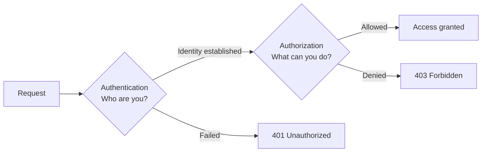
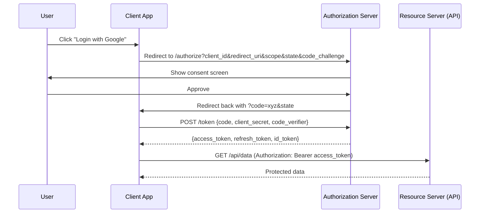
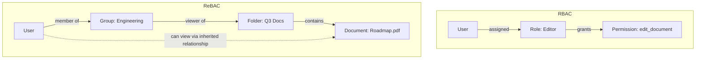
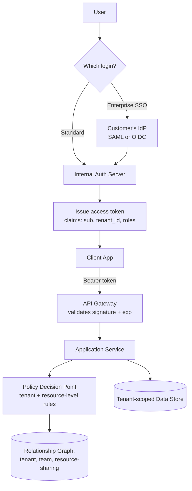

# Authentication & Authorization — Expert Interview & Study Guide

## 1. Definitions That Interviewers Will Test You On Precisely

**Authentication (AuthN)**: proving *who you are*. "Is this really Alice?"
**Authorization (AuthZ)**: deciding *what you're allowed to do*, given who you are. "Can Alice delete this file?"

They are always sequential (you authorize based on an already-established identity) but are architecturally separable systems — conflating them is a common design mistake (e.g., baking permission checks into the same token-validation code path so badly that revoking a permission requires reissuing every token in the system).



**The 401 vs 403 distinction, precisely**: 401 means "I don't know who you are, or your credentials are invalid/missing" (authentication failure). 403 means "I know who you are, and you're not allowed to do this" (authorization failure). Returning 403 for an invalid token, or 401 for a valid-but-insufficiently-privileged user, is a common and frequently-tested API design mistake.

## 2. Password-Based Authentication, Done Correctly

- **Never store plaintext passwords.** Hash with a slow, memory-hard algorithm designed for passwords: **bcrypt**, **scrypt**, or **Argon2** (Argon2id is the current best-practice default). Never use fast general-purpose hashes (MD5, SHA-256) for passwords — their speed is exactly what makes brute-forcing feasible.
- **Salting**: a unique, random salt per password prevents precomputed rainbow-table attacks and ensures two users with the same password get different hashes. bcrypt/Argon2 handle this internally — don't roll your own.
- **Peppering** (optional, extra layer): a secret value stored outside the database (e.g., in a secrets manager or app config), combined with the password before hashing, so a full database leak alone isn't enough to brute-force offline — the attacker also needs the pepper.
- **Rate limiting and account lockout** on login attempts, with exponential backoff, to blunt brute-force and credential-stuffing attacks — but lock the *attempt*, not the account indefinitely, to avoid enabling a denial-of-service against a legitimate user via repeated failed logins from an attacker.
- **Constant-time comparison** for any secret comparison (though modern password-hashing libraries handle this) to avoid timing side-channel attacks.

## 3. Session-Based vs Token-Based Authentication

| | Session-based | Token-based (JWT) |
|---|---|---|
| Server state | Server stores session state (in memory, Redis, or DB), client holds only an opaque session ID cookie | Server stores nothing; the token itself carries the claims, cryptographically signed |
| Revocation | Trivial — delete the session server-side, effective immediately | Hard — a signed token is valid until expiry unless you maintain a blocklist (which reintroduces server-side state, partially defeating the point) |
| Scalability | Requires a shared session store (Redis) across app server instances, or sticky sessions | Naturally stateless — any server can validate the token independently, ideal for horizontally-scaled/microservice architectures |
| Payload size | Small (just an ID) | Larger (claims embedded, sent on every request) |
| Typical transport | HTTP-only, Secure, SameSite cookie | `Authorization: Bearer <token>` header, or a cookie |
| Cross-domain/service use | Awkward across different domains/services | Natural fit for API-to-API and SPA/mobile clients talking to multiple backend services |

**The revocation problem is the crux of most "JWT vs sessions" interview discussions.** JWTs are stateless by design, which is their main advantage — but that same property means you cannot instantly invalidate one without server-side bookkeeping. Production systems handle this with **short-lived access tokens** (5-15 minutes) paired with a **long-lived, server-side-revocable refresh token** — so the blast radius of "can't revoke instantly" is capped at the access token's short lifetime, while the thing that actually needs revocation (the refresh token, or the user's session) is checked against server state on every refresh.

## 4. JWT Internals

A JWT is three base64url-encoded segments joined by dots: `header.payload.signature`.

```
eyJhbGciOiJSUzI1NiIsInR5cCI6IkpXVCJ9.eyJzdWIiOiJ1c2VyXzEyMyIsImV4cCI6MTcxOTk5OTk5OX0.<signature>
```

- **Header**: algorithm (`alg`, e.g., `RS256` or `HS256`) and token type.
- **Payload**: claims — `sub` (subject/user ID), `iss` (issuer), `aud` (audience — which service this token is meant for), `exp` (expiry), `iat` (issued at), `jti` (unique token ID, useful for revocation lists), plus custom claims (roles, permissions, tenant ID).
- **Signature**: `HMACSHA256(base64(header) + "." + base64(payload), secret)` for HS256, or an RSA/ECDSA private-key signature for RS256/ES256. The signature is what prevents tampering — anyone can *read* a JWT's payload (it's just base64, not encrypted), but only the holder of the signing key can produce a valid signature for modified claims.

**HS256 vs RS256 — a frequently tested distinction**: HS256 uses one shared secret for both signing and verification — fine when only one party (a single backend) ever needs to verify tokens. RS256 uses a private key to sign and a public key to verify — the public key can be distributed to any number of services/clients that need to verify tokens without ever holding the ability to *create* valid ones, which is why RS256 (or ES256) is the correct choice for any system where multiple services or third parties verify tokens issued by a central auth server.

**Critical JWT pitfalls to name unprompted:**
- **`alg: none` attack**: some libraries historically accepted a token with `alg` set to `none` and skipped verification entirely — always explicitly pin the accepted algorithm(s) when verifying, never trust the `alg` header to decide how to verify.
- **Storing JWTs in `localStorage`** exposes them to any XSS vulnerability on the page (JavaScript can read `localStorage`). Prefer an `HttpOnly`, `Secure`, `SameSite=Strict` cookie for browser clients, which JavaScript cannot read even if XSS occurs (though this then requires CSRF protection instead — there's no free lunch, see section 7).
- **Putting sensitive data in the payload** — it's base64, not encryption; never put a password, SSN, or other secret in a JWT claim.
- **No revocation plan** — as covered above, always pair short-lived access tokens with a revocable refresh mechanism.

## 5. OAuth 2.0 — What It Actually Is (and Isn't)

**OAuth 2.0 is an authorization delegation protocol, not an authentication protocol.** It answers "can this third-party app access this user's data on Google, with this specific scope, without ever seeing the user's Google password?" It does *not* by itself tell the third-party app who the user is — that's what OIDC adds on top (section 6). Confusing these two is one of the most common mistakes in both interviews and real implementations.

**Roles**: Resource Owner (the user), Client (the third-party app requesting access), Authorization Server (issues tokens, e.g., Google's OAuth server), Resource Server (hosts the protected data/API, e.g., Google's API).

**Authorization Code flow (the one to know cold — used by essentially all server-side web apps and, with PKCE, by SPAs/mobile apps):**



**Why the authorization code is exchanged server-side (or with PKCE) rather than returning the access token directly in the redirect** (the older, now-deprecated Implicit flow): the redirect URL is visible in browser history, server logs, and the Referer header — an access token there is directly stealable. The short-lived, single-use authorization code is far safer to expose in a redirect because it must additionally be exchanged with the `client_secret` (confidential clients) or a PKCE `code_verifier` (public clients like SPAs/mobile, which can't safely hold a secret) — an attacker who intercepts only the code cannot complete the exchange without also having the secret/verifier.

**PKCE (Proof Key for Code Exchange)**: the client generates a random `code_verifier`, derives a `code_challenge = SHA256(code_verifier)`, sends the challenge with the initial `/authorize` request, then sends the original verifier when exchanging the code for a token. The authorization server checks the hash matches — this proves the token exchange is being completed by the same client that started the flow, closing the interception gap for public clients that can't hold a `client_secret`. **PKCE is now recommended for all clients, not just public ones**, per current OAuth best practice.

**Other grant types, briefly**: Client Credentials (machine-to-machine, no user involved — a service authenticating as itself), Refresh Token (exchange a refresh token for a new access token without re-prompting the user), Device Code (for input-constrained devices like smart TVs — show a code, user approves on a second device). The Resource Owner Password Credentials grant and the Implicit grant are both **deprecated** in current best practice (OAuth 2.1) — know why (ROPC requires the client to directly handle the user's password, defeating OAuth's core purpose; Implicit exposes tokens in the URL fragment as described above).

## 6. OpenID Connect (OIDC) — Authentication Built on Top of OAuth 2.0

OIDC adds a standardized **identity layer** on top of OAuth 2.0's delegation mechanics: the same Authorization Code flow, but the token response also includes an **ID Token** — a JWT specifically about the *authenticated user* (claims like `sub`, `email`, `name`, `email_verified`), signed by the authorization server (now acting as an "Identity Provider"). The access token is still for calling APIs on the user's behalf; the ID token is what tells the client *who just logged in*. "Sign in with Google/Apple/GitHub" buttons are OIDC, not raw OAuth.

**The one-sentence distinction that resolves most confusion**: OAuth 2.0 answers "what can this app do on my behalf," OIDC (built on OAuth 2.0) answers "who is this user" — a login flow that only obtains an access token but never validates an ID token isn't actually authenticating the user, it's just obtaining delegated API access, which is a subtle but real security gap seen in real-world misimplementations.

## 7. Session Security: CSRF, XSS, and Cookie Attributes

- **XSS (Cross-Site Scripting)**: attacker-injected script runs in your page's origin, able to read anything JavaScript can read (cookies without `HttpOnly`, `localStorage`, the DOM). Mitigate with output encoding/escaping, a strict Content-Security-Policy, and `HttpOnly` cookies so even a successful XSS can't exfiltrate the session token directly.
- **CSRF (Cross-Site Request Forgery)**: a malicious site tricks a logged-in user's browser into making a state-changing request to your site, riding on the browser's automatically-attached cookies. Mitigate with the `SameSite` cookie attribute (`Strict` or `Lax` stops the cookie from being sent on most cross-site requests), and/or a CSRF token (a value the server issues and the client must echo back in a header/body — not automatically attachable by a forging site, unlike a cookie).
- **Cookie attributes to know cold**: `HttpOnly` (not readable by JavaScript — mitigates XSS token theft), `Secure` (only sent over HTTPS), `SameSite=Strict/Lax/None` (controls cross-site sending — mitigates CSRF).
- **Token-in-header (Bearer) auth is inherently immune to CSRF** (a forging site can't set a custom `Authorization` header on a cross-site request without the browser making a CORS preflight that your API would reject) — one reason many API-first/SPA architectures prefer bearer tokens in headers over cookies, accepting the XSS-can-read-localStorage tradeoff discussed in section 4 as the one to actively defend against instead (via strict CSP).

## 8. Authorization Models

**RBAC (Role-Based Access Control)**: users are assigned roles (`admin`, `editor`, `viewer`); roles are assigned permissions. Simple to reason about and administer at moderate scale, but becomes unwieldy when access needs depend on relationships between the user and the specific resource ("can edit *their own* documents" isn't expressible as a static role).

**ABAC (Attribute-Based Access Control)**: access decisions evaluate policies against attributes of the user, resource, action, and environment (e.g., "allow if `user.department == resource.department AND time_of_day is business_hours`"). Far more expressive than RBAC, at the cost of policies becoming harder to audit/reason about exhaustively as they grow (you can't just list "who has role X," you have to evaluate the policy against arbitrary contexts).

**ReBAC (Relationship-Based Access Control)**: access is determined by traversing relationships in a graph (Google Zanzibar's model, also used by Google Drive/GitHub-style sharing: "can view if user is an owner of this doc, OR a member of a group that's a viewer of this doc, OR this doc is in a folder the user can view"). This is the model that correctly expresses nested sharing (folders, teams, inherited permissions) that RBAC/ABAC struggle to express cleanly, and it's what powers most modern "share this with these people/groups, plus inherit from the parent folder" features.



**Choosing between them in an interview**: start with RBAC for straightforward "roles map cleanly to permissions" systems (most internal admin tools, simple SaaS apps); reach for ABAC when access depends on dynamic context/attributes rather than a fixed role set; reach for ReBAC when the domain has natural hierarchical/social sharing (documents, folders, org charts, social graphs) — and note that real systems often combine them (e.g., RBAC for coarse admin/staff roles, ReBAC for resource-level document sharing).

## 9. Fine-Grained and Distributed AuthZ Patterns

- **Centralized Policy Decision Point (PDP)**: services call a central authorization service (e.g., OPA/Open Policy Agent, or a Zanzibar-style relationship service) to ask "can user X do action Y on resource Z?" rather than each service reimplementing its own permission logic. Consistent policy enforcement, single place to audit/update rules, but adds a network hop (and a critical-path dependency) to every authorized request — usually mitigated with aggressive caching of decisions and/or colocating a PDP sidecar per service.
- **Policy as code**: expressing authorization rules in a dedicated policy language (e.g., Rego for OPA) rather than scattering `if user.role == 'admin'` checks across application code — makes policies testable, versionable, and auditable independent of application deploys.
- **Token-embedded claims vs. real-time lookup**: embedding coarse permissions/roles directly in the access token (fast, no extra lookup, but stale until the token expires/refreshes — a demoted admin still has admin claims until their token expires) vs. looking up permissions in real time against a central service on every request (always current, but adds latency and a dependency). Production systems typically embed coarse/slow-changing claims (org membership, base role) in the token and do a real-time check only for fine-grained, high-stakes, or frequently-changing permissions (e.g., "can this user still access this specific document," which might have been unshared moments ago).
- **Zero Trust / mTLS for service-to-service auth**: in a microservices architecture, don't assume traffic inside your network is trusted just because it's internal. Mutual TLS (both client and server present certificates, verified by each other) authenticates service identity for every internal call, typically issued and rotated automatically by a service mesh (Istio/Linkerd) — this is the modern replacement for "the internal network is the trust boundary."

## 10. Case Study: Designing Auth for a Multi-Tenant B2B SaaS Platform

**Requirements**: each customer (tenant) has its own users; users can belong to multiple tenants with different roles per tenant; support SSO via customers' own identity providers (Okta, Azure AD); fine-grained per-resource sharing within a tenant; API access for customers' own integrations.



**Key design decisions:**
- **`tenant_id` is embedded as a mandatory claim in every access token**, and every downstream data query is scoped by it at the data-access-layer level (never trust a client-supplied tenant ID in a request body — always derive it from the verified token) — this is the single most important guardrail against cross-tenant data leaks, and interviewers specifically probe for it.
- **SSO via SAML or OIDC**: enterprise customers federate their own identity provider so their employees log in with existing corporate credentials, and access is automatically revoked the instant the employee is deactivated in the customer's own IdP — a hard requirement for enterprise B2B deals, and a good moment to mention SAML still dominates enterprise SSO despite OIDC being the modern default, because many large customers' existing IdPs are SAML-based.
- **Multi-tenant membership**: a user's identity is global (one account), but role/permissions are tenant-scoped — the token issued after tenant selection carries that tenant's context, and a user active in two tenants simultaneously (e.g., a consultant) would hold two separate token contexts, not one token with merged permissions across tenants (merging would be a serious cross-tenant leak risk).
- **Resource-level sharing within a tenant** uses a ReBAC-style relationship graph (a user, a team, and a resource-sharing edge) rather than static roles, since "share this specific document with these three people" is exactly the pattern RBAC can't express cleanly.
- **API keys for customer integrations** are a separate credential type from user session tokens — scoped to specific permissions the customer explicitly grants the key (not "whatever the creating user can do"), independently revocable, and never expiring silently the way a user's session might — a detail that's easy to skip but frequently probed ("how is a machine-to-machine API key different from a user's OAuth token, architecturally?").

## 11. Common Auth Interview Prompts to Practice

Design a login system with password reset and 2FA, design an OAuth2 authorization server from scratch, design a permission system for a Google-Drive-like sharing model, design SSO for an enterprise product, design an API key management system, explain how you'd rotate a compromised signing key with zero downtime, design rate-limited/step-up authentication for sensitive actions (re-auth before a password change).

## 12. Interview Questions & Answers

**Q1. What's the difference between authentication and authorization, precisely, and what HTTP status codes map to each failure?**
A: Authentication establishes identity ("who are you") — its failure is 401 Unauthorized (despite the confusing name, it really means "not authenticated"). Authorization decides what an already-identified party can do — its failure is 403 Forbidden ("I know who you are, but you can't do this"). Returning 403 to someone with no/invalid credentials, or 401 to an authenticated-but-insufficiently-privileged user, is a common and testable API design mistake.

**Q2. Why shouldn't you use SHA-256 to hash passwords, even though it's cryptographically secure?**
A: SHA-256 is designed to be fast — a property that's desirable for data-integrity checksums but actively harmful for password storage, because it lets an attacker with a leaked hash database brute-force billions of guesses per second on commodity GPUs. Password hashing needs the opposite property: deliberately slow and memory-hard (bcrypt, scrypt, Argon2) so brute-forcing even a single password is computationally expensive, ideally combined with unique per-password salts (handled internally by these algorithms) to defeat precomputed rainbow tables.

**Q3. Explain why JWTs are hard to revoke, and how production systems solve it in practice.**
A: A JWT is self-contained and cryptographically verifiable without a database lookup — that statelessness is exactly its main advantage for scalability, but it also means a server has no built-in way to say "this specific token is now invalid" short of checking every request against a blocklist, which reintroduces the server-side state JWTs were meant to avoid. The standard solution: issue short-lived access tokens (5-15 minutes) that are simply allowed to expire naturally, paired with a long-lived refresh token that *is* checked against server-side state on every use — so true revocation only needs to happen at the refresh-token layer, capping the maximum "can't revoke" window to the access token's short lifetime.

**Q4. What does OAuth 2.0 actually secure, and why is "OAuth is an authentication protocol" a common misconception?**
A: OAuth 2.0 secures delegated access to resources — it lets a user grant a third-party app scoped access to their data on another service, without sharing their password with that app. It says nothing, by itself, about the third party actually verifying who the user is; a client could obtain an access token and use it to call an API without ever learning or confirming the user's identity. OpenID Connect layers an authentication mechanism (the signed ID Token, containing verified identity claims) on top of OAuth 2.0's flows specifically to close this gap — conflating the two, or implementing "login with X" using bare OAuth without validating an ID token, is a real and recurring security mistake.

**Q5. Walk through the OAuth 2.0 Authorization Code flow and explain why the token exchange happens in a second, back-channel request instead of returning the token directly in the redirect.**
A: The user is redirected to the authorization server, authenticates and consents, and is redirected back to the client with a short-lived, single-use authorization code in the URL. The client then exchanges that code for tokens via a direct server-to-server (or PKCE-protected) POST request, not visible in browser history/logs/Referer headers the way the initial redirect is. This two-step design means an attacker who intercepts the redirect only gets a code that's useless without also possessing the client's secret (confidential clients) or the original PKCE code verifier (public clients) — versus the deprecated Implicit flow, which returned the access token directly in the redirect fragment, fully exposing it to anything that could observe that URL.

**Q6. What problem does PKCE solve, and why is it now recommended even for confidential (server-side) clients, not just public ones like SPAs?**
A: PKCE binds the authorization code exchange to the specific client instance that initiated the flow: the client generates a random `code_verifier`, sends its SHA-256 hash (`code_challenge`) with the initial authorization request, and must present the original verifier when exchanging the code — so even if the code is intercepted, an attacker can't complete the exchange without the verifier, which was never transmitted in a interceptable form. It was originally designed for public clients (mobile/SPA) that can't safely hold a `client_secret`, but current best practice (OAuth 2.1) recommends it universally because it adds meaningful protection against authorization code interception attacks (e.g., via a malicious app registering the same custom URI scheme on a device) at essentially zero cost, even for clients that also have a secret.

**Q7. How would you decide between RBAC, ABAC, and ReBAC for a new authorization system?**
A: Start with the shape of the actual access rules: if permissions map cleanly onto a small, fairly static set of roles ("admins can do X, editors can do Y"), RBAC is simplest to build and audit. If access depends on dynamic attributes/context that don't reduce to a fixed role ("allow if requester's department matches the resource's department and it's within business hours"), you need ABAC's policy-evaluation model. If the domain has natural hierarchical or social sharing — folders containing documents, teams containing users, "share with this person or group, optionally inherited from a parent" — ReBAC's relationship-graph model is the only one of the three that expresses this cleanly without combinatorial role explosion. Most real systems end up combining them: RBAC for coarse platform-level roles, ReBAC for resource-level sharing.

**Q8. In a multi-tenant SaaS system, what's the single most important guardrail against one tenant accessing another tenant's data, and where should it be enforced?**
A: The tenant ID must be derived exclusively from the verified access token (a claim set by the auth server at token-issuance time), never trusted from anything the client supplies in the request itself (a body field, query param, or header the client controls) — and every data-access-layer query must be scoped by that server-derived tenant ID, ideally enforced at a layer that's hard to bypass by mistake (e.g., a query-building layer that structurally requires a tenant filter, or row-level security at the database itself) rather than relying on every individual endpoint's author to remember to add the filter. This is the check interviewers specifically probe for, because the realistic failure mode isn't a sophisticated attack — it's a developer forgetting a `WHERE tenant_id = ?` clause in one of hundreds of queries.

**Q9. Why is `HttpOnly` on a session cookie not sufficient protection on its own, and what else do you need?**
A: `HttpOnly` prevents JavaScript from reading the cookie's value, which blocks the most direct form of session-token theft via XSS — but it does nothing to stop the browser from automatically *sending* that cookie along with a cross-site request that a malicious page tricks the user's browser into making (CSRF), since the cookie is attached by the browser regardless of which site initiated the request. You need `SameSite=Strict` or `Lax` (which stops the cookie being sent on most cross-site requests in the first place) and/or an explicit CSRF token (a value the legitimate page must read and echo back, which a forging third-party site has no way to obtain) as a complementary defense — `HttpOnly` and CSRF protection address two different attack vectors (token theft vs. forged requests) and neither substitutes for the other.

**Q10. What's the difference between a Policy Decision Point (PDP) architecture and embedding authorization checks directly in each service's code, and what's the tradeoff?**
A: A centralized PDP (e.g., OPA) means every service calls out to a shared authorization service/library with the request context (user, action, resource) and gets back an allow/deny decision, with the actual policy logic defined once, versioned, and auditable independently of any single service's codebase. Embedding checks directly in each service is simpler with no extra network hop, but means the same logical rule ("only the owner or an org admin can delete this") gets reimplemented — and can subtly diverge — across every service that needs to enforce it. The tradeoff is architectural coupling and latency (a PDP call on the critical path of every request) versus consistency and auditability; production systems usually mitigate the latency cost with local caching of decisions or a PDP sidecar colocated with each service.

**Q11. Why do access tokens typically embed coarse permissions as claims, while fine-grained/frequently-changing permissions are checked in real time against a service instead?**
A: A claim embedded in a signed token is only as current as the token's issuance time — it can't reflect a permission change that happens during the token's lifetime without either a short token lifetime or an explicit revocation mechanism, so embedding something that changes often (e.g., "can view this specific document, which might get unshared any second") risks granting access based on stale information for the token's remaining lifetime. Coarse, slowly-changing attributes (org membership, base subscription tier) are safe to embed because staleness for a few minutes is an acceptable risk and saves a network round-trip on every request; fine-grained or high-stakes permissions justify the extra latency of a real-time check specifically because the cost of a stale "yes" is higher than the cost of an extra lookup.

**Q12. What is mutual TLS (mTLS) and why is it used for service-to-service authentication instead of just trusting traffic inside the internal network?**
A: In mTLS, both the client and server present X.509 certificates and each verifies the other's identity before the connection proceeds — as opposed to standard TLS, where only the server proves its identity to the client. It's used for internal service-to-service calls because the "internal network = trusted" assumption breaks down once you account for compromised nodes, misconfigured network segmentation, or an attacker who's gained a foothold on any single host — mTLS means every internal call cryptographically authenticates the calling service's identity regardless of network position, which is the foundation of a Zero Trust architecture. In practice, a service mesh (Istio/Linkerd) typically automates certificate issuance and rotation so individual services don't manage this themselves.

**Q13. Explain why the OAuth 2.0 Resource Owner Password Credentials (ROPC) grant is deprecated, and what it was originally meant for.**
A: ROPC has the client application collect the user's actual username and password directly and send them to the authorization server in exchange for a token — which defeats OAuth's foundational purpose of letting a user grant scoped access *without* handing their credentials to the requesting application. It was originally intended for "highly trusted" first-party clients (e.g., a company's own mobile app authenticating against its own backend), but even there it's now discouraged because it trains users to enter credentials into arbitrary app UIs (undermining phishing resistance) and provides no natural path to features like MFA or SSO that a proper redirect-based flow supports. Current guidance (OAuth 2.1) removes it entirely in favor of the Authorization Code flow with PKCE, even for first-party apps.

**Q14. How would you design "step-up authentication" — requiring a fresh re-authentication before a sensitive action like changing a password or making a large payment — in a system that normally uses long-lived sessions?**
A: Track an `auth_time` (or equivalent "freshness" timestamp) representing when the user last actively authenticated, separate from the session's general validity. Sensitive endpoints check that `auth_time` is within an acceptable recency window (e.g., the last 5 minutes) and, if not, respond with a specific challenge requiring the user to re-enter their password or complete a fresh MFA step before proceeding — without invalidating their broader, longer-lived session for normal browsing. OIDC has a standardized mechanism for this via the `max_age` parameter and the `auth_time` claim, which is worth naming if the interviewer is testing OIDC depth specifically.

**Q15. Why is SAML still relevant for enterprise SSO despite OIDC being the more modern protocol, and what's the core mechanical difference between them?**
A: Many large enterprises' existing identity infrastructure (Active Directory Federation Services, older Okta/Ping configurations) was built on SAML long before OIDC existed, and migrating an organization's entire federated identity setup is a significant undertaking many enterprises simply haven't done — so any B2B product targeting enterprise customers needs to support SAML to close deals with those customers, regardless of its own technical preference. Mechanically, SAML exchanges XML-based assertions (typically via browser redirects with POST-bound signed XML documents) whereas OIDC exchanges JSON-based tokens (JWTs) via a more modern, mobile/SPA-friendly redirect-and-token-exchange flow — OIDC is generally simpler to implement and better suited to modern app architectures, but SAML's entrenchment in enterprise identity systems keeps it relevant for the foreseeable future.

**Q16. A user reports they were logged out of every device except one after a password change — walk through how you'd implement "log out everywhere except this session."**
A: Maintain a per-user "token generation" or "session epoch" counter (or a per-session revocation list) in server-side state. On password change, increment the user's global token generation counter but record the current session's ID/token as exempt, or alternatively invalidate all refresh tokens/sessions for the user except the one servicing the current request. Every access token validation (or refresh) checks that the token's embedded generation number matches the user's current counter (or that the session ID isn't in the revoked set); a mismatch forces re-authentication. This again relies on the refresh-token/session layer holding server-side state specifically because, as established earlier, stateless access tokens alone can't support this kind of selective, immediate revocation.

**Q17. What's the security reasoning behind never accepting a client-specified `alg` header value blindly when verifying a JWT?**
A: If verification code trusts whatever algorithm the token claims to use, an attacker can craft a token with `alg: none` (some libraries historically treated this as "no signature to check") or, more subtly, take a service's known RS256 *public* key and craft an HS256 token using that public key's contents as the HMAC secret — if the verifier is told (by the attacker-controlled header) to treat it as HS256, it will "verify" a forged token using a key the attacker actually knows. The fix is for the verifying service to hardcode/pin which algorithm(s) it expects for a given key, ignoring the token's own `alg` claim as an instruction, and reject anything else outright.
