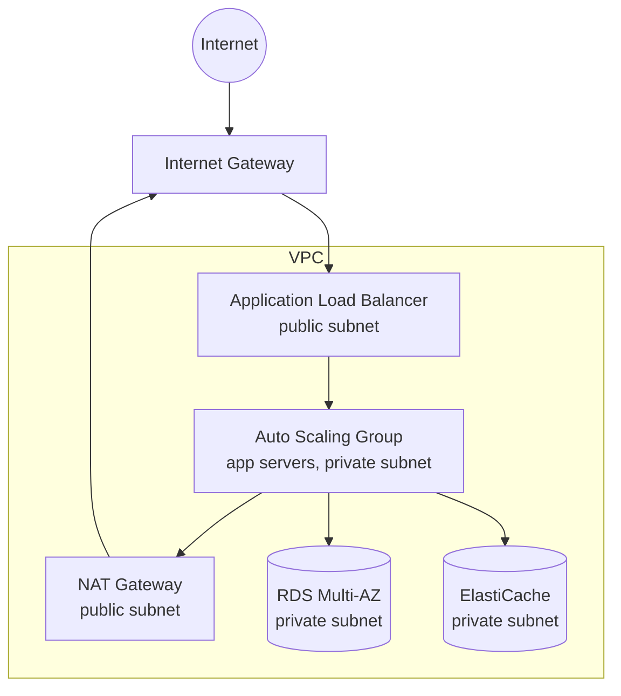
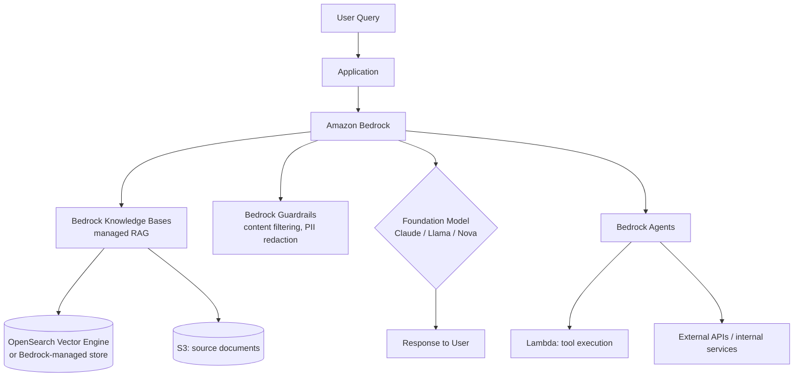
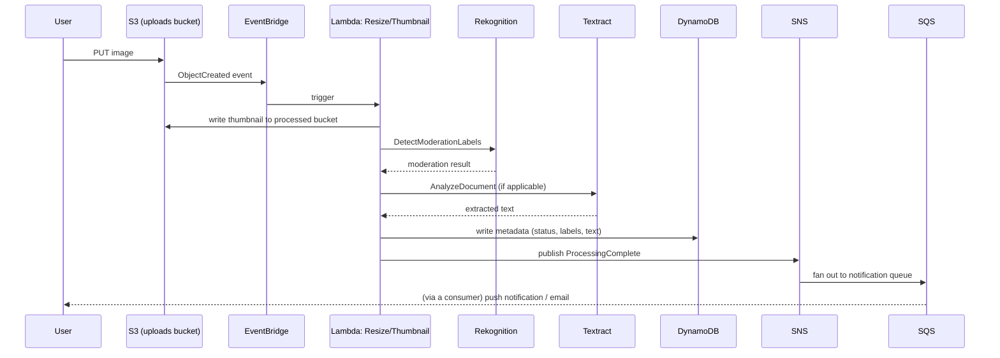

# AWS Services — Expert Interview & Study Guide (Including Modern AI Services)

## 1. How AWS Interviews Are Actually Structured

AWS-focused interview rounds (Solutions Architect, Cloud/DevOps Engineer, or the AWS-heavy portion of a backend/SDE system design round) test three things: (1) do you know the *right* service for a given access/scale/cost pattern, not just that a service exists, (2) do you understand the specific mechanisms (not marketing names) that make a service reliable/scalable, and (3) can you reason about cost and operational tradeoffs, not just "can this technically work." Expect prompts like "design a scalable image-processing pipeline on AWS" more often than "what does S3 stand for."

## 2. Compute

- **EC2**: virtual machines, full control over the OS. Choose when you need custom runtime/OS-level control, licensing requirements, or workloads that don't fit a managed abstraction. Instance families matter: general purpose (M-series), compute-optimized (C-series), memory-optimized (R-series), storage-optimized (I/D-series), and GPU/accelerated (P/G/Trn/Inf-series — the last two, **Trainium** and **Inferentia**, are AWS's custom silicon for ML training and inference respectively, a frequent "latest AWS" talking point).
- **Lambda**: serverless functions, billed per invocation/duration, scales to zero. Best for event-driven, short-duration (≤15 min), spiky/unpredictable workloads. Cold starts are the classic tradeoff to name — mitigated with Provisioned Concurrency for latency-sensitive paths. Not a fit for long-running or steady, high-throughput compute (cost crosses over vs. EC2/Fargate at sustained high volume).
- **ECS / Fargate**: container orchestration. ECS with EC2 launch type gives you the underlying instances to manage (cheaper at scale, more ops burden); **Fargate** is serverless containers — no EC2 instances to patch/manage, you pay per task's vCPU/memory. Fargate is the default recommendation for "run containers without managing servers."
- **EKS**: managed Kubernetes control plane. Choose when the org already has Kubernetes expertise/tooling investment or needs portability across clouds; otherwise ECS/Fargate is simpler and AWS-native with less operational overhead.
- **Elastic Beanstalk**: PaaS wrapper around EC2/ASG/ELB — fast to get a standard web app running, less control, largely superseded by App Runner or containers-on-Fargate for new projects.
- **App Runner**: fully managed, source-to-URL deployment for containerized web apps/APIs — the closest AWS equivalent to Heroku/Render, minimal config.

## 3. Storage

- **S3**: object storage, 11 nines durability (data replicated across multiple AZs within a region by design), effectively infinite scale. Storage classes are a frequent cost-optimization question: **Standard** (frequent access), **Intelligent-Tiering** (automatically moves objects between tiers based on access patterns — the "don't want to think about it" default for unpredictable access), **Standard-IA/One Zone-IA** (infrequent access, cheaper storage + retrieval fee), **Glacier Instant/Flexible/Deep Archive** (archival, minutes-to-hours retrieval, dramatically cheaper storage — Deep Archive is the cheapest, ~12hr retrieval, aimed at compliance/backup data accessed rarely if ever).
- **EBS**: block storage attached to a single EC2 instance (like a virtual hard drive) — persists independently of instance lifecycle, but is AZ-bound (a snapshot is needed to move it across AZs). Types: gp3 (general purpose SSD, default choice), io2 (high-IOPS, for demanding databases).
- **EFS**: managed NFS — shared file storage mountable by multiple EC2 instances/containers simultaneously, unlike EBS which is single-attach. Use when multiple compute nodes need a shared, POSIX-compliant filesystem.
- **FSx**: managed file systems for specific workloads (FSx for Windows File Server, FSx for Lustre — high-performance computing/ML training data).

**S3 vs EBS vs EFS, the interview-tested distinction**: S3 is object storage accessed via API (HTTP), not mountable as a filesystem, effectively unlimited scale, ideal for unstructured data/backups/static assets/data lakes. EBS is block storage, mountable by exactly one instance at a time, ideal for a database's own data volume. EFS is a shared network filesystem, mountable by many instances concurrently, ideal for shared config/shared upload processing across a fleet.

## 4. Databases

- **RDS**: managed relational databases (Postgres, MySQL, MariaDB, Oracle, SQL Server) — AWS handles patching, backups, failover. Multi-AZ deployment gives synchronous standby replication for automatic failover (high availability); read replicas (async) scale read throughput separately.
- **Aurora**: AWS's own MySQL/Postgres-compatible engine, storage decoupled from compute and automatically replicated 6 ways across 3 AZs, with typically much higher throughput and faster failover than stock RDS — the "if budget allows and you're on MySQL/Postgres, this is usually the better default" answer. **Aurora Serverless v2** scales compute capacity automatically based on load, billed per-ACU-second, good for variable/unpredictable workloads without manual capacity planning.
- **DynamoDB**: managed, serverless key-value/document NoSQL store, single-digit millisecond latency at any scale, automatic partitioning. Core interview knowledge: choosing a good **partition key** (high cardinality, even access distribution — a hot partition key is DynamoDB's classic failure mode), **Global Secondary Indexes (GSI)** for querying by non-key attributes, **DynamoDB Streams** for change-data-capture (triggering Lambda on item changes), and **on-demand vs provisioned capacity** billing modes.
- **ElastiCache**: managed Redis or Memcached. Redis for anything needing data structures beyond simple key-value (sorted sets for leaderboards, pub/sub, persistence options); Memcached for pure, simple, multi-threaded caching with no persistence needs.
- **Redshift**: managed data warehouse, columnar storage, for OLAP/analytics queries over large historical datasets — not a transactional database substitute.
- **Neptune**: managed graph database (property graph and RDF) — for relationship-heavy queries (social graphs, recommendation engines, fraud detection networks) that would require expensive recursive joins in a relational DB.
- **DocumentDB**: MongoDB-compatible managed document database.

**The single most-tested DB decision**: "relational integrity + transactions + complex queries" → RDS/Aurora. "Massive scale, simple access patterns, need single-digit-ms latency" → DynamoDB. Justify with the actual access pattern, exactly as covered in the [HLD](high-level-design) document's database decision framework.

## 5. Networking

- **VPC**: your isolated virtual network — subnets (public: has a route to an Internet Gateway; private: doesn't), route tables, security groups (stateful, instance-level firewall — return traffic automatically allowed) vs NACLs (stateless, subnet-level — must explicitly allow both directions).
- **Internet Gateway** (public subnet internet access) vs **NAT Gateway** (lets private-subnet resources initiate outbound internet access without being reachable from the internet — a classic pattern: app servers in private subnets, NAT Gateway for outbound package downloads/API calls, no inbound exposure).
- **ELB family**: **ALB** (Application Load Balancer, Layer 7, content-based routing, native fit for HTTP microservices/containers), **NLB** (Network Load Balancer, Layer 4, ultra-low latency, static IP, handles millions of requests/sec — for TCP/UDP or extreme-throughput needs), **GLB** (Gateway Load Balancer, for inserting third-party virtual appliances like firewalls transparently into traffic paths).
- **Route 53**: DNS, plus routing policies worth knowing: latency-based (route to the region with lowest latency for the requester), geolocation, weighted (canary/blue-green traffic splitting), and health-check-based failover.
- **CloudFront**: AWS's CDN — edge-caches content close to users, integrates natively with S3 (static assets/media) and ALB/API Gateway (dynamic content acceleration, DDoS absorption at the edge).
- **Direct Connect / VPN**: dedicated private network link (Direct Connect) vs encrypted tunnel over the public internet (Site-to-Site VPN) for connecting on-premises infrastructure to a VPC — Direct Connect for consistent bandwidth/lower latency at a premium, VPN for faster setup/lower cost.
- **PrivateLink**: exposes a service privately across VPCs/accounts without traversing the public internet or requiring VPC peering's full network merge — the standard way to offer a SaaS product securely to customer VPCs, or to reach AWS services (S3, DynamoDB) without an Internet Gateway via VPC endpoints.

## 6. Messaging, Events, and Orchestration

- **SQS**: managed message queue. Standard (at-least-once, best-effort ordering, near-unlimited throughput) vs FIFO (exactly-once processing, strict ordering, throughput capped — use only when order/dedup genuinely matters, e.g., processing financial transactions in sequence).
- **SNS**: pub/sub — one message fanned out to many subscribers (SQS queues, Lambda, HTTP endpoints, email/SMS). Classic pattern: **SNS fan-out to multiple SQS queues** so multiple independent consumers each get their own durable, independently-scalable copy of every event.
- **EventBridge**: an event bus with content-based routing rules (route events to targets based on event attributes, not just topic), native integrations with 100+ AWS services and SaaS partners, and **schema registry** support — the modern default for building event-driven architectures on AWS, more expressive than SNS for complex routing logic.
- **Kinesis**: real-time streaming data (like a managed Kafka-lite) — **Data Streams** for custom stream processing applications with ordered, replayable records per shard, **Firehose** for the common case of just needing to load a stream into S3/Redshift/OpenSearch with minimal code, **Data Analytics** for SQL/Flink-based stream processing.
- **Step Functions**: managed state machine / workflow orchestration — the AWS-native answer to "orchestrate a multi-step Saga across Lambda functions/services with retries, error handling, and parallel branches," visualized as a state diagram. The direct AWS-native implementation of the orchestration-style Saga pattern discussed in the System Design document.
- **MSK**: managed Kafka, for teams that specifically need Kafka's ecosystem/semantics rather than AWS-native alternatives.

## 7. IAM and Security Fundamentals

- **IAM Users/Groups/Roles**: Users are long-lived identities (for humans, discouraged for workloads); Roles are temporary, assumable identities with no long-term credentials — **the correct way for EC2/Lambda/ECS to access other AWS services** (instance profiles / task roles), never hardcoded access keys in code or environment variables.
- **Policies**: JSON documents defining allowed/denied actions on resources; evaluated with an explicit-deny-always-wins, otherwise-default-deny logic — an explicit `Deny` anywhere in any applicable policy overrides any `Allow`.
- **Principle of least privilege**: scope every role/policy to the minimum actions and resources actually needed — the single most repeated piece of guidance in every AWS security review, and a near-guaranteed interview topic.
- **KMS**: managed encryption key service — envelope encryption (a data key encrypts the actual data, KMS's master key encrypts the data key) underlies most AWS at-rest encryption (S3, EBS, RDS). Know the difference between AWS-managed keys (simplest, AWS controls rotation) and customer-managed keys (you control rotation/policy/access, needed for stricter compliance).
- **Secrets Manager vs Parameter Store**: Secrets Manager offers automatic rotation (e.g., rotating a DB password on a schedule via a Lambda function) and is purpose-built for credentials; Parameter Store (SSM) is cheaper/simpler for general config values and non-rotating secrets — a common "why not just use one for everything" cost/feature tradeoff question.
- **Security Groups vs NACLs**, **WAF** (Layer 7 filtering — SQL injection/XSS rule sets, rate-based rules, in front of ALB/CloudFront/API Gateway), **Shield** (DDoS protection, Standard is automatic/free, Advanced adds larger-scale mitigation + cost protection + 24/7 DRT access).

## 8. Observability and Well-Architected Framework

- **CloudWatch**: metrics, logs, alarms, dashboards — the baseline observability service; **CloudWatch Logs Insights** for querying log data, **CloudWatch Alarms** feeding into Auto Scaling or SNS notifications.
- **X-Ray**: distributed tracing across microservices — the AWS-native answer to "how do you trace one request across 10 Lambda functions/services" raised in the System Design document's event-driven architecture discussion.
- **CloudTrail**: audit log of every API call made in the account (who did what, when) — a compliance and security-forensics fundamental, distinct from CloudWatch's operational metrics/logs.
- **AWS Well-Architected Framework — the six pillars** (a favorite "tell me about AWS best practices" framing device): **Operational Excellence** (run and monitor systems, improve processes), **Security** (protect data/systems — least privilege, defense in depth), **Reliability** (recover from failure, scale to meet demand — multi-AZ, auto-scaling, backups), **Performance Efficiency** (use resources efficiently, adapt as needs evolve — right-sizing, choosing the right database/compute type), **Cost Optimization** (avoid unnecessary spend — right-sizing, Reserved/Spot instances, storage tiering), **Sustainability** (minimize environmental impact — a newer, sixth pillar). Structuring an answer around these six pillars is a strong way to organize any "how would you architect this on AWS" response.

## 9. AWS AI/ML Services — Including the Latest Generation

This section maps directly onto the [AI/LangChain/RAG/MCP](ai-langgraph-langchain-rag-mcp) document's concepts — AWS's services are the managed infrastructure those concepts run on.

- **Amazon Bedrock**: the flagship managed **foundation model** service — serverless API access to multiple model providers' LLMs (Anthropic Claude, Meta Llama, Amazon's own Nova/Titan family, Mistral, Cohere, Stability AI for image generation) through one unified API, without managing any GPU infrastructure yourself. Key sub-features worth naming: **Bedrock Knowledge Bases** (a fully managed RAG pipeline — handles chunking, embedding, vector storage, and retrieval-augmented generation without you assembling the pipeline by hand), **Bedrock Agents** (managed agentic orchestration — the model plans and calls tools/APIs/Lambda functions autonomously to complete multi-step tasks), **Bedrock Guardrails** (configurable content filtering, PII redaction, and topic/denied-topic enforcement applied consistently across any model), and **Model Evaluation** (built-in tooling to benchmark and compare models on your own prompts/data before committing to one).
- **Amazon SageMaker**: the full ML lifecycle platform for teams training/fine-tuning/hosting their *own* custom models (as opposed to Bedrock's "call someone else's foundation model via API" approach) — notebooks for experimentation, managed training jobs (including distributed training across GPU clusters), **SageMaker Pipelines** for ML CI/CD, and managed real-time or batch inference endpoints with auto-scaling. **SageMaker JumpStart** provides one-click deployment of open-source foundation models when you need more control over hosting than Bedrock's fully-managed API gives you.
- **Amazon Q**: AWS's branded generative-AI assistant family — **Q Developer** (formerly CodeWhisperer; AI pair-programming, code generation, code review, and — notably — automated upgrade/transformation tooling, e.g., automating Java version upgrades across a codebase), **Q Business** (an enterprise chat assistant that answers questions grounded in a company's own internal documents/data sources, essentially RAG-as-a-managed-product), and **Q in QuickSight/Connect** (embedded generative AI inside AWS's BI and contact-center products).
- **Trainium and Inferentia**: AWS's custom silicon (mentioned in Compute above) purpose-built for ML training (Trainium) and inference (Inferentia) at a significantly better cost-per-performance ratio than general-purpose GPUs for many workloads — a strong "AWS is investing in owning the ML compute stack, not just reselling Nvidia GPUs" talking point for a "what's new in AWS AI" question.
- **Rekognition** (image/video analysis — object/face detection, content moderation), **Transcribe** (speech-to-text), **Polly** (text-to-speech), **Textract** (structured data extraction from documents/forms), **Comprehend** (NLP — sentiment, entity extraction, PII detection) — the older, purpose-built "AI services" generation, still relevant for narrow, well-defined tasks where a general-purpose LLM call would be overkill or less accurate/cheaper than a specialized model.
- **OpenSearch Service (with vector engine)**: increasingly the default AWS-native **vector database** for RAG applications not using Bedrock Knowledge Bases' built-in store — supports k-NN vector search alongside traditional full-text search in one service, useful when you want hybrid (keyword + semantic) search.

## 10. Case Study: Serverless Event-Driven Image Processing Pipeline (with an AI step)

A common "design a real AWS system" prompt — upload an image, generate thumbnails, moderate content, extract text, and notify the user.

**Why this shape**: everything is event-driven and serverless (S3 → EventBridge → Lambda) so the system scales to zero at idle and scales out automatically under burst upload traffic with no capacity planning; Rekognition/Textract are used instead of a custom-trained model because content moderation and generic document text extraction are exactly the narrow, well-solved problems AWS's purpose-built AI services target (a custom LLM call would be slower and more expensive for this specific, structured task); DynamoDB (not RDS) fits because the access pattern is pure key lookup by image ID with no relational joins; SNS fan-out to SQS decouples "processing finished" from "how many different things need to react to that" (a notification service, an analytics pipeline, a search-indexing consumer could all subscribe independently without Lambda1 knowing or caring). This is a direct, concrete application of the event-driven architecture principles from the System Design document, expressed entirely in real AWS service names.

## 11. Cost Optimization — A Frequently Tested, Frequently Skipped Topic

- **Reserved Instances / Savings Plans**: commit to 1-3 years of usage for a significant discount (up to ~72%) over On-Demand — right for steady, predictable baseline workloads.
- **Spot Instances**: bid on spare EC2 capacity for up to ~90% off, at the cost of a 2-minute termination warning when AWS needs the capacity back — right for fault-tolerant, interruptible workloads (batch processing, CI runners, stateless horizontally-scaled fleets with graceful draining), never for stateful single-instance workloads.
- **S3 storage class selection and lifecycle policies** — automatically transition objects to cheaper tiers as they age (e.g., move to Glacier after 90 days of no access).
- **Right-sizing**: the single most common real-world cost-saving action — most workloads are over-provisioned relative to actual utilization; CloudWatch metrics + AWS Compute Optimizer surface this directly.
- **Data transfer costs** are a frequently-missed cost driver — cross-AZ and cross-region transfer isn't free, and a chatty multi-AZ microservices architecture can accumulate meaningful transfer costs that a single-AZ (accepting the availability tradeoff) or a same-AZ-affinity design would avoid.

## 12. Common AWS-Focused Interview Prompts to Practice

Design a highly available 3-tier web app on AWS, design a serverless data pipeline (ingestion → transform → warehouse), design a multi-region disaster recovery strategy (pilot light vs warm standby vs active-active — know the RTO/RPO tradeoffs of each), design a CI/CD pipeline using native AWS tooling (CodePipeline/CodeBuild/CodeDeploy or GitHub Actions + OIDC role assumption), design a RAG-based internal knowledge assistant using Bedrock, explain how you'd migrate an on-prem monolith to AWS with minimal downtime.

## 13. Interview Questions & Answers

**Q1. When would you choose DynamoDB over RDS/Aurora for a new AWS-hosted service?**
A: Choose DynamoDB when the access pattern is predominantly key-based lookups (get/put by a well-known key) at a scale where you need guaranteed single-digit-millisecond latency regardless of table size, and you can design around its constraints (limited query flexibility, no native joins, careful partition-key design to avoid hot partitions). Choose RDS/Aurora when the domain has genuine relational structure requiring multi-table transactions, complex ad-hoc queries/joins, or when the team's existing tooling/ORM/reporting stack assumes SQL. The decision should follow from the access pattern, not from "NoSQL is more scalable" as a blanket assumption — Aurora scales to very significant throughput too.

**Q2. Explain the difference between a NAT Gateway and an Internet Gateway, and why a typical 3-tier architecture uses both.**
A: An Internet Gateway allows bidirectional internet traffic for resources in a public subnet (has a route to it and, typically, a public IP). A NAT Gateway sits in a public subnet and allows resources in a *private* subnet to initiate outbound internet connections (e.g., downloading OS patches, calling a third-party API) while remaining unreachable from the internet — the private subnet's route table points outbound traffic to the NAT Gateway, which itself uses the Internet Gateway to actually reach the internet. A typical 3-tier design puts only the load balancer in a public subnet behind an Internet Gateway, keeps app servers and databases in private subnets with no direct inbound internet exposure, and gives the app tier a NAT Gateway for necessary outbound calls — minimizing the attack surface while still allowing legitimate outbound traffic.

**Q3. What's the practical difference between an ALB and an NLB, and when would you choose the Network Load Balancer specifically?**
A: An ALB operates at Layer 7 (HTTP/HTTPS), understands paths/headers/hosts, and can do content-based routing to different target groups — the default choice for HTTP microservices and container-based apps. An NLB operates at Layer 4 (TCP/UDP), has no visibility into request content, but offers ultra-low latency, can handle extreme throughput (millions of requests/second), supports static IP addresses (useful when a client needs to allowlist a fixed IP), and can preserve the client's source IP more transparently. Choose NLB specifically for non-HTTP protocols, for extreme performance/throughput requirements, or when static IPs are a hard requirement — otherwise ALB's Layer 7 features make it the more useful default for typical web/API workloads.

**Q4. How does IAM decide whether to allow or deny an action when multiple policies apply to a request?**
A: The evaluation logic is: start with an implicit deny (nothing is allowed by default); if any applicable policy contains an explicit `Deny` for the action/resource, the request is denied immediately regardless of any `Allow` elsewhere; otherwise, if any applicable policy contains an explicit `Allow`, the request is permitted; if no policy explicitly allows it, the implicit deny stands. The practical implication: an explicit `Deny` is the strongest statement in the system and is the correct tool for hard guardrails (e.g., a Service Control Policy denying resource deletion in production accounts) that must override any permission a well-meaning but overly broad IAM role might otherwise grant.

**Q5. What is envelope encryption, and why does AWS use it instead of encrypting data directly with a KMS master key?**
A: Envelope encryption uses a two-layer key structure: a locally-generated "data key" actually encrypts the data (fast, done entirely by the application/service, no network call needed per encryption operation), while KMS's master key is only used to encrypt (and later decrypt) that small data key itself. This avoids sending potentially large volumes of actual data to KMS for every encryption operation (KMS master keys never leave AWS's HSMs and aren't designed for bulk data throughput), keeps the expensive/rate-limited KMS API calls to a minimum (one call per data key, not per byte of data), and still lets AWS centrally control and audit access to the master key that ultimately gates all decryption.

**Q6. Explain the RTO/RPO tradeoffs between a "pilot light" and a "warm standby" multi-region disaster recovery strategy.**
A: Pilot light keeps only the most critical core infrastructure (typically just a replicated database) running in the DR region, with the rest of the stack (app servers, etc.) defined as infrastructure-as-code but not actively running — recovery means spinning up that additional infrastructure on failover, giving a longer Recovery Time Objective (RTO, e.g., tens of minutes) but very low ongoing cost since most resources aren't running. Warm standby keeps a smaller-scale but fully functional copy of the entire stack running in the DR region continuously, so failover is mostly a traffic-routing change (much lower RTO, often single-digit minutes) at a meaningfully higher ongoing cost since you're paying for always-on (if downsized) duplicate infrastructure. Both typically achieve a low Recovery Point Objective (RPO, minimal data loss) via continuous database replication; the key differentiator between the two strategies is RTO and cost, not RPO.

**Q7. Why would you choose SNS fan-out to multiple SQS queues instead of having each consumer poll a single shared queue?**
A: A single shared queue delivers each message to exactly one consumer that dequeues it (standard queue semantics) — fine when you have multiple worker instances doing the *same* job for load distribution, but wrong when you have multiple different downstream systems that each independently need to see *every* event for entirely different purposes (e.g., one consumer sends a notification, another updates analytics, a third triggers search indexing). SNS fan-out publishes each message once to SNS, which delivers a full copy to every subscribed SQS queue — giving each downstream system its own independently-scalable, independently-failing queue, without the publisher needing to know how many consumers exist or coordinate delivery to each of them itself.

**Q8. What's the difference between Amazon Bedrock and Amazon SageMaker, and how would you decide which to use for a new generative AI feature?**
A: Bedrock provides serverless, pay-per-token API access to third-party and Amazon foundation models (Claude, Llama, Nova, etc.) without you managing any hosting infrastructure — the right choice when you want to build a feature on top of an existing, capable foundation model quickly (chat, summarization, RAG via Bedrock Knowledge Bases, agentic tool use via Bedrock Agents). SageMaker is the full ML platform for training, fine-tuning, and hosting your *own* models — the right choice when you need a custom model trained on proprietary data/architecture that no foundation model API can provide, when you need fine-grained control over the hosting infrastructure/latency/cost profile of inference, or when you're fine-tuning an open-source model and need to manage that lifecycle yourself. Most new generative-AI product features start with Bedrock and only move toward SageMaker-hosted custom models if there's a specific requirement Bedrock's managed API can't satisfy.

**Q9. In the image-processing pipeline case study, why use Rekognition/Textract instead of just calling a general-purpose LLM through Bedrock for moderation and text extraction?**
A: Rekognition and Textract are purpose-built, pre-trained models for exactly these narrow tasks (image moderation label detection, structured document/form text extraction) — they're typically faster, cheaper per-call, and more consistently accurate for their specific narrow task than prompting a general-purpose LLM to do the same job, and they return structured, typed output (confidence-scored labels, bounding boxes) rather than free-text that would need additional parsing/validation. The general lesson worth stating explicitly: reach for a purpose-built AI service when the task is narrow and well-defined with a mature existing model for it, and reach for a general-purpose foundation model (via Bedrock) when the task requires flexible reasoning, open-ended generation, or combining multiple pieces of context in ways a narrow model can't.

**Q10. Why does AWS recommend IAM roles over long-lived access keys for workloads running on EC2/Lambda/ECS?**
A: Access keys are long-lived, static credentials that must be securely stored, rotated manually, and — if leaked (committed to a repo, exposed in a log) — remain valid and exploitable until someone notices and revokes them. IAM roles provide temporary, automatically-rotated credentials injected into the compute environment (via the EC2 instance metadata service, Lambda's execution environment, or ECS task roles) that expire on their own within hours, with no secret ever needing to be stored by the developer or embedded in code/config — eliminating an entire class of credential-leak risk while also simplifying operations (no manual rotation process to maintain). This is a specific, AWS-native instance of the broader principle from the Authentication & Authorization document that ephemeral, narrowly-scoped credentials are safer than long-lived, broadly-scoped ones.

**Q11. What's the practical reason to use Aurora over standard RDS for a MySQL/Postgres-compatible workload, beyond "it's AWS's own engine"?**
A: Aurora decouples compute from a distributed, self-healing storage layer that's automatically replicated six ways across three Availability Zones, which gives it meaningfully faster crash recovery (no need to replay a long transaction log the way a standard RDS instance does after failover — Aurora's storage layer handles this at a lower level) and higher baseline throughput for many workloads, typically without any application-level changes since it stays wire-compatible with MySQL/Postgres. The tradeoffs to name: Aurora costs more than equivalent standard RDS instance types, and it's only available for MySQL/PostgreSQL compatibility — it's not a fit if you need Oracle/SQL Server/MariaDB specifically.

**Q12. A colleague proposes using Lambda for a workload that runs continuously at high, steady throughput 24/7. What would you push back on?**
A: Lambda's per-invocation/per-duration pricing model is optimized for spiky, intermittent, or unpredictable workloads where paying only for actual execution time (and scaling to zero when idle) is the main value proposition; at sustained high, steady throughput, the per-invocation cost model typically becomes more expensive than provisioning EC2/Fargate capacity sized for that known, constant load, and you also lose useful capabilities like long-running processes, larger local storage/memory ceilings, and avoiding the (mitigable but real) cold-start latency Lambda introduces. The right question to ask back: is the load actually steady and predictable, or does it just look that way in aggregate while being genuinely spiky per-customer/per-region — the latter might still favor Lambda's elasticity even at high aggregate volume.
