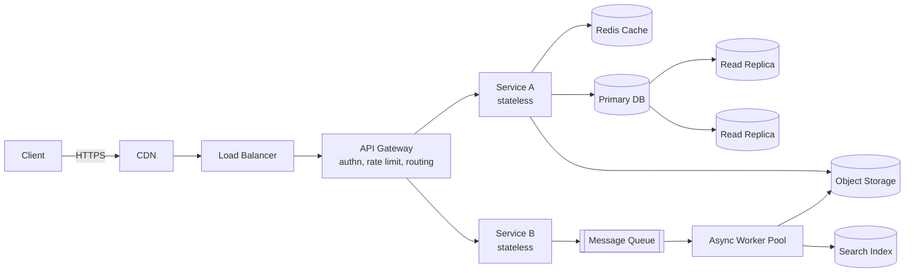
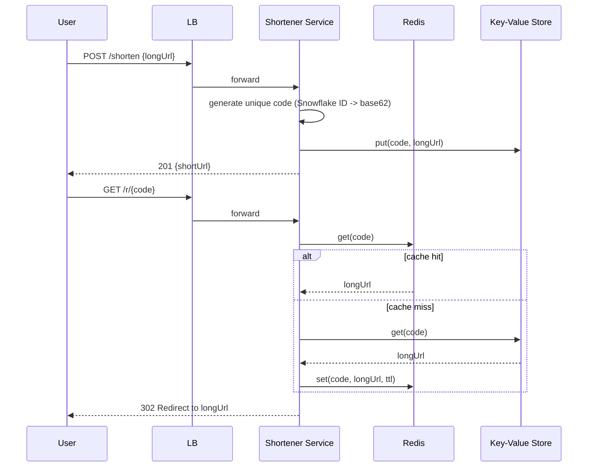
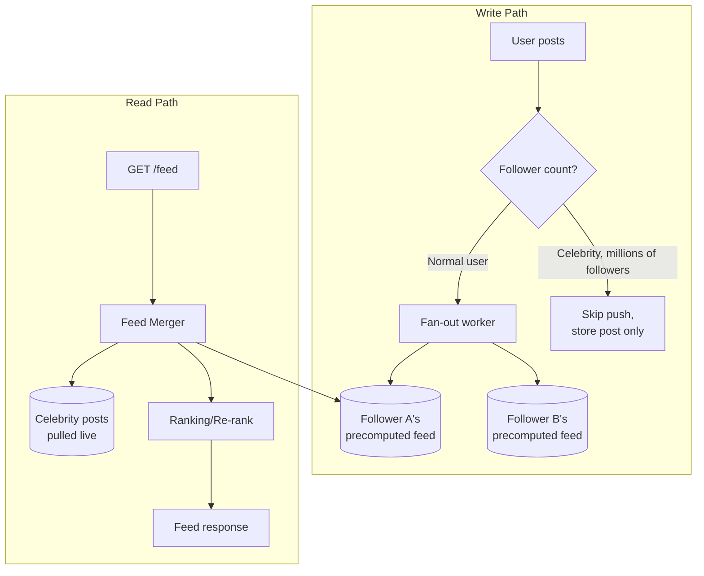
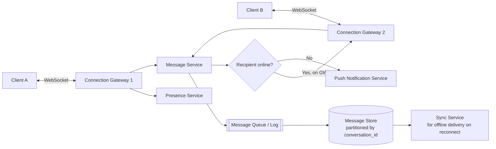
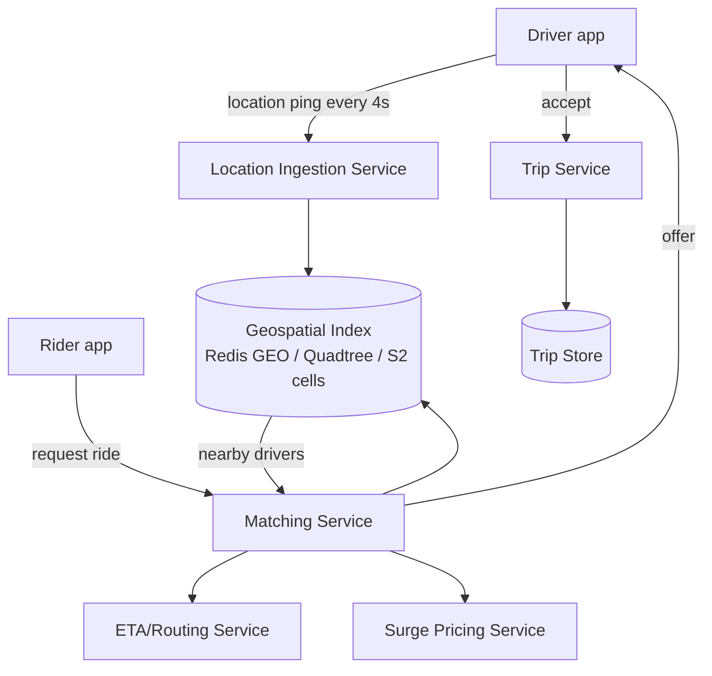
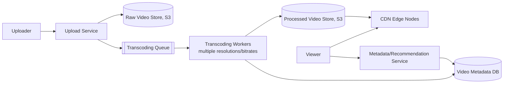
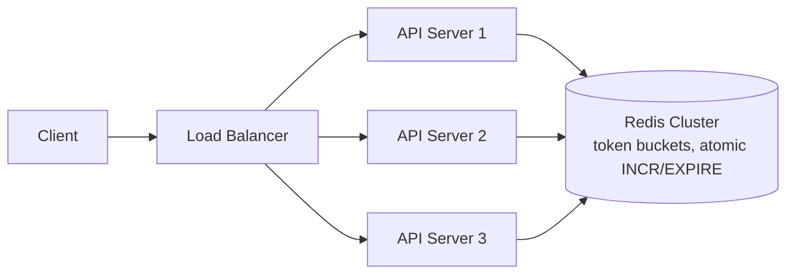

# High-Level Design (HLD) — Expert Interview & Study Guide

## 1. What HLD Interviews Actually Test

HLD (a.k.a. "system design" in the narrower sense) evaluates whether you can turn a vague product ask into a set of services, data stores, and integration points that meet **explicit and implicit non-functional requirements** — scale, latency, availability, consistency, cost. Interviewers are grading your *process* as much as your final diagram: do you clarify scope, quantify load, make tradeoffs explicit, and justify each component?

This document treats **HLD** as "which services/stores/queues exist and how they talk," and defers deep component internals (load balancing algorithms, caching strategies, DB internals, CAP theorem depth) to the companion [System Design & Architecture](system-design-architecture) document — read both together.

**How HLD rounds are graded, concretely** (common rubric shape at senior/staff-level bars):

1. **Requirement clarification (10%)** — did you scope the problem instead of solving an imaginary one?
2. **Estimation (10%)** — can you turn "100M users" into "we need ~12K QPS and 5 shards" with reasonable arithmetic?
3. **API/data model design (15%)** — is the contract precise enough that two teams could build against it independently?
4. **Component architecture (25%)** — right building blocks, right places, no accidental single points of failure.
5. **Deep dive quality (25%)** — when pushed on the hard part of the problem (the thing that makes this prompt interesting, not generic CRUD), do you go deep with real mechanisms, not hand-waving?
6. **Tradeoff articulation (10%)** — do you say "I chose X over Y because Z, which costs us W" unprompted?
7. **Communication (5%)** — structured, checks in with the interviewer, doesn't silently disappear into a monologue.

## 2. The Repeatable HLD Framework

1. **Clarify functional requirements** — list core features explicitly; ask what's out of scope.
2. **Clarify non-functional requirements** — read-heavy or write-heavy? Latency target (p99)? Consistency needs (strong vs eventual)? Expected scale (DAU, QPS, data volume)? Availability target (99.9% vs 99.99%)?
3. **Back-of-envelope estimation** — QPS, storage growth/year, bandwidth. This anchors every later decision (do you need sharding? a CDN? a cache?).
4. **Define the API contract** — 3-6 key endpoints with request/response shape. Forces you to nail down the data model early.
5. **Draw the high-level component diagram** — client → LB → services → data stores → async workers/queues.
6. **Design the data model / schema** at a level deeper than HLD usually gets credit for — table names, key columns, what's indexed, what's partitioned by what.
7. **Deep-dive 2-3 components** the interviewer cares about (usually: the data model/sharding strategy, and one hard problem specific to the prompt — e.g., "how do you rank the feed," "how do you dedupe," "how do you guarantee exactly-once").
8. **Identify bottlenecks and single points of failure**, then address them (replication, caching, queueing, circuit breakers).
9. **Discuss tradeoffs explicitly** — this is the single highest-signal thing you can do. "I chose eventual consistency here because X, at the cost of Y."
10. **Discuss failure modes and monitoring** — what metrics would page you, what does degraded-but-alive look like for this system.

## 3. Estimation Cheat Sheet

| Quantity | Rule of thumb |
|---|---|
| 1 million requests/day | ~12 QPS average, ~3-5x that at peak |
| 100M DAU, 10 requests/user/day | ~1B requests/day → ~11,600 QPS average |
| 1 KB per record, 1B records | ~1 TB raw storage (before replication/indexes) |
| Read:Write ratio for social feeds | often 100:1 to 1000:1 → optimize reads (cache, CDN, read replicas) |
| Network round trip same region | ~0.5-2 ms |
| Network round trip cross-continent | ~100-150 ms |
| SSD random read | ~0.1-0.2 ms |
| Memory access | ~100 ns |
| Replication factor (typical) | 3x (survive 2 node failures with quorum reads/writes) |
| Cache hit ratio target | 90%+ for read-heavy systems with power-law access |

Always state assumptions out loud ("let's assume 500M MAU, 20% DAU, average 5 tweets read per session") — the exact numbers matter less than showing you can reason from them to a design decision (e.g., "at 50K QPS on the read path, a single Postgres primary won't cut it, so we need read replicas + cache").

**Fully worked example — Twitter-scale feed, done end to end:**

- Assume 500M MAU, 200M DAU, average session reads 5 times/day → 1B feed reads/day → ~11,600 QPS average, ~35-40K QPS at peak (3x multiplier for daily traffic curve).
- Assume 200M DAU post at a 1:20 ratio (1 post per 20 reads) → 50M posts/day → ~580 writes/sec average.
- Average post size ~300 bytes text + metadata ≈ 1 KB. 50M posts/day × 1 KB = ~50 GB/day of new post data → ~18 TB/year before replication; ×3 replication ≈ 54 TB/year.
- Precomputed feed: assume each user has ~200 people they follow, feed cache holds the latest 800 post-IDs per user (not full post bodies — just IDs, hydrated at read time) × 8 bytes/ID ≈ 6.4 KB/user × 500M users ≈ 3.2 TB of feed-cache data — this single number is what tells you the precomputed feed needs a horizontally-scaled store like Redis Cluster or Cassandra, not a single Redis box.
- Conclusion chain an interviewer wants to hear: "~40K peak QPS read-heavy at ~70:1 ratio → precompute is worth it for the 99% of normal users; ~3.2TB feed-cache footprint needs a sharded store; ~54TB/year of post data needs a horizontally scalable primary store (Cassandra/DynamoDB) rather than a single Postgres instance." This is estimation *driving* the architecture, not decoration after the fact.

## 4. Core Building Blocks (the vocabulary you assemble diagrams from)

- **Load Balancer** (L4 vs L7, round robin / least-connections / consistent hashing)
- **API Gateway** (auth, rate limiting, routing, request aggregation)
- **Stateless application/service layer** (horizontally scalable)
- **Cache** (Redis/Memcached — read-through, write-through, write-behind, cache-aside)
- **CDN** (static assets, edge caching, geo-distributed reads)
- **Relational DB** (strong consistency, joins, transactions) vs **NoSQL** (horizontal scale, flexible schema, eventual consistency)
- **Message queue / event stream** (Kafka, SQS, RabbitMQ — decoupling, async processing, buffering spikes)
- **Search index** (Elasticsearch — full text, faceted search)
- **Blob/object storage** (S3 — media, backups, data lake)
- **Sharding / partitioning** (by key, range, or consistent hashing) and **replication** (leader-follower, multi-leader, leaderless/quorum)
- **Service discovery**, **circuit breakers**, **rate limiters**, **distributed locks**



## 5. Case Study: Design a URL Shortener

**Functional:** shorten a long URL, redirect short → long, optional custom alias, optional expiry, basic click analytics.
**Non-functional:** read-heavy (100:1 read:write), redirect latency should be near-instant (< 100ms p99), short codes must be unique, high availability > strong consistency for redirects.

**Estimation:** 100M new URLs/month → ~40 writes/sec average. Reads (redirects) at 100x → ~4,000 reads/sec average, spikier in practice (viral links can spike a single key to thousands of QPS — this is a hot-key problem the cache layer must handle, e.g., via local in-process caching in front of Redis for the hottest handful of keys). 7-char base62 code → 62^7 ≈ 3.5 trillion combinations, comfortably enough for years of growth at this rate.

**API contract:**
```
POST /api/v1/shorten
  body: { "longUrl": "https://...", "customAlias"?: "...", "expiresAt"?: "2027-01-01" }
  200: { "shortUrl": "https://sho.rt/aZ3kP9q" }

GET /{code}
  302 Redirect -> Location: <longUrl>
  404 if not found or expired
```

**Data model:**
```
Table: url_mapping
  code           VARCHAR(10)  PRIMARY KEY
  long_url       TEXT         NOT NULL
  created_by     BIGINT
  created_at     TIMESTAMP
  expires_at     TIMESTAMP    NULL
  click_count    BIGINT       DEFAULT 0   -- eventually consistent counter, updated async
```
Access pattern is 100% key-based lookup by `code` — no joins, no range scans needed on the hot path — which is the single fact that justifies a key-value store (DynamoDB/Cassandra) over a relational DB here.

**Key design decisions:**
- **ID generation**: avoid a single auto-increment counter (bottleneck + guessable/enumerable, a security concern too). Options: (a) pre-generate a range of unique IDs per app server (ticket server / range allocation, e.g., server claims IDs 1M-2M, hands them out locally, avoiding a network call per shorten request), (b) hash-based (MD5/SHA of URL + salt, truncate, handle collisions with a retry+salt loop), (c) Snowflake-style distributed ID generator (timestamp + machine ID + sequence) then base62-encode — this is generally the production-grade answer because it's collision-free by construction and roughly time-sortable.
- **Storage**: key-value store (DynamoDB/Cassandra) is a natural fit — access pattern is pure key lookup, no joins needed.
- **Caching**: cache-aside with Redis for hot URLs (power-law distribution — a small fraction of links get most traffic); consider a local (in-process) LRU layer in front of Redis for the handful of extremely hot keys to shave off network hops entirely.
- **Redirect type**: 302 (temporary) lets you change/expire mappings and keeps analytics possible; 301 is cacheable by browsers but loses your ability to track clicks or update the mapping — this is a subtle but frequently-tested tradeoff.
- **Click analytics**: don't synchronously increment a counter in the hot path DB row (write contention on popular links). Instead, emit a lightweight click event to a queue/stream, and aggregate asynchronously (batch update every few seconds, or roll up in a separate analytics store).



**Follow-ups interviewers love:** "How do you shorten under high concurrency without ID collisions?" (pre-allocated ID ranges per server, or distributed sequence generator like Zookeeper/Redis `INCR`). "How do you handle custom aliases colliding with generated codes?" (single namespace, uniqueness constraint, reject or suggest alternative). "How do you purge expired links at scale?" (TTL in the KV store itself if supported, or a background sweep job partitioned by expiry bucket — don't do synchronous checks on every read if avoidable). "How would you prevent someone from enumerating all shortened URLs?" (don't use sequential IDs directly as codes; rate-limit the lookup endpoint; treat `longUrl` as potentially sensitive and don't leak existence via timing differences).

## 6. Case Study: Design a News Feed (Twitter/Instagram-style)

**The central tradeoff: fan-out on write vs fan-out on read.**

- **Fan-out on write (push)**: when a user posts, immediately write the post into every follower's precomputed feed (a list in Redis/Cassandra per user). Read is O(1) — just fetch the precomputed feed. Breaks down for celebrities with millions of followers (a single post triggers millions of writes — "thundering herd" on write).
- **Fan-out on read (pull)**: feed is computed at read time by merging posts from all people you follow. Write is cheap (O(1)). Read is expensive, especially for users following thousands of accounts.
- **Hybrid (what production systems actually do)**: push for regular users, pull for celebrity/high-fan-out accounts, merged at read time. This is the answer that signals real experience.



**Deep dive talking points:** feed ranking (engagement prediction model vs reverse-chronological — mention this is where an ML ranking service plugs in), pagination via cursor (not offset, which breaks under concurrent inserts), storage choice (wide-column store like Cassandra for the precomputed feed — natural fit for "list per user, append-heavy, range scans by time").

**Data model detail interviewers probe:**
```
Table: user_feed (Cassandra-style, partitioned by user_id)
  user_id       PARTITION KEY
  post_id       CLUSTERING KEY (DESC by post timestamp embedded in a Snowflake ID)
  author_id
  inserted_at

Table: posts
  post_id       PARTITION KEY
  author_id
  content
  media_urls
  created_at
```
The feed table stores only `post_id` references, not full post content — hydration (fetching the actual post body/media/like-count) happens in a second batch-get step at read time against the `posts` table (and its own cache). This "store references, hydrate at read" pattern keeps the feed-cache footprint small and lets post content be edited/deleted without rewriting every follower's feed.

## 7. Case Study: Design a Chat/Messaging System (WhatsApp/Slack-style)

Tests real-time delivery, ordering, and offline handling — a different muscle than the mostly-read-path feed/shortener problems.

**Functional:** 1:1 and group messaging, online presence, delivery receipts (sent/delivered/read), offline message delivery, message history/sync across devices.
**Non-functional:** low latency delivery (< 200ms for online recipients), messages must not be lost, ordering must be preserved per-conversation, must scale to billions of messages/day.



**Key design decisions:**
- **Connection layer is stateful** (WebSocket gateways hold long-lived connections) even though the rest of the system is stateless — a `user_id → gateway_instance` mapping (in Redis) lets the Message Service know which gateway node, if any, currently holds a socket to the recipient.
- **Message ordering**: assign each message a monotonically increasing ID *per conversation* (not globally) — e.g., a per-conversation sequence number, or a Snowflake ID which is roughly time-ordered — so clients can detect gaps and request re-sync.
- **Delivery guarantee**: at-least-once from server to client, with client-side dedup by message ID, because "exactly-once" over an unreliable network+client is not achievable in practice (see the tradeoffs section below).
- **Offline delivery**: messages for offline recipients are durably persisted (never solely held in an in-memory queue) and delivered via a sync protocol when the client reconnects (client sends "give me everything after message ID X"), plus a push notification (APNs/FCM) to prompt the user to open the app.
- **Group chat fan-out**: similar push/pull tradeoff as the news feed — small groups fan out directly to each member's active connection; a message store per-conversation (not per-recipient) avoids N-way duplication of the message body itself.
- **Read receipts / typing indicators**: high-frequency, low-durability-requirement events — a good fit for a lighter-weight, possibly lossy channel (don't put "typing..." events through the same durable, ordered pipeline as message content; losing one is harmless).

## 8. Case Study: Design a Ride-Sharing Dispatch System (Uber/Lyft-style)

Tests geospatial indexing and real-time matching under tight latency budgets.



**Key design decisions:**
- **Geospatial indexing**: divide the map into cells (quadtree, geohash, or Google's S2 cells) so "find drivers within 2km" is a lookup of a handful of cells instead of scanning every driver — Redis's `GEOADD`/`GEORADIUS` implements a version of this out of the box for moderate scale; at Uber's actual scale, custom quadtree/S2-based services with in-memory sharded indexes are used.
- **Location update volume dominates the system**: millions of drivers pinging every few seconds is itself a massive write-heavy stream — this typically flows through a queue (Kafka) rather than hitting the index synchronously per ping, with the index updated from consumers.
- **Matching is a race against time**: must return a match in ~1-2 seconds; the matching service queries the geo-index for nearby drivers, filters by availability/vehicle type, ranks by ETA (not just raw distance — traffic matters), and offers to the top candidate with a short accept-timeout before moving to the next.
- **Surge pricing** is computed from the same real-time supply (available drivers in a cell) vs demand (open ride requests in a cell) signal, recalculated on a short interval (e.g., every 1-5 minutes) per geo-cell, not globally.
- **Consistency needs vary wildly by component**: driver location can be a few seconds stale (eventual consistency is fine — the driver is still moving anyway), but "has this ride offer already been accepted by another rider/driver" must be strongly consistent (a distributed lock or a single-writer-per-offer pattern) to avoid double-booking the same driver.

## 9. Case Study: Design a Video Streaming Platform (YouTube/Netflix-style)

Tests the split between a hot, latency-sensitive read path and a heavy, async write/processing pipeline.



**Key design decisions:**
- **Upload and playback are entirely separate pipelines** with different latency budgets — uploads can take minutes to process (transcoding into multiple resolutions/formats for adaptive bitrate streaming), while playback must start in under a second.
- **Adaptive bitrate streaming** (HLS/DASH): video is chunked into short segments (2-10s) at multiple quality levels; the client player switches quality dynamically based on measured bandwidth — this is why "transcode into 5 different resolutions" is a core, non-optional part of the pipeline, not an optimization.
- **CDN is not optional at this scale** — nearly all bytes served are static video segments, the textbook CDN use case; origin (S3) is only hit on a CDN cache miss (first request for a segment in a region).
- **Metadata (views, likes, recommendations) is decoupled from the video bytes themselves** — a separate service/DB, updated asynchronously, so a spike in "like" button clicks never competes with video byte-serving for capacity.
- **Storage cost tradeoff**: storing every resolution forever is expensive; production systems often transcode top resolutions eagerly and lower/rare ones lazily (on first request) or evict rarely-watched high-res variants, regenerating on demand — a cost/latency tradeoff worth naming explicitly.

## 10. Consistency, Availability, and the Tradeoffs You Must Name

- **CAP theorem**: under a network partition, choose Consistency or Availability (Partition tolerance is not optional in a distributed system). Say this precisely — CAP is about behavior *during a partition*, not a permanent three-way choice.
- **PACELC** (more useful in interviews): even without a partition (Else), you trade Latency for Consistency. This is the framework that explains why systems like DynamoDB default to eventual consistency even when healthy — it's faster.
- **Strong consistency** where correctness must be exact (payments, inventory decrement, seat booking).
- **Eventual consistency** where staleness is acceptable for a latency/availability win (social feed like counts, view counts, recommendations).
- **Idempotency**: any HLD involving retries (and all distributed systems need retries) must design idempotent writes — idempotency keys on payment/order APIs, `UPSERT` semantics, dedup on message consumption.

## 11. Case Study: Design a Distributed Rate Limiter (HLD level)

Where the LLD document covers the algorithm (token bucket, sliding window), HLD cares about **where the shared state lives when you have N stateless API servers behind a load balancer.**



Key point: local in-memory counters per server don't work once you scale horizontally (each server only sees its own slice of traffic). Centralize counters in Redis using atomic operations (`INCR` + `EXPIRE`, or a Lua script for atomicity across multiple keys), or push rate limiting to the edge (API Gateway / CDN layer) so it's enforced before requests even reach app servers. Mention the failure mode: if Redis is down, decide fail-open (allow all — risk overload) vs fail-closed (block all — risk false denial), and that this decision is a product/business call, not just an engineering one.

## 12. Failure Modes, Resilience, and Observability (the section most candidates skip)

- **Single points of failure**: any component with exactly one instance is one — a single DB primary, a single message broker node, a single-region deployment. For each, name the mitigation (replica + automated failover, clustered broker, multi-AZ deployment).
- **Cascading failures**: a slow downstream dependency exhausts caller thread pools/connections, which then makes the caller slow to *its* callers, and the failure propagates upward. Mitigate with timeouts (always set them — an unbounded timeout is a bug), circuit breakers, and bulkheads (isolate resource pools per dependency so one slow dependency can't starve calls to a healthy one).
- **Thundering herd**: many clients retry simultaneously after a failure (e.g., a cache expires and every request stampedes the DB at once). Mitigate with jittered exponential backoff, request coalescing (only one in-flight request per key refills the cache, others wait on it), and staggered TTLs.
- **Graceful degradation**: define what "degraded but alive" looks like per system — serve stale cached data, disable a non-critical feature (recommendations), return a simplified response — rather than a binary up/down.
- **Observability**: the "four golden signals" — latency, traffic, errors, saturation. In an interview, naming what you'd alert on (e.g., "p99 redirect latency > 200ms," "cache hit ratio < 80%," "queue depth growing unboundedly") is a strong senior-level signal that's rarely asked for explicitly but always rewarded.
- **Backpressure**: when a downstream consumer can't keep up, the system needs an explicit strategy — buffer (queue, bounded!), drop (shed load, acceptable for non-critical telemetry), or slow the producer (reactive streams, TCP-style flow control) — an unbounded queue is not a strategy, it's a delayed outage.

## 13. Common HLD Interview Prompts to Practice

URL shortener, news feed, chat system (WhatsApp/Slack), rate limiter, notification system, ride-sharing dispatch (Uber), video streaming (YouTube/Netflix), e-commerce checkout/inventory, distributed cache, search autocomplete/typeahead, web crawler, payment processing system, collaborative document editing (Google Docs — OT/CRDT), distributed job scheduler, API rate-limited third-party integration proxy, ad click aggregation/analytics pipeline.

## 14. Interview Questions & Answers

**Q1. Walk me through how you'd approach any system design question in the first 5 minutes.**
A: Clarify functional scope and explicitly state what's out of scope; ask about scale (users, QPS, data size) and non-functional priorities (consistency vs availability, latency target); do a quick back-of-envelope calculation to know if this is a "single server" problem or a "must shard" problem; then sketch the API contract before drawing boxes — the API shape usually reveals the data model, which drives everything else.

**Q2. Explain CAP theorem and why "we chose CA" is usually a wrong answer.**
A: CAP says that during a network partition, a distributed system must choose between Consistency (every read sees the latest write) and Availability (every request gets a response, possibly stale). "CA" implies no partition tolerance, which isn't a real option for any system spanning more than one node/data center — partitions will happen. The real-world answer is "we chose CP for the payments service and AP for the feed service," i.e., the choice is made per-component based on what each actually needs, not once for the whole system.

**Q3. When would you choose SQL over NoSQL for a new service, even at scale?**
A: When the data has strong relational structure requiring multi-row/multi-table transactions (e.g., an order + its line items + inventory decrement must commit atomically), when you need flexible ad-hoc queries/joins, or when the write volume is within what a well-tuned relational DB with read replicas and partitioning (e.g., Postgres with Citus, or Vitess for MySQL) can handle — which is a lot higher than people assume. NoSQL wins when the access pattern is simple key-based lookup at massive scale, schema is naturally flexible/evolving, or you need multi-region active-active writes with automatic conflict resolution.

**Q4. How do you design a system to handle a traffic spike 10x normal load without falling over?**
A: Queue-based load leveling (absorb bursts in a queue, process at a sustainable rate — protects downstream stores), autoscaling with pre-warmed capacity if the spike is predictable (e.g., a sale event), aggressive caching and CDN offload to shrink the load that reaches origin, circuit breakers and graceful degradation (serve stale/cached data or a reduced feature set rather than failing entirely), and load shedding/rate limiting at the edge so the system fails predictably for a subset of requests rather than catastrophically for all.

**Q5. Explain fan-out on write vs fan-out on read and how you'd decide between them for a given feature.**
A: Fan-out on write precomputes and pushes data to every consumer at write time — cheap, fast reads, expensive/bursty writes, breaks down when one writer has a huge number of consumers (celebrity problem). Fan-out on read computes the result at read time by pulling from sources — cheap writes, expensive reads, especially as the number of sources per reader grows. Decide based on the read:write ratio and the fan-out skew: uniform, moderate fan-out favors push; highly skewed fan-out (a few "hot" producers with huge audiences) favors a hybrid — push for most, pull-and-merge for the hot few.

**Q6. How do you design idempotency into a payment API?**
A: Require the client to generate and send a unique idempotency key per logical operation (e.g., a UUID generated once per checkout attempt, reused on retries). The server stores the key with the operation's result; on a retried request with the same key, it returns the stored result instead of re-executing the charge. The key/result pair needs a TTL and must be checked-and-set atomically (unique constraint in the DB, or a distributed lock) to avoid a race where two retries both pass the "not seen before" check simultaneously.

**Q7. What's the difference between a message queue and an event stream (e.g., SQS vs Kafka), and when do you pick one over the other?**
A: A queue (SQS/RabbitMQ) is typically consumed once and removed — good for task distribution/work queues where each message represents one unit of work for exactly one consumer group. An event stream (Kafka) retains events for a configurable window and supports multiple independent consumer groups replaying the same log at their own pace — good when multiple services need the same events for different purposes (analytics, audit, triggering downstream workflows) and when you need ordered, replayable history. Pick a queue for simple task offloading; pick a stream when multiple consumers need the same events or you need replay/audit.

**Q8. How would you shard a database that's outgrown a single instance, and what breaks when you do?**
A: Choose a shard key with high cardinality and access patterns that stay local to one shard (e.g., `user_id` for a per-user data model) — avoid hot keys. Options: range-based (simple, but risks hot shards for sequential keys/time-series), hash-based (even distribution, but range queries become cross-shard), or consistent hashing (minimizes reshuffling when adding/removing shards). What breaks: cross-shard joins and transactions become expensive or impossible without a distributed transaction protocol (2PC/Saga); auto-increment IDs no longer work globally (need a distributed ID generator); "show me all X" aggregate queries need scatter-gather or a separate analytics store.

**Q9. How do you keep a cache consistent with the database?**
A: Most common: cache-aside (read: check cache, on miss read DB and populate cache; write: update DB, then invalidate — not update — the cache entry to avoid races) with a TTL as a safety net against missed invalidations. Write-through (write to cache and DB synchronously) keeps them in lockstep but adds write latency. Write-behind (write to cache, async flush to DB) is fastest but risks data loss on cache failure before flush. For invalidation correctness under concurrent writes, prefer deleting the cache key over updating it (delete is idempotent and avoids stale overwrites from out-of-order writes).

**Q10. How do you handle exactly-once processing when your infrastructure only guarantees at-least-once delivery?**
A: True exactly-once delivery across a network is effectively impossible to guarantee end-to-end; the practical answer is at-least-once delivery + idempotent processing = effectively-once outcome. Techniques: dedup using a message ID stored in the consumer's processed-set (DB unique constraint or a dedup cache with TTL matching the max possible redelivery window), designing writes to be naturally idempotent (`UPSERT` instead of `INSERT`, `SET balance = X` instead of `balance += X` where feasible), and using transactional outbox patterns to atomically commit a DB write with the corresponding event publish.

**Q11. Design a notification system that needs to reach a user across email, SMS, and push, at scale, without duplicate sends.**
A: Producer services emit a `NotificationRequested` event to a queue rather than calling providers directly (decoupling + retry safety). A notification service consumes the event, resolves the user's channel preferences, dedups using an idempotency key (e.g., `eventId + channel`) stored with a TTL, and dispatches to per-channel worker pools (email/SMS/push have very different rate limits and failure modes, so isolate them so one channel's outage doesn't back up the others). Failed sends go through a retry-with-backoff and eventually a dead-letter queue for manual/alerted investigation. Rate limit per user to avoid notification storms.

**Q12. How would you design for multi-region availability, and what's the hardest part?**
A: Serve reads from the nearest region via geo-DNS/anycast and regional read replicas or a multi-region database (e.g., DynamoDB Global Tables, Spanner). The hardest part is writes: either pick one region as the write leader (simpler, but adds latency for far regions and creates a single point of failure for writes) or allow multi-region writes and resolve conflicts (last-write-wins, CRDTs, or application-level merge logic) — which reintroduces the CAP tradeoff at global scale. Also account for data residency/compliance constraints (GDPR) that may force certain data to stay in-region regardless of the technical design.

**Q13. What's a circuit breaker and why is it a HLD-level concern, not just a library detail?**
A: A circuit breaker stops calling a failing downstream dependency after a failure threshold, "opens" and fails fast (or falls back) for a cooldown period, then allows a trial request to check recovery ("half-open") before fully closing again. It's an HLD concern because it changes system-level behavior under partial failure — without it, one slow/broken downstream service can exhaust caller thread pools/connections and cascade the outage upstream ("cascading failure"), turning a single component's problem into a full-system outage. Deciding where breakers sit (service mesh, API gateway, per-client library) and what the fallback behavior is (cached data? degraded feature? error?) is an architecture decision.

**Q14. How do you design pagination for a feed that's constantly being written to, at scale?**
A: Avoid offset-based pagination (`LIMIT 20 OFFSET 1000`) — it gets slower as offset grows and produces duplicates/skips when rows are inserted between page fetches. Use cursor-based pagination: the client passes an opaque cursor (typically an encoded timestamp + ID from the last item seen), and the query fetches "items older than this cursor," which stays O(page size) regardless of position and is stable under concurrent inserts.

**Q15. How do you decide the right database for a given workload in an interview, quickly?**
A: Ask (mentally): what's the access pattern — key lookup, range scan, full-text search, graph traversal, time-series, or complex joins? What's the consistency requirement — must every read see the latest write? What's the write pattern — steady, bursty, append-only? Then match: key lookup at scale → DynamoDB/Cassandra; relational integrity + transactions → Postgres/MySQL (+ sharding tool if needed); full-text/search → Elasticsearch; time-series metrics → TimescaleDB/InfluxDB/Prometheus; graph relationships → Neo4j; blobs/media → S3. Naming the access pattern first, then the store, signals real judgment rather than a memorized "use Redis for everything" answer.

**Q16. In the ride-sharing dispatch design, why is driver location updated via a queue instead of writing directly to the geospatial index?**
A: Millions of drivers pinging their location every few seconds is itself a massive, continuous write stream — pushing that directly and synchronously into the index would make the index the bottleneck for the entire system and couples the availability of location ingestion to the availability of the index. Routing pings through a queue (Kafka) decouples ingestion rate from index-update rate, lets you buffer/absorb bursts, allows multiple downstream consumers (the geo-index updater, but also analytics or fraud-detection consumers) to process the same stream independently, and lets you replay/recover if the index needs to be rebuilt.

**Q17. Why does the chat system design use per-conversation sequence numbers instead of a single global message ID sequence?**
A: A single global sequence number requires every message-send anywhere in the system to coordinate through one shared counter, creating a bottleneck and a single point of contention at massive scale. Per-conversation sequencing only requires ordering guarantees *within* a conversation (which is the actual user-facing requirement — nobody cares if their message ID is globally ordered relative to a stranger's unrelated chat), so each conversation's counter can be maintained independently and in parallel, which is far more horizontally scalable while still satisfying the real ordering requirement.

**Q18. In the video streaming design, why is upload processing (transcoding) fully decoupled from playback, and what would happen if it weren't?**
A: Upload/transcoding is CPU-heavy, can take minutes, and has a relaxed latency requirement (a creator expects "processing," not instant availability). Playback needs to start in under a second and serve enormous read fan-out via CDN. If these shared infrastructure directly (e.g., transcoding workers also served playback requests), a burst of uploads would degrade playback latency for unrelated viewers, and vice versa — a viral video causing a playback traffic spike would compete for the same compute as unrelated ongoing transcodes. Decoupling via a queue and separate worker pools means each path can scale and fail independently.

**Q19. How would you evolve a single-region monolith with one Postgres database into the sharded, multi-region design typical of an HLD interview answer — what's the realistic order of steps?**
A: (1) Extract read traffic to replicas first — cheapest win, no data-model change, addresses read scaling immediately. (2) Introduce caching (cache-aside) for the hottest read paths to cut DB load further. (3) Only once vertical scaling and replicas are genuinely insufficient, shard the primary — pick a shard key aligned to the dominant access pattern, and expect to rewrite queries that previously joined across what are now shard boundaries. (4) Introduce async processing (queue + workers) to move non-critical-path work (emails, analytics, search indexing) off the request path. (5) Multi-region only after single-region is solid — it multiplies operational complexity (conflict resolution, data residency, latency-vs-consistency tradeoffs) and should be justified by an actual requirement (global user base, regulatory, disaster recovery), not done preemptively. Naming this order, rather than jumping straight to "shard everything and go multi-region," is what signals real production experience over interview-prep memorization.

**Q20. What's the difference between horizontal and vertical scaling, and where does each hit a wall?**
A: Vertical scaling (bigger machine — more CPU/RAM/faster disk) is simple, requires no application changes, but hits a hard ceiling (largest available instance size) and creates a single point of failure with no redundancy. Horizontal scaling (more machines) has no practical ceiling and adds redundancy for free, but requires the application to be designed for it — statelessness in app servers, a data layer that supports partitioning/replication, and coordination mechanisms (load balancing, service discovery, distributed locks) that a single-machine design never needed. Interview signal: know that vertical scaling is a legitimate first move for a startup-scale system, not something to skip past to look impressive.

**Q21. How would you design the "search autocomplete/typeahead" feature for a product like Google or Amazon search?**
A: Core data structure is a **Trie** (prefix tree) mapping prefixes to the top-K most likely completions, precomputed offline from historical query logs/frequency (not computed live per keystroke). The trie (or a flattened, serialized version of it) is small enough to be cached entirely in memory per shard, sharded by prefix range if it doesn't fit on one node, and served from edge/CDN-adjacent locations for sub-50ms latency since this fires on every keystroke. Personalization (recent searches, location) is layered on top of the base global suggestions at request time rather than baked into the precomputed trie, keeping the expensive precomputation global and reusable across users while personalization stays a cheap, small overlay.

**Q22. In a collaborative document editor (Google Docs-style), what's the core technical challenge and how is it typically solved?**
A: The challenge is merging concurrent edits from multiple users editing the same region of a document without conflicts or lost updates, while keeping every client's view eventually consistent and preserving user intent. Two established approaches: **Operational Transformation (OT)** — transform each incoming operation against concurrently applied operations so it can still be applied correctly regardless of arrival order (what Google Docs historically used) — requires a central server to sequence operations. **CRDTs (Conflict-free Replicated Data Types)** — design the data structure itself (e.g., a sequence CRDT for text) so that concurrent operations commute and merge deterministically without needing a central sequencer, enabling true peer-to-peer or offline-first editing. OT is generally more complex to implement correctly but was historically more mature; CRDTs are increasingly favored for offline-first and decentralized collaboration apps.

**Q23. Your interviewer says "the cache is down, what happens now?" How do you answer well?**
A: Don't say "the system goes down" — that's a design flaw to fix, not a fact to accept. A well-designed system treats the cache as a performance optimization, not a dependency for correctness: on cache unavailability, requests fall through to the database directly (with a circuit breaker to stop hammering a possibly-struggling DB, and a timeout so cache calls fail fast rather than hanging), throughput/latency degrades (this is where you'd expect a paging alert on elevated latency and DB load) but the system stays functionally correct and available, just slower — and you'd have autoscaling/capacity headroom on the DB tier sized to survive exactly this scenario for the expected MTTR of the cache.

**Q24. How do you approach estimating storage growth over multiple years for capacity planning, and why does it matter in an interview?**
A: Compute year-1 storage from your write-QPS estimate × average record size × seconds/year, then apply a growth multiplier if user/traffic growth is expected (e.g., 50% YoY), and always multiply by the replication factor (commonly 3x) since raw and stored-with-redundancy are very different numbers. It matters because it's the number that determines whether "a single well-provisioned database" is even in the realm of plausibility for years 1-3, or whether the design needs sharding from day one — naming the actual number (not just "it'll be big") is what separates estimation theater from estimation that drives a decision.

**Q25. How would you design an ad click aggregation / analytics pipeline that needs to count billions of events per day accurately for billing purposes?**
A: Ingest raw click events into a durable, ordered log (Kafka) immediately at the edge — this is the source of truth and enables replay if downstream aggregation has a bug. A stream-processing layer (Flink/Spark Streaming/Kafka Streams) aggregates counts in windows (e.g., per-minute, per-hour rollups) with exactly-once processing semantics (checkpointing + idempotent sinks) since billing accuracy makes "effectively-once" non-negotiable here unlike a "like count" which can tolerate minor drift. Raw events are also archived to cold storage (S3) for reprocessing/audits and for handling late-arriving events (watermarking with a bounded lateness window, after which late events either get dropped or trigger a correction record rather than silently corrupting an already-closed window). Serve pre-aggregated rollups from a fast OLAP store (e.g., a columnar warehouse) rather than querying raw events for every dashboard/billing request.
