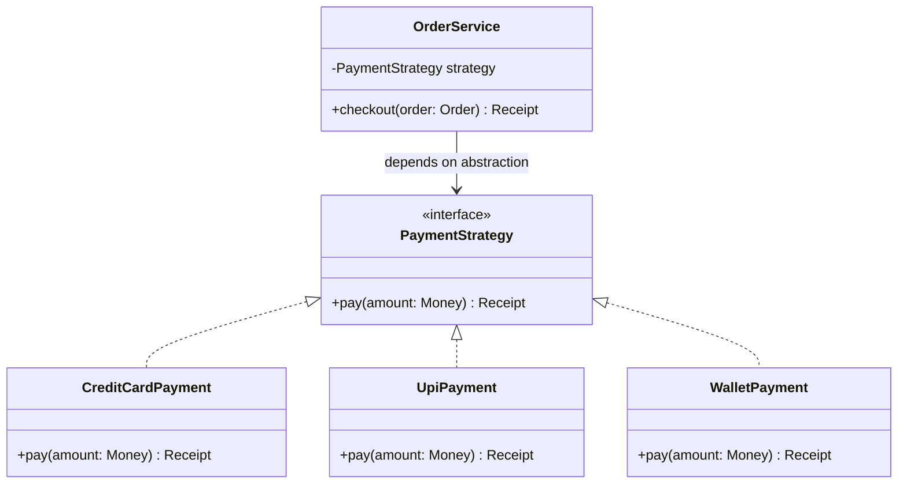
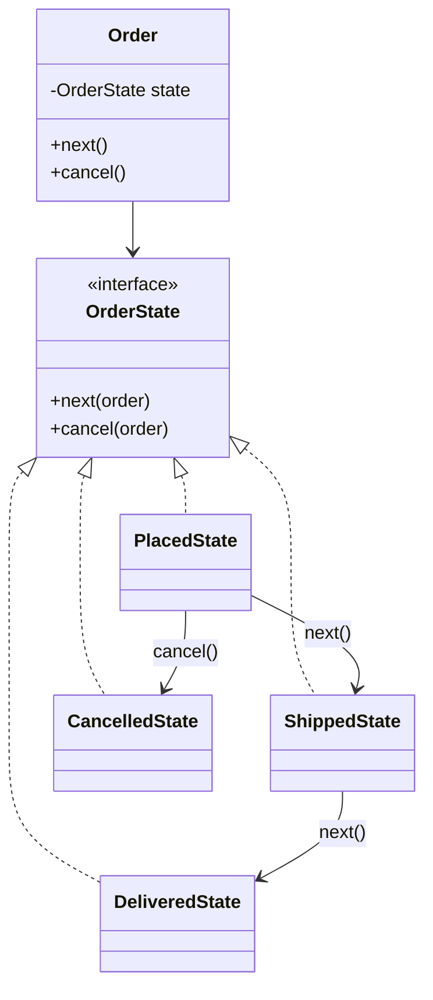
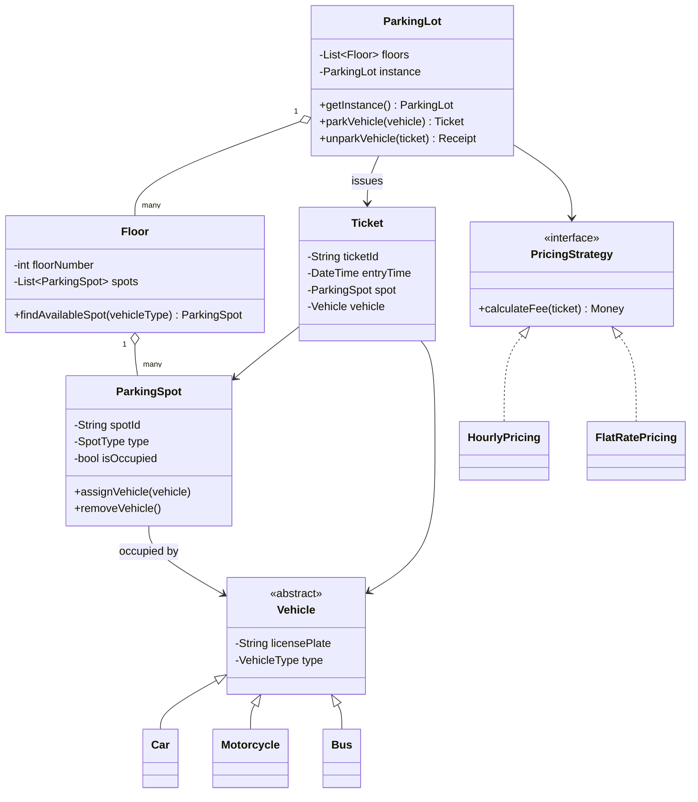
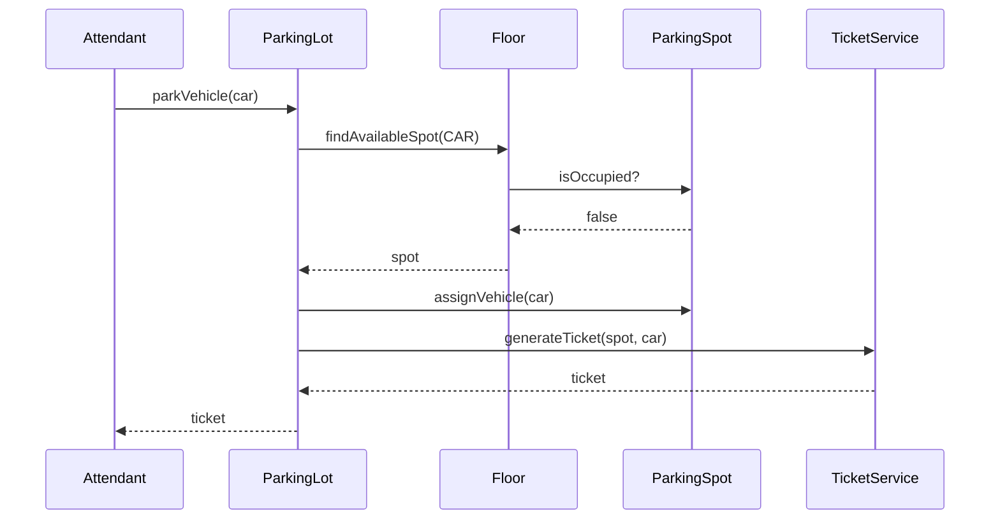
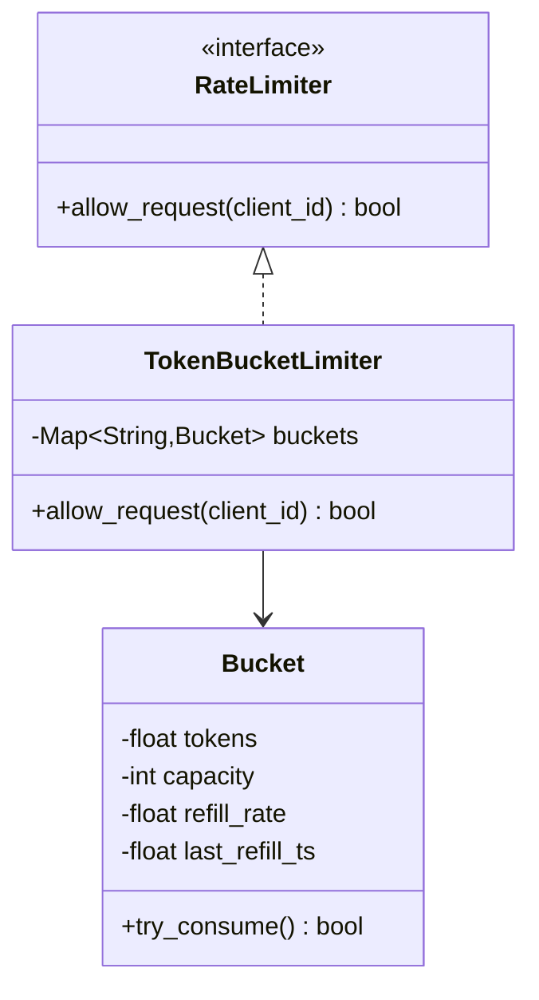
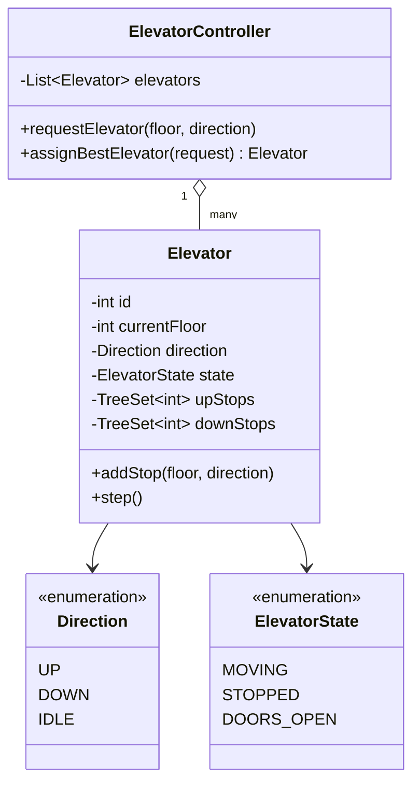
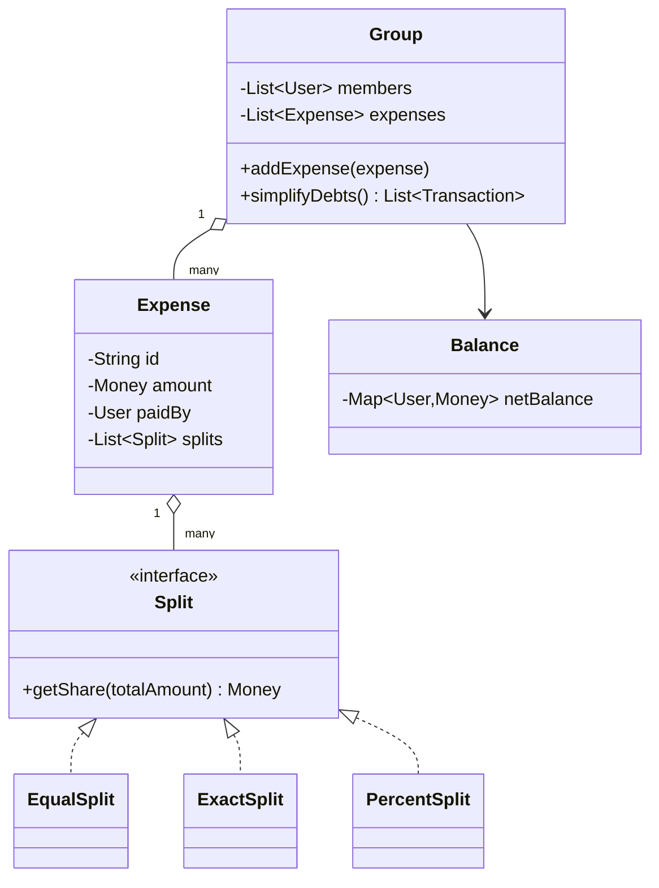
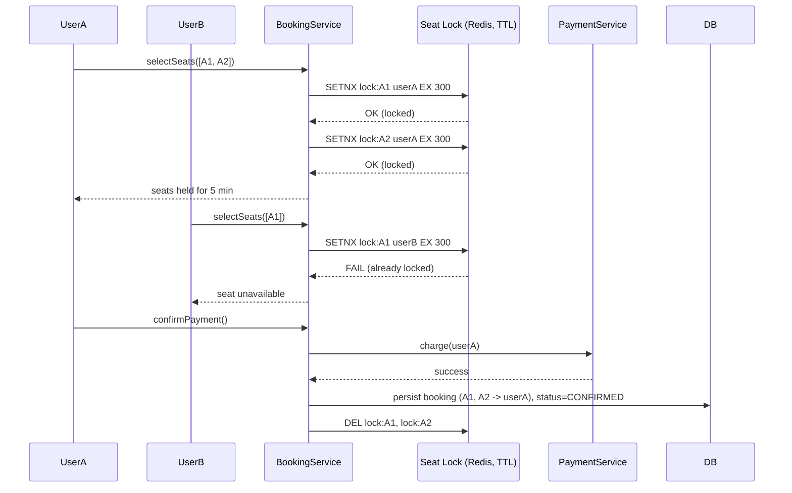

# Low-Level Design (LLD) — Expert Interview & Study Guide

## 1. What LLD Actually Is

Low-Level Design is the bridge between "what the system should do" (requirements, HLD) and "what code gets written." It answers:

- What classes/modules exist, and what does each one own?
- What are the relationships between them (composition, inheritance, association)?
- What are the interfaces/contracts between components?
- How do responsibilities get distributed so the system stays extensible without becoming a spaghetti of `if/else`?

Interviewers use LLD rounds to test **object-oriented thinking under ambiguity** — not whether you know the GoF pattern names by rote, but whether you can take a fuzzy prompt ("design a parking lot"), extract entities and behaviors, and produce a class model that survives a few "what if we now need X" follow-ups, and then **write real, compiling, edge-case-aware code** for at least one core piece of it.

**LLD vs HLD, concretely:**

| | HLD | LLD |
|---|---|---|
| Question | Which services/DBs/queues exist, how do they talk? | Which classes/functions exist, how do they call each other? |
| Output | Architecture diagram, API contracts, tech choices | Class diagrams, sequence diagrams, interfaces, DB schema (table/column level), working code |
| Interview signal | System thinking, scaling, tradeoffs | OOP fundamentals, SOLID, patterns, extensibility, correctness, concurrency |
| Typical duration | 45-60 min, diagram-heavy | 45-60 min, ~50% whiteboard design + ~50% live coding |

**How LLD rounds are actually graded**, based on common rubrics used at FAANG-tier companies:

1. **Requirement gathering (10%)** — did you ask clarifying questions instead of assuming?
2. **Entity/class identification (20%)** — right nouns become classes, right verbs become methods, no god classes.
3. **Relationships & OOP correctness (20%)** — composition vs aggregation vs inheritance used correctly; SOLID respected.
4. **Pattern application (15%)** — patterns used because they fit, not shoehorned in to show off.
5. **Code quality (20%)** — compiles/runs mentally, handles edge cases (null, empty, concurrent access, capacity limits), uses appropriate data structures for the complexity budget.
6. **Extensibility discussion (10%)** — you can answer "how would this change if we added X" without a redesign.
7. **Communication (5%)** — you narrate tradeoffs as you go, not just at the end.

## 2. SOLID — The Foundation Interviewers Actually Probe

**S — Single Responsibility Principle.** A class should have one reason to change. Classic violation: an `Order` class that also formats an invoice PDF and sends emails. Split into `Order`, `InvoiceFormatter`, `NotificationService`.

**O — Open/Closed Principle.** Open for extension, closed for modification. Instead of a `switch` on `paymentType` inside `processPayment`, define a `PaymentStrategy` interface and add new payment types as new classes.

**L — Liskov Substitution Principle.** Subtypes must be substitutable for their base type without breaking correctness. Classic violation: `Square extends Rectangle` overriding `setWidth`/`setHeight` in a way that breaks callers who assume independent width/height.

**I — Interface Segregation Principle.** Don't force clients to depend on methods they don't use. A fat `Worker` interface with `work()` and `eat()` breaks `RobotWorker`. Split into `Workable` and `Eatable`.

**D — Dependency Inversion Principle.** High-level modules shouldn't depend on low-level modules; both depend on abstractions. `OrderService` should depend on a `PaymentGateway` interface, not a concrete `StripeGateway`, and get the concrete instance injected.



This single diagram demonstrates O, L, I, and D simultaneously — which is exactly why "design a payment system with multiple payment methods" is such a common warm-up prompt.

**Worked code — the same example, in Python, showing DIP done correctly via constructor injection:**

```python
from abc import ABC, abstractmethod
from dataclasses import dataclass

@dataclass(frozen=True)
class Money:
    amount: int  # store cents/paise as int, never float, for currency
    currency: str = "INR"

@dataclass(frozen=True)
class Receipt:
    transaction_id: str
    status: str

class PaymentStrategy(ABC):
    @abstractmethod
    def pay(self, amount: Money) -> Receipt: ...

class UpiPayment(PaymentStrategy):
    def __init__(self, vpa: str):
        self.vpa = vpa

    def pay(self, amount: Money) -> Receipt:
        # call UPI gateway SDK here
        return Receipt(transaction_id="upi_123", status="SUCCESS")

class CreditCardPayment(PaymentStrategy):
    def __init__(self, card_token: str):
        self.card_token = card_token

    def pay(self, amount: Money) -> Receipt:
        return Receipt(transaction_id="cc_456", status="SUCCESS")

class OrderService:
    # depends on the abstraction, injected at construction — never
    # instantiates a concrete gateway itself. This is what makes
    # OrderService trivially unit-testable with a FakePaymentStrategy.
    def __init__(self, strategy: PaymentStrategy):
        self.strategy = strategy

    def checkout(self, amount: Money) -> Receipt:
        if amount.amount <= 0:
            raise ValueError("amount must be positive")
        return self.strategy.pay(amount)
```

## 3. Design Patterns — Intent, Code, and When Interviewers Expect Them

Group by intent, not by memorizing all 23 GoF patterns — interviewers care that you reach for the *right* one, not that you can recite the catalog. Each pattern below includes the **signal phrase** that should trigger it in your head during an interview.

### Creational

**Factory Method** — signal: "the exact subclass to create depends on a runtime value." Delegate creation to a factory instead of scattering `new X()` / `X()` calls and `if/elif` chains across the codebase.

```python
class NotificationFactory:
    _registry = {}

    @classmethod
    def register(cls, channel, ctor):
        cls._registry[channel] = ctor

    @classmethod
    def create(cls, channel: str):
        if channel not in cls._registry:
            raise ValueError(f"unknown channel: {channel}")
        return cls._registry[channel]()
```

**Abstract Factory** — signal: "families of related objects that must stay consistent with each other." E.g., a `UIFactory` producing matching `Button`/`Checkbox` for a light theme vs a dark theme — you never want a light `Button` paired with a dark `Checkbox`.

**Builder** — signal: "a constructor with more than ~4 parameters, several of them optional." Prefer over telescoping constructors or a giant config dict with no validation.

```python
class HttpRequestBuilder:
    def __init__(self):
        self._method = "GET"
        self._headers = {}
        self._body = None

    def method(self, m):
        self._method = m
        return self

    def header(self, k, v):
        self._headers[k] = v
        return self

    def body(self, b):
        self._body = b
        return self

    def build(self):
        if self._method in ("POST", "PUT") and self._body is None:
            raise ValueError(f"{self._method} requires a body")
        return HttpRequest(self._method, self._headers, self._body)

# request = HttpRequestBuilder().method("POST").header("Content-Type", "application/json").body(payload).build()
```

**Singleton** — signal: "exactly one instance must exist for the process lifetime" (connection pool, logger, config loader). Know how to make it thread-safe, and know the interviewer wants to hear you flag the testability cost.

### Structural

- **Adapter** — translate one interface into another the client expects (wrapping a legacy `XmlPaymentGateway` behind your `PaymentStrategy` interface).
- **Decorator** — add behavior dynamically without subclassing explosion (`CoffeeWithMilk`, `CoffeeWithSugar` wrapping a `Coffee`; Java I/O streams; Python function decorators are a real-world instance of this pattern).
- **Facade** — a simple interface over a complex subsystem (`OrderFacade.placeOrder()` internally calling inventory, payment, shipping).
- **Composite** — treat individual objects and compositions uniformly (filesystem `File`/`Directory`, org chart, UI component trees).
- **Proxy** — control access to an object (lazy loading, access control, caching, remote proxy — e.g., an ORM's lazy-loaded relationship is a Proxy).

```python
# Decorator, applied to the coffee-shop classic but written the way it'd
# actually show up: pricing composed from independent add-ons.
class Beverage(ABC):
    @abstractmethod
    def cost(self) -> int: ...
    @abstractmethod
    def description(self) -> str: ...

class Espresso(Beverage):
    def cost(self): return 150
    def description(self): return "Espresso"

class AddOnDecorator(Beverage):
    def __init__(self, wrapped: Beverage):
        self._wrapped = wrapped

class WithMilk(AddOnDecorator):
    def cost(self): return self._wrapped.cost() + 30
    def description(self): return self._wrapped.description() + " + Milk"

class WithExtraShot(AddOnDecorator):
    def cost(self): return self._wrapped.cost() + 50
    def description(self): return self._wrapped.description() + " + Extra Shot"

# drink = WithExtraShot(WithMilk(Espresso()))
# drink.cost() -> 230, avoiding a MilkExtraShotEspresso subclass
```

### Behavioral

- **Strategy** — interchangeable algorithms (payment methods, sorting strategies, pricing rules, spot-allocation policies).
- **Observer** — pub/sub within a process (`StockTicker` notifying `Display` subscribers). Foundation of event-driven UI and reactive systems.
- **State** — object behavior changes with internal state (`Order`: `Placed → Shipped → Delivered → Cancelled`, each state class controlling allowed transitions).
- **Command** — encapsulate a request as an object (undo/redo, job queues, remote procedure invocation, macro recording).
- **Chain of Responsibility** — pass a request along a chain until handled (middleware pipelines, approval workflows, logging levels, input validation pipelines).
- **Template Method** — skeleton algorithm in a base class, steps overridden by subclasses (`DataExporter.export()` calling `fetch_data()`, `format()`, `write()` where subclasses override `format()`).
- **Visitor** — add operations to a class hierarchy without modifying it (AST traversal in a compiler, computing different reports over the same object tree).
- **Mediator** — centralize how a set of objects interact instead of each referencing every other (air traffic control tower pattern; chat room routing messages between users without users knowing about each other directly).
- **Memento** — capture and restore an object's internal state without violating encapsulation (undo stacks, save/checkpoint systems).



```python
class OrderState(ABC):
    @abstractmethod
    def next(self, order: "Order"): ...
    @abstractmethod
    def cancel(self, order: "Order"): ...

class PlacedState(OrderState):
    def next(self, order):
        order.state = ShippedState()
    def cancel(self, order):
        order.state = CancelledState()

class ShippedState(OrderState):
    def next(self, order):
        order.state = DeliveredState()
    def cancel(self, order):
        raise IllegalStateTransition("cannot cancel a shipped order")

class DeliveredState(OrderState):
    def next(self, order):
        raise IllegalStateTransition("order already delivered")
    def cancel(self, order):
        raise IllegalStateTransition("cannot cancel a delivered order")

class CancelledState(OrderState):
    def next(self, order):
        raise IllegalStateTransition("order is cancelled")
    def cancel(self, order):
        pass  # already cancelled, idempotent no-op

class Order:
    def __init__(self):
        self.state: OrderState = PlacedState()
    def next(self):
        self.state.next(self)
    def cancel(self):
        self.state.cancel(self)
```

Notice the State pattern is *doing the validation for you* — illegal transitions become impossible to represent instead of being checked with scattered `if order.status == "shipped": raise ...` guards. This is the exact kind of detail that separates a senior answer from a junior one.

## 4. The Repeatable LLD Process (use this in every interview)

1. **Clarify scope** — list explicit requirements and *explicitly out-of-scope* items. ("Should this support multiple parking floors? Multiple vehicle types? Payment? Multiple attendants concurrently?")
2. **Identify actors and use cases** — who interacts with the system, and how (draw a quick use-case list, not necessarily a formal UML use-case diagram).
3. **Identify nouns → candidate classes**, verbs → candidate methods.
4. **Define relationships** — inheritance ("is-a"), composition ("owns, dies with parent"), aggregation ("has, survives independently"), association.
5. **Assign responsibilities** — apply SRP; watch for god classes.
6. **Draw the class diagram**, including multiplicities (1, 0..1, 1..*, *) — interviewers notice when you skip these.
7. **Walk through 2-3 core flows as sequence diagrams** — this is where hidden design flaws surface (e.g., you realize `ParkingSpot` needs a way to notify `Floor` when it frees up).
8. **Write real code for the core 20%** — usually the interviewer will ask you to implement one specific class/method fully (e.g., "now code the `allocateSpot` method"). Handle edge cases out loud: empty input, capacity exceeded, concurrent access, not-found.
9. **Discuss extensibility** — "how would this change if we added X?" Show OCP in action.
10. **Discuss concurrency/edge cases** if relevant (e.g., two users grabbing the last parking spot, double-booking the same seat).
11. **Discuss persistence** briefly — which fields would be columns, what would need an index, would this entity be its own table or embedded (this is the natural bridge to a DB-schema follow-up).

## 5. Case Study: Design a Parking Lot System

**Requirements gathered:** multiple floors, multiple spot sizes (compact/large/handicapped), multiple vehicle types (motorcycle/car/bus), entry/exit gates issue and settle tickets, pricing based on duration, support for "lot is full" handling.



**Key design decisions worth saying out loud in an interview:**

- `ParkingLot` is a **Singleton** — there's exactly one lot per building (justify it, don't just apply it by reflex).
- Spot allocation uses a **Strategy** so "nearest spot" vs "best-fit spot" algorithms can be swapped.
- Pricing uses **Strategy** so weekday/weekend or member/non-member pricing plugs in without touching `ParkingLot`.
- Vehicle-to-spot compatibility is modeled explicitly (a motorcycle can use a compact spot, a bus needs a large spot) rather than as scattered `if` statements — this is the detail that separates a strong answer from a mediocre one.
- Concurrency: two attendants scanning the same spot as free needs a lock/atomic compare-and-swap on `ParkingSpot.isOccupied`, or a DB-level `SELECT ... FOR UPDATE` if persisted. Always mention this even if you don't implement it live.

**Sequence diagram — parking a vehicle:**



**Full working code — the allocation + concurrency-safe spot assignment**, the part interviewers most often ask you to actually implement:

```python
import threading
from enum import Enum, auto
from dataclasses import dataclass, field
from datetime import datetime
from typing import Optional

class VehicleType(Enum):
    MOTORCYCLE = auto()
    CAR = auto()
    BUS = auto()

class SpotType(Enum):
    COMPACT = auto()
    LARGE = auto()
    HANDICAPPED = auto()

# which spot types a vehicle can legally use, largest-fit last so we
# prefer the smallest spot that still fits (avoids wasting LARGE spots
# on motorcycles)
COMPATIBLE_SPOTS = {
    VehicleType.MOTORCYCLE: [SpotType.COMPACT, SpotType.LARGE],
    VehicleType.CAR: [SpotType.COMPACT, SpotType.LARGE],
    VehicleType.BUS: [SpotType.LARGE],
}

@dataclass
class ParkingSpot:
    spot_id: str
    spot_type: SpotType
    _lock: threading.Lock = field(default_factory=threading.Lock)
    _vehicle: Optional["Vehicle"] = None

    def try_assign(self, vehicle: "Vehicle") -> bool:
        # the lock makes check-then-act atomic; without it two threads
        # can both read _vehicle as None and both "win" the same spot
        with self._lock:
            if self._vehicle is not None:
                return False
            self._vehicle = vehicle
            return True

    def release(self):
        with self._lock:
            self._vehicle = None

    @property
    def is_occupied(self) -> bool:
        return self._vehicle is not None

class NoAvailableSpotError(Exception):
    pass

class Floor:
    def __init__(self, floor_number: int, spots: list[ParkingSpot]):
        self.floor_number = floor_number
        self.spots_by_type: dict[SpotType, list[ParkingSpot]] = {}
        for spot in spots:
            self.spots_by_type.setdefault(spot.spot_type, []).append(spot)

    def try_park(self, vehicle: "Vehicle") -> Optional[ParkingSpot]:
        for spot_type in COMPATIBLE_SPOTS[vehicle.vehicle_type]:
            for spot in self.spots_by_type.get(spot_type, []):
                if spot.try_assign(vehicle):
                    return spot
        return None

class ParkingLot:
    _instance = None
    _instance_lock = threading.Lock()

    def __init__(self, floors: list[Floor]):
        self.floors = floors
        self.active_tickets: dict[str, "Ticket"] = {}
        self._ticket_lock = threading.Lock()

    @classmethod
    def get_instance(cls, floors: list[Floor] | None = None) -> "ParkingLot":
        with cls._instance_lock:
            if cls._instance is None:
                if floors is None:
                    raise ValueError("first call must supply floors")
                cls._instance = cls(floors)
            return cls._instance

    def park_vehicle(self, vehicle: "Vehicle") -> "Ticket":
        for floor in self.floors:
            spot = floor.try_park(vehicle)
            if spot:
                ticket = Ticket(spot=spot, vehicle=vehicle, entry_time=datetime.utcnow())
                with self._ticket_lock:
                    self.active_tickets[ticket.ticket_id] = ticket
                return ticket
        raise NoAvailableSpotError(f"lot full for vehicle type {vehicle.vehicle_type}")

    def unpark_vehicle(self, ticket_id: str, pricing: "PricingStrategy") -> "Money":
        with self._ticket_lock:
            ticket = self.active_tickets.pop(ticket_id, None)
        if ticket is None:
            raise ValueError("invalid or already-settled ticket")
        ticket.spot.release()
        return pricing.calculate_fee(ticket)
```

The reason to present code like this (rather than pseudocode) is that it demonstrates three things at once: correct handling of the classic parking-lot race condition (two cars for one spot), a smallest-fit allocation policy stated as an explicit, arguable design decision, and a Singleton implemented safely with a class-level lock — all things interviewers specifically probe with "what if two cars arrive at the same time?"

## 6. Case Study: Design a Rate Limiter (LLD level, full implementation)

- **Fixed Window Counter** — simplest, but allows bursts at window boundaries (2x traffic at the edge).
- **Sliding Window Log** — store timestamps per user, precise but memory-heavy at scale.
- **Sliding Window Counter** — weighted average of current + previous window, good accuracy/memory tradeoff.
- **Token Bucket** — tokens refill at a fixed rate, requests consume tokens; allows controlled bursts. Most commonly used in production (e.g., AWS API Gateway).
- **Leaky Bucket** — requests processed at a fixed output rate regardless of burst; smooths traffic for downstream systems.



```python
import time
import threading

class Bucket:
    __slots__ = ("capacity", "refill_rate", "tokens", "last_refill_ts", "lock")

    def __init__(self, capacity: int, refill_rate: float):
        self.capacity = capacity
        self.refill_rate = refill_rate  # tokens per second
        self.tokens = float(capacity)
        self.last_refill_ts = time.monotonic()
        self.lock = threading.Lock()

    def try_consume(self, cost: int = 1) -> bool:
        with self.lock:
            now = time.monotonic()
            elapsed = now - self.last_refill_ts
            self.tokens = min(self.capacity, self.tokens + elapsed * self.refill_rate)
            self.last_refill_ts = now
            if self.tokens >= cost:
                self.tokens -= cost
                return True
            return False

class TokenBucketRateLimiter:
    def __init__(self, capacity: int, refill_rate: float):
        self._capacity = capacity
        self._refill_rate = refill_rate
        self._buckets: dict[str, Bucket] = {}
        self._buckets_lock = threading.Lock()

    def _get_bucket(self, client_id: str) -> Bucket:
        with self._buckets_lock:
            if client_id not in self._buckets:
                self._buckets[client_id] = Bucket(self._capacity, self._refill_rate)
            return self._buckets[client_id]

    def allow_request(self, client_id: str) -> bool:
        return self._get_bucket(client_id).try_consume()
```

Design talking points: where does state live (in-process map above vs Redis for a distributed rate limiter shared across app servers — see the HLD document for that variant), what happens under clock skew across nodes (use `time.monotonic()`/monotonic clocks, never wall-clock, to avoid going backward on NTP adjustment), how the limiter degrades gracefully (fail-open vs fail-closed) if the store backing it is unavailable, and how you'd evict stale per-client buckets so `_buckets` doesn't grow unboundedly (an LRU eviction or periodic sweep of buckets untouched for N minutes).

## 7. Case Study: Design an Elevator System

A favorite precisely because naive designs collapse the moment you ask "what if 3 people request the elevator from different floors going different directions at once?"



**Key decisions:**
- Each `Elevator` keeps two sorted sets of pending stops (`upStops`, `downStops`) so it services all requests in its current direction before reversing — this is the classic **SCAN/LOOK disk-scheduling algorithm** repurposed, and naming that connection out loud is a strong signal.
- `ElevatorController.assignBestElevator` scores each elevator (distance to the request floor, whether it's already heading that direction, current load) and picks the minimum-cost one — this is effectively a **Strategy** for elevator assignment, swappable for a smarter dispatch algorithm later.
- Internal vs external requests are modeled the same way (a `Stop` with a floor and a direction) so the core `step()` logic doesn't care who requested it.
- Concurrency: multiple `Elevator` instances run independently; the controller only needs a lock around request assignment, not around each elevator's internal movement loop, since each elevator owns its own state exclusively — an important "where do I even need a lock" observation.

## 8. Case Study: Design Splitwise (Expense Sharing with Debt Simplification)

Tests graph thinking layered on top of OOP.



**The core algorithm — debt simplification** reduces N pairwise debts to the minimum number of settling transactions: compute each user's net balance (total paid − total owed), then greedily match the largest creditor with the largest debtor repeatedly (a min-heap/max-heap pair, or sort-and-two-pointer) until all balances are zero.

```python
import heapq

def simplify_debts(net_balance: dict[str, int]) -> list[tuple[str, str, int]]:
    # net_balance[user] > 0 means user is owed money; < 0 means user owes.
    creditors = [(-amt, user) for user, amt in net_balance.items() if amt > 0]
    debtors = [(amt, user) for user, amt in net_balance.items() if amt < 0]
    heapq.heapify(creditors)  # max-heap via negation
    heapq.heapify(debtors)    # min-heap (most negative first)

    transactions = []
    while creditors and debtors:
        neg_credit, creditor = heapq.heappop(creditors)
        debt, debtor = heapq.heappop(debtors)
        credit = -neg_credit
        settled = min(credit, -debt)

        transactions.append((debtor, creditor, settled))

        remaining_credit = credit - settled
        remaining_debt = debt + settled
        if remaining_credit > 0:
            heapq.heappush(creditors, (-remaining_credit, creditor))
        if remaining_debt < 0:
            heapq.heappush(debtors, (remaining_debt, debtor))
    return transactions
```

This greedy approach is provably optimal in *count* of transactions among "always fully settle the larger side" strategies commonly taught, and it's O(N log N) — worth stating both the complexity and why the greedy choice works (it's a variant of the classic "minimum cash flow" problem).

## 9. Case Study: Design BookMyShow (Movie Ticket Booking with Seat Locking)

The hard part isn't the class diagram — it's **preventing two users from booking the same seat**, and doing so without holding a seat hostage forever if a user abandons checkout.



**Key design decisions:** the lock is a short-TTL entry in a fast store (Redis `SETNX`/`SET NX EX`), not a DB row lock held across the entire checkout flow — checkout can take minutes (entering card details) and you cannot hold a pessimistic DB lock that long without starving other requests. If payment succeeds, the lock is converted into a permanent DB row (`booking` table) inside a transaction with a unique constraint on `(show_id, seat_id)` as the final correctness backstop — the lock is an optimization for good UX (fail fast, show "seat taken" immediately), the DB unique constraint is what actually guarantees no double-booking even if the lock layer has a bug or an expired-but-not-yet-cleaned-up entry. If the TTL expires before payment, the seat silently becomes available again — no manual cleanup process needed, which is precisely why TTL-based locks are preferred here over an explicit "release" call that a crashed client would never send.

## 10. Concurrency Patterns Every LLD Round Should Surface

- **Optimistic locking** (version column, retry on conflict) — good when contention is rare (most e-commerce inventory updates).
- **Pessimistic locking** (`SELECT ... FOR UPDATE`, `synchronized`, mutex) — good when contention is frequent and retries would be wasteful (seat booking at the exact moment tickets go on sale).
- **Compare-and-swap / atomic operations** — lock-free updates for simple counters (`AtomicInteger`, Redis `INCR`).
- **Read-write locks** — when reads vastly outnumber writes and reads don't need to block each other (a config cache updated rarely, read constantly).
- **Distributed locks** (Redis Redlock, Zookeeper/etcd) — when the resource is shared across multiple processes/machines, not just threads in one process. Always pair with a TTL/lease so a crashed lock-holder doesn't deadlock the resource forever.
- **Idempotency keys** — not a lock, but the other half of correctness: even with perfect locking, retries (client timeout + resend) can cause double-processing unless the operation itself is idempotent.

## 11. Common Anti-Patterns to Call Out (saying these unprompted is a strong signal)

- **God Class** — one class doing validation + persistence + business rules + notification. Fix: extract by responsibility (SRP).
- **Anemic Domain Model** — entities that are just data bags (getters/setters) with all logic living in a separate `*Service` or `*Manager` class. Sometimes fine (transaction-script style), but in an OOP-focused interview, pushing behavior into the entities themselves is usually the better answer (`Order.cancel()` instead of `OrderManager.cancelOrder(order)`).
- **Primitive Obsession** — passing raw `int`/`String` for money, currency, IDs everywhere instead of wrapping them in small value types (`Money`, `UserId`) that can enforce invariants (no negative amounts) and prevent parameter-order bugs.
- **Feature Envy** — a method that mostly operates on another object's data belongs on that other object.
- **Shotgun Surgery** — adding one feature requires touching a dozen classes; usually a missing abstraction (often solved by Strategy/Template Method).

## 12. Common LLD Interview Prompts to Practice

Splitwise/expense sharing, elevator system, chess/tic-tac-toe game, library management system, vending machine, LRU/LFU cache, notification system (multi-channel), URL shortener (LLD depth, not just HLD), movie ticket booking (BookMyShow), logging framework, in-memory key-value store with TTL, food delivery order lifecycle, ATM machine, hotel booking system, ride-sharing matching (LLD depth), text editor with undo/redo (Command + Memento), traffic light controller.

## 13. Interview Questions & Answers

**Q1. What's the difference between aggregation and composition?**
A: Both are "has-a" relationships. In composition, the child's lifecycle is bound to the parent — if the parent is destroyed, so is the child (e.g., a `House` and its `Room`s). In aggregation, the child can exist independently (e.g., a `University` has `Department`s, but a `Department` could theoretically be reassigned; more classically, a `Car` and its `Engine` — the engine can exist without the car in inventory).

**Q2. Why prefer composition over inheritance?**
A: Inheritance creates tight coupling to a parent's implementation and can violate LSP if subclasses don't truly satisfy the parent's contract. Composition lets you assemble behavior from smaller, independently testable units and change it at runtime (e.g., swapping a `Strategy`), whereas inheritance hierarchies are fixed at compile time and get brittle as they deepen ("gorilla holding the banana" problem — you wanted the banana, you got the gorilla and the whole jungle).

**Q3. How would you make a Singleton thread-safe?**
A: Options: (1) eager initialization (instance created at class load, trades startup cost for simplicity), (2) double-checked locking with a volatile field in Java, (3) initialization-on-demand holder idiom (nested static class, JVM class-loading guarantees thread safety for free), (4) in Python, module-level objects are singletons by import semantics, or use a class-level lock as shown in the parking lot code above. Always mention that Singletons hurt unit testing (global state, hidden dependencies) and dependency injection is often a better fit.

**Q4. Design a class hierarchy for a payment system that needs to support adding new payment methods without modifying existing code. Which principle does this test?**
A: Open/Closed Principle via the Strategy pattern. Define a `PaymentStrategy` interface with `pay(amount)`. Each payment method (`CreditCard`, `UPI`, `Wallet`) implements it. `OrderService` holds a reference to `PaymentStrategy` (injected), so adding `CryptoPayment` means adding a new class, not editing `OrderService`.

**Q5. When would you use the Observer pattern vs a message queue?**
A: Observer is in-process, synchronous (or same-runtime-async), and tightly coupled to the object lifecycle — good for UI event handling or in-app pub/sub. A message queue (Kafka/SQS) is for cross-process, durable, decoupled communication where the publisher shouldn't know or care who/how many consumers exist, and where you need persistence, retries, and back-pressure. If your "observer" needs to survive a process restart or scale across machines, you actually need a queue.

**Q6. What is the difference between the Strategy and State patterns? They look structurally identical.**
A: Structurally similar (both hold a reference to an interface implementation), but intent differs. Strategy: the client chooses the algorithm and it typically doesn't change on its own (e.g., pick a sorting algorithm). State: the object transitions between states on its own based on internal logic/events, and each state controls what transitions are legal next (e.g., `Order` moving `Placed → Shipped`). The key interview tell: if the algorithm choice is external and static, it's Strategy; if the object drives its own transitions, it's State.

**Q7. How do you handle a "God Class" you're asked to refactor?**
A: Identify the distinct responsibilities mixed inside it (e.g., validation, persistence, notification, business rules). Extract each into its own class following SRP, then have the original class (or a new orchestrator) compose them. Use the Facade pattern if you still want one entry point for callers. Watch for shared mutable state that makes extraction non-trivial — that's usually the real reason the class grew that way.

**Q8. Design an LRU cache. What's the time complexity requirement and how do you hit it?**
A: O(1) get and put. Use a `HashMap<Key, Node>` for O(1) lookup combined with a doubly linked list to maintain recency order in O(1) (move-to-front on access, evict from tail on capacity overflow). The HashMap stores pointers directly to the linked list nodes so you avoid O(n) traversal.

```python
class Node:
    __slots__ = ("key", "value", "prev", "next")
    def __init__(self, key=0, value=0):
        self.key, self.value = key, value
        self.prev = self.next = None

class LRUCache:
    def __init__(self, capacity: int):
        self.capacity = capacity
        self.map: dict[int, Node] = {}
        self.head = Node()  # dummy, head.next = most recently used
        self.tail = Node()  # dummy, tail.prev = least recently used
        self.head.next, self.tail.prev = self.tail, self.head

    def _remove(self, node: Node):
        node.prev.next, node.next.prev = node.next, node.prev

    def _insert_front(self, node: Node):
        node.next = self.head.next
        node.prev = self.head
        self.head.next.prev = node
        self.head.next = node

    def get(self, key: int) -> int:
        if key not in self.map:
            return -1
        node = self.map[key]
        self._remove(node)
        self._insert_front(node)
        return node.value

    def put(self, key: int, value: int) -> None:
        if key in self.map:
            self._remove(self.map[key])
        node = Node(key, value)
        self.map[key] = node
        self._insert_front(node)
        if len(self.map) > self.capacity:
            lru = self.tail.prev
            self._remove(lru)
            del self.map[lru.key]
```

In Java, `LinkedHashMap` with `removeEldestEntry` gives this for free; in Python, `collections.OrderedDict` (`move_to_end` + `popitem(last=False)`) is the idiomatic shortcut — but implementing the doubly-linked-list version by hand, as above, is what most interviewers actually want to see.

**Q9. How would you extend the parking lot design to support dynamic pricing (e.g., surge pricing during peak hours)?**
A: Because pricing is already behind a `PricingStrategy` interface, add a `SurgePricing` implementation that wraps or composes a base strategy and applies a multiplier based on time-of-day/occupancy — Decorator pattern is a clean fit here (`SurgePricingDecorator(basePricing)`). No changes needed to `ParkingLot` or `Ticket`.

**Q10. What's the difference between an interface and an abstract class, and when do you choose one over the other?**
A: An abstract class can hold shared state and partial implementation (template methods); a class can extend only one. An interface defines a pure contract (in most languages, no state, possibly default methods) and a class can implement many. Choose abstract class when subclasses share meaningful common code/state (is-a with shared implementation); choose interface when you're defining a capability multiple unrelated classes can plug into (can-do, e.g., `Comparable`, `Serializable`, `PaymentStrategy`).

**Q11. How do you prevent two threads from booking the same parking spot/seat simultaneously?**
A: At the data layer: pessimistic locking (`SELECT ... FOR UPDATE`) or optimistic locking (version column, retry on conflict) on the spot/seat row. In-memory: synchronize on a per-resource lock (as shown in `ParkingSpot.try_assign` above, using a per-spot `threading.Lock`), or a distributed lock via Redis `SETNX`/Redlock if multiple app instances share the resource. Always prefer the smallest possible lock scope (per-spot, not global) to avoid throughput collapse.

**Q12. In the Decorator vs Inheritance debate, when does Decorator clearly win?**
A: When you need to combine behaviors in arbitrary combinations at runtime — e.g., a coffee that's both `WithMilk` and `WithExtraShot` and `WithWhippedCream`. Inheritance would need a subclass per combination (combinatorial explosion). Decorator lets you wrap the base object in any combination of decorators, each adding one concern, decided at runtime.

**Q13. How would you design a notification system that supports Email, SMS, and Push, with per-user channel preferences and retry on failure?**
A: `NotificationChannel` interface (`send(message)`) implemented by `EmailChannel`, `SmsChannel`, `PushChannel` — Strategy/Factory to pick channels per user preference. A `NotificationService` reads user preferences, resolves the relevant channel(s) (Composite if it should fan out to multiple), and wraps each send in a retry policy (Decorator or a `RetryTemplate` using exponential backoff). For durability, the actual delivery attempt should be queued (not fired synchronously) so a downstream outage doesn't block the caller — this is the point where LLD hands off to HLD (queue choice, dead-letter handling).

**Q14. What are code smells that suggest a missing design pattern?**
A: Long `if/else` or `switch` chains on a type field → Strategy or State. Constructors with many optional parameters → Builder. Classes instantiating concrete dependencies directly (`new StripeClient()` inline) → Dependency Injection / Factory. Deep conditional nesting for validation/approval steps → Chain of Responsibility. Multiple classes needing to react to one object's changes → Observer.

**Q15. How do you test classes that depend on Singletons or static state?**
A: This is exactly why Singletons are discouraged in testable design — static/global state leaks across tests and can't be swapped for a mock. Fix: depend on an injected interface instead of calling `Singleton.getInstance()` directly inside business logic; the singleton itself can still be the one concrete instance wired at composition-root/startup time, but consumers should receive it via constructor injection so tests can substitute a fake.

**Q16. In the elevator system, why model stop requests as two sorted sets (upStops/downStops) instead of one queue?**
A: A single FIFO queue processes requests in arrival order, which produces wasteful zig-zag movement (go to floor 9, then back down to floor 2, then up to floor 7). Two sorted sets let the elevator service every pending stop in its current direction of travel before reversing (the SCAN/LOOK algorithm), which is both more efficient and matches real elevator behavior riders expect ("it's going up, it'll get my floor on the way").

**Q17. How would you design the debt-simplification algorithm in Splitwise to run incrementally, instead of recomputing from scratch on every new expense?**
A: Recomputing full simplification on every expense is O(N log N) each time and can also produce a *different* set of settling transactions each time (annoying if users have already started paying each other back based on a prior simplification). A more production-realistic approach maintains running net balances incrementally (O(1) update per new expense/split) and only triggers full re-simplification on demand (e.g., a "settle up" button) or on a schedule, rather than after every single expense — trading perfect minimality for stability and lower compute cost.

**Q18. Why use a short-TTL cache lock instead of a database row lock for seat selection in a ticket-booking flow?**
A: A DB pessimistic lock (`SELECT ... FOR UPDATE`) held across an entire checkout (which can take minutes while a user enters payment details) ties up a DB connection and a row lock for that whole window, which doesn't scale — you'd exhaust the connection pool under real traffic. A TTL-based lock in a fast external store (Redis) gives the same "reserve while I decide" UX without holding a DB transaction open, self-heals if the user abandons checkout (TTL expiry), and the DB is only touched briefly at the final commit, protected by a unique constraint as the correctness backstop.

**Q19. What's the difference between the Template Method pattern and the Strategy pattern?**
A: Template Method uses inheritance: a base class defines the algorithm's skeleton and calls abstract "hook" methods that subclasses override to fill in specific steps — the control flow lives in the base class. Strategy uses composition: the entire algorithm is swapped out as one interchangeable object, and the client holds a reference to whichever implementation it's configured with — the control flow lives in the client/context. Rule of thumb: if you're overriding one step of a larger fixed algorithm, it's Template Method; if you're swapping the whole algorithm, it's Strategy.

**Q20. How would you extend the Rate Limiter's `TokenBucketRateLimiter` (the in-process Python version) to avoid unbounded memory growth from millions of distinct client IDs?**
A: The `_buckets` dict grows forever as new client IDs appear and never shrinks. Fix options: (1) wrap it in an LRU cache with a max size, evicting the least-recently-used client's bucket (acceptable — a fresh bucket for a returning client just starts full, which is a safe default, not an exploit); (2) a periodic background sweep that removes buckets whose `last_refill_ts` is older than some threshold (e.g., 10 minutes of inactivity); (3) at real scale, move the state out of process entirely into Redis with per-key TTLs, which gives you eviction for free and also solves the multi-server consistency problem simultaneously (see the HLD document's distributed rate limiter section).

**Q21. How do you decide whether behavior belongs on the entity itself (e.g., `Order.cancel()`) or in a separate service class (`OrderService.cancel(order)`)?**
A: If the behavior only needs the entity's own state to decide what's valid (e.g., "can this order transition to cancelled given its current status?"), put it on the entity — this keeps invariants co-located with the data they protect and avoids an anemic domain model. If the behavior needs to coordinate across multiple entities/external systems (e.g., cancelling an order also needs to reverse a payment charge and restock inventory), that orchestration belongs in a service, which then calls `order.cancel()` for the part that's purely the order's own concern. The dividing line is "single-entity invariant" vs "cross-entity workflow."

**Q22. Walk through why the parking lot's `try_assign` uses a lock per spot instead of one global lock for the whole `ParkingLot`.**
A: A single global lock would serialize every park/unpark operation across the entire lot, even when two requests are targeting completely unrelated spots on different floors — this destroys concurrency under real load (imagine a 1000-spot lot handling dozens of simultaneous entries). A per-spot lock only creates contention when two threads genuinely compete for the *same* spot, which is exactly the correctness property you need and nothing more — this is the general LLD principle of minimizing lock scope to the smallest unit that has a real invariant to protect.

**Q23. How would you add support for reserved/pre-booked parking spots (e.g., monthly subscribers) to the existing design without breaking the walk-in flow?**
A: Add a `ReservationService` that, independent of live allocation, marks certain `ParkingSpot`s as `reserved_for: UserId` ahead of time. `Floor.try_park` for walk-ins simply filters out spots that are currently reserved (checking a `reserved_for` field alongside `is_occupied`), while a separate `park_reserved(user, spot)` path on `ParkingLot` bypasses the general allocation search entirely and assigns the user directly to their specific held spot. This is a good example of extending via a new, narrow code path rather than complicating the existing `try_park` search logic with reservation-aware branching.

**Q24. In the BookMyShow design, why put a unique constraint on `(show_id, seat_id)` in the database if the Redis lock already prevents double-booking?**
A: Because the lock layer and the database are two different systems that can disagree — a lock could expire a moment before payment commits (a slow payment gateway call outliving the TTL), or the lock service itself could have a bug, a network partition, or be bypassed by a different code path entirely (an internal admin tool, a batch import). The database unique constraint is the single source of truth that makes double-booking *structurally impossible* regardless of what happened upstream — the lock is purely a latency/UX optimization ("fail fast, don't even attempt payment for a seat someone else is holding"), never the actual correctness guarantee.

**Q25. What would you change about the LRU cache implementation to make it thread-safe for concurrent `get`/`put` calls?**
A: Wrap the critical sections (the linked-list pointer manipulation plus the dict mutation) in a single `threading.Lock` acquired for the duration of each `get`/`put` call — because both operations mutate shared structure (the list and the map together), a lock per-operation is needed rather than per-node, since `get` still needs to *move* a node, which is a write to the list even though it's conceptually a "read." At higher throughput, you'd shard the cache into N independent LRU segments (hash the key to a segment) each with its own lock, trading strict global LRU ordering for much lower lock contention — the same idea Java's `ConcurrentHashMap` uses internally.
