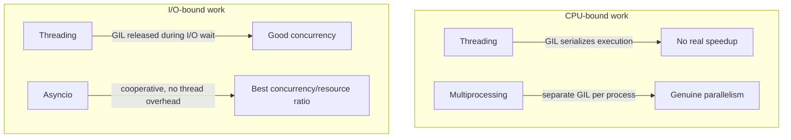

# Python, FastAPI & Flask — Expert Interview & Study Guide

## 1. How Python Backend Interviews Are Layered

Expect four layers: (1) **Python language internals** (GIL, memory model, mutable-default-argument traps — the things that separate "knows Python syntax" from "understands the runtime"), (2) **concurrency models** (threading vs multiprocessing vs asyncio — when each actually helps), (3) **framework-specific reasoning** (why FastAPI's dependency injection exists, why Flask's request context works the way it does), and (4) **applied API design** (build a paginated endpoint, handle a long-running task, structure a production-grade project layout).

## 2. The GIL — What It Actually Constrains

The **Global Interpreter Lock** ensures only one thread executes Python bytecode at a time within a single process, even on a multi-core machine. This means **threading does not speed up CPU-bound work** in CPython — two threads doing pure computation run essentially sequentially, taking turns holding the GIL. Threading *does* help for **I/O-bound work** (network calls, file I/O, DB queries) because the GIL is released during blocking I/O operations, letting other threads run while one waits — this is the single most important GIL fact interviewers test, usually via "why doesn't adding threads speed up my CPU-heavy function?"

- **CPU-bound work** → use **multiprocessing** (separate processes, each with its own GIL and memory space, genuinely parallel on multiple cores) or offload to a native extension/library that releases the GIL internally (NumPy, for instance, releases it during heavy array operations).
- **I/O-bound work** → use **threading** or, better in modern Python, **asyncio** (single-threaded cooperative concurrency, avoiding thread overhead and context-switching cost entirely for I/O-bound workloads).
- **Python 3.13+ free-threaded builds** (PEP 703, an opt-in "no-GIL" build) are worth naming as the forward-looking answer to "will this always be true" — it's an experimental, opt-in build variant as of its introduction, not yet the default, but signals where CPython is heading for genuine multi-core parallelism without multiprocessing's memory-isolation overhead.



## 3. Asyncio — The Event Loop Model

`asyncio` provides single-threaded **cooperative multitasking**: an event loop runs one coroutine at a time, and a coroutine voluntarily yields control (at every `await` point) back to the loop, which then runs another ready coroutine. Nothing runs in true parallel — the concurrency comes entirely from overlapping *waiting* time (e.g., while one coroutine awaits a network response, the loop runs another coroutine that's ready to proceed), which is exactly the profile of I/O-bound web backend workloads (mostly waiting on DB queries, external API calls, disk I/O).

**Common async pitfalls, precisely the ones interviewers plant in code review:**
- **Blocking calls inside an async function**: calling a synchronous, blocking library (e.g., the classic `requests.get()`, or `time.sleep()`) inside an `async def` function blocks the *entire event loop*, not just that coroutine — every other coroutine waiting to run is stalled for the duration, defeating the entire point of async. The fix: use an async-native library (`httpx.AsyncClient`, `asyncpg`), or run the blocking call in a thread pool executor (`asyncio.to_thread` in modern Python) so it doesn't block the loop itself.
- **Forgetting to `await`**: calling an `async def` function without `await` doesn't execute it — it just creates a coroutine object that silently does nothing unless awaited or scheduled, a common source of "why didn't this run" bugs with no error raised.
- **Fire-and-forget tasks without a reference**: `asyncio.create_task(coro())` without keeping a reference to the returned task risks the task being garbage-collected mid-execution (Python's own docs warn about this) — always keep a reference (e.g., in a set) until the task completes, or explicitly await it.
- **Sequential `await` when concurrency was intended**: `await`ing several independent coroutines one after another in a loop runs them sequentially; wrapping them in `asyncio.gather(*coros)` runs them concurrently — the exact same conceptual bug as the `Promise.all` vs sequential-`await` distinction in JavaScript, and a frequent live-coding correction point.

```python
import asyncio, httpx

# BUGGY: sequential, takes sum of all request times
async def fetch_all_sequential(urls: list[str]) -> list[dict]:
    async with httpx.AsyncClient() as client:
        results = []
        for url in urls:
            resp = await client.get(url)
            results.append(resp.json())
        return results

# FIXED: concurrent, takes roughly the time of the SLOWEST request
async def fetch_all_concurrent(urls: list[str]) -> list[dict]:
    async with httpx.AsyncClient() as client:
        responses = await asyncio.gather(*(client.get(url) for url in urls))
        return [r.json() for r in responses]
```

## 4. Python Language Internals Frequently Tested

### 4.1 Mutable Default Arguments — The Classic Trap

```python
# BUGGY: the default list is created ONCE, at function definition time,
# and is SHARED and MUTATED across every call that doesn't pass its own.
def add_item(item, items=[]):
    items.append(item)
    return items

add_item(1)  # [1]
add_item(2)  # [1, 2]  <- surprise, the same list persisted!

# FIXED: use None as a sentinel, create a fresh list inside the function.
def add_item(item, items=None):
    if items is None:
        items = []
    items.append(item)
    return items
```

### 4.2 Everything Is an Object; Variables Are References

Assignment binds a name to an object; it doesn't copy the object. This is why mutable default arguments misbehave (section 4.1), and why passing a list into a function and mutating it in place affects the caller's list, while reassigning the parameter name inside the function does not. **Mutable vs immutable**: lists, dicts, sets are mutable (in-place changes visible to all references); ints, strings, tuples are immutable (any "modification" actually creates a new object). Know `is` (identity — same object in memory) vs `==` (equality — same value) as a related, frequently tested distinction — `a is b` can be `True` for small integers/interned strings due to CPython implementation details (an interpreter optimization, not a language guarantee), a classic "why did this work by accident" gotcha.

### 4.3 Decorators

A decorator is a higher-order function that wraps another function to extend its behavior without modifying its source — the mechanism underlying `@app.route`, `@app.get`, `@property`, `@staticmethod`, `@lru_cache`, and any custom logging/timing/auth-check wrapper.

```python
import functools
import time

def timed(func):
    @functools.wraps(func)  # preserves the wrapped function's __name__/docstring
    def wrapper(*args, **kwargs):
        start = time.perf_counter()
        result = func(*args, **kwargs)
        print(f"{func.__name__} took {time.perf_counter() - start:.4f}s")
        return result
    return wrapper

@timed
def slow_query():
    ...
```
`functools.wraps` is the detail interviewers specifically check for — omitting it silently replaces the wrapped function's metadata (`__name__`, `__doc__`) with the wrapper's own, breaking introspection, debugging output, and any framework that relies on function metadata.

### 4.4 Context Managers

The `with` statement guarantees cleanup code runs even if an exception occurs inside the block — implemented via `__enter__`/`__exit__` (or, more concisely, `@contextlib.contextmanager` around a generator function). The canonical case for understanding *why* this matters: a file handle or DB connection acquired without a context manager can leak if an exception is raised between acquisition and a manual `.close()` call; `with` makes that leak structurally impossible by running `__exit__` unconditionally on the way out of the block, exception or not.

```python
from contextlib import contextmanager

@contextmanager
def db_transaction(connection):
    try:
        yield connection
        connection.commit()
    except Exception:
        connection.rollback()
        raise
    finally:
        connection.close()
```

### 4.5 Generators and Memory Efficiency

A generator function (using `yield`) produces values lazily, one at a time, holding only the current position and local state in memory — instead of a list comprehension, which builds and holds the entire result in memory at once. For large or unbounded datasets (streaming a huge file line by line, paginating through millions of DB rows), a generator's constant memory footprint versus a list's linear-in-size footprint is the concrete, quantifiable reason to prefer it — a frequent "how would you process a 10GB file without running out of memory" prompt.

### 4.6 `*args`/`**kwargs`, Type Hints, and `dataclasses`

Type hints (`def f(x: int) -> str`) are not enforced at runtime by the interpreter itself — they're metadata consumed by static type checkers (mypy, pyright) and by frameworks like FastAPI/Pydantic that explicitly perform runtime validation using them. Know this distinction cold: a plain type-hinted function will happily accept and run with a wrong-typed argument at runtime with no error, unless something (Pydantic, an explicit `isinstance` check) actually validates it. `@dataclass` auto-generates `__init__`, `__repr__`, and `__eq__` from declared fields, reducing boilerplate for simple data-holding classes — know `frozen=True` for immutability and `field(default_factory=list)` as the dataclass-native solution to the mutable-default-argument problem from 4.1.

## 5. FastAPI — Why Its Core Abstractions Exist

### 5.1 Pydantic-Based Validation Is the Foundation

FastAPI's request/response bodies are declared as Pydantic models; FastAPI uses the type hints on those models to automatically validate incoming JSON (rejecting malformed requests with a detailed 422 error before your handler code ever runs), serialize responses, and generate an OpenAPI schema and interactive docs (`/docs`) — all from the same single source of truth (the model definitions), rather than separately maintaining validation logic, serialization logic, and API documentation by hand as three independently-drifting artifacts.

```python
from fastapi import FastAPI, HTTPException, Depends
from pydantic import BaseModel, Field, EmailStr

app = FastAPI()

class UserCreate(BaseModel):
    email: EmailStr
    age: int = Field(gt=0, le=150)

class UserOut(BaseModel):
    id: int
    email: EmailStr

@app.post("/users", response_model=UserOut, status_code=201)
async def create_user(payload: UserCreate):
    # payload is already validated and correctly typed here —
    # invalid input never reaches this line; FastAPI returns a 422
    # with field-level error detail automatically.
    user = await save_user(payload)
    return user
```

### 5.2 Dependency Injection — What Problem It Actually Solves

FastAPI's `Depends()` system lets you declare reusable, composable pieces of request-handling logic (auth, DB session acquisition, pagination parameters, rate limiting) once and inject them into any route that needs them, with FastAPI resolving the dependency graph (including dependencies of dependencies) automatically per-request.

```python
from fastapi import Depends, Header, HTTPException

async def get_db():
    db = SessionLocal()
    try:
        yield db  # code after yield runs as teardown, like a context manager
    finally:
        db.close()

async def get_current_user(
    authorization: str = Header(...),
    db: Session = Depends(get_db),
) -> User:
    token = authorization.removeprefix("Bearer ")
    user = await verify_token_and_load_user(token, db)
    if user is None:
        raise HTTPException(status_code=401, detail="Invalid or expired token")
    return user

@app.get("/me")
async def read_current_user(user: User = Depends(get_current_user)):
    return user

@app.get("/me/orders")
async def read_orders(
    user: User = Depends(get_current_user),  # reused, no duplicated auth logic
    db: Session = Depends(get_db),
):
    return await get_orders_for_user(db, user.id)
```

**Why this beats decorator-based or middleware-based auth for per-route granularity**: middleware applies globally (or via broad path matching) and doesn't naturally support *different* routes needing *different combinations* of dependencies (some routes need auth + DB, some need just DB, some need neither) with each dependency's own typed return value flowing directly into the handler's parameters, fully visible to static analysis and the auto-generated docs. A dependency that itself has parameters (like `get_current_user` depending on `get_db`) composes automatically — FastAPI resolves the whole graph once per request and can even cache a dependency's result within that request if it's used multiple times (default behavior, overridable).

### 5.3 The `yield`-Based Dependency as a Request-Scoped Context Manager

A dependency using `yield` (as `get_db` does above) is FastAPI's request-scoped equivalent of a context manager: the code before `yield` runs at request start, the code after runs at request end (in a `finally`, guaranteeing cleanup even if the handler raises) — this is the standard, correct pattern for anything needing setup/teardown per request (DB sessions, transaction boundaries, acquiring/releasing a resource), and mirrors the `contextlib.contextmanager` pattern from section 4.4 applied at the request-lifecycle level.

### 5.4 Async vs Sync Route Handlers in FastAPI

`async def` route handlers run directly on the event loop (correct for I/O-bound work using async-native libraries) — but blocking synchronous code inside one blocks the whole event loop for every concurrent request being served, per section 3's warning. Plain `def` route handlers are automatically run by FastAPI in an external thread pool, so a blocking synchronous call inside them doesn't block the main event loop (other requests keep being served by other threads) — but you then get thread-pool concurrency limits and overhead instead of async's lighter-weight cooperative concurrency. The rule to state precisely: use `async def` when everything inside is async-native (or CPU-trivial); use plain `def` when the handler necessarily calls blocking/synchronous code (a legacy sync DB driver, a CPU-bound computation) you haven't converted to async, so FastAPI can isolate that blocking work in a thread rather than stalling the whole server.

### 5.5 Background Tasks vs a Real Task Queue

FastAPI's `BackgroundTasks` runs a function after the response has been sent, within the same process — good for lightweight, best-effort work (sending a confirmation email, writing a log entry) where losing the task on a process restart/crash is an acceptable risk. It is **not** a durable task queue: there's no retry on failure, no persistence if the process dies mid-task, and no ability to distribute work across multiple worker processes/machines. For anything that must survive a crash, needs retries, or needs to scale independently of the web server (sending millions of emails, processing uploaded video, any workflow from the Saga pattern discussed in the System Design document), the correct answer is a real task queue (Celery, or a cloud-native equivalent like SQS + a worker fleet) — naming this distinction unprompted is a strong signal that you understand `BackgroundTasks`' actual guarantees rather than just its API.

## 6. Flask — The Older, More Manual Model (and Why That's Sometimes Right)

### 6.1 The Application and Request Context

Flask uses a **context-local** pattern (`current_app`, `request`, `g`) — global-looking proxy objects that actually resolve to the correct object for the current request/thread under the hood, implemented via Python's `contextvars` (or, historically, thread-locals). This lets code deep in a call stack access `request.args` without the request object being explicitly threaded through every function call — convenient, but it's genuine implicit global-like state that can make testing and reasoning about a function's actual dependencies harder than FastAPI's explicit `Depends()` injection, which is the core philosophical difference between the two frameworks worth naming when asked to compare them.

### 6.2 Flask Is WSGI (Synchronous) by Default; FastAPI Is ASGI (Async-Native)

**WSGI** (Web Server Gateway Interface, Flask's traditional foundation) handles one request per worker thread/process synchronously, blocking for the full duration of each request — scaling concurrency means adding more worker processes/threads (via Gunicorn/uWSGI), each with real memory/OS overhead. **ASGI** (Asynchronous Server Gateway Interface, FastAPI's foundation, also usable by newer Flask versions) supports async handlers natively, allowing a single worker to hold many concurrent I/O-bound requests in flight cooperatively, which is far more resource-efficient for I/O-heavy workloads at scale (many concurrent slow-but-mostly-waiting requests) — though for CPU-bound or already-fast synchronous workloads, the difference matters much less, and WSGI's simpler mental model (no `async`/`await` discipline required anywhere in the codebase) is a genuine, legitimate reason some teams still choose Flask for services that aren't I/O-concurrency-bound.

### 6.3 Extensions vs. Built-In Batteries

Flask deliberately ships minimal (routing + WSGI glue), relying on an extension ecosystem (Flask-SQLAlchemy, Flask-Login, Flask-Migrate, Flask-RESTful) to add validation, ORM integration, auth, etc. — giving maximal flexibility in how a project is assembled, at the cost of more upfront decisions and potential inconsistency across projects/teams in how those pieces are wired together. FastAPI bundles opinionated, integrated defaults (Pydantic validation, dependency injection, automatic docs) as first-class framework features — faster to get a consistent, well-documented API up correctly, at the cost of being more opinionated about how validation/DI should work if a project's needs diverge from FastAPI's model.

### 6.4 When Flask Is Still the Right Choice

Existing large Flask codebases (rewrite cost rarely justified by framework preference alone), server-rendered (Jinja2-templated) traditional web apps rather than JSON APIs (Flask's templating story is more mature/idiomatic for this than FastAPI's, which is API-first), teams that value WSGI's simpler synchronous mental model and don't have an I/O-concurrency bottleneck that async would meaningfully address, or a need for a specific mature Flask extension with no equally mature FastAPI equivalent. The honest, senior-level answer to "FastAPI vs Flask" is never "FastAPI is strictly better" — it's "FastAPI wins for new, I/O-heavy JSON APIs that benefit from built-in validation/docs/async; Flask remains reasonable for server-rendered apps, teams without an async-concurrency need, or existing investment."

## 7. Case Study: Designing a Production-Grade Paginated, Filterable API Endpoint

A common "show me you can build a real endpoint, not just a hello-world" prompt.

```python
from fastapi import FastAPI, Depends, Query
from pydantic import BaseModel
from typing import Optional
from enum import Enum

app = FastAPI()

class SortOrder(str, Enum):
    asc = "asc"
    desc = "desc"

class PaginationParams(BaseModel):
    cursor: Optional[str] = None
    limit: int = Field(default=20, ge=1, le=100)

def pagination_params(
    cursor: Optional[str] = Query(None),
    limit: int = Query(20, ge=1, le=100),
) -> PaginationParams:
    return PaginationParams(cursor=cursor, limit=limit)

class OrderOut(BaseModel):
    id: int
    status: str
    total_cents: int
    created_at: str

class PaginatedOrders(BaseModel):
    items: list[OrderOut]
    next_cursor: Optional[str]

@app.get("/orders", response_model=PaginatedOrders)
async def list_orders(
    status: Optional[str] = Query(None, description="Filter by order status"),
    sort: SortOrder = Query(SortOrder.desc),
    pagination: PaginationParams = Depends(pagination_params),
    user: User = Depends(get_current_user),
    db: AsyncSession = Depends(get_db),
):
    # Cursor-based, not offset-based (see the HLD document's pagination
    # section) -- stays O(limit) regardless of position and stays
    # correct under concurrent inserts, unlike LIMIT/OFFSET.
    orders, next_cursor = await fetch_orders_page(
        db, user_id=user.id, status=status, sort=sort,
        cursor=pagination.cursor, limit=pagination.limit,
    )
    return PaginatedOrders(items=orders, next_cursor=next_cursor)
```

**Design points worth narrating out loud**: input validation and constraints (`ge=1, le=100` on `limit`) prevent a client from requesting an unbounded page size that could degrade DB performance; cursor-based (not offset-based) pagination for the correctness reasons covered in the HLD document; `status` as an optional filter modeled as a plain string with a description rather than over-constraining it to an enum if the underlying valid values are expected to grow without a code deploy (a real tradeoff to name — an enum gives better validation/docs but couples the API contract tightly to a fixed value set); dependency injection cleanly separates auth (`get_current_user`), DB access (`get_db`), and pagination parameter parsing (`pagination_params`) so each is independently testable and reusable across other endpoints without duplicating the logic.

## 8. Common Python/FastAPI/Flask Interview Prompts to Practice

Implement a rate limiter as FastAPI middleware/dependency, design a background job system with retries using Celery, implement an async connection-pooled DB access layer, explain how you'd add request tracing/correlation IDs across an async call chain, implement a custom Pydantic validator for cross-field validation, design a file upload endpoint with streaming (avoiding loading a huge file fully into memory), explain how you'd structure a large FastAPI project (routers, dependency layering, settings management via `pydantic-settings`).

## 9. Interview Questions & Answers

**Q1. Why doesn't adding more threads speed up a CPU-bound Python function, and what's the actual fix?**
A: The GIL ensures only one thread executes Python bytecode at any instant within a process, so CPU-bound threads take turns rather than running in parallel — adding more threads to CPU-bound work adds context-switching overhead without adding real throughput, and can even make it slightly slower. The fix is multiprocessing (each process gets its own Python interpreter and GIL, achieving genuine parallelism across CPU cores at the cost of higher memory usage and the need to serialize data passed between processes), or delegating the CPU-heavy portion to a library that releases the GIL internally during its native/compiled computation (e.g., NumPy for numerical work).

**Q2. Explain why a blocking call inside an `async def` function is worse than the equivalent blocking call in a synchronous Flask/WSGI handler.**
A: In a synchronous WSGI model, each request is already handled by its own worker thread/process, so one request blocking doesn't prevent other *concurrent* requests (served by other workers) from proceeding — you pay for concurrency via more OS threads/processes. In an async event loop, a single thread is cooperatively multiplexing potentially hundreds of concurrent requests; a blocking call inside any one coroutine monopolizes that single thread and stalls the entire event loop, meaning every other in-flight request — not just the one that made the blocking call — stops making progress for the duration of the block. This is why "just add `async def`" without also using async-native libraries throughout can make an application's *worst-case* latency dramatically worse than the synchronous version it replaced, despite async's better best-case throughput.

**Q3. Walk through the mutable default argument bug and explain precisely why it happens (not just that it happens).**
A: A function's default argument values are evaluated exactly once, at function *definition* time, not on each call — the resulting object (e.g., an empty list) is created once and stored as part of the function object itself. Every subsequent call that doesn't explicitly pass its own value for that parameter receives a reference to that *same* persisted object, so any in-place mutation (like `.append()`) accumulates across calls instead of starting fresh each time, since there's only ever one such default object in existence for the function's entire lifetime. The fix (`None` as sentinel, create the real default inside the function body) works because it moves the object's creation to call time, giving each call its own fresh object.

**Q4. What's the practical difference between FastAPI's `Depends()`-based dependency injection and Flask's `g`/`current_app` context-local pattern?**
A: `Depends()` makes a route's actual dependencies explicit in its function signature — reading the signature alone tells you everything the handler needs (auth, a DB session, query parameters), and each dependency's return value is directly and statically type-checkable as a parameter. Flask's `g`/`current_app`/`request` proxies are implicit, ambient, context-local globals — a function deep in the call stack can silently read `g.user` or `request.headers` without that dependency being visible anywhere in its signature, which makes it harder to know a function's full set of inputs just by reading its definition, and correspondingly harder to unit test in isolation (you often need to push a real or fake application/request context just to call the function at all, versus FastAPI's dependencies being directly overridable per-test via `app.dependency_overrides`).

**Q5. Why is `BackgroundTasks` in FastAPI not a substitute for a real task queue like Celery, specifically?**
A: `BackgroundTasks` executes the function within the same process, after the response is sent, with no persistence — if the process crashes or restarts between the response being sent and the background task completing, the task is simply lost with no record it was ever supposed to run, and there's no built-in retry mechanism if it fails. A real task queue persists the task (in a broker like Redis/RabbitMQ) before acknowledging it, so a worker crash means the task is picked up again by another worker rather than silently disappearing, supports configurable retries with backoff, and lets task execution scale independently across a fleet of worker processes/machines rather than being tied to the web server process's own capacity. `BackgroundTasks` is appropriate only for work where losing it occasionally is a genuinely acceptable, low-stakes outcome.

**Q6. In the paginated orders endpoint example, why is the pagination logic extracted into its own dependency function rather than declared as parameters directly on the route?**
A: Extracting `pagination_params` into its own dependency makes pagination parsing/validation reusable verbatim across every endpoint that needs pagination (orders, users, products, etc.) without duplicating the same `Query(...)` declarations and constraints on each route, and FastAPI's dependency system means it's independently unit-testable (you can call `pagination_params` directly with test inputs) and independently overridable in tests (`app.dependency_overrides[pagination_params] = ...`) without needing to spin up a full request against a specific route. It's the direct FastAPI-native application of the same "extract shared responsibility instead of duplicating it" principle from the LLD document's SRP discussion, applied at the API layer instead of the class layer.

**Q7. What's the concrete difference in guarantees between using a generator and a list comprehension when processing a very large file, and when would you actually need the generator's guarantee?**
A: A list comprehension eagerly evaluates and holds every produced item in memory simultaneously — for a file with millions of lines, the resulting list's memory footprint scales linearly with the file size, and can exhaust available memory well before processing finishes if the file is large enough. A generator produces one item at a time, holding only the current item and minimal iteration state in memory regardless of how many items exist overall — the memory footprint stays constant. You need this guarantee specifically when the total dataset size is large enough (or unbounded, as in a live stream) that materializing it all at once genuinely risks memory exhaustion, and when the consuming code can process items one at a time without needing random access or the full collection simultaneously (e.g., streaming line-by-line transformation, versus needing to sort the entire dataset, which does require having it all available at once regardless).

**Q8. Why does FastAPI's automatic validation via Pydantic reduce bugs compared to manually validating a request body with `if` statements in a Flask route?**
A: Manual `if`-statement validation in each route handler is duplicated per-endpoint, easy to forget a field or a constraint on any given route, and drifts silently out of sync with the actual API documentation (which then has to be maintained separately, by hand, and can lie about what's actually enforced). Pydantic models declared once and reused as FastAPI's `response_model`/body-parameter types are the single source of truth for validation, serialization, *and* the auto-generated OpenAPI docs simultaneously — a constraint change (e.g., `age: int = Field(gt=0)`) is applied and reflected everywhere derived from that model automatically, and a request that violates it is rejected with a structured, consistent 422 error before any handler code runs, rather than depending on every route author remembering to check it correctly and consistently by hand.

**Q9. When would you deliberately choose a plain `def` route handler over `async def` in FastAPI, even in an otherwise async-native codebase?**
A: When the handler necessarily calls a blocking, synchronous dependency you don't control or haven't converted to an async equivalent — a legacy synchronous ORM/DB driver without an async variant, a synchronous third-party SDK, or a genuinely CPU-bound computation. FastAPI automatically runs plain `def` handlers in an external thread pool rather than directly on the event loop, so that blocking call stalls only its own worker thread, not the shared event loop serving every other concurrent request — deliberately choosing `def` here isolates unavoidable blocking work rather than accidentally stalling the whole server by wrapping it in `async def` and calling blocking code inside it anyway, which would be strictly worse than either pure option.

**Q10. Explain how you'd add correlation/request IDs for tracing a request across an async call chain in FastAPI, and why this is slightly trickier than in a synchronous framework.**
A: In a synchronous, one-thread-per-request model (classic Flask/WSGI), a thread-local variable set at request start naturally stays associated with that request for its entire lifetime, since the thread never handles another request concurrently. In an async event loop, a single thread interleaves many concurrent requests' coroutines, so a naive thread-local would leak/mix values across unrelated concurrent requests. The correct tool is Python's `contextvars.ContextVar`, which is coroutine-aware — each `async def` call chain (including tasks spawned from it) that hasn't explicitly copied a new context sees the value set in its own logical execution context, correctly isolating one request's correlation ID from another's even while both run concurrently on the same thread. A FastAPI middleware typically sets the `ContextVar` at request start (generating or extracting an incoming correlation ID header) and a logging filter reads it to attach the ID to every log line emitted during that request's processing, including from deeply nested async calls.
