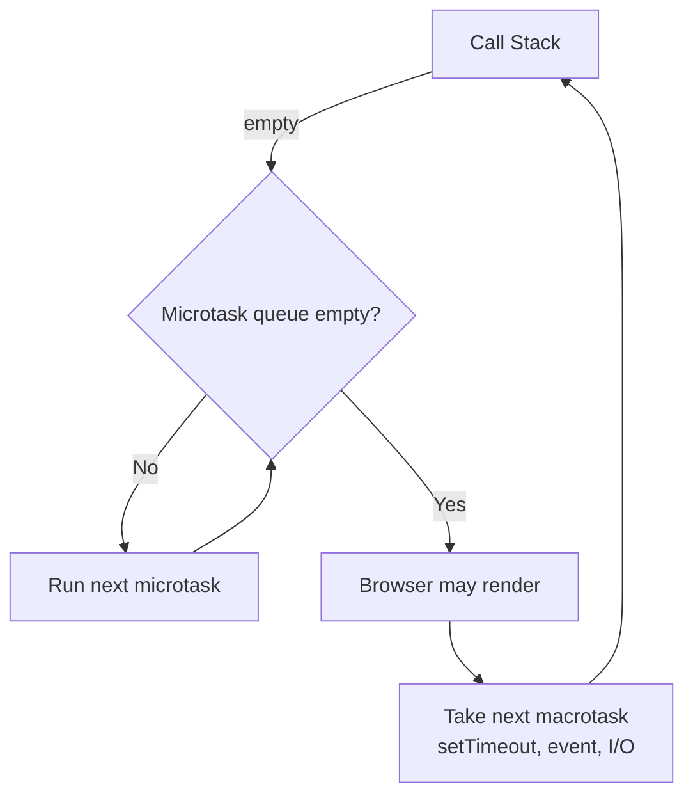
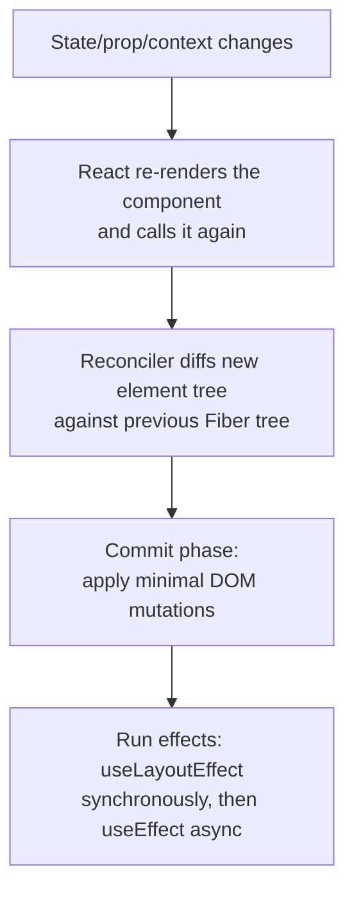
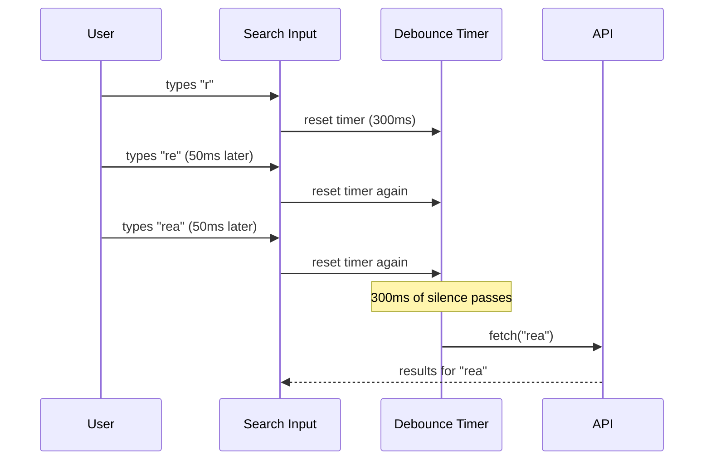

# React, JavaScript & TypeScript — Expert Interview & Study Guide

## 1. How Frontend Interviews Are Layered

Frontend rounds at a senior level test four layers simultaneously: (1) **JavaScript language fundamentals** (closures, `this`, the event loop — the things that cause the weirdest bugs), (2) **TypeScript's type system** (how to model real domain constraints, not just "add types"), (3) **React's rendering and state model** (why re-renders happen, when they're a problem, how to fix it correctly), and (4) **applied component/architecture design** (build a debounced search, a virtualized list, a data-fetching hook with race-condition safety). Interviewers weight correctness and reasoning about *why* over syntax recall.

## 2. JavaScript Fundamentals That Actually Get Probed

### 2.1 The Event Loop, Precisely

JavaScript is single-threaded with a **call stack**, a **microtask queue**, and a **macrotask (task) queue**. After each macrotask (e.g., a `setTimeout` callback, a UI event handler), the engine drains the **entire** microtask queue before running the next macrotask or repainting. Promises (`.then`, `async/await` continuations) are microtasks; `setTimeout`, `setInterval`, and I/O callbacks are macrotasks.



**The classic interview question**: predict the output of
```javascript
console.log('1');
setTimeout(() => console.log('2'), 0);
Promise.resolve().then(() => console.log('3'));
console.log('4');
// Output: 1, 4, 3, 2
// '1' and '4' run synchronously first. The promise callback ('3') is a
// microtask and runs before the setTimeout callback ('2'), a macrotask,
// even though both were "scheduled" for as soon as possible.
```

### 2.2 Closures

A closure is a function bundled with references to its surrounding lexical scope, persisting after the outer function has returned. This is the mechanism behind private state (module pattern), memoization, and — notoriously — the classic loop-variable bug:

```javascript
// Bug: logs 3, 3, 3 — var is function-scoped, so all three callbacks
// share the SAME i, which is 3 by the time any callback runs.
for (var i = 0; i < 3; i++) {
  setTimeout(() => console.log(i), 0);
}

// Fix: let is block-scoped — each iteration gets its own binding,
// captured independently by each closure.
for (let i = 0; i < 3; i++) {
  setTimeout(() => console.log(i), 0);
}
```

### 2.3 `this` Binding Rules (in precedence order)

1. `new Foo()` — `this` is the newly created object.
2. `.call/.apply/.bind` — `this` is explicitly set.
3. Method call (`obj.method()`) — `this` is `obj` (**implicit binding**).
4. Plain function call — `this` is `undefined` in strict mode (or the global object otherwise).
5. **Arrow functions have no own `this`** — they lexically inherit `this` from their enclosing scope at definition time, which is exactly why they're the standard fix for `this`-loss bugs in callbacks (e.g., inside a class method passed as an event handler, or inside `setTimeout`).

### 2.4 Prototypal Inheritance

Every object has an internal `[[Prototype]]` link (`Object.getPrototypeOf`, accessible historically via `__proto__`); property lookup walks up this prototype chain until found or the chain ends at `null`. `class` syntax is sugar over this same mechanism — `class B extends A` sets `B.prototype.__proto__ = A.prototype`. Understanding this explains why methods defined via `class` are shared across all instances (they live once on the prototype) while instance fields (`this.x = ...` in the constructor) are per-instance.

### 2.5 Equality, Coercion, and Type Gotchas

`==` performs type coercion before comparing (`'' == 0` is `true`, `null == undefined` is `true` but `null == 0` is `false`); `===` never coerces. Default to `===` everywhere; know the coercion rules well enough to explain *why* a `==` comparison in legacy code produces a surprising result, since that's exactly the kind of bug interviewers plant. `NaN !== NaN` (use `Number.isNaN()` or `Object.is()` to test for it). `typeof null === 'object'` is a long-standing language bug, not a design choice — know it, don't defend it.

### 2.6 Promises and Async/Await

`async/await` is syntactic sugar over Promises — an `async` function always returns a Promise, and `await` pauses execution of that function (not the whole program) until the awaited Promise settles. Key patterns:
- **`Promise.all`**: runs promises concurrently, rejects as soon as any one rejects (fails fast) — use when you need every result and would fail the whole operation if any part fails.
- **`Promise.allSettled`**: runs concurrently, never short-circuits, returns the status of every promise — use when partial failure is acceptable and you need to know which ones failed.
- **`Promise.race`**: resolves/rejects as soon as the first promise settles — used for timeout patterns (race a real request against a timer promise).
- **Sequential vs. concurrent `await`**: `await`ing inside a `for` loop one at a time runs requests sequentially (slow, but sometimes required — e.g., rate-limited APIs or when each step depends on the previous result); mapping to promises first and `Promise.all`-ing them runs them concurrently — a frequent, real performance bug in interview code review rounds.

## 3. TypeScript — Modeling Real Constraints, Not Just Adding Types

### 3.1 Structural Typing

TypeScript uses **structural** (duck) typing, not nominal typing — two types are compatible if their shapes match, regardless of declared name or inheritance relationship. This is a frequent source of confusion for developers coming from Java/C#, and a common interview question: "why does this object literal satisfy this interface even though it never declared it?"

### 3.2 Generics

Generics let a function/type be parameterized over the types it operates on while preserving type relationships, instead of falling back to `any` (which discards all type safety):

```typescript
function firstOrDefault<T>(items: T[], fallback: T): T {
  return items.length > 0 ? items[0] : fallback;
}
// TypeScript infers T from usage; the return type is correctly tied to
// the input array's element type, unlike a version typed with `any`.
```

### 3.3 Union, Intersection, and Discriminated Unions

Union types (`A | B`) model "one of several shapes"; intersection types (`A & B`) model "must satisfy all of these shapes." **Discriminated unions** — a shared literal "tag" field that TypeScript can narrow on — are the idiomatic way to model state machines and API response shapes precisely:

```typescript
type RequestState<T> =
  | { status: 'idle' }
  | { status: 'loading' }
  | { status: 'success'; data: T }
  | { status: 'error'; error: string };

function render<T>(state: RequestState<T>) {
  switch (state.status) {
    case 'idle': return 'Waiting to start';
    case 'loading': return 'Loading...';
    case 'success': return state.data; // TS knows `.data` exists ONLY here
    case 'error': return state.error;  // TS knows `.error` exists ONLY here
  }
}
```
This pattern eliminates an entire class of bugs where `data` and `error` are both optional fields on one flat type and nothing stops you from accidentally reading `data` while the request is actually still loading.

### 3.4 Utility Types Worth Knowing Cold

`Partial<T>` (all properties optional — useful for update/patch payloads), `Required<T>` (opposite), `Pick<T, K>`/`Omit<T, K>` (select/exclude a subset of properties), `Readonly<T>` (immutability at the type level), `Record<K, V>` (a dictionary type), `ReturnType<F>`/`Parameters<F>` (extract types from a function signature — useful to avoid duplicating a type that should be derived from an existing function).

### 3.5 `unknown` vs `any`, and Type Narrowing

`any` disables type checking entirely for that value — a footgun that should be rare and deliberate. `unknown` is the type-safe counterpart: it accepts any value (like `any`) but forces you to **narrow** it (via `typeof`, `instanceof`, a custom type guard, or a schema validator) before you can operate on it — this is the correct type for "data from an untrusted boundary" (an API response, `JSON.parse` output, user input) because it forces explicit validation rather than silently trusting an assumed shape.

```typescript
function isUser(x: unknown): x is User {
  return typeof x === 'object' && x !== null && 'id' in x && 'email' in x;
}
// A user-defined type guard — the `x is User` return type lets TS narrow
// `x` to `User` in any branch where this function returns true.
```

### 3.6 `interface` vs `type`, precisely

Both can describe object shapes and are largely interchangeable for that use case. Key differences: `interface` supports **declaration merging** (multiple `interface Foo {}` declarations with the same name merge into one — used heavily for extending third-party library types) and is generally preferred for public object/class shapes for slightly better error messages and extendability; `type` can express unions, intersections, tuples, mapped, and conditional types that `interface` cannot. The common team convention: `interface` for object shapes meant to be extended/implemented, `type` for unions, aliases, and utility/computed types.

## 4. React — The Rendering Model, Precisely

### 4.1 What Actually Triggers a Re-render

A component re-renders when: its own state changes (`useState`/`useReducer` setter called), its parent re-renders (by default, **every child re-renders when its parent does, regardless of whether its own props changed**, unless memoized), or a consumed context value changes. This last point — "a parent re-rendering re-renders all its children by default" — is the single most load-bearing fact for any React performance discussion, and the reason `React.memo`, `useMemo`, and `useCallback` exist at all.



### 4.2 The Virtual DOM and Reconciliation (Fiber)

React re-renders a component by calling its function again and producing a new tree of React elements (lightweight JS objects, the "virtual DOM"). The **reconciler** diffs this new tree against the previous one and computes the minimal set of real DOM mutations needed — this is why React state updates don't require manually specifying what changed. **Fiber** is React's reconciliation engine (since React 16): it represents the component tree as a linked list of units of work that can be paused, resumed, prioritized, and aborted — this is the foundation for **concurrent rendering** (React 18+), where React can interrupt a low-priority render (e.g., a big list update) to handle a high-priority update (e.g., a keystroke) first, keeping the UI responsive under heavy render load. Know the **keys** rule precisely: keys tell the reconciler which array items are "the same" across renders so it can match, reorder, and preserve state correctly instead of destroying/recreating DOM nodes and component state — using array index as a key is a well-known bug source specifically when the list can be reordered, filtered, or have items inserted/removed from the middle, because the index-to-item mapping shifts while React thinks it's still looking at "the same" item at each index.

### 4.3 Hooks — Rules and Why They Exist

**The Rules of Hooks** (only call hooks at the top level, never inside conditions/loops/nested functions; only call them from React function components or custom hooks) exist because React tracks hooks by **call order**, not by name — each render must call the exact same hooks in the exact same order so React can correctly associate each `useState` call with its persisted state slot. Conditionally skipping a hook call shifts every subsequent hook's slot, corrupting state association.

- **`useState`**: local state, triggers re-render on change; the setter can take a value or an updater function (`setCount(c => c + 1)`) — always prefer the updater form when the new state depends on the old, to avoid stale-closure bugs in async callbacks/rapid successive updates.
- **`useEffect`**: runs *after* the DOM has been committed and the browser has painted (asynchronously) — for side effects that don't need to block visible paint (data fetching, subscriptions, logging). The dependency array controls when it re-runs; an empty array means "run once on mount," omitting it means "run after every render" (almost always a bug unless deliberate), and every value from component scope used inside the effect belongs in the array (the exhaustive-deps lint rule exists specifically to catch stale-closure bugs from a missing dependency).
- **`useLayoutEffect`**: same as `useEffect` but runs synchronously *before* the browser paints — use only when you must read/mutate the DOM before the user sees a visual flash (e.g., measuring an element and adjusting its position before paint); using it by default instead of `useEffect` blocks painting and hurts perceived performance.
- **`useMemo`**: memoizes a computed *value* across renders, recomputing only when a dependency changes — for expensive computations, or to preserve referential equality of an object/array passed to a memoized child (see 4.4).
- **`useCallback`**: memoizes a *function reference* across renders — functionally `useMemo(() => fn, deps)` — needed specifically because a new function is created on every render by default, which breaks referential-equality checks (`React.memo`, a `useEffect` dependency) even when the function's logic hasn't meaningfully changed.
- **`useRef`**: a mutable box that persists across renders *without* triggering a re-render when changed — for DOM node references, or for holding a mutable value (like a previous-value tracker or an interval ID) that the component logic needs but the UI doesn't need to reactively reflect.
- **`useReducer`**: like `useState` but for more complex state transitions expressed as `(state, action) => newState` — preferred when the next state depends on multiple sub-values changing together, or when the update logic itself is complex enough to benefit from being tested in isolation from the component.
- **`useContext`**: subscribes to the nearest ancestor `Context.Provider`'s value — **any** change to the provided value re-renders every consuming component, regardless of whether that specific consumer cares about the part of the value that changed, which is precisely why Context is a poor fit for frequently-changing, broadly-consumed state (see 4.5).

### 4.4 `React.memo`, `useMemo`, `useCallback` — How They Actually Interact

`React.memo(Component)` skips re-rendering a component if its props are shallow-equal to the previous render's props. This only helps if the props themselves are actually stable across parent re-renders — passing a new inline object/array/function literal as a prop on every parent render defeats `memo` immediately, because `{} !== {}` under shallow equality even if the contents are identical. This is *why* `useMemo`/`useCallback` in the parent are often necessary *together with* `React.memo` on the child — `useCallback` stabilizes a function prop's reference, `useMemo` stabilizes an object/array prop's reference, and only then does `React.memo`'s shallow comparison actually see "no change" and skip the re-render. Using `useMemo`/`useCallback` without a memoized consumer downstream, or memoizing a component whose parent still passes unstable props, are both common "I added memoization but nothing got faster" interview traps.

### 4.5 State Management: Local State, Context, and External Stores

- **Local component state** (`useState`/`useReducer`) — the default, and correct for the large majority of UI state that only one component (and maybe its direct children) cares about.
- **Lifting state up** — when siblings need to share state, move it to their nearest common ancestor and pass it down — the first, simplest escape hatch before reaching for anything heavier.
- **Context** — for state that's genuinely global/cross-cutting (theme, authenticated user, locale) and changes infrequently. Not a general-purpose state manager: because every consumer re-renders on any change to the context value, using Context for frequently-updating state (e.g., mouse position, a live-typing search box shared broadly) causes broad, hard-to-optimize re-render storms — splitting into multiple, narrowly-scoped contexts (so unrelated consumers don't re-render on an unrelated value's change) is the standard mitigation.
- **External state libraries** (Redux, Zustand, Jotai, Recoil) — for state that's complex, needs time-travel debugging/middleware, or needs fine-grained subscription (a component re-renders only when the *specific slice* of state it reads changes, unlike Context's all-or-nothing subscription) — this fine-grained-subscription property is the concrete technical reason libraries like Zustand/Redux (with selectors) scale better than Context for large, frequently-updating global state.
- **Server state** (data fetched from an API) is a fundamentally different category from client UI state — it's asynchronous, can be stale, can error, is often needed in multiple places, and needs caching/invalidation/refetching logic. Libraries purpose-built for this (**React Query/TanStack Query**, **SWR**) handle caching, deduplication of simultaneous requests, background refetching, and race-condition-safe request cancellation — reaching for `useState` + `useEffect` to hand-rolled-fetch is the classic "reinventing a worse, buggier version of React Query" anti-pattern worth naming unprompted in a senior interview.

### 4.6 The `useEffect` Data-Fetching Race Condition (a Frequent Live-Coding Prompt)

```javascript
// BUGGY: if `userId` changes quickly (e.g., user clicks through a list),
// an earlier, now-stale request can resolve AFTER a later one and
// overwrite the correct data with outdated data.
useEffect(() => {
  fetchUser(userId).then(data => setUser(data));
}, [userId]);

// FIXED: a cleanup flag ignores the result of any effect run that's
// since been superseded by a newer one.
useEffect(() => {
  let cancelled = false;
  fetchUser(userId).then(data => {
    if (!cancelled) setUser(data);
  });
  return () => { cancelled = true; };
}, [userId]);
// Modern alternative: pass an AbortController's signal to fetch and
// call controller.abort() in the cleanup, actually canceling the
// in-flight network request rather than just ignoring its result.
```

### 4.7 Server Components, Suspense, and Concurrent Features (React 18+)

- **Suspense**: lets a component "pause" rendering while waiting for asynchronous data/code (lazy-loaded components, or data-fetching libraries built to integrate with it) and show a fallback UI until it's ready — declarative loading states at the boundary level instead of manual `isLoading` flags threaded through every component.
- **Concurrent rendering / `useTransition`**: marks a state update as low-priority ("this can be interrupted if something more urgent comes in"), keeping the UI responsive during expensive renders (e.g., filtering a huge list on every keystroke) by letting React prioritize the keystroke's own UI feedback over finishing the expensive re-render immediately.
- **React Server Components (RSC)**: components that render entirely on the server, sending only the resulting output (not their JS bundle) to the client — reducing client bundle size for content that doesn't need interactivity, and allowing direct server-side data access (DB queries) inside a component without an API layer in between. The critical distinction to name: RSCs are not "server-side rendering" (SSR) — SSR renders the *same* component tree on the server first for faster initial paint but still ships the full JS to hydrate on the client; RSCs *never* ship their JS to the client at all, which is a different and larger bundle-size win, at the cost of RSCs being unable to use state/effects/browser APIs (that's what Client Components, explicitly opted into, are for).

## 5. Case Study: Building a Debounced, Race-Condition-Safe Search Component

A frequent live-coding prompt that combines several of the above concepts.



```typescript
import { useState, useEffect, useRef } from 'react';

function useDebouncedSearch(query: string, delayMs: number) {
  const [results, setResults] = useState<SearchResult[]>([]);
  const [isLoading, setIsLoading] = useState(false);

  useEffect(() => {
    if (!query) {
      setResults([]);
      return;
    }
    setIsLoading(true);
    const controller = new AbortController();

    const timeoutId = setTimeout(async () => {
      try {
        const res = await fetch(`/api/search?q=${encodeURIComponent(query)}`, {
          signal: controller.signal,
        });
        const data: SearchResult[] = await res.json();
        setResults(data);
      } catch (err) {
        if ((err as Error).name !== 'AbortError') throw err;
      } finally {
        setIsLoading(false);
      }
    }, delayMs);

    // Cleanup runs before the NEXT effect and on unmount: cancels both
    // the pending debounce timer and any in-flight request from a
    // now-stale query, which together solve both the "too many
    // requests" problem and the race-condition problem in one pattern.
    return () => {
      clearTimeout(timeoutId);
      controller.abort();
    };
  }, [query, delayMs]);

  return { results, isLoading };
}
```

**Talking points an interviewer expects unprompted**: why debounce at all (avoid firing a network request on every keystroke), why `AbortController` and not just a `cancelled` boolean flag (it actually cancels the network request server-side/at the browser level, saving bandwidth and server load, not just ignoring the response client-side), why the cleanup function is the right place for both timer and abort cleanup (React guarantees it runs before the next effect invocation and on unmount, which is exactly when the previous request becomes stale), and how you'd extend this for production (add a minimum query length, cache recent queries, add a loading skeleton distinct from an empty-results state).

## 6. Performance Optimization Playbook

- **Code splitting** (`React.lazy` + `Suspense`, or bundler-level dynamic `import()`) — ship less JS upfront, load routes/heavy components on demand.
- **Virtualization** (`react-window`/`react-virtual`) — for long lists, render only the visible rows (plus a small buffer) instead of the entire list's DOM nodes, which is the only real fix once a list is large enough that rendering all rows itself is the bottleneck (memoization doesn't help here — the problem is DOM node count, not re-render frequency).
- **Avoiding unnecessary re-renders**: covered in 4.4 — `React.memo` + stable prop references via `useMemo`/`useCallback`, splitting broad context into narrower ones, and moving frequently-changing state as far down/local in the tree as possible instead of hoisting it higher than necessary "just in case."
- **Image/asset optimization**: lazy-loading offscreen images (`loading="lazy"`, or intersection-observer-based custom loading), responsive image sizing, modern formats (WebP/AVIF).
- **Measuring before optimizing**: React DevTools Profiler (see exactly which components re-rendered and why, and how long each render took) and browser performance tooling — the senior-level instinct to state explicitly: don't reach for `useMemo`/`useCallback` everywhere prophylactically (they have their own overhead and add code complexity); profile first, then memoize the specific, measured bottleneck.

## 7. Common Frontend Interview Prompts to Practice

Implement a debounced/throttled input, implement an infinite-scroll list, implement a custom `useFetch` hook with caching, build a modal with focus-trap and accessibility considerations, implement a virtualized list from scratch, explain how you'd migrate a Redux app to a lighter state manager, implement a type-safe form with validation, explain how you'd detect and fix a memory leak in a React app (uncanceled subscriptions/timers/effects), design a component library's theming system.

## 8. Interview Questions & Answers

**Q1. Why does using array index as a `key` in a React list cause bugs, specifically?**
A: React uses `key` to match elements between renders and decide whether to update, reorder, or destroy-and-recreate a given item's DOM node and internal state. When items are static in order and never inserted/removed except at the end, index-as-key is harmless. But if items can be reordered, filtered, or inserted/removed from the middle, the index-to-item mapping shifts on every such change — React ends up matching "index 2" across renders even though a *different* logical item now occupies that position, which can cause stale component state (e.g., a text input's typed value) to appear attached to the wrong item, or cause unnecessary DOM node recreation that loses focus/animation state. The fix is a stable, unique identifier intrinsic to the item itself (a database ID), not its position in the array.

**Q2. Explain why `useCallback` alone, without `React.memo` on the receiving component, provides no rendering performance benefit.**
A: `useCallback` only stabilizes the *function's reference* across renders — it doesn't, by itself, prevent the component holding it from re-rendering, nor does it prevent a child receiving that function as a prop from re-rendering, unless that child is wrapped in `React.memo` (or otherwise checks referential equality of its props before deciding to re-render). Without `React.memo` on the consumer, the child re-renders every time its parent does regardless of whether the callback prop's reference changed, making the `useCallback` call pure overhead with no effect — this is one of the most common "I memoized everything and nothing got faster" interview traps, and the fix is understanding that memoization tools work in pairs (a stable reference upstream + a component that actually checks references downstream).

**Q3. What's the difference between `useEffect` and `useLayoutEffect`, and what's the concrete visual symptom of using the wrong one?**
A: `useEffect` runs asynchronously after the browser has painted the updated DOM to the screen; `useLayoutEffect` runs synchronously after DOM mutations but *before* the browser paints. If you need to measure a DOM element's size/position and then synchronously adjust styles/layout based on that measurement (e.g., positioning a tooltip relative to its target), using `useEffect` causes a visible flicker: the browser paints the initial (wrong) position first, then the effect runs and causes a second, visually jarring layout shift a moment later. `useLayoutEffect` avoids this because the adjustment happens before anything is painted, at the cost of blocking the paint for however long the effect takes to run — which is why it should be reserved specifically for measure-and-adjust-before-paint cases, not used as a default replacement for `useEffect`.

**Q4. Why is `Promise.all` sometimes the wrong choice compared to `Promise.allSettled`, with a concrete example?**
A: `Promise.all` rejects as soon as any single promise in the collection rejects, discarding the results of every other promise even if they succeeded — appropriate when every result is required for the operation to make sense (e.g., all pieces of a page's initial data must load, or there's nothing coherent to render). If you're fetching independent pieces of optional data (e.g., a user's profile, their recent activity, and their notification count, each shown in a separate widget), using `Promise.all` means one failing endpoint (say, notifications) blanks out the entire page instead of just that one widget. `Promise.allSettled` lets you render every widget that succeeded and show an error state only for the one that failed, which is almost always the better user experience for independently-failable, independently-renderable pieces of a page.

**Q5. Walk through what happens, step by step, when a `setState` call happens inside a React event handler versus inside a `setTimeout` callback, in terms of batching.**
A: In React 18+, state updates are batched (multiple `setState` calls collapsed into a single re-render) in essentially all contexts by default, including inside `setTimeout`, promises, and native event handlers — this is a change from React 17 and earlier, where only updates inside React's own synthetic event handlers were batched, and updates inside `setTimeout`/promise callbacks triggered a separate re-render for each call. This matters concretely for a rapid sequence of state updates: pre-React-18 code relying on multiple `setTimeout`-triggered updates causing multiple distinct renders (e.g., to observe intermediate visual states) would behave differently after upgrading, since React 18 now batches those as well — a real, testable "what changed between React 17 and 18" interview question.

**Q6. Explain the difference between `interface` declaration merging and why it matters when working with third-party TypeScript libraries.**
A: Declaration merging means multiple `interface` declarations with the same name in the same scope are automatically combined into a single interface with all their members — `type` aliases cannot do this (redeclaring a `type` with the same name is a compile error). This is specifically useful for augmenting third-party library types you don't control: for example, extending an Express `Request` interface to add a custom `user` property attached by your auth middleware, by declaring `interface Request { user?: User }` in your own ambient type declaration file — TypeScript merges it with the library's own `Request` interface rather than conflicting with it, which would be impossible to do cleanly with a `type` alias.

**Q7. Why is `unknown` considered safer than `any` for typing the result of `JSON.parse` or an external API response, given that both technically "accept anything"?**
A: `any` disables type checking entirely for that value AND for anything derived from it — you can call any method, access any property, and pass it anywhere, all without a compile error, even if the actual runtime shape is completely different, silently propagating type-unsafety through your codebase. `unknown` also accepts any value being *assigned* to it, but the compiler refuses to let you *operate* on an `unknown` value (call a method, access a property) until you've narrowed it via a type guard, `typeof`/`instanceof` check, or a runtime schema validator (e.g., Zod) — forcing you to explicitly handle the fact that data from an untrusted boundary might not match your assumed shape, which is exactly the discipline you want at a JSON-parsing or API-response boundary where the actual runtime shape is genuinely unverified until checked.

**Q8. In the debounced search example, why is clearing the timeout AND aborting the fetch both necessary — wouldn't just one of them be enough?**
A: Clearing the timeout prevents a *not-yet-fired* debounced request from firing at all once a newer keystroke has superseded it — without this, every keystroke's timer would eventually fire and hit the API regardless of debouncing, defeating its purpose entirely. Aborting the fetch handles the separate case where a request has *already been sent* (its timer already fired) before a newer query arrives — clearing a timeout does nothing for a request that's already in flight; only `AbortController.abort()` actually cancels that outstanding network request (or at minimum stops its result from being used). Both bugs are real and independent: without clearing the timeout you get redundant requests; without aborting in-flight requests you get the race condition where a slower, stale response overwrites a faster, current one.

**Q9. What specifically makes React Server Components different from traditional server-side rendering (SSR), beyond both happening "on the server"?**
A: Traditional SSR renders the initial HTML for the *same* component tree that will later run on the client, and ships the full JavaScript for that tree to the browser anyway, so the client can "hydrate" (attach event listeners and reconcile) and take over interactivity — SSR is purely a faster-first-paint optimization, the client-side bundle size is unaffected. React Server Components render on the server and send only the *resulting output* to the client — their component code and any of their dependencies never ship to the browser at all, which is a genuine, permanent bundle-size reduction, not just a faster initial paint. The tradeoff: Server Components cannot use state, effects, or any browser-only API (no interactivity), because they never run on the client — which is why RSC-based architectures explicitly mark interactive pieces as Client Components and compose the two together, rather than RSCs being a strict replacement for client-rendered components.

**Q10. A component wrapped in `React.memo` is still re-rendering every time its parent renders. What are the possible causes, and how would you diagnose it?**
A: The most common cause is an unstable prop reference — an inline object, array, or function literal (or a `useCallback`/`useMemo` in the parent with dependencies that change more often than intended) creates a new reference every render, which fails `React.memo`'s default shallow-equality check even if the prop's actual contents are unchanged. Another cause: the component consumes a Context whose value changed, which forces a re-render regardless of `React.memo` (memo only guards against prop changes, not context or internal state changes). Diagnosis: use the React DevTools Profiler to record a render and inspect the "why did this render" information it surfaces per component, which will show whether it's a changed prop (and which one), a changed context, or a parent-forced re-render — guessing from reading code alone is much slower and error-prone than using the tool built specifically for this.

**Q11. Explain the tradeoff between lifting state up versus using a global state manager (Redux/Zustand) for shared state between two sibling components.**
A: Lifting state to the nearest common ancestor keeps state colocated with the components that actually need it, requires no new dependency or boilerplate, and is trivially easy to reason about for a small number of components — the correct default first move. It starts to break down as the tree gets deeper (props must be threaded through every intermediate component that doesn't itself need the data — "prop drilling") or as more, increasingly distant components need access to the same state, at which point a global store (or Context, for infrequently-changing state) avoids the drilling at the cost of decoupling the state from any single component's lifecycle and adding a layer of indirection to trace where a given piece of state is read/written. The senior-level framing: don't reach for global state management preemptively — lift state up until prop drilling becomes a genuine, repeated pain point, then introduce a more global solution scoped to the specific state that actually needs it, rather than moving all application state into a global store by default.

**Q12. What's the practical difference between a discriminated union and simply making every field on a type optional, for modeling something like an API request's loading/success/error states?**
A: With every field optional (`{ data?: T; error?: string; isLoading?: boolean }`), the type system allows — and does nothing to prevent — logically impossible combinations, like `isLoading: true` and `data` simultaneously populated with stale results, or both `data` and `error` set at once; consuming code has to defensively check combinations that should never happen, and the compiler provides no guarantee that a given code path is actually handling every real state correctly. A discriminated union makes illegal states genuinely unrepresentable: each variant only has the fields relevant to that state, and TypeScript's control-flow narrowing (via `switch`/`if` on the discriminant field) guarantees, at compile time, that you can only access `data` in the branch where the type system has proven it exists — turning a class of runtime bugs (reading `undefined` data, or missing a state) into compile-time errors instead.
