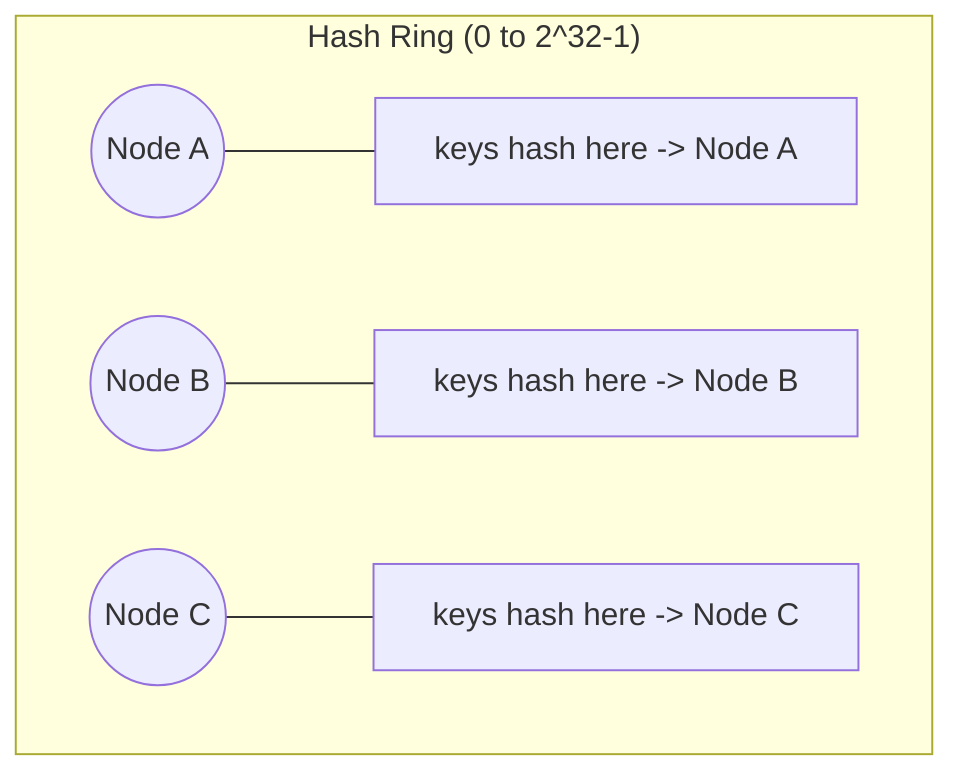
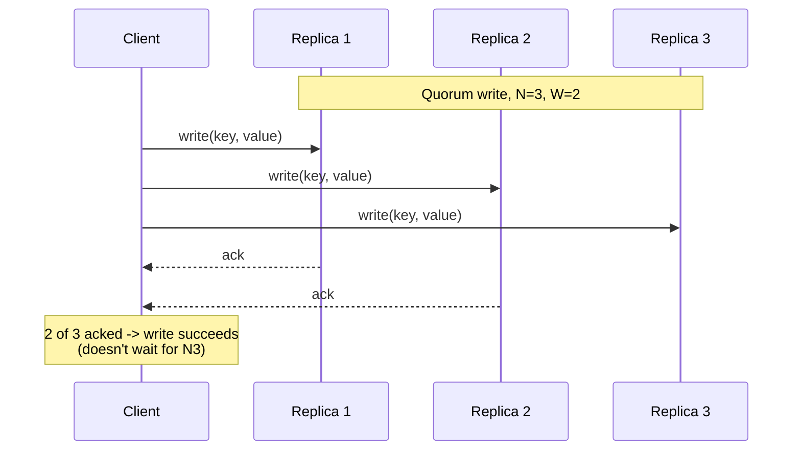
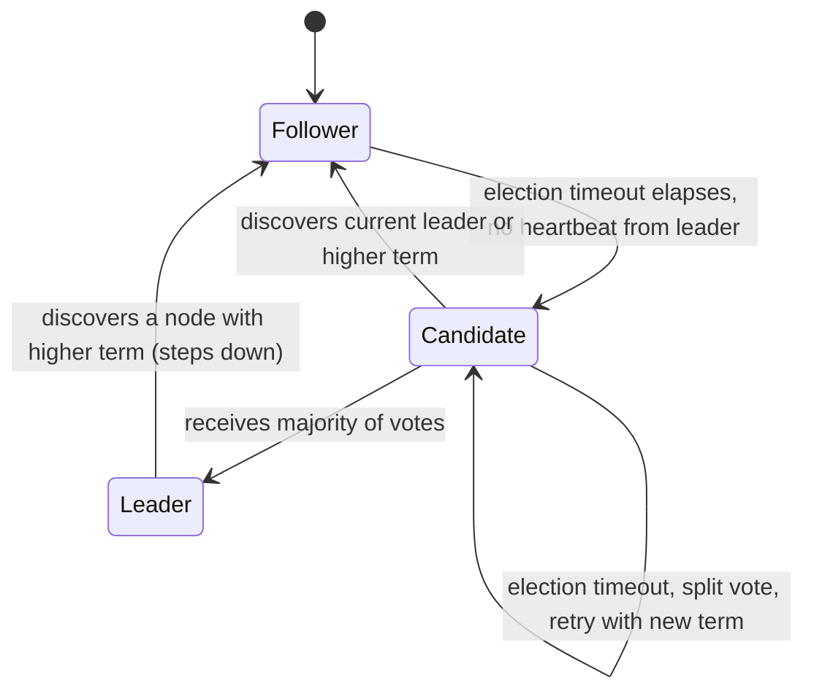
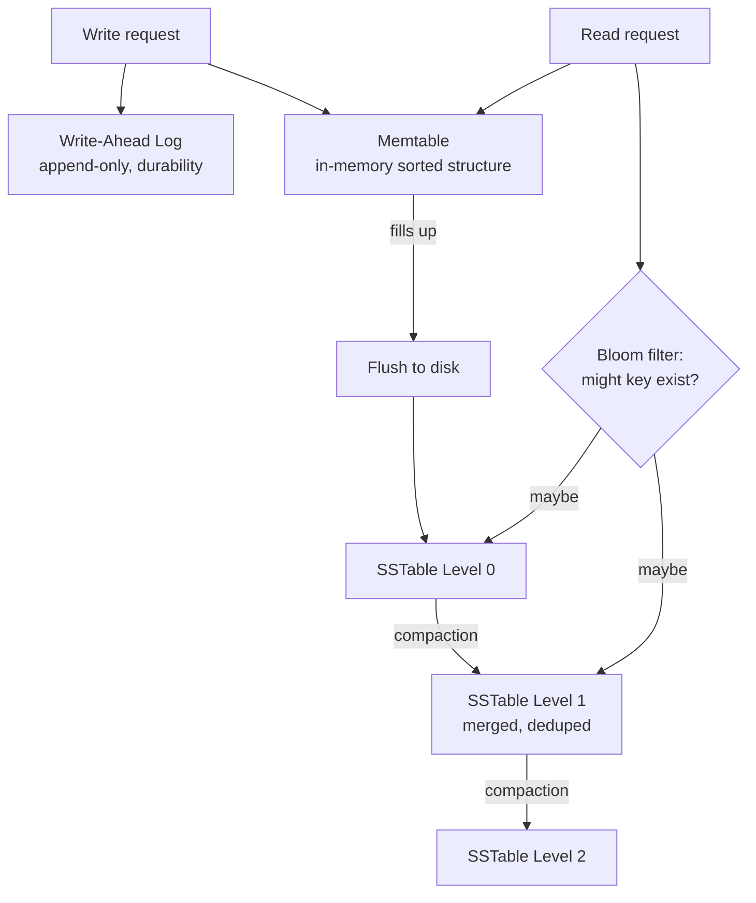
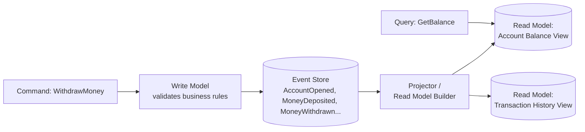
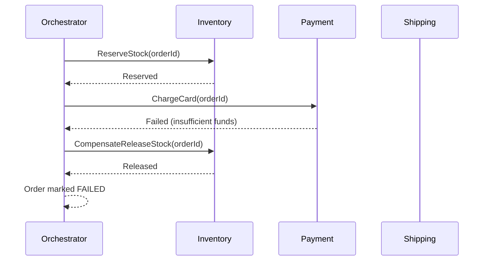
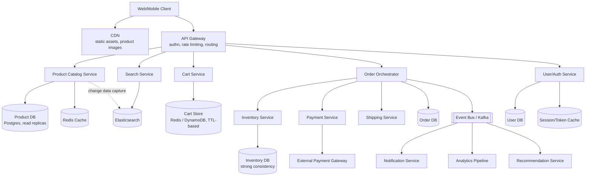

# System Design & Architecture — Expert Interview & Study Guide

## 1. Scope of This Document

The [HLD](high-level-design) document covers *how to approach* a system design interview end to end. This document goes one layer deeper into the **mechanisms** that HLD answers are built from — the internals interviewers probe when they say "tell me more about how that actually works" — plus **architectural styles** (monolith vs microservices, event-driven, CQRS) and a full **production-style architecture case study** that ties everything together.

## 2. Consistent Hashing — The Mechanism Behind "Add a Node Without Reshuffling Everything"

**The problem it solves**: with plain `hash(key) % N` sharding, adding or removing one node changes `N`, which remaps almost every key to a different node — a catastrophic amount of data movement.

**How it works**: map both nodes and keys onto a hash ring (0 to 2^32-1). A key belongs to the first node found walking clockwise from the key's hash position. Adding/removing a node only affects the keys between it and its predecessor on the ring — roughly `1/N` of all keys, not all of them.

**Virtual nodes**: a raw hash ring can still be unbalanced (a node might land on a large arc of the ring by chance, or a small one). Production systems (DynamoDB, Cassandra) assign each physical node **many virtual nodes** (e.g., 100-256) scattered around the ring, so load balances statistically across physical nodes regardless of ring geometry, and losing one physical node spreads its load thinly across many other nodes instead of dumping it all on one neighbor.

**Interview tell**: if you say "we hash mod N" for a system expected to scale/rebalance, that's a flag. Reaching for consistent hashing (or explicitly saying "range-based with a routing/config service that tracks shard boundaries," which DynamoDB/HBase/many systems actually use in practice instead of literal consistent hashing) is the senior-level answer.

## 3. Replication Strategies

- **Single-leader (leader-follower)**: all writes go to one leader, replicated to followers; reads can go to either (stale on followers). Simple, but the leader is a write bottleneck and a failover event (leader dies) needs a leader-election mechanism and has a brief unavailability window. Used by: Postgres/MySQL standard replication, MongoDB replica sets.
- **Multi-leader**: multiple nodes accept writes (e.g., one per data center), replicating to each other. Better write availability and lower write latency per region, but **write conflicts** are now possible and need a resolution strategy (last-write-wins by timestamp, version vectors, or application-level merge/CRDTs).
- **Leaderless (quorum-based)**: any replica can accept a write; a write is considered successful once acknowledged by `W` replicas, a read once `R` replicas agree, with `W + R > N` guaranteeing overlap between write and read sets (Dynamo-style). Tunable per-operation consistency (favor availability with `W=1` or consistency with `W=N`). Used by: Cassandra, DynamoDB, Riak.

**Follow-up interviewers ask**: "what if two replicas disagree on a read?" → read repair (return the latest by version/timestamp, and asynchronously push the correct value to the stale replica) or hinted handoff (if a replica was down during a write, another node temporarily holds the write on its behalf and delivers it once the original comes back).

## 4. Consensus Algorithms — Paxos, Raft, and Why They Exist

Consensus is needed whenever multiple nodes must agree on a single value/order despite failures and network delays — leader election, distributed locks, config stores, and any strongly-consistent replicated log.

- **Paxos**: the original proof that consensus is achievable in an asynchronous network with crash failures; notoriously hard to understand and implement correctly, so it's rarely implemented from scratch in interviews — know that it exists and what it guarantees (safety: never agree on two different values; a majority quorum is required to make progress).
- **Raft**: designed explicitly to be more understandable than Paxos, and is what most modern systems actually implement (etcd, Consul, CockroachDB, Kafka's KRaft mode). Three roles: **Leader** (handles all client writes, replicates a log to followers), **Follower** (passive, applies the leader's log), **Candidate** (a follower that hasn't heard from a leader within a timeout, so it starts an election). A leader is elected by majority vote; log entries are committed once replicated to a majority; if the leader fails, a new election happens after a randomized timeout (randomization avoids split-vote livelock).

**Why this matters practically**: whenever your HLD answer includes "a distributed lock," "leader election," "a strongly consistent config store," or "a replicated log for a database," the mechanism underneath is Raft (or Paxos) — naming it, and knowing it needs a majority quorum to make progress (hence deploying an odd number of nodes: 3 or 5, tolerating 1 or 2 failures respectively), is a strong senior/staff signal.

## 5. Database Internals: How Storage Engines Actually Work

**B-Trees** (used by Postgres, MySQL/InnoDB): balanced tree structure, each node holds sorted keys and pointers; reads and writes are O(log n) with a small constant (few disk seeks due to high fan-out). Writes are in-place, which makes B-trees great for read-heavy, moderate-write workloads but means a single write can touch multiple pages (write amplification from page splits).

**LSM Trees (Log-Structured Merge Trees)** (used by Cassandra, RocksDB, LevelDB, and under the hood in many "NoSQL" stores): writes go to an in-memory structure (memtable) plus an append-only write-ahead log for durability; when the memtable fills, it's flushed to disk as an immutable sorted file (SSTable). Reads may need to check multiple SSTables (mitigated by bloom filters to skip files that definitely don't contain the key) plus the memtable. A background **compaction** process merges and discards obsolete/overwritten entries across SSTable levels. LSM trees turn random writes into sequential writes (much faster on both spinning disks and, to a lesser extent, SSDs), trading it for read amplification (multiple files to check) and compaction overhead (background CPU/IO). This is *the* mechanism behind "NoSQL stores have better write throughput" — know it's LSM trees, not magic.

**Write-Ahead Log (WAL)**: before any in-memory structure is mutated, the change is appended to a durable, sequential log. If the process crashes, the WAL is replayed on restart to recover state that hadn't yet been flushed. This is the universal durability mechanism underneath both relational DBs and LSM-based stores — mention it whenever discussing "how do you not lose data on a crash."

**Indexing**: a secondary index is itself a separate B-tree/LSM structure mapping indexed-column values to primary keys/row locations — which is why every index speeds up reads on that column but slows down writes (every write now updates N index structures, not just the primary one) and consumes additional storage. Composite indexes only help queries whose filter/sort order is a left-prefix of the index's column order — a frequently-tested subtlety.

## 6. Load Balancing — Algorithms and Layers

- **Layer 4 (transport layer)**: balances based on IP/port, doesn't inspect HTTP content, very fast, can't route based on URL path or headers.
- **Layer 7 (application layer)**: inspects HTTP request (path, headers, cookies), enabling content-based routing (`/api/*` → service A, `/static/*` → CDN), but adds overhead from parsing/terminating connections.
- **Round robin**: simplest, cycles through servers; ignores actual server load.
- **Least connections**: routes to the server with the fewest active connections; better for long-lived/uneven-duration requests.
- **Consistent hashing**: routes the same client/key to the same server consistently — critical for sticky sessions or when a server holds in-memory state/cache for a key (e.g., WebSocket connection gateways, or a caching layer where you want the same key always hitting the same cache instance to maximize hit ratio).
- **Health checks**: active (LB pings a `/health` endpoint periodically) vs passive (LB observes real traffic failures and ejects a server that's erroring). Production systems use both.

## 7. Caching Strategies, Deep Dive

- **Cache-aside (lazy loading)**: app checks cache, on miss reads DB and populates cache. Cache only holds what's actually been requested (good for uneven access patterns); a cache-aside miss adds one extra round trip on the unlucky first request per key/TTL cycle.
- **Read-through**: the cache itself is responsible for loading from the DB on a miss (app only ever talks to the cache) — same performance characteristics as cache-aside but centralizes the loading logic in the caching layer rather than the app.
- **Write-through**: writes go to the cache, which synchronously writes to the DB before acknowledging — keeps cache and DB always consistent, at the cost of write latency (every write pays both cache and DB latency).
- **Write-behind (write-back)**: writes go to the cache and are acknowledged immediately; the cache asynchronously flushes to the DB in the background. Fastest writes, but risks data loss if the cache node fails before flushing, and needs careful ordering/batching logic.
- **Eviction policies**: LRU (evict least-recently-used, good general default), LFU (evict least-frequently-used, better when popularity is stable over time and you don't want a single recent burst to evict a perennially popular item), TTL-based (simplest, good when staleness has a hard deadline like a session token).
- **Cache stampede / dogpill**: many concurrent requests miss the cache for the same key simultaneously (e.g., right after expiry) and all hit the DB at once. Mitigate with request coalescing (a mutex/promise per key so only one request repopulates the cache while others wait on it), or probabilistic early expiration (refresh slightly before actual TTL, staggered per request, to spread out refreshes).

## 8. Architectural Styles: Monolith vs Microservices vs Serverless

| | Monolith | Microservices | Serverless (FaaS) |
|---|---|---|---|
| Deployment | One unit | Independently deployable services | Independently invoked functions |
| Team scaling | Gets harder past a certain team size (merge conflicts, coupled release cycles) | Teams own services independently | Teams own functions/small services |
| Operational complexity | Low (one thing to run, monitor, debug) | High (service discovery, distributed tracing, network calls replace function calls) | Managed by cloud provider, but cold starts and vendor lock-in are real costs |
| Latency | In-process calls, fast | Network hops between services add latency and failure modes | Cold start latency can be significant; pay-per-invocation |
| When it fits | Early-stage products, small teams, unclear domain boundaries | Large orgs, clear bounded contexts, independent scaling needs per component | Spiky/unpredictable load, event-driven glue code, low ops budget |

**The single most important thing to say in an interview about this choice**: microservices are an *organizational* scaling solution as much as a technical one (Conway's Law — team boundaries end up mirroring service boundaries) and they trade development-time simplicity for operational complexity (network calls can fail in ways function calls can't — partial failure, latency, serialization). Don't default to microservices for a system with one small team and a not-yet-understood domain; that's the classic case of paying distributed-systems tax for no benefit. **The "Strangler Fig" pattern** is the standard, low-risk way to migrate a monolith to microservices incrementally: put a routing layer in front of the monolith, peel off one capability at a time into a new service, route an increasing share of traffic to it, and only decommission the monolith's code path for that capability once the new service has proven itself — never a big-bang rewrite.

## 9. Event-Driven Architecture, CQRS, and Event Sourcing

**Event-driven architecture**: services communicate by publishing/subscribing to events on a broker (Kafka/SNS/EventBridge) rather than calling each other directly. Benefits: loose coupling (a producer doesn't know or care who consumes its events), independent scaling, natural audit trail. Costs: harder to trace a single business transaction across services (needs distributed tracing/correlation IDs), eventual consistency between services becomes the default, and debugging "why didn't X happen" requires understanding an asynchronous chain rather than a stack trace.

**CQRS (Command Query Responsibility Segregation)**: separate the write model (commands, optimized for validating and persisting business rules) from the read model (queries, optimized for the shapes the UI actually needs — often heavily denormalized). The write side publishes events on state changes; one or more read models are built/updated by consuming those events. This lets you scale reads and writes independently and tailor each to its actual access pattern, at the cost of eventual consistency between a write and its visibility in a read model (a "the like count updated one second late" tradeoff, similar to fan-out feeds).

**Event Sourcing**: instead of storing current state, store the full sequence of events that led to it (e.g., `AccountOpened`, `MoneyDeposited`, `MoneyWithdrawn`) and derive current state by replaying events. Benefits: perfect audit trail, ability to reconstruct state as of any point in time, natural fit with CQRS (events are what feed the read models). Costs: replaying a long event history to get current state is expensive without periodic snapshots; schema evolution of events over time needs careful versioning; it's a genuinely harder mental model that shouldn't be reached for without a real requirement (audit/compliance, temporal queries, or an existing event-driven system it fits naturally into).

## 10. Distributed Transactions: 2PC and Saga

**Two-Phase Commit (2PC)**: a coordinator asks all participants to "prepare" (lock resources, confirm they *can* commit) in phase 1, then tells them all to "commit" (or "abort" if any participant said no) in phase 2. Guarantees atomicity across services/databases, but the coordinator is a single point of failure/blocking — if it crashes between phases, participants can be left holding locks indefinitely ("in doubt"). Rarely used across microservices in practice because of this blocking behavior and the tight coupling it requires (all participants must be up and reachable simultaneously).

**Saga pattern**: break a distributed transaction into a sequence of local transactions, each with a corresponding **compensating transaction** that undoes it if a later step fails (e.g., `ReserveInventory` ↔ `ReleaseInventory`, `ChargePayment` ↔ `RefundPayment`). Two coordination styles:
- **Choreography**: each service publishes an event on completing its step; the next service reacts to it. No central coordinator, but the overall flow is implicit and harder to trace/reason about as the number of steps grows.
- **Orchestration**: a central orchestrator service explicitly calls each step and invokes compensations on failure. Easier to reason about and monitor as a single defined workflow, at the cost of that orchestrator becoming a (non-blocking, but still central) point of coordination logic.

This is the standard answer to "how do you handle a checkout flow that spans Inventory, Payment, and Shipping services without a shared database transaction."

## 11. Case Study: End-to-End Architecture for an E-Commerce Platform

Ties together nearly every concept above into one coherent system — a strong template for "design Amazon/Flipkart" prompts.

**Key architectural decisions, and why:**
- **Product catalog is read-heavy and read-mostly** → aggressively cached, served from replicas, and mirrored into Elasticsearch via change-data-capture for search — the catalog DB is never queried directly for search-style access patterns.
- **Cart is ephemeral, per-user, high write volume** → a fast key-value store with TTL (abandoned carts expire naturally), not the relational order DB.
- **Checkout is the one place strong consistency is non-negotiable** → the Order Orchestrator runs a Saga across Inventory (must not oversell), Payment (must not double-charge — idempotency keys), and Shipping, with explicit compensations on failure, rather than a single distributed transaction across services.
- **Everything non-critical-path off checkout's latency budget goes through the event bus** — sending a confirmation email, updating analytics, feeding the recommendation engine, are all async subscribers to `OrderPlaced`, not synchronous calls the checkout flow waits on. This is the practical application of "decouple with an event bus" from section 9.
- **Auth is centralized at the API Gateway** (validate the token once, on the way in) rather than every downstream service re-validating a raw credential — downstream services trust a signed, gateway-issued context (see the [Authentication & Authorization](authentication-and-authorization) document for the deep dive).
- **Single points of failure are explicitly eliminated**: every DB has replicas, the event bus is a clustered/partitioned Kafka deployment (not one broker), and the API Gateway itself is deployed behind a load balancer across multiple instances/AZs.

## 12. Common System Design & Architecture Interview Prompts

Design a distributed cache (like Redis) from scratch, design a distributed job scheduler (like Airflow/Quartz at scale), design a config management system, design a service mesh's core routing/observability behavior, design a multi-tenant SaaS architecture (data isolation strategies), design a CI/CD pipeline architecture, design a metrics/monitoring pipeline (like Prometheus/Datadog), design a feature flag system, design a distributed lock manager, design an API gateway.

## 13. Interview Questions & Answers

**Q1. Explain consistent hashing and why virtual nodes matter.**
A: Consistent hashing places both nodes and keys on a hash ring; a key is owned by the next node clockwise. Adding/removing a node only remaps the keys in its immediate arc (~1/N of all keys), unlike `hash % N` which remaps almost everything. Virtual nodes assign each physical node many positions on the ring so load balances evenly regardless of ring geometry, and a failed node's load spreads across many survivors instead of dumping entirely onto one neighbor.

**Q2. What's the difference between Paxos and Raft, and why did Raft become more popular in real systems?**
A: Both solve distributed consensus with the same safety guarantees (a majority quorum, never agreeing on two different values for the same slot). Paxos describes the algorithm more abstractly and is notoriously difficult to reason about and implement correctly in its full multi-decree form. Raft was explicitly designed for understandability: it decomposes the problem into leader election, log replication, and safety, with a single, clearly-defined leader role at any time. That clarity is why etcd, Consul, and most modern infrastructure choose Raft over classic Paxos, even though they're equivalent in theoretical power.

**Q3. Why do consensus clusters typically run with an odd number of nodes (3 or 5), not an even number?**
A: Progress requires a strict majority quorum. With 3 nodes, you tolerate 1 failure (need 2 of 3). With 4 nodes, you still only tolerate 1 failure (need 3 of 4) — the 4th node adds cost without adding fault tolerance, since a majority of 4 is 3, the same as needing to survive with 3. Odd numbers maximize fault tolerance per node deployed and also avoid tie votes during leader election.

**Q4. Explain the tradeoff between B-trees and LSM trees, and when you'd pick each for a new data store.**
A: B-trees update in place and are read-optimized — great for workloads with a high proportion of point/range reads and moderate writes (typical OLTP relational workloads). LSM trees buffer writes in memory and flush as immutable sorted files, turning random writes into sequential ones, which gives much higher write throughput at the cost of read amplification (checking multiple files, mitigated by bloom filters) and background compaction overhead. Pick B-trees for read-heavy, transactional workloads; pick LSM trees for write-heavy workloads (logging, time-series, event ingestion) where write throughput matters more than the fastest possible single read.

**Q5. What is a write-ahead log and why do virtually all durable storage engines have one?**
A: A WAL is an append-only log that records every intended change before it's applied to the main data structure (whether a B-tree page or an LSM memtable). Because it's append-only, writing to it is fast (sequential I/O) and the write can be considered durable as soon as it's flushed to the log — the actual in-memory/page-cache update can happen after. If the process crashes before flushing the "real" structure to disk, replaying the WAL on restart recovers all committed changes. It's the universal mechanism that lets a database claim durability without requiring every write to be a slow, fully-synced random I/O to its main data files.

**Q6. Why does adding an index speed up reads but slow down writes, and what's a "left-prefix" rule for composite indexes?**
A: An index is a separate ordered structure (usually its own B-tree/LSM tree) mapping column value → row location, so a lookup on that column can binary-search instead of scanning every row — but every write to the table now must also update every index defined on it, multiplying write cost by the number of indexes. A composite index on `(A, B, C)` is physically sorted by A first, then B within each A, then C within each (A, B) — so it can efficiently serve queries filtering on `A`, or `A and B`, or `A and B and C`, but not a query filtering on `B` alone, because the index isn't sorted by B independently of A. This is the "left-prefix" rule, and it's a frequent gotcha in both interviews and real production slow-query debugging.

**Q7. When should you choose microservices over a monolith, and what's the most common mistake teams make with this decision?**
A: Choose microservices when you have clear, stable bounded contexts, multiple teams that need to deploy independently without blocking each other, and components with genuinely different scaling profiles. The most common mistake is adopting microservices prematurely — before the domain boundaries are well understood — which results in "distributed monolith": services that are still tightly coupled (shared database, synchronous call chains, coordinated deployments) but now also pay the full tax of network calls, partial failure, and operational complexity, with none of the independence benefits.

**Q8. Explain the Saga pattern and the difference between choreography and orchestration.**
A: A Saga breaks a multi-service transaction into a sequence of local transactions, each paired with a compensating action to undo it if a later step fails — avoiding a blocking two-phase-commit-style distributed transaction. In choreography, each service publishes an event when it completes its step and reacts to others' events, with no central coordinator — simple for short flows, but the overall business process becomes implicit and hard to observe/debug as steps grow. In orchestration, a central orchestrator explicitly invokes each step and its compensation on failure — easier to monitor, test, and reason about as one defined workflow, at the cost of that orchestrator being a piece of central logic (not a blocking coordinator like in 2PC, since each local transaction still commits independently).

**Q9. What's the practical difference between choosing eventual consistency for a "like count" versus needing strong consistency for "account balance," in terms of actual implementation?**
A: A like count can be incremented via an eventually-consistent, highly-available path (e.g., a counter in a leaderless/quorum store, or even an async aggregation pipeline) because a user seeing "241 likes" vs "242 likes" for a few seconds has zero real-world consequence, and optimizing for availability/low-latency writes at extreme scale is worth that imprecision. An account balance must use a strongly consistent path (single-leader write with synchronous replication acknowledgment, or a serializable transaction) because two concurrent reads returning different, both-stale balances could let a user overdraw an account or a system double-spend — the cost of an occasional slower write is far preferable to the cost of financial incorrectness. The implementation difference: the like counter can tolerate `W=1` or async fire-and-forget; the balance requires a transaction with proper isolation (or a Saga with compensations if it spans services) and no read-your-own-write violations.

**Q10. What's CQRS and what specific problem does it solve that a single shared model doesn't?**
A: CQRS separates the model used to validate and persist writes (optimized around business rules and invariants) from the model(s) used to serve reads (optimized around the exact shapes the UI/API consumers need, often heavily denormalized and pre-joined). A single shared model forces a compromise: either it's normalized (good for write correctness, requires expensive joins for read-heavy queries) or denormalized (fast reads, but risks invariant violations and redundant update logic on writes). CQRS lets each side use the model that's actually efficient for its job, at the cost of the read side lagging the write side by the time it takes events to propagate (eventual consistency between write and read models).

**Q11. What is event sourcing, and what's the biggest practical cost teams underestimate when adopting it?**
A: Event sourcing stores the sequence of events that produced the current state (rather than just the current state), and derives state by replaying events — giving a perfect audit trail and the ability to reconstruct state at any historical point. The biggest underestimated cost is **event schema evolution**: once events are in the store, you can never really delete or freely restructure the old ones (they're the permanent history), so every change to an event's shape needs a versioning/migration strategy (upcasting old event versions to the current shape at read time, or maintaining parallel handlers), and this discipline has to be designed in from day one — retrofitting it onto an event store that already has years of un-versioned events is extremely painful.

**Q12. Why is two-phase commit rarely used across microservices in practice, even though it guarantees atomicity?**
A: 2PC requires every participant to be reachable and to hold locks on its resources throughout both phases — if the coordinator crashes after participants have "prepared" but before it sends the final commit/abort, participants are stuck holding locks indefinitely ("in-doubt" transactions), blocking other operations on those resources. This tight coupling (everyone must be simultaneously available, and lock duration is at the mercy of network/coordinator latency) is exactly what microservice architectures try to avoid — it reintroduces the availability and coupling costs microservices were adopted to escape. The Saga pattern trades strict atomicity for eventual consistency with compensations, which fits the "independent, eventually-consistent services" model far better.

**Q13. Explain the difference between read-through and cache-aside caching — they sound similar.**
A: Functionally similar (a miss triggers a DB read and cache population), but the responsibility differs: in cache-aside, the *application code* explicitly checks the cache, and on a miss, explicitly reads the DB and explicitly writes the result into the cache — the cache is a "dumb" key-value store the app orchestrates around. In read-through, the *cache itself* (via a configured loader function) is responsible for fetching from the DB on a miss — the application only ever talks to the cache, never falls back to the DB directly. Read-through centralizes the loading logic (useful if many different services would otherwise duplicate cache-aside boilerplate); cache-aside gives the application more explicit control (e.g., choosing not to cache certain results based on business logic).

**Q14. What causes a cache stampede, and what are two different ways to prevent it?**
A: A cache stampede happens when a hot key's cache entry expires (or the cache restarts cold) and a large number of concurrent requests all miss simultaneously, all falling through to the database at once — which can be enough load to take the database down even though it normally handles that traffic fine when cached. Prevention: (1) request coalescing/single-flight — the first request to miss acquires a per-key lock/promise and repopulates the cache while all concurrent requests for that same key wait on the result instead of independently hitting the DB; (2) probabilistic early expiration — refresh a hot key's cache entry slightly before its actual TTL, with jitter, so refreshes are staggered across time instead of a whole cohort of keys expiring in the same instant (which itself often happens because they were all cached at the same time by a cold-start warm-up).

**Q15. In the e-commerce architecture case study, why is the shopping cart stored in a different data store than the order?**
A: The cart has fundamentally different access and lifecycle characteristics than an order: it's mutated frequently (every add/remove), is per-user and often abandoned (most carts never convert), and needs no long-term durability guarantee beyond a reasonable expiry — a fast key-value store with a TTL is a good fit, and losing an abandoned cart occasionally is a non-event. An order, once placed, is a permanent financial/business record that needs strong durability, auditability, and often relational integrity with line items, payment records, and inventory decrements — it belongs in a properly durable, likely relational, store. Conflating the two into one data store means over-provisioning durability/consistency guarantees for cart data that doesn't need them, or under-provisioning them for order data that can't do without them.

**Q16. Why does the case study put authentication/token validation at the API Gateway instead of in every downstream service?**
A: Centralizing auth at the gateway means the actual credential/token verification logic (signature checks, revocation checks, session lookups) exists in exactly one place, avoiding both duplicated logic across N services (each a chance to get it subtly wrong) and duplicated latency cost (N services each independently validating the same token). Downstream services instead trust a lightweight, signed context the gateway attaches to the forwarded request (e.g., a validated JWT or an internal service-to-service token asserting the caller's identity/claims) — this is the standard "trust boundary" pattern: expensive/sensitive verification happens once at the edge, and internal services trust what crossed that boundary. The tradeoff to name: this makes the gateway a critical dependency for every request, so its own availability and the token-validation latency it adds become first-class concerns.

**Q17. What's the difference between choreography-based events and a Saga orchestrator, in terms of how you'd debug "order #4521 got stuck halfway through checkout" at 2am?**
A: With choreography, debugging requires reconstructing the implicit flow from scattered event logs across every service that touched the order — there's no single place that shows "step 3 of 5 completed, step 4 failed," you have to correlate timestamps and event payloads across systems (a correlation/trace ID is essential here, without one this is nearly undebuggable at scale). With orchestration, the orchestrator itself holds explicit state for the workflow ("Inventory: done, Payment: failed, Shipping: not started") which can typically be queried directly — you look at one place and see exactly which step failed and why, then decide whether to retry or trigger compensations manually. This operational debuggability is a major practical reason teams choose orchestration for complex, multi-step business transactions even though choreography is architecturally more decoupled.

**Q18. Why is "just use a distributed transaction" usually the wrong answer when an interviewer asks about a checkout flow spanning Inventory, Payment, and Shipping services?**
A: A distributed transaction (2PC) requires all three services to hold locks and remain available simultaneously for the duration of the transaction, meaning the checkout's availability is now the *product* of all three services' availability (if any one is briefly unavailable or slow, the whole transaction blocks or fails), and a coordinator crash mid-transaction can leave resources locked indefinitely. It also assumes all three can even participate in a shared transactional protocol, which often isn't true once Payment involves an external, third-party gateway you don't control. The Saga pattern accepts a brief window of intermediate, visible state (inventory reserved but payment not yet confirmed) in exchange for each service only ever managing its own local transaction plus a well-defined compensating action — trading strict atomicity for availability and loose coupling, which is almost always the right trade for cross-service business workflows.

**Q19. How would you decide between hash-based and range-based partitioning for a new sharded system?**
A: Hash-based partitioning (hash the key, mod/ring to a shard) distributes load evenly and avoids hot shards from sequential access patterns, but destroys the ability to do efficient range scans (e.g., "all events between time T1 and T2") since adjacent keys land on unrelated shards. Range-based partitioning (contiguous key ranges per shard) keeps range scans efficient and local to one or a few shards, but risks a hot shard when writes are skewed toward one part of the key space (the classic failure mode: partitioning a time-series table by timestamp range means all *current* writes hit the single "latest" shard). The decision hinges on the dominant query pattern: point lookups at even load favor hash-based; range queries on an inherently ordered key (with a mitigation for the "hot latest shard" problem, like also hashing a secondary dimension into the key) favor range-based.

**Q20. What does "the coordinator is a single point of failure" mean concretely for 2PC, and how does Saga orchestration avoid the same problem despite also having a central orchestrator?**
A: In 2PC, the coordinator's failure mid-protocol leaves participants in an "in-doubt" state — they've prepared (locked resources) but don't know whether to commit or abort, and must block until the coordinator recovers or a recovery protocol resolves the ambiguity; this is a true availability failure, not just an inconvenience. A Saga orchestrator's failure is different in kind: each step is already a committed local transaction (no locks held across steps), so if the orchestrator crashes, it can simply resume from its last recorded state once restarted (or a new orchestrator instance can pick up the persisted workflow state) — nothing is left "in doubt" because nothing was ever left half-committed waiting on a second phase. The orchestrator needing to be *eventually* available to resume/complete a workflow is a much weaker requirement than 2PC's participants needing the coordinator to be available to release locks *right now*.

**Q21. Explain how a bloom filter helps an LSM-tree-based store avoid unnecessary disk reads, and what's the tradeoff in using one.**
A: A bloom filter is a compact, probabilistic set structure: it can say "this key is definitely not in this SSTable" with 100% certainty, or "this key might be in this SSTable" with some configurable false-positive rate. Before checking a given SSTable file for a key, the engine first checks that file's bloom filter in memory; if it says "definitely not present," the (relatively expensive) disk read for that file is skipped entirely, which is why LSM reads across many SSTable levels don't get proportionally slower with every additional level. The tradeoff is the false-positive rate itself (tunable via the filter's size — more bits per key means fewer false positives but more memory) — a false positive just costs one wasted disk read (still correct, just not optimal), never an incorrect answer, since bloom filters never produce false negatives.

**Q22. What's the "Strangler Fig" pattern and why is it preferred over a full rewrite when migrating a monolith to microservices?**
A: The Strangler Fig pattern puts a routing/facade layer in front of the existing monolith, then incrementally extracts one capability at a time into a new service, routing an increasing share of relevant traffic to the new service while the monolith continues serving everything not yet migrated — named after the fig vine that gradually envelops and eventually replaces its host tree. It's preferred over a big-bang rewrite because a full rewrite carries enormous risk (the team is offline from delivering new value for months/years, and the rewrite target is often a moving one since the old system doesn't stop changing), whereas the Strangler Fig approach ships incremental value, lets you validate each extracted service against real production traffic before fully committing, and provides an easy rollback (route traffic back to the monolith) if a newly extracted service has problems.

**Q23. Why do most production systems favor W+R>N quorum reads/writes over always requiring all N replicas to acknowledge?**
A: Requiring all N replicas to ack every write means the write's availability is only as good as the least-available replica — any single slow or down node blocks every write. A quorum (`W + R > N`, e.g., `W=2, R=2, N=3`) guarantees that any write set and any read set overlap by at least one replica (so a read is guaranteed to see the latest acknowledged write, or can compare versions to determine which is newest), while tolerating up to `N - W` (or `N - R`) replicas being unavailable at any given time without blocking the operation entirely. This is the mechanism that lets leaderless/Dynamo-style systems offer tunable consistency-vs-availability per operation (lower W/R for availability, higher for consistency) rather than a single fixed system-wide guarantee.

**Q24. How would you explain the relationship between Raft/Paxos-style consensus and the CAP theorem — are they solving the same problem?**
A: They're related but distinct: CAP describes a fundamental *tradeoff* a distributed system must make during a network partition (favor consistency or availability); consensus algorithms (Raft/Paxos) are a *mechanism* for achieving strong consistency safely when a system chooses the "C" side of that tradeoff — they let a cluster agree on a single, totally-ordered sequence of operations despite node failures and network delays, which is exactly what's needed to make replicated state provably consistent. A consensus-based system (like etcd) explicitly chooses CP behavior: during a partition, the minority side becomes unavailable for writes (can't reach a quorum) rather than risk two sides diverging — so consensus algorithms are one of the standard tools you reach for specifically *because* you've decided to sit on the C side of CAP for that component.

**Q25. In the e-commerce case study, why does the Product Catalog Service sync into Elasticsearch via change-data-capture instead of the Search Service querying the Product DB directly?**
A: Full-text/faceted search (fuzzy matching, relevance ranking, filtering across many attributes) requires an inverted-index data structure that a relational or document DB isn't built to serve efficiently — running that kind of query pattern directly against the Product DB would be slow and would compete for resources with the DB's actual job of serving transactional catalog reads/writes. Change-data-capture (streaming the DB's write-ahead log or change events into a pipeline that updates Elasticsearch) keeps the search index near-real-time consistent with the source of truth without the Product Service needing to know or care that a search index exists — it's a clean example of "the system that owns the data doesn't need to own every way that data gets queried," and it decouples search-index scaling/availability from the catalog DB's.
